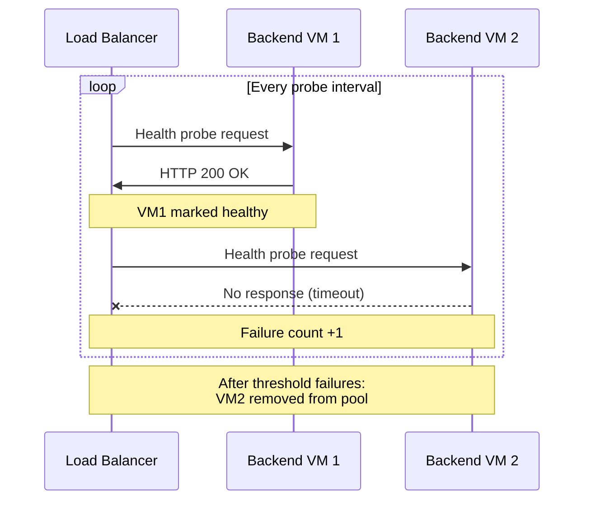

# How to Configure Azure Load Balancer Health Probes for Backend Pool Monitoring

Author: [nawazdhandala](https://www.github.com/nawazdhandala)

Tags: Azure, Load Balancer, Health Probes, Backend Pool, High Availability, Azure Networking

Description: Learn how to configure and optimize Azure Load Balancer health probes to accurately monitor backend pool health and ensure reliable traffic distribution.

---

Azure Load Balancer distributes incoming traffic across backend VMs, but it only works well if it knows which backends are actually healthy. Health probes are the mechanism the load balancer uses to determine whether a backend instance can receive traffic. If a probe fails, the load balancer stops sending traffic to that instance until it recovers. Get the probes wrong, and you either route traffic to dead servers or unnecessarily remove healthy ones from rotation.

This guide covers how to create and configure health probes for different scenarios, understand probe behavior, and troubleshoot common issues.

## How Health Probes Work

The Azure Load Balancer sends probe requests to each backend instance at regular intervals. If an instance responds correctly within the timeout, it stays in rotation. If it fails to respond for a configured number of consecutive probes, it is marked unhealthy and removed from the pool.



## Probe Types

Azure Load Balancer supports three probe types:

| Probe Type | Protocol | How It Works |
|---|---|---|
| TCP | TCP | Attempts a TCP connection. Success = connection established. |
| HTTP | HTTP | Sends a GET request. Success = HTTP 200 response. |
| HTTPS | HTTPS | Sends a GET request over TLS. Success = HTTP 200 response. |

TCP probes only verify that the port is open. HTTP/HTTPS probes verify that the application is actually responding correctly. For web applications, always prefer HTTP/HTTPS probes because a port can be open even when the application is crashed or misconfigured.

## Prerequisites

- An Azure subscription
- An existing load balancer with a backend pool, or we will create one
- Azure CLI installed

## Step 1: Create a Load Balancer with Backend Pool

If you already have a load balancer, skip to Step 3.

```bash
# Create a resource group
az group create --name rg-lb-probes-demo --location eastus

# Create a VNet and subnet
az network vnet create \
  --resource-group rg-lb-probes-demo \
  --name vnet-demo \
  --location eastus \
  --address-prefixes 10.0.0.0/16 \
  --subnet-name subnet-lb \
  --subnet-prefixes 10.0.0.0/24

# Create a public IP for the load balancer
az network public-ip create \
  --resource-group rg-lb-probes-demo \
  --name pip-lb \
  --sku Standard \
  --allocation-method Static

# Create the load balancer
az network lb create \
  --resource-group rg-lb-probes-demo \
  --name lb-demo \
  --sku Standard \
  --public-ip-address pip-lb \
  --frontend-ip-name fe-default \
  --backend-pool-name bp-web
```

## Step 2: Add Backend VMs to the Pool

```bash
# Create two VMs and add them to the backend pool
for i in 1 2; do
  az vm create \
    --resource-group rg-lb-probes-demo \
    --name vm-web-$i \
    --image Ubuntu2204 \
    --vnet-name vnet-demo \
    --subnet subnet-lb \
    --admin-username azureuser \
    --generate-ssh-keys \
    --public-ip-address "" \
    --size Standard_B1s \
    --no-wait
done
```

After the VMs are created, add their NICs to the backend pool:

```bash
# Add NIC to backend pool (repeat for each VM)
az network nic ip-config address-pool add \
  --resource-group rg-lb-probes-demo \
  --nic-name vm-web-1VMNic \
  --ip-config-name ipconfig1 \
  --lb-name lb-demo \
  --address-pool bp-web
```

## Step 3: Create an HTTP Health Probe

An HTTP probe is the best choice for web applications. It verifies the application is running, not just that the port is open.

```bash
# Create an HTTP health probe
az network lb probe create \
  --resource-group rg-lb-probes-demo \
  --lb-name lb-demo \
  --name probe-http-health \
  --protocol Http \
  --port 80 \
  --path /health \
  --interval 15 \
  --threshold 2
```

Let me explain each parameter:

- `--protocol Http`: Uses HTTP GET requests for probing
- `--port 80`: The port to probe on each backend
- `--path /health`: The URL path to request (the backend must return HTTP 200 for this path)
- `--interval 15`: Sends a probe every 15 seconds
- `--threshold 2`: After 2 consecutive failures, mark the backend as unhealthy

## Step 4: Create a TCP Health Probe (Alternative)

For non-HTTP services (like database connections or custom TCP services), use a TCP probe.

```bash
# Create a TCP health probe
az network lb probe create \
  --resource-group rg-lb-probes-demo \
  --lb-name lb-demo \
  --name probe-tcp-db \
  --protocol Tcp \
  --port 5432 \
  --interval 10 \
  --threshold 3
```

## Step 5: Create an HTTPS Health Probe

For backends running HTTPS, use an HTTPS probe. The load balancer does not validate the certificate, so self-signed certs work fine for probing.

```bash
# Create an HTTPS health probe
az network lb probe create \
  --resource-group rg-lb-probes-demo \
  --lb-name lb-demo \
  --name probe-https-health \
  --protocol Https \
  --port 443 \
  --path /health \
  --interval 15 \
  --threshold 2
```

## Step 6: Associate the Probe with a Load Balancing Rule

A health probe is only active when it is associated with a load balancing rule.

```bash
# Create a load balancing rule using the HTTP probe
az network lb rule create \
  --resource-group rg-lb-probes-demo \
  --lb-name lb-demo \
  --name rule-http \
  --frontend-ip-name fe-default \
  --backend-pool-name bp-web \
  --protocol Tcp \
  --frontend-port 80 \
  --backend-port 80 \
  --probe-name probe-http-health \
  --idle-timeout 15 \
  --enable-tcp-reset true
```

The `--enable-tcp-reset true` flag sends a TCP RST to both ends when a connection is idle for too long or when a backend becomes unhealthy. This helps clients quickly detect dead connections.

## Step 7: Implement the Health Endpoint on Your Backend

Your backend application needs a `/health` endpoint that returns HTTP 200 when the application is healthy. Here is a simple example in different languages.

A basic Node.js health endpoint:

```javascript
// Express.js health check endpoint
app.get('/health', (req, res) => {
  // Check critical dependencies
  const dbConnected = checkDatabaseConnection();
  const cacheAvailable = checkCacheConnection();

  if (dbConnected && cacheAvailable) {
    // Return 200 to tell the load balancer this instance is healthy
    res.status(200).json({ status: 'healthy' });
  } else {
    // Return 503 to tell the load balancer to stop sending traffic
    res.status(503).json({ status: 'unhealthy', db: dbConnected, cache: cacheAvailable });
  }
});
```

A Python Flask equivalent:

```python
# Flask health check endpoint
@app.route('/health')
def health_check():
    # Verify the app can connect to its dependencies
    try:
        db.session.execute('SELECT 1')
        return jsonify({'status': 'healthy'}), 200
    except Exception as e:
        return jsonify({'status': 'unhealthy', 'error': str(e)}), 503
```

The key principle: the health endpoint should check the application's critical dependencies (database, cache, external services) and return a non-200 status code if any of them are down.

## Tuning Probe Parameters

Getting the interval and threshold right matters:

**Fast detection (interval=5, threshold=2)**: Backend marked unhealthy after 10 seconds of failure. Good for applications where fast failover is critical.

**Balanced (interval=15, threshold=2)**: Backend marked unhealthy after 30 seconds. Good default for most applications.

**Conservative (interval=30, threshold=3)**: Backend marked unhealthy after 90 seconds. Good for applications that occasionally have slow responses (batch processing, startup scenarios).

Be careful with aggressive settings. If your health endpoint is slow because it checks database connectivity, a 5-second interval with a 5-second timeout can cause false positives during brief network hiccups.

## Monitoring Health Probe Status

Check the health status of your backend pool.

```bash
# View the load balancer health probe status
az network lb show \
  --resource-group rg-lb-probes-demo \
  --name lb-demo \
  --query "probes" \
  --output table
```

You can also use Azure Monitor metrics:

- **Health Probe Status**: Shows the percentage of healthy instances over time
- **DIP Availability**: Per-backend availability based on probe results

## Troubleshooting

**All backends show unhealthy.** Check that the health endpoint returns HTTP 200 (not 301 redirects or other codes). Verify the probe port matches what the application listens on. Check NSG rules allow traffic from `168.63.129.16` (Azure's infrastructure IP that sends probes).

**Intermittent probe failures.** The health endpoint might be slow. Increase the timeout or simplify the health check logic. Database checks in health endpoints can time out under load.

**Probes pass but application is not working.** Your health endpoint might be too simple. If it just returns 200 without checking dependencies, a backend with a crashed database connection will still appear healthy.

## Cleanup

```bash
# Delete all resources
az group delete --name rg-lb-probes-demo --yes --no-wait
```

## Wrapping Up

Health probes are the foundation of reliable load balancing. Use HTTP probes for web applications because they verify application-level health, not just port availability. Implement meaningful health endpoints that check critical dependencies. Tune the interval and threshold based on your tolerance for detection time versus false positives. And always make sure your NSGs allow probe traffic from Azure's infrastructure IP. A well-configured health probe setup means the load balancer accurately reflects your backend's actual health, leading to better reliability for your users.
