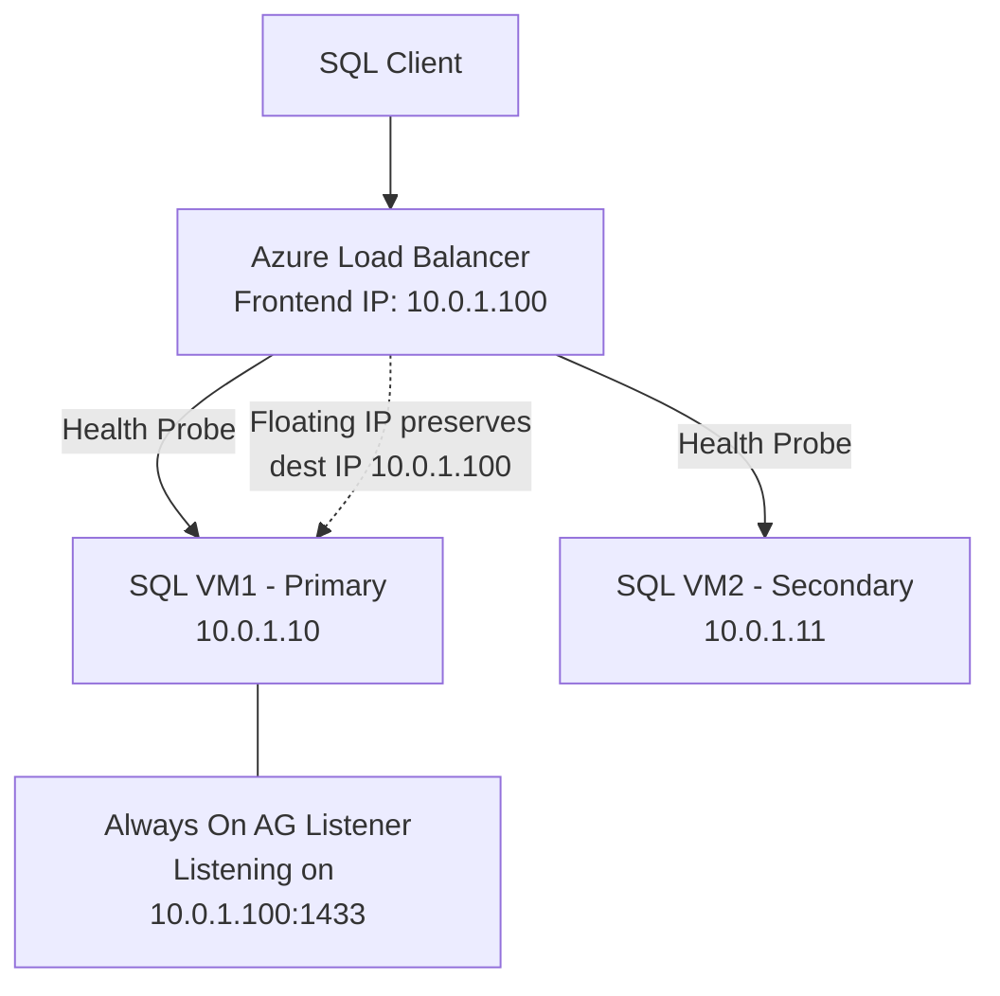

# How to Configure Azure Load Balancer with Floating IP for SQL Server Always On

Author: [nawazdhandala](https://www.github.com/nawazdhandala)

Tags: Azure, Load Balancer, SQL Server, Always On, Floating IP, High Availability

Description: Configure Azure Load Balancer with floating IP (Direct Server Return) to support SQL Server Always On Availability Groups in Azure VMs.

---

Running SQL Server Always On Availability Groups in Azure VMs requires a load balancer to direct client traffic to whichever node is currently the primary replica. The tricky part is that Always On uses a listener that expects traffic to arrive on a specific IP address, and that IP needs to "float" between nodes during failover. Azure Load Balancer's floating IP feature (also called Direct Server Return) makes this work by delivering traffic to the backend VM without changing the destination IP address.

This guide covers the full setup from creating the load balancer to configuring the SQL Server listener to work with floating IP.

## Why Floating IP Is Required

In a traditional on-premises SQL Server Always On setup, the availability group listener uses a virtual IP address managed by Windows Server Failover Clustering (WSFC). When a failover happens, the cluster moves the IP from one node to another. This works because both nodes are on the same Layer 2 network.

In Azure, things are different. Azure networking does not support gratuitous ARP or Layer 2 IP mobility between VMs. Instead, you use a load balancer with a health probe. The probe detects which node is the primary replica, and the load balancer routes traffic to that node.

Without floating IP, the load balancer performs destination NAT, changing the destination IP to the backend VM's IP. SQL Server's listener does not recognize this NATted traffic because it is listening on the listener IP, not the VM's IP. Floating IP solves this by preserving the original destination IP (the frontend IP of the load balancer), which matches the listener IP that SQL Server expects.

## Architecture Overview



## Prerequisites

Before you begin:

- Two or more Azure VMs running SQL Server Enterprise edition
- Windows Server Failover Clustering configured between the VMs
- SQL Server Always On Availability Group created
- VMs in the same virtual network and availability set (or availability zones)
- SQL Server instances configured with static IP addresses

## Step 1: Create the Internal Load Balancer

Create an internal (private) load balancer. The frontend IP should be in the same subnet as your SQL Server VMs and should match the IP you want for the Always On listener.

```bash
# Create the internal load balancer
az network lb create \
  --name sqlAlwaysOnLB \
  --resource-group myResourceGroup \
  --sku Standard \
  --vnet-name myVNet \
  --subnet sqlSubnet \
  --frontend-ip-name sqlListenerFrontend \
  --private-ip-address 10.0.1.100 \
  --backend-pool-name sqlBackendPool
```

## Step 2: Create the Health Probe

The health probe determines which SQL VM is the current primary replica. You configure a TCP probe on a port that only the primary replica responds to. The common approach is to use a custom port (like 59999) and configure a probe listener on the primary replica only.

```bash
# Create a health probe on a custom port
# Only the primary replica will respond on this port
az network lb probe create \
  --name sqlHealthProbe \
  --resource-group myResourceGroup \
  --lb-name sqlAlwaysOnLB \
  --protocol Tcp \
  --port 59999 \
  --interval 5 \
  --threshold 2
```

## Step 3: Create the Load Balancing Rule with Floating IP

This is the critical step. The load balancing rule must have floating IP enabled. This ensures that traffic arrives at the backend VM with the frontend IP (10.0.1.100) as the destination, not the VM's own IP.

```bash
# Create the load balancing rule with floating IP enabled
# The enable-floating-ip flag is what makes this work with Always On
az network lb rule create \
  --name sqlListenerRule \
  --resource-group myResourceGroup \
  --lb-name sqlAlwaysOnLB \
  --frontend-ip-name sqlListenerFrontend \
  --backend-pool-name sqlBackendPool \
  --probe-name sqlHealthProbe \
  --protocol Tcp \
  --frontend-port 1433 \
  --backend-port 1433 \
  --enable-floating-ip true \
  --idle-timeout 30 \
  --load-distribution Default
```

Key parameters to note:

- **enable-floating-ip true**: This is the Direct Server Return setting that preserves the destination IP
- **idle-timeout 30**: SQL connections can be long-lived, so increase the idle timeout from the default 4 minutes
- **frontend-port and backend-port**: Both set to 1433 (SQL Server's default port)

## Step 4: Add SQL VMs to the Backend Pool

Add both SQL Server VMs to the load balancer's backend pool:

```bash
# Add the first SQL VM's NIC to the backend pool
az network nic ip-config address-pool add \
  --address-pool sqlBackendPool \
  --ip-config-name ipconfig1 \
  --nic-name sqlvm1-nic \
  --resource-group myResourceGroup \
  --lb-name sqlAlwaysOnLB

# Add the second SQL VM's NIC to the backend pool
az network nic ip-config address-pool add \
  --address-pool sqlBackendPool \
  --ip-config-name ipconfig1 \
  --nic-name sqlvm2-nic \
  --resource-group myResourceGroup \
  --lb-name sqlAlwaysOnLB
```

## Step 5: Configure the Cluster IP Resource

On each SQL Server VM, you need to configure the failover cluster IP resource to work with the load balancer. Open PowerShell on any cluster node and run:

```powershell
# Get the cluster network name for the SQL subnet
$clusterNetwork = Get-ClusterNetwork | Where-Object {
    $_.Address -eq "10.0.1.0"  # Your SQL subnet
}

# Get the AG listener IP resource
$ipResource = Get-ClusterResource |
    Where-Object { $_.ResourceType -eq "IP Address" -and $_.OwnerGroup -eq "YOURAGNAMEHERE" }

# Set the IP address and probe port
# The probe port must match the health probe port in the load balancer
$ipResource | Set-ClusterParameter -Multiple @{
    "Address" = "10.0.1.100"
    "ProbePort" = 59999
    "SubnetMask" = "255.255.255.255"
    "Network" = $clusterNetwork.Name
    "EnableDhcp" = 0
}

# Restart the cluster resource for changes to take effect
$ipResource | Stop-ClusterResource
$ipResource | Start-ClusterResource
```

The `SubnetMask` of `255.255.255.255` is deliberate. It tells the cluster that this is a single-host IP address managed by the load balancer, not a traditional subnet-based IP.

## Step 6: Configure the Probe Listener on SQL VMs

The health probe needs something to connect to on port 59999. You need to set up a probe listener on each SQL VM. The simplest approach is to use a PowerShell script that creates a TCP listener only on the primary replica.

Create this script and schedule it to run on cluster failover events:

```powershell
# Script to manage the health probe listener
# Run this on each SQL VM as part of the cluster failover notification

# Check if this node is the primary replica
$agPrimary = (Invoke-Sqlcmd -Query "
    SELECT replica_server_name
    FROM sys.dm_hadr_availability_replica_states AS rs
    JOIN sys.availability_replicas AS r
    ON rs.replica_id = r.replica_id
    WHERE rs.role_desc = 'PRIMARY'
" -ServerInstance "localhost").replica_server_name

if ($agPrimary -eq $env:COMPUTERNAME) {
    # This node is primary, start the probe listener
    $listener = [System.Net.Sockets.TcpListener]::new([System.Net.IPAddress]::Any, 59999)
    $listener.Start()
    Write-Output "Probe listener started on port 59999"
} else {
    # This node is secondary, stop any existing probe listener
    # The load balancer health probe will fail, routing traffic away
    Write-Output "This node is secondary, probe listener not started"
}
```

A cleaner alternative is to use the Azure SQL VM IaaS Agent Extension, which handles the probe listener automatically.

## Step 7: Verify the Configuration

Test the setup by connecting to the Always On listener from a client machine:

```powershell
# Test connectivity to the AG listener through the load balancer
Test-NetConnection -ComputerName 10.0.1.100 -Port 1433

# Connect using sqlcmd
sqlcmd -S 10.0.1.100,1433 -U sa -P 'YourPassword' -Q "SELECT @@SERVERNAME"
```

The query should return the name of the current primary replica. To test failover:

```powershell
# Initiate a manual failover in SQL Server Management Studio or via T-SQL
# On the secondary replica:
ALTER AVAILABILITY GROUP [MyAG] FAILOVER;
```

After failover, the health probe on the old primary will fail, the load balancer will redirect traffic to the new primary, and the listener IP will continue to work without any client-side changes.

## Troubleshooting

**Connection timeouts after failover**: The load balancer health probe has an interval and threshold. With the settings above (5-second interval, 2 failure threshold), failover detection takes about 10 seconds. Increase the idle timeout on the load balancing rule if connections drop during this window.

**Health probe not detecting the primary**: Verify the probe port (59999) is open in the Windows Firewall on both VMs and that the probe listener is running on the current primary.

**Floating IP traffic not arriving**: Check that the NSG rules on the SQL subnet allow traffic from the Azure Load Balancer (use the AzureLoadBalancer service tag as the source).

**Multiple listeners**: If you have multiple availability groups with different listeners, create a separate load balancing rule and health probe for each one, using different frontend IPs and probe ports.

## Wrapping Up

Configuring Azure Load Balancer with floating IP for SQL Server Always On is all about ensuring the destination IP matches what SQL Server's listener expects. The floating IP setting preserves the frontend IP through to the backend VM, which is the piece that makes Azure Load Balancer compatible with Always On Availability Groups. Get the health probe right, configure the cluster IP resource with a /32 subnet mask and the probe port, and the whole thing works seamlessly across failovers.
