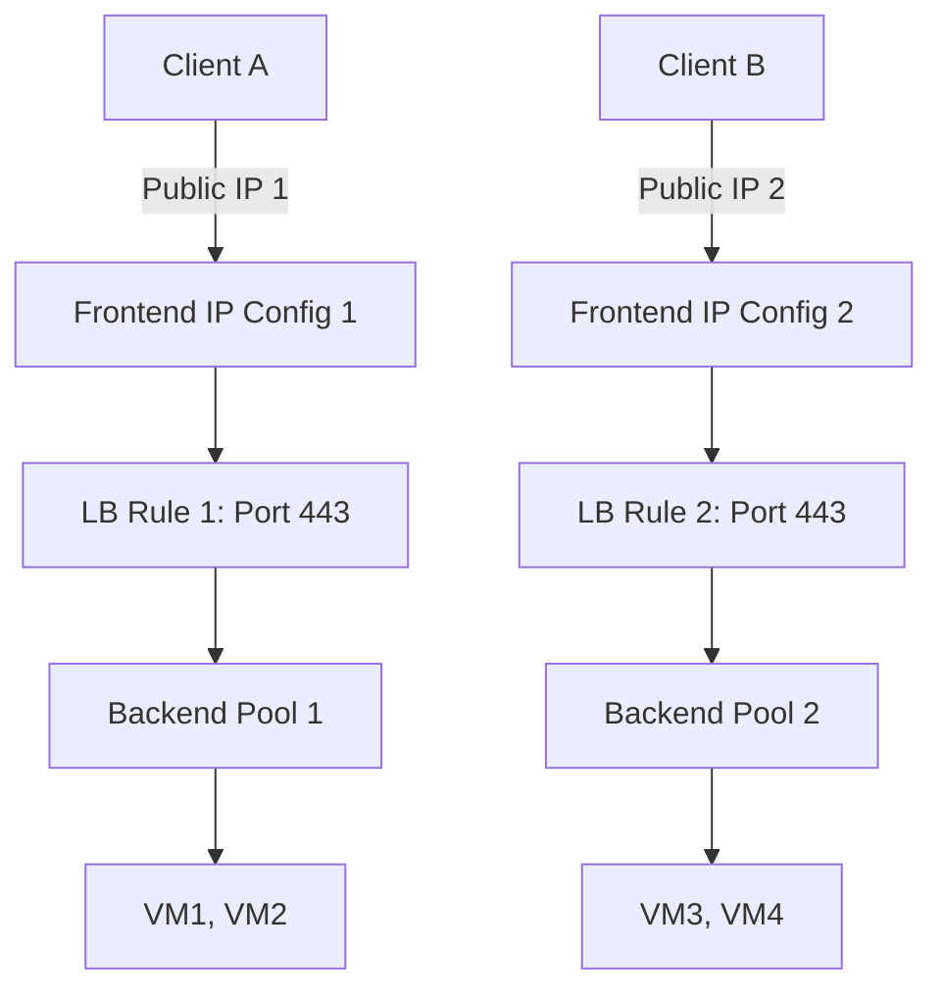

# How to Configure Azure Load Balancer with Multiple Frontend IP Addresses

Author: [nawazdhandala](https://www.github.com/nawazdhandala)

Tags: Azure, Load Balancer, Frontend IP, Networking, High Availability, Multi-IP, Traffic Management

Description: A practical guide to configuring Azure Load Balancer with multiple frontend IP addresses for hosting multiple services behind a single load balancer.

---

Azure Load Balancer supports multiple frontend IP addresses, which means you can host several services or applications behind a single load balancer instance. This is useful when you want different public IPs for different services but do not want to deploy a separate load balancer for each one.

I have seen teams deploy five or six load balancers when one with multiple frontends would do the same job at a fraction of the cost and complexity. In this post, I will show you how to configure multiple frontend IPs and map them to different backend pools using load balancing rules.

## When You Need Multiple Frontend IPs

There are a few common scenarios:

- **Hosting multiple websites** on the same set of VMs, each needing its own public IP for SSL termination at the DNS level
- **Separating production and staging traffic** through different IPs while sharing backend infrastructure
- **Running multiple services** (like a web app on port 443 and an API on port 8443) each with its own dedicated IP
- **IP-based routing** where clients connect to specific IPs based on their geographic region or service tier

## Architecture Overview

Here is how the setup looks:



Each frontend IP gets its own load balancing rules, and those rules can point to different backend pools or the same pool depending on your needs.

## Step 1: Create the Load Balancer with the First Frontend IP

Start by creating a Standard Load Balancer with one public IP:

```bash
# Create a public IP address for the first frontend
az network public-ip create \
  --resource-group myResourceGroup \
  --name myPublicIP1 \
  --sku Standard \
  --allocation-method Static

# Create the load balancer with the first frontend IP configuration
az network lb create \
  --resource-group myResourceGroup \
  --name myLoadBalancer \
  --sku Standard \
  --frontend-ip-name frontendIP1 \
  --public-ip-address myPublicIP1 \
  --backend-pool-name backendPool1
```

This gives you a load balancer with one frontend and one backend pool.

## Step 2: Add a Second Frontend IP

Now add a second public IP and frontend configuration:

```bash
# Create a second public IP address
az network public-ip create \
  --resource-group myResourceGroup \
  --name myPublicIP2 \
  --sku Standard \
  --allocation-method Static

# Add the second frontend IP configuration to the existing load balancer
az network lb frontend-ip create \
  --resource-group myResourceGroup \
  --lb-name myLoadBalancer \
  --name frontendIP2 \
  --public-ip-address myPublicIP2
```

You can repeat this process for as many frontend IPs as you need. The Standard SKU supports up to 600 frontend IP configurations per load balancer.

## Step 3: Create Additional Backend Pools

If you want different frontend IPs routing to different sets of VMs, create additional backend pools:

```bash
# Create a second backend pool
az network lb address-pool create \
  --resource-group myResourceGroup \
  --lb-name myLoadBalancer \
  --name backendPool2
```

## Step 4: Add Health Probes

Each backend pool should have its own health probe, especially if the services are different:

```bash
# Create a health probe for the first backend pool (web app)
az network lb probe create \
  --resource-group myResourceGroup \
  --lb-name myLoadBalancer \
  --name healthProbe1 \
  --protocol Tcp \
  --port 443

# Create a health probe for the second backend pool (API service)
az network lb probe create \
  --resource-group myResourceGroup \
  --lb-name myLoadBalancer \
  --name healthProbe2 \
  --protocol Tcp \
  --port 8443
```

## Step 5: Create Load Balancing Rules

This is where you tie everything together. Each rule maps a frontend IP and port to a backend pool:

```bash
# Rule 1: Frontend IP 1, port 443 -> Backend Pool 1
az network lb rule create \
  --resource-group myResourceGroup \
  --lb-name myLoadBalancer \
  --name lbRule1 \
  --frontend-ip-name frontendIP1 \
  --frontend-port 443 \
  --backend-pool-name backendPool1 \
  --backend-port 443 \
  --protocol Tcp \
  --probe-name healthProbe1 \
  --idle-timeout 15 \
  --enable-tcp-reset true

# Rule 2: Frontend IP 2, port 443 -> Backend Pool 2
az network lb rule create \
  --resource-group myResourceGroup \
  --lb-name myLoadBalancer \
  --name lbRule2 \
  --frontend-ip-name frontendIP2 \
  --frontend-port 443 \
  --backend-pool-name backendPool2 \
  --backend-port 8443 \
  --protocol Tcp \
  --probe-name healthProbe2 \
  --idle-timeout 15 \
  --enable-tcp-reset true
```

Notice that Rule 2 maps frontend port 443 to backend port 8443. This lets clients connect on the standard HTTPS port while your API runs on a different port internally.

## Step 6: Add VMs to Backend Pools

Add your VMs to the appropriate backend pools by associating their NICs:

```bash
# Add VM1's NIC to Backend Pool 1
az network nic ip-config address-pool add \
  --resource-group myResourceGroup \
  --nic-name vm1NIC \
  --ip-config-name ipconfig1 \
  --lb-name myLoadBalancer \
  --address-pool backendPool1

# Add VM3's NIC to Backend Pool 2
az network nic ip-config address-pool add \
  --resource-group myResourceGroup \
  --nic-name vm3NIC \
  --ip-config-name ipconfig1 \
  --lb-name myLoadBalancer \
  --address-pool backendPool2
```

## Using Multiple Frontend IPs with the Same Backend Pool

Sometimes you want multiple IPs routing to the same set of VMs. This works perfectly fine. Just point both rules to the same backend pool:

```bash
# Both frontend IPs route to the same backend pool
az network lb rule create \
  --resource-group myResourceGroup \
  --lb-name myLoadBalancer \
  --name lbRuleShared1 \
  --frontend-ip-name frontendIP1 \
  --frontend-port 80 \
  --backend-pool-name backendPool1 \
  --backend-port 80 \
  --protocol Tcp \
  --probe-name healthProbe1

az network lb rule create \
  --resource-group myResourceGroup \
  --lb-name myLoadBalancer \
  --name lbRuleShared2 \
  --frontend-ip-name frontendIP2 \
  --frontend-port 80 \
  --backend-pool-name backendPool1 \
  --backend-port 80 \
  --protocol Tcp \
  --probe-name healthProbe1
```

The VMs in the backend pool will see traffic from both IPs. Your application code can differentiate based on the destination IP in the packet header if needed.

## Outbound Rules with Multiple Frontend IPs

When VMs in a backend pool need to make outbound connections, you can control which frontend IP they use for SNAT:

```bash
# Create an outbound rule specifying which frontend IP to use for SNAT
az network lb outbound-rule create \
  --resource-group myResourceGroup \
  --lb-name myLoadBalancer \
  --name outboundRule1 \
  --frontend-ip-configs frontendIP1 \
  --address-pool backendPool1 \
  --protocol All \
  --allocated-outbound-ports 10000
```

This is handy when you need outbound traffic from your VMs to appear as a specific public IP, for example when the destination has IP-based allow lists.

## Monitoring and Verification

After setting everything up, verify your configuration:

```bash
# List all frontend IPs on the load balancer
az network lb frontend-ip list \
  --resource-group myResourceGroup \
  --lb-name myLoadBalancer \
  --output table

# List all load balancing rules
az network lb rule list \
  --resource-group myResourceGroup \
  --lb-name myLoadBalancer \
  --output table

# Check backend pool health
az network lb show \
  --resource-group myResourceGroup \
  --name myLoadBalancer \
  --query "backendAddressPools[].backendIPConfigurations[].id" \
  --output table
```

## Things to Watch Out For

**SKU consistency.** All public IPs must use the same SKU as the load balancer. Standard Load Balancer requires Standard SKU public IPs.

**Zone redundancy.** If your load balancer is zone-redundant, your public IPs should be too. Mixing zone-redundant and zonal resources can cause unexpected failover behavior.

**SNAT port exhaustion.** With multiple frontend IPs, you get more SNAT ports (1024 per IP per backend instance). If you are hitting SNAT limits, adding more frontend IPs with outbound rules can help.

**NSG rules.** Make sure the NSG on your backend VMs allows inbound traffic from the load balancer. Use the `AzureLoadBalancer` service tag in your NSG rules.

## Summary

Multiple frontend IPs on Azure Load Balancer give you flexibility to host several services behind one infrastructure without multiplying your load balancer count. The configuration is straightforward - create the public IPs, add them as frontend configurations, and create rules mapping each frontend to the appropriate backend pool. Just remember to keep your SKUs consistent, set up proper health probes for each service, and monitor SNAT port usage if your backend VMs make outbound connections.
