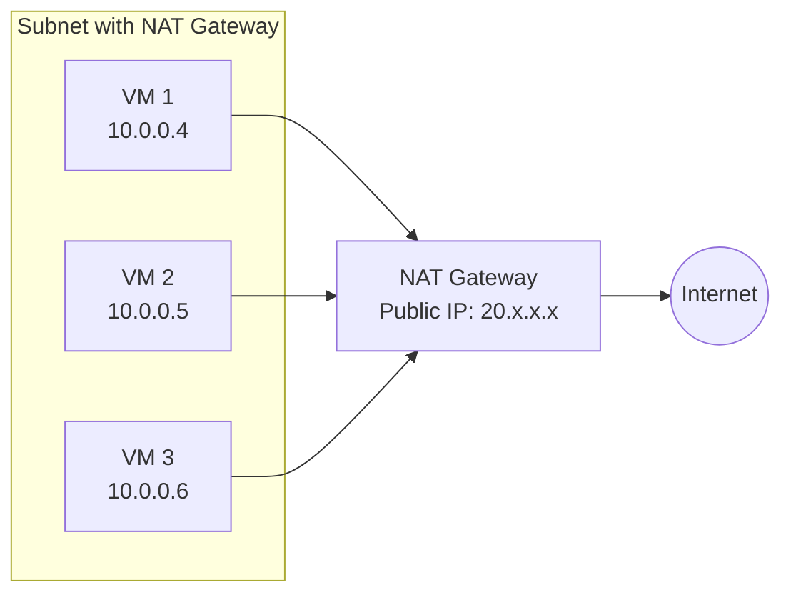
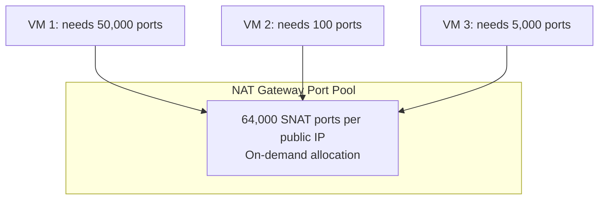

# How to Configure Azure NAT Gateway for Outbound Internet Connectivity

Author: [nawazdhandala](https://www.github.com/nawazdhandala)

Tags: Azure, NAT Gateway, Outbound Connectivity, SNAT, Azure Networking, Cloud Infrastructure

Description: Learn how to deploy Azure NAT Gateway to provide reliable and scalable outbound internet connectivity for your Azure virtual network resources.

---

Outbound internet connectivity in Azure can be surprisingly tricky. By default, VMs without a public IP or load balancer get outbound access through Azure's default SNAT (Source Network Address Translation), but this approach has limitations. The default SNAT uses dynamically assigned IPs that can change, provides limited port allocation, and makes it difficult to whitelist your Azure resources on external services.

Azure NAT Gateway solves these problems. It provides a dedicated, static public IP (or set of IPs) for outbound traffic from a subnet. All VMs in the subnet share the NAT Gateway for outbound connections, getting up to 64,000 SNAT ports per public IP with on-demand port allocation. No more SNAT exhaustion, no more unpredictable source IPs.

## Why You Need a NAT Gateway

Without a NAT Gateway, outbound connectivity depends on what resources are associated with your VMs:

1. **VM has a public IP**: Outbound uses that public IP (SNAT through the public IP)
2. **VM is behind a Standard Load Balancer**: Outbound uses the load balancer's outbound rules
3. **Neither**: Azure provides default outbound access, but with a shared, unpredictable IP

The third scenario is the problem. The default outbound access provides no guaranteed source IP, no way to scale ports, and Azure has been gradually deprecating this behavior.

NAT Gateway provides:

- **Static outbound IPs** that you control and can whitelist on external services
- **Scalable SNAT ports** with up to 64,000 ports per public IP
- **On-demand port allocation** that eliminates SNAT exhaustion
- **No configuration on VMs** needed - just associate with the subnet

## Architecture



## Prerequisites

- An Azure subscription
- A virtual network with a subnet
- Azure CLI installed

## Step 1: Create the Network Resources

```bash
# Create a resource group
az group create --name rg-natgw-demo --location eastus

# Create a VNet and subnet
az network vnet create \
  --resource-group rg-natgw-demo \
  --name vnet-demo \
  --location eastus \
  --address-prefixes 10.0.0.0/16 \
  --subnet-name subnet-workloads \
  --subnet-prefixes 10.0.0.0/24
```

## Step 2: Create a Public IP for the NAT Gateway

The public IP must use the Standard SKU and static allocation.

```bash
# Create a static public IP for NAT Gateway
az network public-ip create \
  --resource-group rg-natgw-demo \
  --name pip-natgw \
  --sku Standard \
  --allocation-method Static \
  --location eastus
```

If you need more than 64,000 concurrent outbound connections, you can create additional public IPs or use a public IP prefix.

```bash
# Create a public IP prefix for more IPs (optional)
az network public-ip prefix create \
  --resource-group rg-natgw-demo \
  --name pip-prefix-natgw \
  --length 30 \
  --location eastus
```

A /30 prefix gives you 4 public IPs, which means up to 256,000 concurrent SNAT ports.

## Step 3: Create the NAT Gateway

```bash
# Create the NAT Gateway
az network nat gateway create \
  --resource-group rg-natgw-demo \
  --name natgw-demo \
  --location eastus \
  --public-ip-addresses pip-natgw \
  --idle-timeout 10
```

The `--idle-timeout` controls how long idle connections are kept before being released. The default is 4 minutes, and the maximum is 120 minutes. Set this based on your application's needs. Long-running HTTP connections or database connections may need a higher timeout.

## Step 4: Associate the NAT Gateway with a Subnet

```bash
# Associate the NAT Gateway with the subnet
az network vnet subnet update \
  --resource-group rg-natgw-demo \
  --vnet-name vnet-demo \
  --name subnet-workloads \
  --nat-gateway natgw-demo
```

That is it. Every VM in `subnet-workloads` now uses the NAT Gateway for outbound internet traffic. No VM-level configuration required.

## Step 5: Verify Outbound IP

Create a VM in the subnet and verify it uses the NAT Gateway's public IP for outbound connections.

```bash
# Create a test VM
az vm create \
  --resource-group rg-natgw-demo \
  --name vm-test \
  --image Ubuntu2204 \
  --vnet-name vnet-demo \
  --subnet subnet-workloads \
  --admin-username azureuser \
  --generate-ssh-keys \
  --public-ip-address "" \
  --size Standard_B1s

# Get the expected outbound IP
az network public-ip show \
  --resource-group rg-natgw-demo \
  --name pip-natgw \
  --query ipAddress --output tsv
```

From within the VM (accessible via Bastion or other means), run:

```bash
# Check the outbound IP from inside the VM
curl -s ifconfig.me
```

The IP returned should match the NAT Gateway's public IP.

## Understanding SNAT Port Allocation

NAT Gateway allocates SNAT ports dynamically on demand rather than pre-allocating a fixed number per VM. This is a significant improvement over load balancer SNAT.

With a Standard Load Balancer, SNAT ports are divided equally among backend VMs. If you have 64,000 ports and 64 VMs, each VM gets 1,000 ports. If one VM needs more, it is out of luck.

With NAT Gateway, ports are pooled. Any VM can use any available port up to the 64,000 per IP maximum. A single VM making thousands of connections will not starve other VMs because the allocation is on-demand.



## Multiple Public IPs

For high-throughput workloads, add more public IPs to the NAT Gateway.

```bash
# Create additional public IPs
az network public-ip create \
  --resource-group rg-natgw-demo \
  --name pip-natgw-2 \
  --sku Standard \
  --allocation-method Static

# Add the second IP to the NAT Gateway
az network nat gateway update \
  --resource-group rg-natgw-demo \
  --name natgw-demo \
  --public-ip-addresses pip-natgw pip-natgw-2
```

With two public IPs, you get 128,000 total SNAT ports.

## NAT Gateway vs. Other Outbound Options

| Feature | NAT Gateway | Load Balancer SNAT | Default Outbound |
|---|---|---|---|
| Static outbound IP | Yes | Yes | No |
| SNAT port allocation | On-demand (64K/IP) | Pre-allocated per VM | Limited |
| SNAT exhaustion risk | Very low | Moderate | High |
| Cost | Per hour + data | Included with LB | Free (deprecated) |
| Configuration | Per subnet | Per LB rule | Automatic |

## Common Use Cases

**API calls to external services.** When calling third-party APIs that require IP whitelisting, NAT Gateway gives you a static IP to whitelist.

**Package downloads and updates.** VMs pulling packages from the internet benefit from the reliable outbound path.

**Microservices calling external dependencies.** Services making many concurrent outbound connections need the SNAT port scalability.

**Replacing default outbound access.** Since Azure is deprecating default outbound access, NAT Gateway is the recommended replacement.

## Troubleshooting

**SNAT exhaustion still occurring?** Check if you have exceeded 64,000 ports per IP. Add more public IPs. Also check the idle timeout - connections held open unnecessarily consume ports.

**Outbound IP not matching NAT Gateway IP?** If the VM has its own public IP or is behind a load balancer with outbound rules, those take precedence over the NAT Gateway. NAT Gateway is the lowest priority outbound mechanism.

**Traffic not going through NAT Gateway?** Verify the subnet association. Also check if there are UDRs that redirect traffic before it reaches the NAT Gateway.

## Cleanup

```bash
# Delete all resources
az group delete --name rg-natgw-demo --yes --no-wait
```

## Wrapping Up

Azure NAT Gateway is the recommended way to handle outbound internet connectivity for VMs in Azure. It provides static IPs for whitelisting, on-demand SNAT port allocation that eliminates exhaustion, and requires zero configuration on the VMs themselves. Associate it with a subnet and you are done. For any workload making outbound internet connections, especially those needing predictable source IPs or high connection counts, NAT Gateway should be part of your network design from the start.
