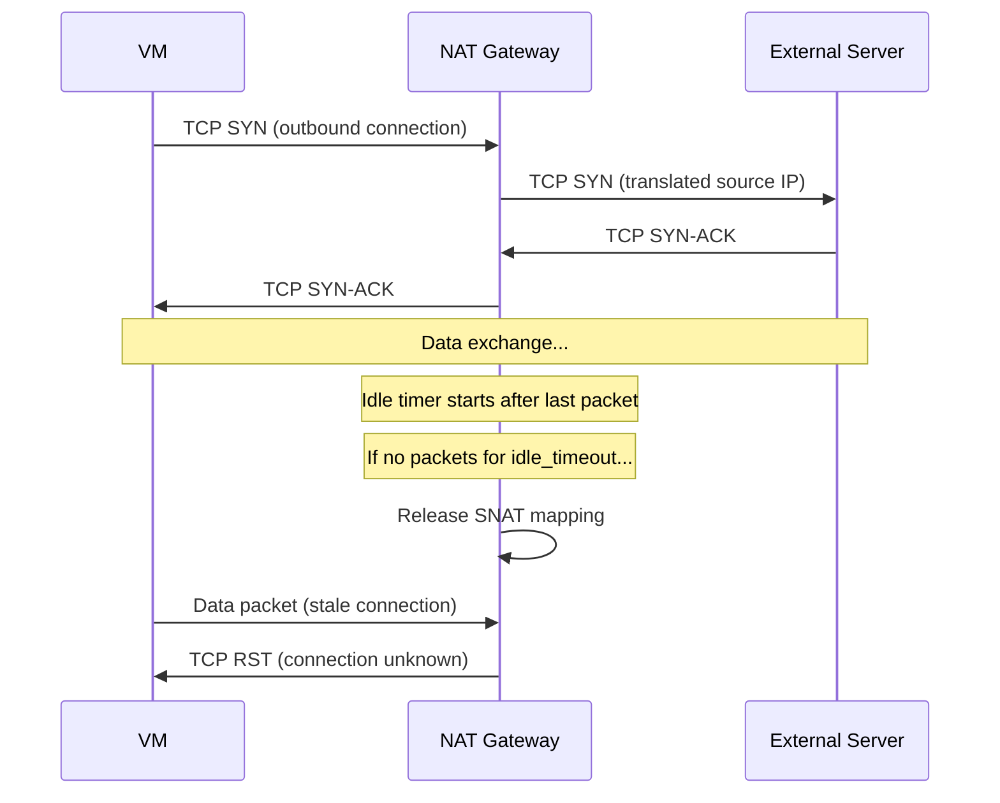

# How to Configure Azure NAT Gateway Idle Timeout for Long-Lived Connections

Author: [nawazdhandala](https://www.github.com/nawazdhandala)

Tags: Azure, NAT Gateway, Idle Timeout, Networking, TCP Connections, Outbound

Description: Learn how to configure Azure NAT Gateway idle timeout settings to prevent long-lived TCP connections from being dropped due to inactivity timeouts.

---

Azure NAT Gateway provides outbound internet connectivity for resources in a virtual network, handling SNAT (Source Network Address Translation) automatically. One of the settings that catches people off guard is the idle timeout. If a TCP connection sits idle for too long without any data flowing, NAT Gateway closes it. This is fine for typical web requests, but it breaks long-lived connections like database sessions, message queue consumers, SSH tunnels, and WebSocket connections.

This guide covers how to configure the idle timeout, understand its implications, and implement strategies for connections that need to stay alive longer than the maximum timeout allows.

## How NAT Gateway Idle Timeout Works

When a VM behind NAT Gateway opens an outbound TCP connection, NAT Gateway allocates a SNAT port and tracks the connection state. If no packets flow through the connection for the idle timeout period, NAT Gateway considers the connection dead and releases the SNAT port. The next packet from either side gets a TCP RST because the NAT mapping no longer exists.

The default idle timeout is 4 minutes. You can configure it from 4 minutes to 120 minutes (2 hours).



## Common Scenarios Where Idle Timeout Matters

Several workload patterns are affected by idle timeouts:

- **Database connection pools**: Applications maintain persistent connections to databases. Connections in the pool that are not actively in use will sit idle.
- **Message queue consumers**: Consumers connected to RabbitMQ, Kafka, or other message brokers may wait minutes or hours for new messages.
- **SSH sessions**: Interactive SSH sessions have natural idle periods when the user is thinking or reading.
- **WebSocket connections**: Real-time applications maintain WebSocket connections that might go idle between events.
- **Long-running API calls**: Batch processing APIs that take a long time to respond.
- **FTP data connections**: File transfer sessions with pauses between transfers.

## Step 1: Check Your Current NAT Gateway Idle Timeout

First, check the current idle timeout setting on your NAT Gateway:

```bash
# Check the current idle timeout (in minutes)
az network nat gateway show \
  --name myNatGateway \
  --resource-group myResourceGroup \
  --query "idleTimeoutInMinutes" -o tsv
```

## Step 2: Update the Idle Timeout

Increase the idle timeout to a value that accommodates your longest expected idle period:

```bash
# Set the idle timeout to 30 minutes
az network nat gateway update \
  --name myNatGateway \
  --resource-group myResourceGroup \
  --idle-timeout 30
```

If you need the maximum value:

```bash
# Set the idle timeout to the maximum of 120 minutes (2 hours)
az network nat gateway update \
  --name myNatGateway \
  --resource-group myResourceGroup \
  --idle-timeout 120
```

The change takes effect immediately for new connections. Existing connections keep their current timer.

## Step 3: Create a New NAT Gateway with Custom Idle Timeout

If you are deploying a new NAT Gateway, set the idle timeout during creation:

```bash
# Create a public IP for the NAT Gateway
az network public-ip create \
  --name nat-gw-pip \
  --resource-group myResourceGroup \
  --location eastus \
  --sku Standard \
  --allocation-method Static

# Create the NAT Gateway with a 60-minute idle timeout
az network nat gateway create \
  --name myNatGateway \
  --resource-group myResourceGroup \
  --location eastus \
  --public-ip-addresses nat-gw-pip \
  --idle-timeout 60
```

Then associate it with a subnet:

```bash
# Associate the NAT Gateway with a subnet
az network vnet subnet update \
  --name mySubnet \
  --resource-group myResourceGroup \
  --vnet-name myVNet \
  --nat-gateway myNatGateway
```

## Step 4: Implement TCP Keep-Alives for Extra Safety

Even with the maximum 120-minute idle timeout, some connections need to stay alive indefinitely. For these, configure TCP keep-alives at the application or OS level. Keep-alive packets are small TCP probes that reset the idle timer without transferring actual application data.

**Linux OS-level keep-alive settings**:

```bash
# View current keep-alive settings
sysctl net.ipv4.tcp_keepalive_time
sysctl net.ipv4.tcp_keepalive_intvl
sysctl net.ipv4.tcp_keepalive_probes

# Set keep-alive to send probes every 60 seconds after 120 seconds of idle
# This keeps the NAT Gateway mapping alive
sudo sysctl -w net.ipv4.tcp_keepalive_time=120
sudo sysctl -w net.ipv4.tcp_keepalive_intvl=60
sudo sysctl -w net.ipv4.tcp_keepalive_probes=3

# Make persistent across reboots
echo "net.ipv4.tcp_keepalive_time = 120" | sudo tee -a /etc/sysctl.conf
echo "net.ipv4.tcp_keepalive_intvl = 60" | sudo tee -a /etc/sysctl.conf
echo "net.ipv4.tcp_keepalive_probes = 3" | sudo tee -a /etc/sysctl.conf
```

**Application-level keep-alive in Python**:

```python
# Enable TCP keep-alive on a socket connection
# This ensures the NAT Gateway idle timer resets regularly

import socket

sock = socket.socket(socket.AF_INET, socket.SOCK_STREAM)

# Enable TCP keep-alive
sock.setsockopt(socket.SOL_SOCKET, socket.SO_KEEPALIVE, 1)

# Set keep-alive parameters (Linux only)
# TCP_KEEPIDLE: seconds before first keep-alive probe
sock.setsockopt(socket.IPPROTO_TCP, socket.TCP_KEEPIDLE, 120)
# TCP_KEEPINTVL: seconds between keep-alive probes
sock.setsockopt(socket.IPPROTO_TCP, socket.TCP_KEEPINTVL, 60)
# TCP_KEEPCNT: number of failed probes before connection is considered dead
sock.setsockopt(socket.IPPROTO_TCP, socket.TCP_KEEPCNT, 3)

sock.connect(('database-server.example.com', 5432))
```

**Database connection pool configuration (PostgreSQL with psycopg2)**:

```python
# Configure PostgreSQL connection pool with keep-alive
# Prevents idle database connections from being dropped by NAT Gateway

import psycopg2
from psycopg2 import pool

# Connection parameters include keep-alive settings
connection_pool = psycopg2.pool.ThreadedConnectionPool(
    minconn=5,
    maxconn=20,
    host='external-db.example.com',
    port=5432,
    database='mydb',
    user='myuser',
    password='mypassword',
    # TCP keep-alive parameters
    keepalives=1,
    keepalives_idle=120,    # Start probes after 120 seconds idle
    keepalives_interval=60,  # Probe every 60 seconds
    keepalives_count=3       # Give up after 3 failed probes
)
```

## Step 5: Monitor SNAT Port Usage

High idle timeouts mean SNAT ports are held longer, which can lead to port exhaustion. Monitor your SNAT port usage:

```bash
# Check NAT Gateway metrics
az monitor metrics list \
  --resource "/subscriptions/{sub-id}/resourceGroups/myResourceGroup/providers/Microsoft.Network/natGateways/myNatGateway" \
  --metric "SNATConnectionCount" "TotalConnectionCount" "DroppedPackets" \
  --interval PT5M \
  --output table
```

Create an alert for high SNAT usage:

```bash
# Alert when SNAT connection count gets high
az monitor metrics alert create \
  --name "NatGateway-HighSNAT" \
  --resource-group myResourceGroup \
  --scopes "/subscriptions/{sub-id}/resourceGroups/myResourceGroup/providers/Microsoft.Network/natGateways/myNatGateway" \
  --condition "total SNATConnectionCount > 50000" \
  --window-size 5m \
  --evaluation-frequency 1m \
  --action myActionGroup \
  --severity 2
```

## Step 6: Scale SNAT Ports if Needed

If you increase the idle timeout and start running into SNAT port exhaustion, you can add more public IP addresses to the NAT Gateway. Each public IP provides approximately 64,000 SNAT ports.

```bash
# Create additional public IPs
az network public-ip create \
  --name nat-gw-pip2 \
  --resource-group myResourceGroup \
  --location eastus \
  --sku Standard \
  --allocation-method Static

# Add the new public IP to the NAT Gateway
az network nat gateway update \
  --name myNatGateway \
  --resource-group myResourceGroup \
  --public-ip-addresses nat-gw-pip nat-gw-pip2
```

You can also use public IP prefixes for even more scalability:

```bash
# Create a /28 public IP prefix (16 IPs = ~1 million SNAT ports)
az network public-ip prefix create \
  --name nat-gw-prefix \
  --resource-group myResourceGroup \
  --location eastus \
  --length 28

# Associate the prefix with the NAT Gateway
az network nat gateway update \
  --name myNatGateway \
  --resource-group myResourceGroup \
  --public-ip-prefixes nat-gw-prefix
```

## Choosing the Right Idle Timeout

The idle timeout you choose involves a trade-off:

**Shorter timeout (4-10 minutes)**: SNAT ports are recycled quickly, reducing the chance of port exhaustion. But idle connections get dropped more frequently, which is problematic for connection pools and persistent connections.

**Longer timeout (30-120 minutes)**: Long-lived connections stay alive without keep-alives. But SNAT ports are held longer, which can lead to exhaustion under high connection counts.

Here are recommended starting points based on workload type:

| Workload | Recommended Timeout | Keep-Alive |
|----------|-------------------|------------|
| Web applications | 4-10 min | Not needed |
| Database pools | 30-60 min | Yes, 120s interval |
| Message consumers | 60-120 min | Yes, 60s interval |
| SSH sessions | 30-60 min | Yes, 60s interval |
| WebSockets | 30-60 min | Application-level ping/pong |

## Wrapping Up

Azure NAT Gateway idle timeout is a simple setting with significant impact on long-lived connections. Start by identifying which of your outbound connections are long-lived or have idle periods, then set the timeout to accommodate them. For connections that may exceed even the 120-minute maximum, implement TCP keep-alives at either the OS level or the application level. Monitor your SNAT port usage after making changes, and scale up with additional public IPs if needed. Getting the idle timeout right prevents those mysterious connection resets that are otherwise very difficult to diagnose.
