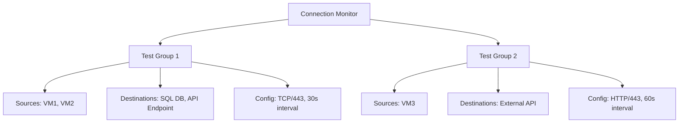

# How to Configure Azure Network Watcher Connection Monitor for Endpoint Monitoring

Author: [nawazdhandala](https://www.github.com/nawazdhandala)

Tags: Azure, Network Watcher, Connection Monitor, Endpoint Monitoring, Networking, Diagnostics, Monitoring

Description: Learn how to set up Azure Network Watcher Connection Monitor to continuously monitor connectivity between endpoints and detect network issues proactively.

---

Waiting for users to report connectivity problems is not a monitoring strategy. Azure Network Watcher Connection Monitor lets you proactively test connectivity between your Azure VMs, on-premises machines, and external endpoints on a continuous basis. When a connection degrades or fails, you get alerted before anyone opens a support ticket.

Connection Monitor is the successor to the older Connection Monitor (classic) and Network Performance Monitor. It unifies network monitoring into a single tool that works across Azure, on-premises, and multi-cloud environments.

## What Connection Monitor Does

Connection Monitor periodically sends test traffic between source and destination endpoints and measures:

- **Connectivity success/failure** - Can the source reach the destination?
- **Latency** - Round-trip time for the test
- **Packet loss** - Percentage of test probes that fail
- **Hop-by-hop path** - The network path taken (for TCP tests)

You define test groups with sources, destinations, and test configurations. Connection Monitor runs the tests at your specified frequency and reports results to Azure Monitor.

## Key Concepts

- **Test Group:** A collection of sources, destinations, and test configurations
- **Source:** An Azure VM, Azure VMSS, or on-premises machine with the Log Analytics agent
- **Destination:** Any IP, FQDN, URL, Azure VM, or Azure service endpoint
- **Test Configuration:** Protocol (TCP, HTTP, ICMP), port, frequency, and success thresholds



## Prerequisites

1. Network Watcher enabled in the regions you are monitoring
2. The Network Watcher extension installed on source VMs
3. A Log Analytics workspace (for metric storage and alerting)
4. Source VMs must have outbound internet access for sending telemetry (or be able to reach the Azure Monitor endpoint)

## Step 1: Install the Network Watcher Extension

Source VMs need the Network Watcher agent to run connectivity tests:

```bash
# Install on Linux VMs
az vm extension set \
  --resource-group myResourceGroup \
  --vm-name sourceVM1 \
  --name NetworkWatcherAgentLinux \
  --publisher Microsoft.Azure.NetworkWatcher

# Install on Windows VMs
az vm extension set \
  --resource-group myResourceGroup \
  --vm-name sourceVM2 \
  --name NetworkWatcherAgentWindows \
  --publisher Microsoft.Azure.NetworkWatcher
```

## Step 2: Create a Connection Monitor

Create a connection monitor with a test group that monitors connectivity from your VMs to critical endpoints:

```bash
# Create a connection monitor with a test group
az network watcher connection-monitor create \
  --name myConnectionMonitor \
  --location eastus \
  --test-group-name criticalServices \
  --endpoint-source-name sourceVM1 \
  --endpoint-source-resource-id "/subscriptions/<sub-id>/resourceGroups/myResourceGroup/providers/Microsoft.Compute/virtualMachines/sourceVM1" \
  --endpoint-dest-name sqlDatabase \
  --endpoint-dest-address "mysqlserver.database.windows.net" \
  --test-config-name tcpTest443 \
  --protocol Tcp \
  --tcp-port 443 \
  --test-config-frequency 30
```

This creates a monitor that tests TCP connectivity from sourceVM1 to your SQL Database on port 443 every 30 seconds.

## Step 3: Add Multiple Endpoints and Tests

Real-world monitoring involves multiple sources and destinations. You can define more elaborate configurations using a JSON template:

```bash
# Create a comprehensive connection monitor using JSON input
az network watcher connection-monitor create \
  --name comprehensiveMonitor \
  --location eastus \
  --notes "Monitors critical application dependencies"
```

For complex configurations, using an ARM template or the Azure Portal is more practical. Here is the structure of a connection monitor with multiple test groups:

```json
{
  "testGroups": [
    {
      "name": "webTierToDatabase",
      "sources": ["webVM1", "webVM2"],
      "destinations": ["sqlEndpoint", "cosmosEndpoint"],
      "testConfigurations": ["tcpTest1433", "tcpTest443"]
    },
    {
      "name": "appTierToExternalAPIs",
      "sources": ["appVM1"],
      "destinations": ["paymentAPI", "shippingAPI"],
      "testConfigurations": ["httpTest443"]
    }
  ]
}
```

## Step 4: Configure HTTP Tests

For web services, HTTP tests provide richer information than TCP tests. They can check HTTP status codes and response content:

```bash
# Add an HTTP test configuration
az network watcher connection-monitor test-configuration add \
  --connection-monitor myConnectionMonitor \
  --location eastus \
  --name httpHealthCheck \
  --protocol Http \
  --http-port 443 \
  --http-method GET \
  --http-path "/api/health" \
  --http-valid-status-codes 200 204 \
  --test-frequency-sec 60
```

HTTP tests let you detect issues that TCP tests miss. A service might accept TCP connections but return 500 errors. Only an HTTP test catches that.

## Step 5: Configure ICMP Tests

For basic reachability testing, ICMP (ping) tests are simple and low-overhead:

```bash
# Add an ICMP test configuration
az network watcher connection-monitor test-configuration add \
  --connection-monitor myConnectionMonitor \
  --location eastus \
  --name icmpTest \
  --protocol Icmp \
  --test-frequency-sec 30
```

Note that ICMP tests require NSG rules to allow ICMP traffic. Many default NSG configurations block ICMP.

## Step 6: Set Up Alerts

Connect your Connection Monitor to Azure Monitor alerts so you get notified when connectivity degrades:

```bash
# Create a metric alert for connection monitor failures
az monitor metrics alert create \
  --resource-group NetworkWatcherRG \
  --name connectionFailureAlert \
  --scopes "/subscriptions/<sub-id>/resourceGroups/NetworkWatcherRG/providers/Microsoft.Network/networkWatchers/NetworkWatcher_eastus/connectionMonitors/myConnectionMonitor" \
  --condition "avg ChecksFailedPercent > 50" \
  --window-size 5m \
  --evaluation-frequency 1m \
  --action-group myAlertActionGroup \
  --description "Alert when more than 50% of checks fail"
```

You can also alert on latency thresholds:

```bash
# Alert when average latency exceeds 100ms
az monitor metrics alert create \
  --resource-group NetworkWatcherRG \
  --name highLatencyAlert \
  --scopes "/subscriptions/<sub-id>/resourceGroups/NetworkWatcherRG/providers/Microsoft.Network/networkWatchers/NetworkWatcher_eastus/connectionMonitors/myConnectionMonitor" \
  --condition "avg RoundTripTimeMs > 100" \
  --window-size 5m \
  --evaluation-frequency 1m \
  --action-group myAlertActionGroup \
  --description "Alert when average latency exceeds 100ms"
```

## Step 7: Review Results

View the monitoring results in the Azure Portal under Network Watcher > Connection Monitor, or query them through Log Analytics:

```
// KQL query to see connection monitor test results
NWConnectionMonitorTestResult
| where TimeGenerated > ago(24h)
| where TestGroupName == "criticalServices"
| summarize
    AvgLatency = avg(AvgRoundTripTimeMs),
    FailedChecks = countif(ChecksFailed > 0),
    TotalChecks = count()
    by DestinationName, bin(TimeGenerated, 1h)
| order by TimeGenerated desc
```

To see the network path and identify where failures occur:

```
// KQL query to see path analysis
NWConnectionMonitorPathResult
| where TimeGenerated > ago(1h)
| where TestGroupName == "criticalServices"
| project TimeGenerated, SourceName, DestinationName, PathHops
```

## Monitoring On-Premises Endpoints

Connection Monitor can monitor connectivity to on-premises machines through ExpressRoute or VPN. The on-premises machine needs the Azure Monitor Agent installed and registered with a Log Analytics workspace.

Once registered, add it as a source or destination in your test group. This gives you end-to-end monitoring from Azure to on-premises and vice versa.

## Best Practices

**Choose appropriate test frequencies.** Testing every 10 seconds gives high granularity but generates a lot of data. For most use cases, 30-60 second intervals provide a good balance.

**Use the right protocol for each test.** Use HTTP for web services, TCP for database ports, and ICMP for basic reachability. HTTP tests give the most diagnostic value.

**Group tests logically.** Create test groups that match your application architecture (web tier to data tier, app tier to external APIs, etc.).

**Set meaningful alert thresholds.** A single failed check is not worth waking someone up for. Alert on sustained failures (50%+ checks failed over 5 minutes) to reduce noise.

**Monitor dependencies, not just your own services.** If your app depends on a third-party API, monitor that connection too. External dependencies are often the source of outages.

## Limitations

- Maximum of 100 connection monitors per subscription per region
- Maximum of 20 test groups per connection monitor
- ICMP tests are not supported from VMSS sources
- On-premises sources require the Azure Monitor Agent

## Summary

Connection Monitor provides continuous, automated monitoring of network connectivity between your Azure VMs, on-premises machines, and external endpoints. Set up test groups matching your application's dependency graph, configure appropriate test protocols and frequencies, and wire up alerts for failure and latency thresholds. This gives you early warning of network issues before they become user-facing outages, and the hop-by-hop path analysis helps you pinpoint exactly where problems occur.
