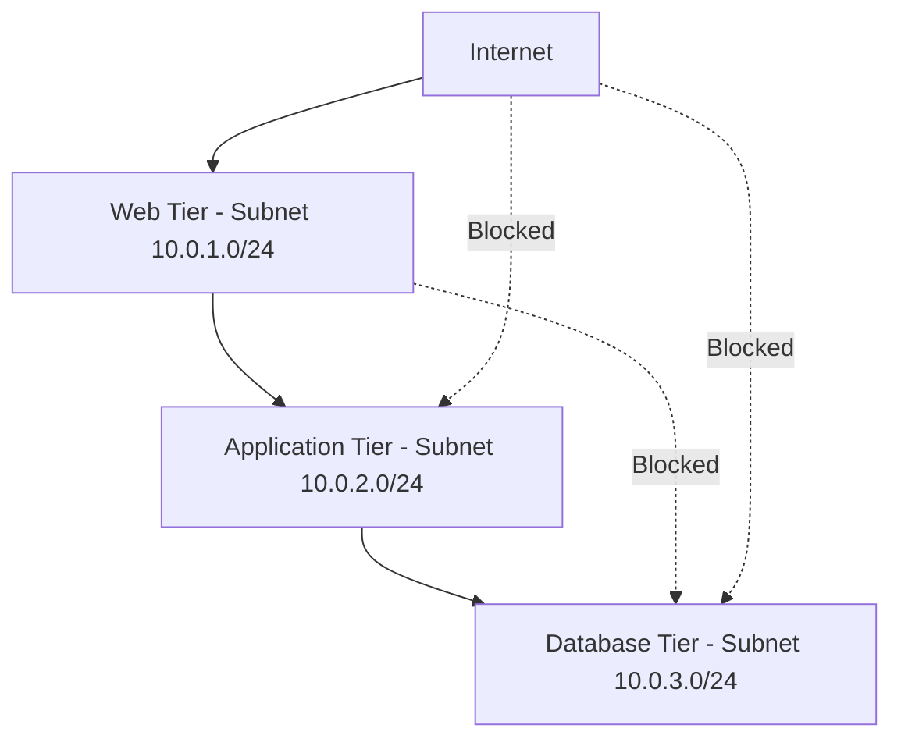

# How to Configure Azure NSG Application Rules for Multi-Tier Architecture Security Isolation

Author: [nawazdhandala](https://www.github.com/nawazdhandala)

Tags: Azure, NSG, Network Security, Multi-Tier Architecture, Security Isolation, Azure Networking, Firewall Rules

Description: A practical guide to configuring Azure Network Security Groups for proper traffic isolation between web, application, and database tiers in a multi-tier architecture.

---

Running a multi-tier application in Azure without proper network segmentation is like leaving all the doors in your house unlocked. Sure, everything works, but one compromised component gives an attacker free rein to move laterally across your entire infrastructure. Network Security Groups (NSGs) are the primary tool Azure gives you to lock down traffic between tiers, and getting the rules right is critical.

In this guide, I will walk through how to design and configure NSG rules for a classic three-tier architecture: a web tier, an application tier, and a database tier. We will build the rules from scratch, starting with a deny-all baseline and adding only the traffic flows that are actually needed.

## Understanding the Three-Tier Model

Before diving into NSG configurations, let us clarify what we are building. A typical three-tier architecture looks like this:



The key principle: traffic should only flow between adjacent tiers. The web tier talks to the application tier. The application tier talks to the database tier. The web tier should never talk directly to the database tier. The internet should never reach the application or database tiers directly.

## Step 1: Set Up the Virtual Network and Subnets

First, let us create the network infrastructure. Each tier gets its own subnet, and each subnet gets its own NSG.

This script creates the virtual network with three subnets and three NSGs - one per tier:

```bash
# Define variables
RG="rg-multitier-app"
LOCATION="eastus"
VNET_NAME="vnet-multitier"

# Create resource group
az group create --name $RG --location $LOCATION

# Create the virtual network with three subnets
az network vnet create \
  --resource-group $RG \
  --name $VNET_NAME \
  --address-prefix 10.0.0.0/16 \
  --subnet-name snet-web \
  --subnet-prefix 10.0.1.0/24

az network vnet subnet create \
  --resource-group $RG \
  --vnet-name $VNET_NAME \
  --name snet-app \
  --address-prefix 10.0.2.0/24

az network vnet subnet create \
  --resource-group $RG \
  --vnet-name $VNET_NAME \
  --name snet-db \
  --address-prefix 10.0.3.0/24

# Create NSGs for each tier
az network nsg create --resource-group $RG --name nsg-web
az network nsg create --resource-group $RG --name nsg-app
az network nsg create --resource-group $RG --name nsg-db
```

## Step 2: Configure the Web Tier NSG

The web tier is the only tier exposed to the internet. It needs to accept HTTP and HTTPS traffic from the internet and forward requests to the application tier.

This configuration allows inbound web traffic from the internet and outbound traffic to the application tier, while blocking everything else:

```bash
# Allow inbound HTTP from the internet
az network nsg rule create \
  --resource-group $RG \
  --nsg-name nsg-web \
  --name Allow-HTTP-Inbound \
  --priority 100 \
  --direction Inbound \
  --access Allow \
  --protocol Tcp \
  --source-address-prefixes Internet \
  --source-port-ranges '*' \
  --destination-address-prefixes '10.0.1.0/24' \
  --destination-port-ranges 80

# Allow inbound HTTPS from the internet
az network nsg rule create \
  --resource-group $RG \
  --nsg-name nsg-web \
  --name Allow-HTTPS-Inbound \
  --priority 110 \
  --direction Inbound \
  --access Allow \
  --protocol Tcp \
  --source-address-prefixes Internet \
  --source-port-ranges '*' \
  --destination-address-prefixes '10.0.1.0/24' \
  --destination-port-ranges 443

# Allow outbound traffic to the application tier on port 8080
az network nsg rule create \
  --resource-group $RG \
  --nsg-name nsg-web \
  --name Allow-To-AppTier \
  --priority 100 \
  --direction Outbound \
  --access Allow \
  --protocol Tcp \
  --source-address-prefixes '10.0.1.0/24' \
  --source-port-ranges '*' \
  --destination-address-prefixes '10.0.2.0/24' \
  --destination-port-ranges 8080

# Deny outbound traffic to the database tier (explicit block)
az network nsg rule create \
  --resource-group $RG \
  --nsg-name nsg-web \
  --name Deny-To-DBTier \
  --priority 200 \
  --direction Outbound \
  --access Deny \
  --protocol '*' \
  --source-address-prefixes '10.0.1.0/24' \
  --source-port-ranges '*' \
  --destination-address-prefixes '10.0.3.0/24' \
  --destination-port-ranges '*'
```

## Step 3: Configure the Application Tier NSG

The application tier should only accept traffic from the web tier and should only send traffic to the database tier. No internet traffic should reach this tier directly.

These rules restrict the application tier to accept traffic only from the web subnet and send traffic only to the database subnet:

```bash
# Allow inbound from web tier on port 8080
az network nsg rule create \
  --resource-group $RG \
  --nsg-name nsg-app \
  --name Allow-From-WebTier \
  --priority 100 \
  --direction Inbound \
  --access Allow \
  --protocol Tcp \
  --source-address-prefixes '10.0.1.0/24' \
  --source-port-ranges '*' \
  --destination-address-prefixes '10.0.2.0/24' \
  --destination-port-ranges 8080

# Deny all other inbound traffic from VNet (catches cross-tier violations)
az network nsg rule create \
  --resource-group $RG \
  --nsg-name nsg-app \
  --name Deny-All-Other-Inbound \
  --priority 4000 \
  --direction Inbound \
  --access Deny \
  --protocol '*' \
  --source-address-prefixes VirtualNetwork \
  --source-port-ranges '*' \
  --destination-address-prefixes '10.0.2.0/24' \
  --destination-port-ranges '*'

# Allow outbound to database tier on SQL port
az network nsg rule create \
  --resource-group $RG \
  --nsg-name nsg-app \
  --name Allow-To-DBTier \
  --priority 100 \
  --direction Outbound \
  --access Allow \
  --protocol Tcp \
  --source-address-prefixes '10.0.2.0/24' \
  --source-port-ranges '*' \
  --destination-address-prefixes '10.0.3.0/24' \
  --destination-port-ranges 1433

# Deny outbound to web tier (prevent reverse communication)
az network nsg rule create \
  --resource-group $RG \
  --nsg-name nsg-app \
  --name Deny-To-WebTier \
  --priority 200 \
  --direction Outbound \
  --access Deny \
  --protocol '*' \
  --source-address-prefixes '10.0.2.0/24' \
  --source-port-ranges '*' \
  --destination-address-prefixes '10.0.1.0/24' \
  --destination-port-ranges '*'
```

## Step 4: Configure the Database Tier NSG

The database tier is the most restricted. It should only accept connections from the application tier on the specific database port. No outbound internet access, no connections from the web tier.

This is the most restrictive NSG - it only allows inbound SQL connections from the application tier:

```bash
# Allow inbound from app tier on SQL port only
az network nsg rule create \
  --resource-group $RG \
  --nsg-name nsg-db \
  --name Allow-From-AppTier \
  --priority 100 \
  --direction Inbound \
  --access Allow \
  --protocol Tcp \
  --source-address-prefixes '10.0.2.0/24' \
  --source-port-ranges '*' \
  --destination-address-prefixes '10.0.3.0/24' \
  --destination-port-ranges 1433

# Deny all other inbound from VNet
az network nsg rule create \
  --resource-group $RG \
  --nsg-name nsg-db \
  --name Deny-All-Other-Inbound \
  --priority 4000 \
  --direction Inbound \
  --access Deny \
  --protocol '*' \
  --source-address-prefixes VirtualNetwork \
  --source-port-ranges '*' \
  --destination-address-prefixes '10.0.3.0/24' \
  --destination-port-ranges '*'

# Deny all outbound to internet (database should not reach the internet)
az network nsg rule create \
  --resource-group $RG \
  --nsg-name nsg-db \
  --name Deny-Internet-Outbound \
  --priority 100 \
  --direction Outbound \
  --access Deny \
  --protocol '*' \
  --source-address-prefixes '10.0.3.0/24' \
  --source-port-ranges '*' \
  --destination-address-prefixes Internet \
  --destination-port-ranges '*'
```

## Step 5: Associate NSGs with Subnets

Now associate each NSG with its corresponding subnet:

```bash
# Associate NSGs with their respective subnets
az network vnet subnet update \
  --resource-group $RG \
  --vnet-name $VNET_NAME \
  --name snet-web \
  --network-security-group nsg-web

az network vnet subnet update \
  --resource-group $RG \
  --vnet-name $VNET_NAME \
  --name snet-app \
  --network-security-group nsg-app

az network vnet subnet update \
  --resource-group $RG \
  --vnet-name $VNET_NAME \
  --name snet-db \
  --network-security-group nsg-db
```

## Important Considerations for NSG Rule Priority

NSG rules are evaluated in priority order, starting from the lowest number. Here are some things to keep in mind:

- **Lower numbers have higher priority.** A rule with priority 100 is evaluated before a rule with priority 200.
- **First match wins.** Once a rule matches the traffic, no further rules are evaluated.
- **Default rules exist.** Azure creates default rules at priorities 65000-65500 that allow VNet-to-VNet traffic and outbound internet access. Your custom deny rules need to have lower priority numbers to override these defaults.
- **Leave gaps in priority numbers.** I usually increment by 10 or 100 so I can insert rules later without renumbering everything.

## Testing Your NSG Rules

After configuring everything, you should verify that traffic flows as expected. A quick way to do this is with the Network Watcher IP flow verify feature.

This command checks whether a specific traffic flow would be allowed or denied by your NSG rules:

```bash
# Test if web tier can reach app tier on port 8080 (should be allowed)
az network watcher test-ip-flow \
  --resource-group $RG \
  --vm web-vm-01 \
  --direction Outbound \
  --protocol Tcp \
  --local '10.0.1.4:*' \
  --remote '10.0.2.4:8080'

# Test if web tier can reach db tier on port 1433 (should be denied)
az network watcher test-ip-flow \
  --resource-group $RG \
  --vm web-vm-01 \
  --direction Outbound \
  --protocol Tcp \
  --local '10.0.1.4:*' \
  --remote '10.0.3.4:1433'
```

## Enabling NSG Flow Logs

You should always enable NSG flow logs for visibility into what traffic is being allowed and denied. This is invaluable for troubleshooting and security auditing.

```bash
# Enable NSG flow logs (requires a storage account and Network Watcher)
az network watcher flow-log create \
  --resource-group $RG \
  --name flowlog-nsg-web \
  --nsg nsg-web \
  --storage-account stgsecuritylogs \
  --enabled true \
  --retention 90 \
  --format JSON
```

## Common Mistakes to Avoid

**Forgetting about return traffic.** NSGs are stateful, meaning if you allow inbound traffic on a port, the return traffic is automatically allowed. You do not need to create explicit rules for response packets.

**Being too broad with service tags.** Using "VirtualNetwork" as a source allows traffic from any subnet in the VNet and any peered VNets. Be specific with subnet CIDR ranges when you need strict tier isolation.

**Not accounting for Azure platform traffic.** Some Azure services need to communicate with your VMs for things like health probes, DNS resolution, and metadata services. Make sure you do not accidentally block these by being too aggressive with deny rules.

**Ignoring Application Security Groups.** For more complex setups, consider using Application Security Groups (ASGs) to group VMs logically instead of relying solely on subnet addresses. ASGs make your rules more readable and easier to maintain as your architecture grows.

## Wrapping Up

Proper NSG configuration for multi-tier architectures is not glamorous work, but it is fundamental to a strong security posture. The key principle is simple: deny everything by default, then allow only the specific traffic flows that your application needs between adjacent tiers. Test your rules, enable flow logs, and review them periodically as your application evolves. A well-segmented network means that even if one tier gets compromised, the attacker cannot easily pivot to the rest of your infrastructure.
