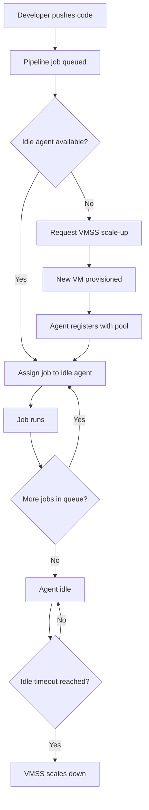

# How to Configure Azure Pipelines Agent Pools with Scaling Based on Queue Demand

Author: [nawazdhandala](https://www.github.com/nawazdhandala)

Tags: Azure Pipelines, Agent Pools, Auto Scaling, DevOps, CI/CD, Self-Hosted Agents, VMSS

Description: Set up Azure Pipelines agent pools with auto-scaling using VMSS agents that scale up based on queue demand and scale down when idle.

---

Microsoft-hosted agents are convenient but they come with limitations. Build times can be slower because every job starts with a fresh machine, you cannot pre-install specialized tools, and for security-sensitive workloads you might need agents that run inside your own network. Self-hosted agents solve these problems, but they introduce a new challenge: how many agents should you run?

Too few agents and your builds queue up, frustrating developers. Too many and you are paying for idle VMs. The answer is auto-scaling agent pools backed by Azure Virtual Machine Scale Sets (VMSS). Azure Pipelines natively integrates with VMSS to automatically spin up agents when jobs are waiting and tear them down when the queue is empty.

## How VMSS Agent Pools Work

When you create a VMSS-backed agent pool, Azure Pipelines monitors the job queue. When a job is waiting and no agents are available, it tells the VMSS to scale up. When agents finish their jobs and the queue is empty, it scales them back down.



The key advantage over manually managed agents is that you only pay for compute when builds are actually running. During nights and weekends when nobody is pushing code, the scale set drops to zero (or whatever minimum you configure).

## Prerequisites

You need:

1. An Azure subscription with permission to create VMSS resources
2. An Azure DevOps organization
3. A virtual network if you need agents inside your corporate network (optional but common)

## Step 1: Create the VMSS

First, create a Virtual Machine Scale Set that will serve as the agent pool backend.

```bash
# Create a resource group for the build agents
az group create \
  --name "rg-build-agents" \
  --location "eastus2"

# Create a VMSS with the right image and configuration
az vmss create \
  --name "vmss-build-agents" \
  --resource-group "rg-build-agents" \
  --image "Ubuntu2204" \
  --instance-count 0 \
  --vm-sku "Standard_D4s_v3" \
  --admin-username "azuredevops" \
  --generate-ssh-keys \
  --disable-overprovision \
  --upgrade-policy-mode "manual" \
  --single-placement-group false \
  --load-balancer ""
```

Important settings to note:

- `--instance-count 0`: Start with zero instances. Azure Pipelines will scale up as needed.
- `--disable-overprovision`: VMSS normally over-provisions instances for reliability, but for build agents you want exact counts.
- `--upgrade-policy-mode "manual"`: Azure Pipelines manages the instances, not auto-upgrade.
- `--load-balancer ""`: Build agents do not need a load balancer.

## Step 2: Install Build Tools on the VMSS Image

The default Ubuntu image does not have build tools installed. You have two options:

### Option A: Custom Script Extension

Add a script that installs tools when each VM starts:

```bash
# Create an initialization script
cat > install-build-tools.sh << 'SCRIPT_EOF'
#!/bin/bash
# Install common build tools for CI/CD agents

# Update package lists
apt-get update

# Install .NET SDK
wget https://packages.microsoft.com/config/ubuntu/22.04/packages-microsoft-prod.deb
dpkg -i packages-microsoft-prod.deb
apt-get update
apt-get install -y dotnet-sdk-8.0

# Install Node.js
curl -fsSL https://deb.nodesource.com/setup_20.x | bash -
apt-get install -y nodejs

# Install Docker
apt-get install -y docker.io
usermod -aG docker azuredevops

# Install Azure CLI
curl -sL https://aka.ms/InstallAzureCLIDeb | bash

# Install kubectl
curl -LO "https://dl.k8s.io/release/$(curl -L -s https://dl.k8s.io/release/stable.txt)/bin/linux/amd64/kubectl"
install -o root -g root -m 0755 kubectl /usr/local/bin/kubectl
SCRIPT_EOF

# Apply the script as a VMSS extension
az vmss extension set \
  --vmss-name "vmss-build-agents" \
  --resource-group "rg-build-agents" \
  --name "customScript" \
  --publisher "Microsoft.Azure.Extensions" \
  --settings '{"fileUris": [], "commandToExecute": "bash /tmp/install-build-tools.sh"}' \
  --protected-settings "{\"script\": \"$(base64 -w0 install-build-tools.sh)\"}"
```

### Option B: Custom VM Image (Recommended)

For faster startup times, build a custom image with everything pre-installed:

```bash
# Use Packer or Azure Image Builder to create a custom image
# Then reference it when creating the VMSS
az vmss create \
  --name "vmss-build-agents" \
  --resource-group "rg-build-agents" \
  --image "/subscriptions/{sub}/resourceGroups/rg-images/providers/Microsoft.Compute/images/build-agent-image" \
  --instance-count 0 \
  --vm-sku "Standard_D4s_v3" \
  --admin-username "azuredevops" \
  --generate-ssh-keys \
  --disable-overprovision \
  --upgrade-policy-mode "manual" \
  --single-placement-group false \
  --load-balancer ""
```

Custom images reduce startup time from 5-10 minutes (with script extensions) to about 2-3 minutes.

## Step 3: Create the Agent Pool in Azure DevOps

Go to Azure DevOps Organization Settings, then Agent Pools, then click "Add pool."

Select:
- **Pool type**: Azure virtual machine scale set
- **Azure subscription**: Select your subscription
- **Virtual machine scale set**: Select "vmss-build-agents"
- **Name**: Give it a meaningful name like "Linux Build Agents"
- **Pool options**:
  - **Maximum number of VMs**: Set your upper limit (e.g., 10)
  - **Number of agents to keep on standby**: How many idle agents to maintain (0 for cost savings, 1-2 for faster job pickup)
  - **Delay in minutes before deleting excess idle agents**: How long to wait before scaling down (e.g., 15 minutes)
  - **Automatically tear down virtual machines after every use**: Enable this for clean builds; disable for faster subsequent builds with caching

## Step 4: Configure Your Pipelines to Use the Pool

Reference the agent pool in your pipeline YAML:

```yaml
# Use the VMSS-backed agent pool
trigger:
  - main

pool:
  name: 'Linux Build Agents'

steps:
  - script: dotnet build --configuration Release
    displayName: 'Build'

  - script: dotnet test --no-build
    displayName: 'Test'
```

For multi-stage pipelines where different stages need different agent types:

```yaml
stages:
  - stage: Build
    jobs:
      - job: BuildJob
        pool:
          name: 'Linux Build Agents'
        steps:
          - script: dotnet build
            displayName: 'Build application'

  - stage: Deploy
    jobs:
      - job: DeployJob
        pool:
          name: 'Linux Deploy Agents'  # Different pool with network access
        steps:
          - script: kubectl apply -f manifests/
            displayName: 'Deploy to Kubernetes'
```

## Tuning the Scaling Configuration

The scaling behavior is controlled by several settings that you can adjust after the pool is created.

### Scaling Up

Azure Pipelines checks the queue every 30 seconds. When it detects waiting jobs, it requests new instances. The time from "job queued" to "job running" depends on:

- VM provisioning time (1-5 minutes depending on image and SKU)
- Agent registration time (about 30 seconds)
- Whether you have standby agents (0 wait time if an idle agent is available)

### Scaling Down

After an agent finishes a job and no new jobs are queued, it becomes idle. The pool keeps it running for the configured delay period. If no jobs arrive during that time, the VM is deallocated.

Here are my recommended settings for different scenarios:

**Cost-optimized (small team, infrequent builds)**:
- Standby agents: 0
- Idle delay: 5 minutes
- Tear down after use: Yes

**Balanced (medium team, regular builds)**:
- Standby agents: 1
- Idle delay: 15 minutes
- Tear down after use: No

**Performance-optimized (large team, constant builds)**:
- Standby agents: 3-5
- Idle delay: 30 minutes
- Tear down after use: No

## Monitoring Agent Pool Usage

You can monitor your agent pool through the Azure DevOps analytics:

```bash
# Check current VMSS instance count
az vmss show \
  --name "vmss-build-agents" \
  --resource-group "rg-build-agents" \
  --query "sku.capacity"

# List all instances and their states
az vmss list-instances \
  --name "vmss-build-agents" \
  --resource-group "rg-build-agents" \
  --output table
```

## Networking Considerations

If your builds need to access private resources (private NuGet feeds, internal APIs, databases), place the VMSS in a virtual network:

```bash
# Create VMSS in a specific subnet
az vmss create \
  --name "vmss-build-agents" \
  --resource-group "rg-build-agents" \
  --image "Ubuntu2204" \
  --instance-count 0 \
  --vm-sku "Standard_D4s_v3" \
  --vnet-name "vnet-build" \
  --subnet "subnet-agents" \
  --admin-username "azuredevops" \
  --generate-ssh-keys \
  --disable-overprovision \
  --upgrade-policy-mode "manual" \
  --single-placement-group false \
  --load-balancer ""
```

The agents need outbound internet access to communicate with Azure DevOps. If your network restricts outbound traffic, allow access to `dev.azure.com` and `vstsagentpackage.azureedge.net`.

## Wrapping Up

VMSS-backed agent pools give you the flexibility of self-hosted agents with the scalability of cloud infrastructure. The setup requires some upfront work - creating the VMSS, installing tools, and tuning the scaling parameters - but once it is running, you get agents that scale to demand and cost you nothing when idle. Start with conservative settings, monitor the queue wait times for a few weeks, and adjust the standby count and idle delay until you find the right balance between cost and developer experience.
