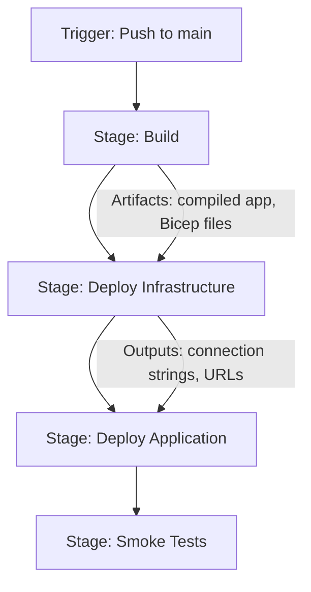

# How to Configure Azure Pipelines to Deploy Infrastructure and Application Code in a Single Pipeline

Author: [nawazdhandala](https://www.github.com/nawazdhandala)

Tags: Azure Pipelines, Infrastructure as Code, Bicep, CI/CD, DevOps, Deployment, Azure

Description: Build a single Azure Pipeline that deploys both infrastructure changes and application code in the right order with proper dependency management.

---

A common pattern in many organizations is to have separate pipelines for infrastructure and application deployments. The infrastructure team runs one pipeline to deploy Bicep or Terraform templates, and the application team runs another to deploy the actual code. This separation sounds clean in theory, but in practice it creates coordination headaches. What happens when a new feature requires both a new database and new application code? Someone has to coordinate the order, handle failures across pipelines, and ensure everything lands in the right sequence.

A single pipeline that handles both infrastructure and application deployment eliminates this coordination problem. This guide shows you how to structure such a pipeline using Azure Pipelines with Bicep for infrastructure and various deployment targets for the application.

## The Pipeline Structure

The key insight is that infrastructure deployment and application deployment are stages in the same pipeline, with explicit dependencies between them. Infrastructure deploys first, its outputs (like connection strings and resource names) feed into the application deployment stage, and the whole thing runs as one atomic unit.



## Stage 1: Build Everything

The first stage compiles the application, runs unit tests, and publishes all artifacts that the later stages need.

```yaml
# azure-pipelines.yml - unified infrastructure and application pipeline
trigger:
  branches:
    include:
      - main

pool:
  vmImage: 'ubuntu-latest'

variables:
  buildConfiguration: 'Release'
  azureSubscription: 'Production-ServiceConnection'
  resourceGroup: 'rg-myapp-prod'
  location: 'eastus2'

stages:
  - stage: Build
    displayName: 'Build and Test'
    jobs:
      - job: BuildApp
        displayName: 'Build Application'
        steps:
          # Build the .NET application
          - task: DotNetCoreCLI@2
            inputs:
              command: 'restore'
              projects: 'src/**/*.csproj'
            displayName: 'Restore packages'

          - task: DotNetCoreCLI@2
            inputs:
              command: 'build'
              projects: 'src/**/*.csproj'
              arguments: '--configuration $(buildConfiguration) --no-restore'
            displayName: 'Build'

          - task: DotNetCoreCLI@2
            inputs:
              command: 'test'
              projects: 'tests/**/*.csproj'
              arguments: '--configuration $(buildConfiguration) --no-build'
            displayName: 'Run unit tests'

          # Publish the application for deployment
          - task: DotNetCoreCLI@2
            inputs:
              command: 'publish'
              projects: 'src/MyApp.Web/*.csproj'
              arguments: '--configuration $(buildConfiguration) --output $(Build.ArtifactStagingDirectory)/app'
            displayName: 'Publish application'

          # Copy infrastructure files to artifacts
          - task: CopyFiles@2
            inputs:
              sourceFolder: 'infra'
              contents: '**'
              targetFolder: '$(Build.ArtifactStagingDirectory)/infra'
            displayName: 'Copy Bicep files'

          # Publish all artifacts
          - task: PublishPipelineArtifact@1
            inputs:
              targetPath: '$(Build.ArtifactStagingDirectory)'
              artifactName: 'drop'
            displayName: 'Publish artifacts'
```

## Stage 2: Deploy Infrastructure

This stage deploys the Bicep template and captures the outputs. The outputs are critical because they contain the resource names and connection strings that the application deployment stage needs.

```yaml
  - stage: DeployInfrastructure
    displayName: 'Deploy Infrastructure'
    dependsOn: Build
    jobs:
      - job: DeployBicep
        displayName: 'Deploy Bicep Template'
        steps:
          # Download the build artifacts
          - task: DownloadPipelineArtifact@2
            inputs:
              artifactName: 'drop'
              targetPath: '$(Pipeline.Workspace)/drop'
            displayName: 'Download artifacts'

          # Deploy the Bicep template
          - task: AzureCLI@2
            name: deployInfra
            inputs:
              azureSubscription: '$(azureSubscription)'
              scriptType: 'bash'
              scriptLocation: 'inlineScript'
              inlineScript: |
                # Deploy infrastructure and capture outputs
                DEPLOY_OUTPUT=$(az deployment group create \
                  --resource-group "$(resourceGroup)" \
                  --template-file "$(Pipeline.Workspace)/drop/infra/main.bicep" \
                  --parameters "$(Pipeline.Workspace)/drop/infra/parameters.prod.json" \
                  --query "properties.outputs" \
                  --output json)

                # Extract specific outputs and set as pipeline variables
                APP_SERVICE_NAME=$(echo $DEPLOY_OUTPUT | jq -r '.appServiceName.value')
                SQL_CONNECTION=$(echo $DEPLOY_OUTPUT | jq -r '.sqlConnectionString.value')
                STORAGE_NAME=$(echo $DEPLOY_OUTPUT | jq -r '.storageAccountName.value')

                # Set output variables for use in subsequent stages
                echo "##vso[task.setvariable variable=appServiceName;isOutput=true]$APP_SERVICE_NAME"
                echo "##vso[task.setvariable variable=sqlConnectionString;isOutput=true;isSecret=true]$SQL_CONNECTION"
                echo "##vso[task.setvariable variable=storageAccountName;isOutput=true]$STORAGE_NAME"

                echo "Infrastructure deployed successfully"
                echo "App Service: $APP_SERVICE_NAME"
                echo "Storage: $STORAGE_NAME"
            displayName: 'Deploy Bicep template'
```

Here is the corresponding Bicep template that produces those outputs:

```bicep
// infra/main.bicep - infrastructure for the application
param location string = resourceGroup().location
param environmentName string
param sqlAdminPassword string

// App Service Plan
resource appServicePlan 'Microsoft.Web/serverfarms@2023-01-01' = {
  name: 'asp-myapp-${environmentName}'
  location: location
  sku: {
    name: 'P1v3'
    tier: 'PremiumV3'
  }
  properties: {
    reserved: true
  }
}

// Web App
resource webApp 'Microsoft.Web/sites@2023-01-01' = {
  name: 'app-myapp-${environmentName}-${uniqueString(resourceGroup().id)}'
  location: location
  properties: {
    serverFarmId: appServicePlan.id
    httpsOnly: true
    siteConfig: {
      linuxFxVersion: 'DOTNETCORE|8.0'
    }
  }
}

// SQL Server and Database
resource sqlServer 'Microsoft.Sql/servers@2023-05-01-preview' = {
  name: 'sql-myapp-${environmentName}'
  location: location
  properties: {
    administratorLogin: 'sqladmin'
    administratorLoginPassword: sqlAdminPassword
  }
}

resource sqlDb 'Microsoft.Sql/servers/databases@2023-05-01-preview' = {
  parent: sqlServer
  name: 'db-myapp'
  location: location
  sku: {
    name: 'S1'
    tier: 'Standard'
  }
}

// Storage Account
resource storage 'Microsoft.Storage/storageAccounts@2023-01-01' = {
  name: 'stmyapp${environmentName}${uniqueString(resourceGroup().id)}'
  location: location
  sku: {
    name: 'Standard_LRS'
  }
  kind: 'StorageV2'
}

// Outputs consumed by the application deployment stage
output appServiceName string = webApp.name
output sqlConnectionString string = 'Server=${sqlServer.properties.fullyQualifiedDomainName};Database=${sqlDb.name};'
output storageAccountName string = storage.name
```

## Stage 3: Deploy Application

This stage uses the infrastructure outputs to deploy the application to the correct resources:

```yaml
  - stage: DeployApplication
    displayName: 'Deploy Application'
    dependsOn: DeployInfrastructure
    variables:
      # Reference outputs from the infrastructure stage
      appServiceName: $[ stageDependencies.DeployInfrastructure.DeployBicep.outputs['deployInfra.appServiceName'] ]
      sqlConnectionString: $[ stageDependencies.DeployInfrastructure.DeployBicep.outputs['deployInfra.sqlConnectionString'] ]
      storageAccountName: $[ stageDependencies.DeployInfrastructure.DeployBicep.outputs['deployInfra.storageAccountName'] ]
    jobs:
      - deployment: DeployWebApp
        displayName: 'Deploy to App Service'
        environment: 'production'
        strategy:
          runOnce:
            deploy:
              steps:
                # Download artifacts
                - task: DownloadPipelineArtifact@2
                  inputs:
                    artifactName: 'drop'
                    targetPath: '$(Pipeline.Workspace)/drop'

                # Configure app settings with infrastructure outputs
                - task: AzureCLI@2
                  inputs:
                    azureSubscription: '$(azureSubscription)'
                    scriptType: 'bash'
                    scriptLocation: 'inlineScript'
                    inlineScript: |
                      # Set application configuration from infrastructure outputs
                      az webapp config appsettings set \
                        --resource-group "$(resourceGroup)" \
                        --name "$(appServiceName)" \
                        --settings \
                          "ConnectionStrings__Default=$(sqlConnectionString)" \
                          "Storage__AccountName=$(storageAccountName)"
                  displayName: 'Configure app settings'

                # Deploy the application code
                - task: AzureWebApp@1
                  inputs:
                    azureSubscription: '$(azureSubscription)'
                    appType: 'webAppLinux'
                    appName: '$(appServiceName)'
                    package: '$(Pipeline.Workspace)/drop/app/**/*.zip'
                  displayName: 'Deploy to App Service'
```

## Stage 4: Smoke Tests

After both infrastructure and application are deployed, run quick smoke tests to verify everything works:

```yaml
  - stage: SmokeTests
    displayName: 'Smoke Tests'
    dependsOn: DeployApplication
    variables:
      appServiceName: $[ stageDependencies.DeployInfrastructure.DeployBicep.outputs['deployInfra.appServiceName'] ]
    jobs:
      - job: RunSmokeTests
        steps:
          - script: |
              # Wait for app to warm up
              sleep 30

              # Test the health endpoint
              HTTP_STATUS=$(curl -s -o /dev/null -w "%{http_code}" \
                "https://$(appServiceName).azurewebsites.net/health")

              if [ "$HTTP_STATUS" -eq 200 ]; then
                echo "Health check passed"
              else
                echo "Health check failed with status $HTTP_STATUS"
                exit 1
              fi
            displayName: 'Run health check'
```

## Handling Infrastructure-Only and App-Only Changes

One concern with a unified pipeline is that you do not want to redeploy infrastructure when only application code changed, and vice versa. You can handle this with path-based conditions:

```yaml
# At the top of your pipeline, detect what changed
stages:
  - stage: DetectChanges
    jobs:
      - job: Detect
        steps:
          - script: |
              # Check if infrastructure files changed
              INFRA_CHANGED=$(git diff --name-only HEAD~1 HEAD -- infra/ | wc -l)
              APP_CHANGED=$(git diff --name-only HEAD~1 HEAD -- src/ | wc -l)

              echo "##vso[task.setvariable variable=infraChanged;isOutput=true]$([ $INFRA_CHANGED -gt 0 ] && echo true || echo false)"
              echo "##vso[task.setvariable variable=appChanged;isOutput=true]$([ $APP_CHANGED -gt 0 ] && echo true || echo false)"
            name: changes
            displayName: 'Detect changes'
```

Then add conditions to your stages:

```yaml
  - stage: DeployInfrastructure
    condition: eq(stageDependencies.DetectChanges.Detect.outputs['changes.infraChanged'], 'true')
```

## Best Practices

1. **Always deploy infrastructure first.** The application might depend on new resources or configuration changes. If you deploy the app first and it references a resource that does not exist yet, it will fail.

2. **Use outputs to pass data between stages.** Do not hardcode resource names. Let the infrastructure deployment tell the application deployment where to deploy.

3. **Make infrastructure deployments idempotent.** Bicep handles this naturally, but make sure your templates can be run multiple times without errors.

4. **Add manual approvals between stages for production.** Use Azure Pipelines environments with approval gates between the infrastructure and application deployment stages.

5. **Keep your Bicep parameters in separate files per environment.** This makes it easy to deploy the same template to dev, staging, and production with different configurations.

## Wrapping Up

Running infrastructure and application deployments in a single pipeline removes the coordination overhead that comes with separate pipelines. The pattern is straightforward: build everything first, deploy infrastructure and capture outputs, then deploy the application using those outputs. With path-based conditions, you can skip unnecessary stages when only part of the codebase changed. This approach gives you a single pipeline run to review, a clear deployment order, and automatic data flow between infrastructure and application layers.
