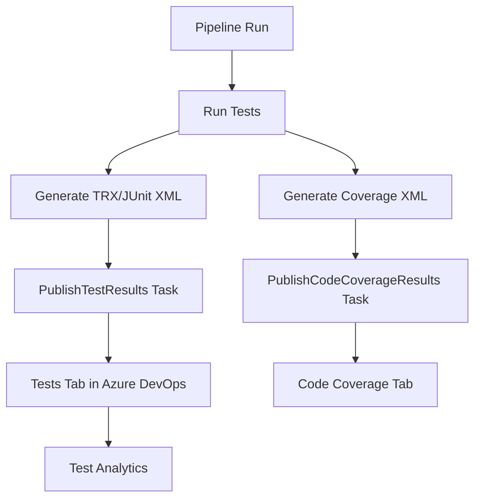

# How to Configure Azure Pipelines to Run Automated Tests and Publish Test Results

Author: [nawazdhandala](https://www.github.com/nawazdhandala)

Tags: Azure Pipelines, Automated Testing, Test Results, CI/CD, Azure DevOps, Unit Testing, Code Coverage

Description: Set up Azure Pipelines to run automated tests across multiple frameworks and publish results with code coverage reports.

---

Running tests in a CI/CD pipeline is not the same as running them on your local machine. Locally, you run tests, see the output, and move on. In a pipeline, you need to run tests across potentially multiple frameworks, capture the results in a format that Azure DevOps can display, collect code coverage metrics, and fail the build if tests do not pass.

Azure Pipelines has built-in support for all of this, but the configuration varies depending on your test framework and language. In this post, I will cover the most common scenarios - .NET, JavaScript/TypeScript, Python, and Java - and show how to get rich test reporting in Azure DevOps.

## The Test Results Tab

Before diving into configuration, it helps to understand what you are building toward. When you publish test results to Azure DevOps, you get:

- A **Tests** tab on each pipeline run showing passed, failed, and skipped tests
- Drill-down into individual test cases with error messages and stack traces
- Test duration tracking to identify slow tests
- Trend analysis across builds to spot flaky tests
- Code coverage integration showing which lines are covered

All of this comes from two pipeline tasks: `PublishTestResults` and `PublishCodeCoverageResults`.

## .NET Test Configuration

.NET is the best-supported scenario in Azure Pipelines since both are Microsoft products. The `DotNetCoreCLI` test task can handle everything.

The following pipeline builds a .NET solution, runs tests, and publishes both test results and code coverage.

```yaml
# azure-pipelines.yml - .NET test pipeline with coverage
trigger:
  - main

pool:
  vmImage: 'ubuntu-latest'

variables:
  buildConfiguration: 'Release'

steps:
  # Restore and build
  - task: DotNetCoreCLI@2
    displayName: 'Restore'
    inputs:
      command: 'restore'
      projects: '**/*.csproj'

  - task: DotNetCoreCLI@2
    displayName: 'Build'
    inputs:
      command: 'build'
      projects: '**/*.csproj'
      arguments: '--configuration $(buildConfiguration) --no-restore'

  # Run tests with coverage collection
  - task: DotNetCoreCLI@2
    displayName: 'Run tests with coverage'
    inputs:
      command: 'test'
      projects: '**/*Tests.csproj'
      arguments: >
        --configuration $(buildConfiguration)
        --no-build
        --logger trx
        --collect:"XPlat Code Coverage"
        --results-directory $(Agent.TempDirectory)/TestResults

  # Publish test results to Azure DevOps
  - task: PublishTestResults@2
    displayName: 'Publish test results'
    condition: succeededOrFailed()  # Publish even if tests fail
    inputs:
      testResultsFormat: 'VSTest'
      testResultsFiles: '$(Agent.TempDirectory)/TestResults/**/*.trx'
      mergeTestResults: true
      testRunTitle: 'Unit Tests - $(buildConfiguration)'

  # Publish code coverage report
  - task: PublishCodeCoverageResults@2
    displayName: 'Publish code coverage'
    inputs:
      summaryFileLocation: '$(Agent.TempDirectory)/TestResults/**/coverage.cobertura.xml'
```

A few important details:

- The `--logger trx` flag produces test results in TRX format, which Azure DevOps understands natively
- `--collect:"XPlat Code Coverage"` uses the built-in coverage collector that works on all platforms
- The `condition: succeededOrFailed()` on the publish task ensures results are published even when tests fail. Without this, a failing test step would skip the publish step, and you would not see which tests failed in the Azure DevOps UI

## JavaScript/TypeScript Test Configuration

For JavaScript projects using Jest, Mocha, or other frameworks, you need to configure test reporters that output formats Azure DevOps can consume.

Here is a pipeline for a Jest-based project.

```yaml
# azure-pipelines.yml - Node.js test pipeline
trigger:
  - main

pool:
  vmImage: 'ubuntu-latest'

steps:
  # Install dependencies
  - task: NodeTool@0
    displayName: 'Use Node.js 20'
    inputs:
      versionSpec: '20.x'

  - script: npm ci
    displayName: 'Install dependencies'

  # Run tests with JUnit reporter and coverage
  - script: npx jest --ci --reporters=default --reporters=jest-junit --coverage --coverageReporters=cobertura
    displayName: 'Run tests'
    env:
      JEST_JUNIT_OUTPUT_DIR: '$(System.DefaultWorkingDirectory)/test-results'
      JEST_JUNIT_OUTPUT_NAME: 'junit.xml'

  # Publish test results
  - task: PublishTestResults@2
    displayName: 'Publish test results'
    condition: succeededOrFailed()
    inputs:
      testResultsFormat: 'JUnit'
      testResultsFiles: '**/test-results/junit.xml'
      testRunTitle: 'Jest Tests'

  # Publish code coverage
  - task: PublishCodeCoverageResults@2
    displayName: 'Publish code coverage'
    inputs:
      summaryFileLocation: '$(System.DefaultWorkingDirectory)/coverage/cobertura-coverage.xml'
```

You need `jest-junit` as a dev dependency.

```bash
# Install the JUnit reporter for Jest
npm install --save-dev jest-junit
```

And add the reporter configuration to your `jest.config.js` or `package.json`.

```javascript
// jest.config.js - Configure Jest for CI
module.exports = {
  // Test configuration
  testMatch: ['**/__tests__/**/*.test.js', '**/*.spec.js'],

  // Coverage configuration
  collectCoverageFrom: [
    'src/**/*.{js,ts}',
    '!src/**/*.d.ts',      // Exclude type definitions
    '!src/**/index.{js,ts}' // Exclude barrel exports
  ],
  coverageThreshold: {
    global: {
      branches: 70,
      functions: 80,
      lines: 80,
      statements: 80
    }
  }
};
```

## Python Test Configuration

For Python projects using pytest, the approach is similar but with different reporter packages.

```yaml
# azure-pipelines.yml - Python test pipeline
trigger:
  - main

pool:
  vmImage: 'ubuntu-latest'

steps:
  - task: UsePythonVersion@0
    displayName: 'Use Python 3.11'
    inputs:
      versionSpec: '3.11'

  # Install dependencies and test tools
  - script: |
      python -m pip install --upgrade pip
      pip install -r requirements.txt
      pip install pytest pytest-cov pytest-azurepipelines
    displayName: 'Install dependencies'

  # Run pytest with JUnit XML output and coverage
  - script: |
      pytest tests/ \
        --junitxml=test-results/results.xml \
        --cov=src \
        --cov-report=xml:coverage/coverage.xml \
        --cov-report=html:coverage/htmlcov
    displayName: 'Run tests'

  # Publish test results
  - task: PublishTestResults@2
    displayName: 'Publish test results'
    condition: succeededOrFailed()
    inputs:
      testResultsFormat: 'JUnit'
      testResultsFiles: '**/test-results/results.xml'
      testRunTitle: 'Python Tests'

  # Publish coverage report
  - task: PublishCodeCoverageResults@2
    displayName: 'Publish code coverage'
    inputs:
      summaryFileLocation: '$(System.DefaultWorkingDirectory)/coverage/coverage.xml'
```

## Java Test Configuration

Java projects using Maven or Gradle have their own test reporting conventions.

```yaml
# azure-pipelines.yml - Java Maven test pipeline
trigger:
  - main

pool:
  vmImage: 'ubuntu-latest'

steps:
  - task: Maven@4
    displayName: 'Build and test'
    inputs:
      mavenPomFile: 'pom.xml'
      goals: 'clean verify'
      options: '-B'  # Batch mode for non-interactive builds
      publishJUnitResults: true
      testResultsFiles: '**/surefire-reports/TEST-*.xml'
      codeCoverageToolOption: 'JaCoCo'
      codeCoverageClassFilesDirectories: 'target/classes'
```

The Maven task in Azure Pipelines has built-in support for JUnit results and JaCoCo coverage, making it simpler than the other languages.

## Running Tests in Parallel

For large test suites, running tests sequentially is slow. Most test frameworks support parallel execution.

For .NET:

```yaml
# Run .NET tests in parallel across multiple agents
- task: DotNetCoreCLI@2
  displayName: 'Run tests in parallel'
  inputs:
    command: 'test'
    projects: '**/*Tests.csproj'
    arguments: '--configuration Release --no-build -- RunConfiguration.MaxCpuCount=0'
```

The `MaxCpuCount=0` setting tells the test runner to use all available CPU cores.

## Failing the Build on Test Thresholds

Sometimes you want to fail the build not just when tests fail, but when coverage drops below a threshold. You can do this with a script step.

```yaml
# Fail the build if coverage drops below 80%
- task: Bash@3
  displayName: 'Check coverage threshold'
  inputs:
    targetType: 'inline'
    script: |
      # Parse the Cobertura XML for the line-rate attribute
      COVERAGE=$(grep -oP 'line-rate="\K[^"]+' coverage/coverage.xml | head -1)
      PERCENTAGE=$(echo "$COVERAGE * 100" | bc)
      echo "Code coverage: $PERCENTAGE%"

      # Fail if below threshold
      THRESHOLD=80
      if (( $(echo "$PERCENTAGE < $THRESHOLD" | bc -l) )); then
        echo "##vso[task.logissue type=error]Coverage ($PERCENTAGE%) is below threshold ($THRESHOLD%)"
        exit 1
      fi
```

## Test Impact Analysis

Azure DevOps has a feature called Test Impact Analysis (TIA) that identifies which tests are affected by a code change and runs only those tests. This can dramatically speed up PR validation.

```yaml
# Enable Test Impact Analysis for .NET
- task: VSTest@2
  displayName: 'Run impacted tests'
  inputs:
    testSelector: 'testAssemblies'
    testAssemblyVer2: '**/*Tests.dll'
    runOnlyImpactedTests: true
    runInParallel: true
```

TIA works by instrumenting your test runs to build a map of which tests touch which source files. On subsequent runs, it uses this map to run only the tests that could be affected by the changed files.

## Viewing Test Analytics

After several pipeline runs with published test results, you can access Test Analytics under **Pipelines > Test Analytics** (or from the Tests tab on any pipeline run).

Test Analytics shows:

- **Top failing tests**: Tests that fail most frequently across builds
- **Test duration trends**: Tests that are getting slower over time
- **Flaky tests**: Tests that alternate between passing and failing

This data is invaluable for maintaining test suite health. Review it monthly and prioritize fixing the top flaky tests and slowest tests.



## Wrapping Up

Publishing test results and code coverage in Azure Pipelines transforms your pipeline from a simple pass/fail check into a rich testing dashboard. The configuration varies by language and framework, but the pattern is always the same: run tests with a reporter that produces JUnit XML or TRX format, collect coverage in Cobertura or JaCoCo format, and use the publish tasks to send results to Azure DevOps. Once set up, you get trend analysis, flaky test detection, and code coverage tracking without any additional effort.
