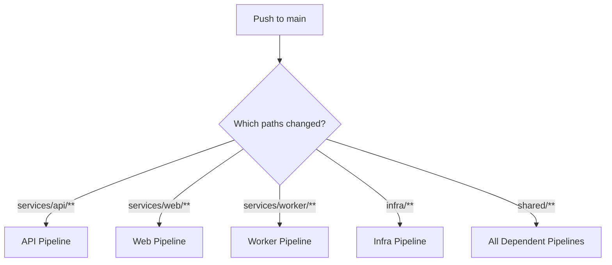

# How to Configure Azure Pipelines to Trigger on Specific File Path Changes in a Monorepo

Author: [nawazdhandala](https://www.github.com/nawazdhandala)

Tags: Azure Pipelines, Monorepo, Path Triggers, CI/CD, DevOps, Build Optimization

Description: Configure Azure Pipelines path-based triggers to build only the services that changed in a monorepo, reducing unnecessary builds and saving pipeline minutes.

---

Monorepos are popular for good reasons. They simplify dependency management, make cross-service changes atomic, and give you a single place for all your code. But they create a problem for CI/CD: when someone changes a file in the frontend, you do not want to rebuild and test the backend, the mobile app, and the infrastructure templates. That wastes time and pipeline minutes.

Azure Pipelines supports path-based triggers that let you define which directories should trigger which pipelines. When a push only changes files under `/services/api`, only the API pipeline runs. This guide covers how to configure path triggers, handle edge cases, and set up a monorepo pipeline structure that scales.

## Basic Path Triggers

Path triggers are defined in the `trigger` section of your YAML pipeline. You specify which paths should include or exclude trigger evaluation.

```yaml
# api-pipeline.yml - only triggers when API code changes
trigger:
  branches:
    include:
      - main
  paths:
    include:
      - services/api/**
      - shared/models/**    # Also trigger when shared code changes
    exclude:
      - services/api/docs/** # But not for documentation changes

pool:
  vmImage: 'ubuntu-latest'

steps:
  - script: |
      cd services/api
      dotnet build
      dotnet test
    displayName: 'Build and test API'
```

With this configuration:
- A commit that changes `services/api/Controllers/UserController.cs` triggers this pipeline
- A commit that changes `services/web/src/App.tsx` does not trigger this pipeline
- A commit that changes `shared/models/User.cs` triggers this pipeline (shared code might affect the API)
- A commit that changes `services/api/docs/README.md` does not trigger this pipeline

## Setting Up Multiple Pipelines for a Monorepo

In a typical monorepo, you create one pipeline per service or major component. Here is the directory structure and corresponding pipeline configuration:

```
monorepo/
  services/
    api/
    web/
    worker/
  shared/
    models/
    utils/
  infra/
  pipelines/
    api-ci.yml
    web-ci.yml
    worker-ci.yml
    infra-ci.yml
```



### API Pipeline

```yaml
# pipelines/api-ci.yml
trigger:
  branches:
    include:
      - main
  paths:
    include:
      - services/api/**
      - shared/**

pool:
  vmImage: 'ubuntu-latest'

steps:
  - task: DotNetCoreCLI@2
    inputs:
      command: 'build'
      projects: 'services/api/**/*.csproj'
    displayName: 'Build API'

  - task: DotNetCoreCLI@2
    inputs:
      command: 'test'
      projects: 'services/api/tests/**/*.csproj'
    displayName: 'Test API'
```

### Web Pipeline

```yaml
# pipelines/web-ci.yml
trigger:
  branches:
    include:
      - main
  paths:
    include:
      - services/web/**
      - shared/**

pool:
  vmImage: 'ubuntu-latest'

steps:
  - script: |
      cd services/web
      npm ci
      npm run build
      npm test
    displayName: 'Build and test web app'
```

### Worker Pipeline

```yaml
# pipelines/worker-ci.yml
trigger:
  branches:
    include:
      - main
  paths:
    include:
      - services/worker/**
      - shared/**

pool:
  vmImage: 'ubuntu-latest'

steps:
  - script: |
      cd services/worker
      npm ci
      npm test
    displayName: 'Build and test worker'
```

### Infrastructure Pipeline

```yaml
# pipelines/infra-ci.yml
trigger:
  branches:
    include:
      - main
  paths:
    include:
      - infra/**

pool:
  vmImage: 'ubuntu-latest'

steps:
  - task: AzureCLI@2
    inputs:
      azureSubscription: 'my-connection'
      scriptType: 'bash'
      scriptLocation: 'inlineScript'
      inlineScript: |
        az bicep build --file infra/main.bicep
        az deployment group what-if \
          --resource-group "rg-myapp-dev" \
          --template-file "infra/main.bicep"
    displayName: 'Validate infrastructure'
```

## Path Triggers for Pull Requests

Path triggers also work for PR validation pipelines. Use the `pr` section instead of `trigger`:

```yaml
# Only run PR validation when relevant files change
trigger: none

pr:
  branches:
    include:
      - main
  paths:
    include:
      - services/api/**
      - shared/**

pool:
  vmImage: 'ubuntu-latest'

steps:
  - task: DotNetCoreCLI@2
    inputs:
      command: 'test'
      projects: 'services/api/tests/**/*.csproj'
    displayName: 'Run API tests'
```

This means if a PR only changes frontend code, the API validation pipeline does not run, giving faster PR feedback.

## Handling Shared Code Changes

The tricky part of monorepo pipelines is shared code. When someone modifies a shared library, you need to rebuild everything that depends on it. There are several approaches:

### Approach 1: Include Shared Paths in Every Pipeline

This is the simplest approach (shown above). Every pipeline lists `shared/**` in its path includes. When shared code changes, all pipelines trigger.

The downside is that changing a utility function that only the worker uses still triggers the API and web pipelines.

### Approach 2: Granular Shared Code Paths

If your shared code is well-organized, you can be more specific:

```yaml
# API pipeline - only triggers on shared code that the API actually uses
trigger:
  paths:
    include:
      - services/api/**
      - shared/models/**        # API uses these models
      - shared/auth/**          # API uses the auth library
    exclude:
      - shared/ui-components/** # API does not use UI components
```

### Approach 3: Detect Changes in a Script

For maximum control, use a script to detect which services are affected by the changes:

```yaml
# detect-and-build.yml - single pipeline that detects changes and builds affected services
trigger:
  branches:
    include:
      - main

pool:
  vmImage: 'ubuntu-latest'

jobs:
  - job: DetectChanges
    steps:
      - script: |
          # Get the list of changed files
          CHANGED_FILES=$(git diff --name-only HEAD~1 HEAD)
          echo "Changed files:"
          echo "$CHANGED_FILES"

          # Detect which services need rebuilding
          BUILD_API=false
          BUILD_WEB=false
          BUILD_WORKER=false

          if echo "$CHANGED_FILES" | grep -q "^services/api/"; then
              BUILD_API=true
          fi
          if echo "$CHANGED_FILES" | grep -q "^services/web/"; then
              BUILD_WEB=true
          fi
          if echo "$CHANGED_FILES" | grep -q "^services/worker/"; then
              BUILD_WORKER=true
          fi
          # Shared code triggers all dependent services
          if echo "$CHANGED_FILES" | grep -q "^shared/"; then
              BUILD_API=true
              BUILD_WEB=true
              BUILD_WORKER=true
          fi

          echo "##vso[task.setvariable variable=buildApi;isOutput=true]$BUILD_API"
          echo "##vso[task.setvariable variable=buildWeb;isOutput=true]$BUILD_WEB"
          echo "##vso[task.setvariable variable=buildWorker;isOutput=true]$BUILD_WORKER"
        name: changes
        displayName: 'Detect changed services'

  - job: BuildAPI
    dependsOn: DetectChanges
    condition: eq(dependencies.DetectChanges.outputs['changes.buildApi'], 'true')
    steps:
      - script: |
          cd services/api
          dotnet build && dotnet test
        displayName: 'Build and test API'

  - job: BuildWeb
    dependsOn: DetectChanges
    condition: eq(dependencies.DetectChanges.outputs['changes.buildWeb'], 'true')
    steps:
      - script: |
          cd services/web
          npm ci && npm run build && npm test
        displayName: 'Build and test web'

  - job: BuildWorker
    dependsOn: DetectChanges
    condition: eq(dependencies.DetectChanges.outputs['changes.buildWorker'], 'true')
    steps:
      - script: |
          cd services/worker
          npm ci && npm test
        displayName: 'Build and test worker'
```

## Handling Edge Cases

### Initial Pipeline Run

When you first create a pipeline or when there is no previous commit to compare against, path triggers will run the pipeline. This is expected and correct behavior.

### Multiple Path Matches

If a single commit changes files in multiple service directories, all matching pipelines will trigger independently. They run in parallel by default, which is the desired behavior.

### Pipeline File Changes

Changes to the pipeline YAML file itself always trigger the pipeline, regardless of path filters. This is important because you want to validate pipeline changes.

### Merge Commits

When merging branches, Azure Pipelines evaluates the path filter against the diff between the merge commit and its first parent. This means all files changed in the merged branch are evaluated, not just the merge commit itself.

## Performance Considerations

### Shallow Clones

For monorepos, the default full clone can be slow. Use shallow clones to speed things up:

```yaml
steps:
  - checkout: self
    fetchDepth: 1  # Only fetch the latest commit
```

But be careful: if your change detection script uses `git diff HEAD~1`, a fetch depth of 1 might not be enough. Set it to at least 2.

### Sparse Checkout

For very large monorepos, you can use sparse checkout to only fetch the files your pipeline needs:

```yaml
steps:
  - checkout: self
    fetchDepth: 1

  - script: |
      git sparse-checkout init --cone
      git sparse-checkout set services/api shared
    displayName: 'Sparse checkout API and shared code'
```

This dramatically reduces clone time for repos with many large directories.

## A Complete Monorepo Pipeline Template

Here is a reusable template that other service pipelines can extend:

```yaml
# templates/service-ci.yml - reusable template for service CI
parameters:
  - name: serviceName
    type: string
  - name: servicePath
    type: string
  - name: buildCommand
    type: string
    default: 'npm ci && npm run build'
  - name: testCommand
    type: string
    default: 'npm test'

jobs:
  - job: Build_${{ parameters.serviceName }}
    displayName: 'Build ${{ parameters.serviceName }}'
    pool:
      vmImage: 'ubuntu-latest'
    steps:
      - script: |
          cd ${{ parameters.servicePath }}
          ${{ parameters.buildCommand }}
        displayName: 'Build'

      - script: |
          cd ${{ parameters.servicePath }}
          ${{ parameters.testCommand }}
        displayName: 'Test'
```

Each service pipeline then uses the template:

```yaml
# pipelines/web-ci.yml
trigger:
  branches:
    include:
      - main
  paths:
    include:
      - services/web/**
      - shared/**

extends:
  template: templates/service-ci.yml
  parameters:
    serviceName: 'web'
    servicePath: 'services/web'
    buildCommand: 'npm ci && npm run build'
    testCommand: 'npm test -- --coverage'
```

## Wrapping Up

Path-based triggers are essential for making monorepo CI/CD practical. Without them, every commit triggers every pipeline, wasting time and compute. With them, each service gets its own focused pipeline that only runs when relevant code changes. Start with the simple approach of separate pipelines with path includes, handle shared code by including shared paths in dependent pipelines, and consider the script-based approach if you need finer control over change detection. The investment in setting up proper path triggers pays off immediately in faster feedback loops and lower pipeline costs.
