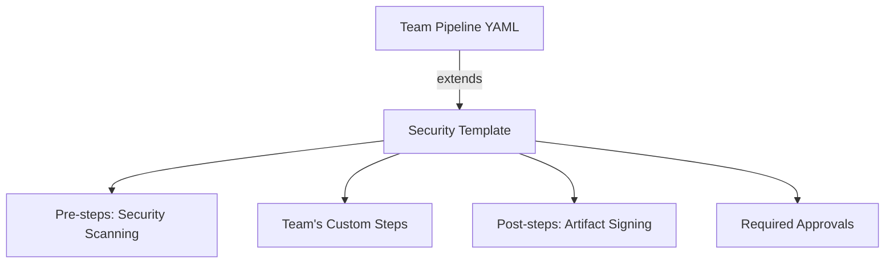

# How to Configure Azure Pipelines YAML Extends Templates for Enforcing Pipeline Security

Author: [nawazdhandala](https://www.github.com/nawazdhandala)

Tags: Azure Pipelines, YAML Templates, Pipeline Security, CI/CD, DevOps, Azure DevOps, Security

Description: Learn how to use Azure Pipelines YAML extends templates to enforce security policies, required steps, and guardrails across all pipelines in your organization.

---

In a large organization, every team defines their own pipelines. That flexibility is great for productivity, but it creates a security problem. How do you ensure every pipeline follows security best practices? How do you guarantee that credential scanning runs on every build, that deployments go through approval gates, and that nobody skips the required steps?

Azure Pipelines YAML extends templates solve this problem. Instead of letting teams write pipelines from scratch, you define a base template that enforces security requirements. Teams then extend that template, adding their own stages and steps within the guardrails you set. Think of it as a pipeline policy that cannot be bypassed.

## The Problem with Shared Templates

Before extends templates, organizations used `include` templates - shared YAML files that teams were expected to reference in their pipelines. The issue is that includes are optional. A team could simply not include the security scanning template and nobody would know until an audit.

Extends templates flip this model. Instead of "here is a template you should include," it becomes "your pipeline must extend this template to run at all." The template author controls what happens before and after the team's custom code runs.

## How Extends Templates Work

An extends template defines a contract. It specifies:

1. What parameters the consuming pipeline can pass in
2. What steps run before the team's code (e.g., credential scanning, compliance checks)
3. What steps run after the team's code (e.g., artifact signing, audit logging)
4. What the team is allowed to customize

Here is the basic structure:



## Creating the Base Security Template

Let's build a security template that every pipeline in the organization must extend. This template lives in a shared repository (often called a "template repository"):

```yaml
# templates/secure-pipeline.yml
# This is the security template that all pipelines must extend.
# It enforces credential scanning, SAST, and artifact signing.

parameters:
  # Teams provide their stages through this parameter
  - name: stages
    type: stageList
    default: []

  # Allow teams to specify their pool
  - name: pool
    type: object
    default:
      vmImage: 'ubuntu-latest'

  # Optional: allow teams to add extra pre-steps
  - name: additionalPreSteps
    type: stepList
    default: []

stages:
  # Security scanning stage that runs before anything else
  - stage: SecurityScan
    displayName: 'Security Compliance Checks'
    pool: ${{ parameters.pool }}
    jobs:
      - job: CredentialScan
        displayName: 'Credential Scanning'
        steps:
          # Scan the repository for accidentally committed secrets
          - task: CredScan@3
            inputs:
              toolMajorVersion: 'V2'
            displayName: 'Run credential scanner'

          # Publish security scan results
          - task: PublishSecurityAnalysisLogs@3
            displayName: 'Publish security logs'

      - job: DependencyScan
        displayName: 'Dependency Vulnerability Scan'
        steps:
          # Check for known vulnerabilities in dependencies
          - script: |
              echo "Running dependency vulnerability scan..."
              # Integration with your chosen SCA tool
            displayName: 'Run dependency scan'

  # Insert the team's custom stages here
  # The ${{ each }} expression iterates over the stages parameter
  - ${{ each stage in parameters.stages }}:
    - ${{ stage }}

  # Post-deployment compliance stage that runs after all custom stages
  - stage: ComplianceAudit
    displayName: 'Post-Deployment Compliance'
    dependsOn:
      - ${{ each stage in parameters.stages }}:
        - ${{ stage.stage }}
    pool: ${{ parameters.pool }}
    jobs:
      - job: AuditLog
        displayName: 'Audit Logging'
        steps:
          - script: |
              # Log deployment details for compliance tracking
              echo "Pipeline: $(Build.DefinitionName)"
              echo "Run ID: $(Build.BuildId)"
              echo "Triggered by: $(Build.RequestedFor)"
              echo "Branch: $(Build.SourceBranchName)"
              echo "Timestamp: $(date -u +%Y-%m-%dT%H:%M:%SZ)"
            displayName: 'Record audit trail'
```

## Consuming the Extends Template

Teams reference the security template using the `extends` keyword in their pipeline. Here is what a team's pipeline looks like:

```yaml
# azure-pipelines.yml (in the team's repository)
# This pipeline extends the organization's security template

# Reference the shared template repository
resources:
  repositories:
    - repository: templates
      type: git
      name: SharedProject/pipeline-templates  # Project/RepoName in Azure Repos
      ref: refs/heads/main

trigger:
  branches:
    include:
      - main
      - develop

# Extend the security template - this is mandatory
extends:
  template: templates/secure-pipeline.yml@templates
  parameters:
    pool:
      vmImage: 'ubuntu-latest'
    stages:
      # The team defines their own stages here
      - stage: Build
        displayName: 'Build Application'
        jobs:
          - job: BuildJob
            steps:
              - script: |
                  npm install
                  npm run build
                displayName: 'Build'

              - script: |
                  npm test
                displayName: 'Run tests'

      - stage: DeployStaging
        displayName: 'Deploy to Staging'
        dependsOn: Build
        jobs:
          - deployment: DeployStaging
            environment: 'staging'
            strategy:
              runOnce:
                deploy:
                  steps:
                    - script: |
                        echo "Deploying to staging..."
                      displayName: 'Deploy'
```

When this pipeline runs, the execution order is:

1. SecurityScan stage (from the template - team cannot skip this)
2. Build stage (team's custom stage)
3. DeployStaging stage (team's custom stage)
4. ComplianceAudit stage (from the template - team cannot skip this)

## Enforcing Template Usage with Required Templates

Creating a template is only half the battle. You need to make it mandatory. Azure DevOps supports "Required YAML templates" at the environment or pipeline level.

To enforce a required template:

1. Go to your Azure DevOps project settings
2. Navigate to Pipelines and then Environments
3. Select an environment (e.g., "production")
4. Click on Approvals and Checks
5. Add a "Required template" check
6. Specify the template repository and file path

With this check in place, any pipeline that deploys to the "production" environment must extend the specified template. If it does not, the deployment will be blocked.

## Template Expressions for Conditional Enforcement

Templates can include conditional logic to apply different rules based on the context:

```yaml
# templates/secure-pipeline.yml
parameters:
  - name: stages
    type: stageList
    default: []
  - name: deploysToProd
    type: boolean
    default: false

stages:
  # Always run basic security scanning
  - stage: SecurityScan
    jobs:
      - job: BasicScan
        steps:
          - script: echo "Running basic security scan"
            displayName: 'Basic scan'

  # Insert team stages
  - ${{ each stage in parameters.stages }}:
    - ${{ stage }}

  # Only run extended compliance for production deployments
  - ${{ if eq(parameters.deploysToProd, true) }}:
    - stage: ExtendedCompliance
      displayName: 'Extended Production Compliance'
      jobs:
        - job: ProdCompliance
          steps:
            - script: |
                echo "Running extended compliance checks for production..."
                echo "Verifying change management ticket..."
                echo "Checking deployment window..."
              displayName: 'Production compliance verification'
```

## Restricting What Teams Can Do

Extends templates can restrict which tasks and resources teams are allowed to use. This prevents teams from running arbitrary scripts that could compromise security:

```yaml
# templates/restricted-pipeline.yml
# This template restricts which tasks can be used in team steps

parameters:
  - name: stages
    type: stageList
    default: []

# Use template expressions to validate the stages
stages:
  - ${{ each stage in parameters.stages }}:
    - ${{ each job in stage.jobs }}:
      - ${{ each step in job.steps }}:
        # Block usage of PowerShell tasks in non-Windows pipelines
        - ${{ if eq(step.task, 'PowerShell@2') }}:
          - script: echo "PowerShell task is not allowed in this template"
            displayName: 'BLOCKED - PowerShell not permitted'
        - ${{ else }}:
          - ${{ step }}
```

A more practical approach is to use the "Restricted" agent pool combined with template checks. This way, you can control both what code runs and where it runs.

## Step Injection Pattern

One of the most useful patterns is injecting steps before and after each job in the team's pipeline. This ensures that security steps run even if the team adds new jobs:

```yaml
# templates/step-injection.yml
parameters:
  - name: jobs
    type: jobList
    default: []

jobs:
  - ${{ each job in parameters.jobs }}:
    - ${{ each pair in job }}:
        ${{ if eq(pair.key, 'steps') }}:
          steps:
            # Injected pre-step: set up security context
            - script: |
                echo "Setting up security context..."
                echo "Configuring audit logging..."
              displayName: '[Security] Pre-step setup'

            # The team's actual steps
            - ${{ pair.value }}

            # Injected post-step: cleanup and reporting
            - script: |
                echo "Uploading security telemetry..."
              displayName: '[Security] Post-step cleanup'
              condition: always()
        ${{ else }}:
          ${{ pair.key }}: ${{ pair.value }}
```

## Versioning Templates

Template repositories should be versioned so that updates do not break existing pipelines. Use tags or branches:

```yaml
resources:
  repositories:
    - repository: templates
      type: git
      name: SharedProject/pipeline-templates
      ref: refs/tags/v2.1.0  # Pin to a specific version
```

When you release a new version of the security template, teams can migrate at their own pace by updating the ref. For critical security fixes, you can update the tag to point to the new commit, and all pipelines using that tag will pick up the change on their next run.

## Testing Template Changes

Before rolling out template changes, test them in a sandbox project:

```yaml
# test-pipeline.yml - Used to test template changes before release
resources:
  repositories:
    - repository: templates
      type: git
      name: SharedProject/pipeline-templates
      ref: refs/heads/feature/new-security-checks  # Test branch

extends:
  template: templates/secure-pipeline.yml@templates
  parameters:
    stages:
      - stage: TestStage
        jobs:
          - job: TestJob
            steps:
              - script: echo "Testing template changes"
```

## Wrapping Up

Extends templates are the right tool for enforcing pipeline security at scale. They give you a mechanism to mandate security scanning, compliance checks, and audit logging across every pipeline in the organization without relying on teams to remember to include them. Combined with required template checks on environments, you get a security model that is both enforceable and flexible enough for teams to build their own workflows within the guardrails you define. Start with a simple template that injects a few critical security steps, and expand it as your security requirements evolve.
