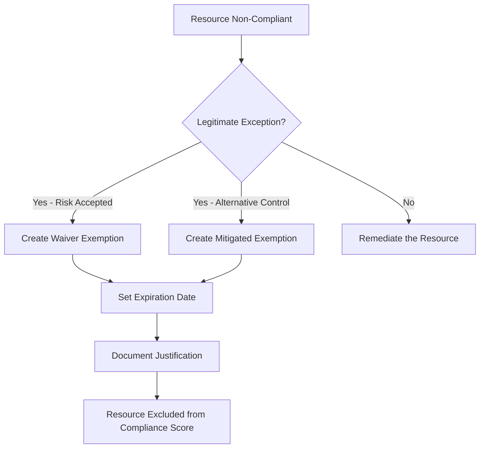
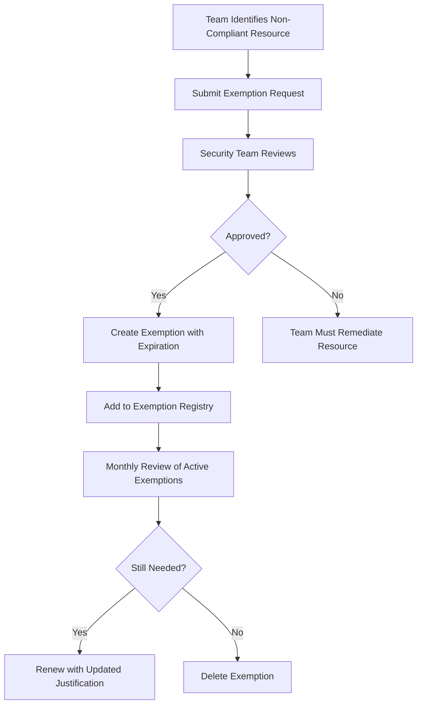

# How to Configure Azure Policy Exemptions for Resources That Require Temporary Non-Compliance Exceptions

Author: [nawazdhandala](https://www.github.com/nawazdhandala)

Tags: Azure, Azure Policy, Policy Exemptions, Compliance, Governance, Exceptions Management, Cloud Security

Description: Learn how to create and manage Azure Policy exemptions for resources that legitimately need temporary exceptions from compliance requirements.

---

In a perfect world, every resource in your Azure environment would comply with every policy you have in place. In the real world, there are always edge cases. Maybe a legacy application needs a specific configuration that violates your security policy while the team works on upgrading it. Maybe a proof-of-concept deployment needs relaxed rules temporarily. Maybe a vendor-managed appliance requires settings that do not fit your standard policies.

Azure Policy exemptions let you handle these situations properly. Instead of removing the policy entirely (which creates gaps for all resources), or ignoring the non-compliant resource (which pollutes your compliance reports), you create a targeted exemption that documents why the exception exists, who approved it, and when it expires.

In this post, I will walk through creating policy exemptions, managing them at scale, and setting up processes to make sure temporary exemptions do not become permanent ones.

## Understanding Policy Exemptions

An exemption is an Azure resource that tells the policy engine to skip evaluation for a specific resource or resource group against a specific policy or initiative assignment. Exemptions have two categories:

**Waiver** - The resource is non-compliant, and you are accepting the risk. The resource is excluded from compliance calculations. Use this for situations where you know the resource does not comply but have a documented reason for accepting that risk.

**Mitigated** - The resource technically does not comply with the policy, but equivalent security controls are in place through other means. For example, the resource might not have Azure disk encryption, but it uses a third-party encryption solution instead. The resource is excluded from compliance calculations.



## Step 1: Identify Resources That Need Exemptions

Before creating exemptions, identify which resources are non-compliant and determine whether they genuinely need an exemption or should be remediated instead.

This script lists all non-compliant resources for a specific policy assignment:

```bash
# List non-compliant resources for a specific policy assignment
az policy state list \
  --policy-assignment "require-disk-encryption" \
  --filter "complianceState eq 'NonCompliant'" \
  --query "[].{resource:resourceId, policy:policyDefinitionName, reason:policyDefinitionReferenceId}" \
  -o table
```

For each non-compliant resource, ask these questions:

1. Can the resource be remediated to comply? If yes, fix it instead of exempting it.
2. Is there a technical reason it cannot comply? Document it.
3. Is there an alternative control in place? If so, use a "Mitigated" exemption.
4. Is the non-compliance temporary? Set an expiration date.
5. Who is responsible for resolving the non-compliance? Document the owner.

## Step 2: Create a Policy Exemption

Let us create an exemption for a specific resource. This is the most common scenario - a single resource that needs a temporary exception.

This creates a waiver exemption for a specific VM that cannot have disk encryption enabled due to a vendor limitation:

```bash
# Create a policy exemption for a specific resource
az policy exemption create \
  --name "exempt-vm-vendor-appliance" \
  --display-name "Vendor Appliance - Disk Encryption Exemption" \
  --description "VM runs vendor-managed software that is incompatible with Azure Disk Encryption. The vendor is working on a compatible version, expected Q3 2026. Risk accepted per security review SR-2026-042." \
  --policy-assignment "/subscriptions/<sub-id>/providers/Microsoft.Authorization/policyAssignments/require-disk-encryption" \
  --exemption-category "Waiver" \
  --scope "/subscriptions/<sub-id>/resourceGroups/rg-vendor-app/providers/Microsoft.Compute/virtualMachines/vm-vendor-01" \
  --expires-on "2026-09-30T00:00:00Z"
```

Key fields in the exemption:

- **name** - A unique identifier for the exemption.
- **description** - This is critical. Document why the exemption exists, what the plan is to resolve it, and any reference to security review or approval processes.
- **exemption-category** - Either "Waiver" (accepting risk) or "Mitigated" (alternative control in place).
- **scope** - The specific resource, resource group, or subscription being exempted.
- **expires-on** - When the exemption automatically stops being effective. After this date, the resource will show as non-compliant again.

## Step 3: Create an Exemption for a Policy Initiative

If your policies are organized into initiatives (policy sets), you can exempt a resource from specific policies within the initiative without exempting it from all of them.

This creates an exemption from a specific policy within an initiative:

```bash
# Exempt a resource from a specific policy within a security initiative
# The policy-definition-reference-id identifies which policy in the initiative to exempt from
az policy exemption create \
  --name "exempt-storage-public-access" \
  --display-name "Public Storage for CDN Content" \
  --description "Storage account serves static content through Azure CDN and requires public blob access. Network controls are enforced through CDN WAF rules and SAS token expiration." \
  --policy-assignment "/subscriptions/<sub-id>/providers/Microsoft.Authorization/policyAssignments/security-baseline-initiative" \
  --policy-definition-reference-ids "denyPublicBlobAccess" \
  --exemption-category "Mitigated" \
  --scope "/subscriptions/<sub-id>/resourceGroups/rg-cdn/providers/Microsoft.Storage/storageAccounts/stcdnpubliccontent" \
  --expires-on "2026-12-31T00:00:00Z"
```

The `--policy-definition-reference-ids` parameter lets you specify which policies within the initiative should be exempted. The resource still needs to comply with all other policies in the initiative.

## Step 4: Create Exemptions at Resource Group Scope

Sometimes you need to exempt an entire resource group - for example, a sandbox environment where policies should be relaxed.

This creates an exemption for an entire resource group:

```bash
# Exempt a sandbox resource group from location restrictions
az policy exemption create \
  --name "exempt-sandbox-location" \
  --display-name "Sandbox - Allow All Locations" \
  --description "Sandbox resource group used for experimentation. No production data. Unrestricted location policy to allow testing in all regions. Reviews monthly." \
  --policy-assignment "/subscriptions/<sub-id>/providers/Microsoft.Authorization/policyAssignments/restrict-locations" \
  --exemption-category "Waiver" \
  --scope "/subscriptions/<sub-id>/resourceGroups/rg-sandbox" \
  --expires-on "2026-06-30T00:00:00Z"
```

Be cautious with resource group-level exemptions. Any new resource created in that group will also be exempt, which could lead to compliance drift if the group is not properly controlled.

## Step 5: Manage Exemptions at Scale

As your environment grows, you will accumulate exemptions. Managing them requires visibility and process.

This script lists all exemptions across your subscription with their expiration status:

```bash
# List all policy exemptions with their expiration dates
az policy exemption list \
  --query "[].{name:displayName, category:exemptionCategory, scope:scope, expiresOn:expiresOn, description:description}" \
  -o table
```

For a more detailed report, use PowerShell to identify expired or soon-to-expire exemptions:

```powershell
# Find exemptions that are expired or expiring within 30 days
Connect-AzAccount

$exemptions = Get-AzPolicyExemption -All
$today = Get-Date
$warningThreshold = $today.AddDays(30)

$report = foreach ($exemption in $exemptions) {
    $expiry = $exemption.Properties.ExpiresOn

    $status = if ($null -eq $expiry) {
        "No Expiration (Permanent)"
    }
    elseif ($expiry -lt $today) {
        "EXPIRED"
    }
    elseif ($expiry -lt $warningThreshold) {
        "Expiring Soon"
    }
    else {
        "Active"
    }

    [PSCustomObject]@{
        Name        = $exemption.Properties.DisplayName
        Category    = $exemption.Properties.ExemptionCategory
        Scope       = $exemption.Properties.Scope
        ExpiresOn   = $expiry
        Status      = $status
        Description = $exemption.Properties.Description
    }
}

# Display the report sorted by status urgency
$report | Sort-Object @{Expression={
    switch ($_.Status) {
        "EXPIRED"        { 1 }
        "Expiring Soon"  { 2 }
        "No Expiration (Permanent)" { 3 }
        "Active"         { 4 }
    }
}} | Format-Table -AutoSize
```

## Step 6: Set Up Expiration Monitoring

Create an automated alert when exemptions are about to expire. This gives the responsible team time to either resolve the underlying issue or request a renewal.

This Logic App or Azure Automation script checks for expiring exemptions weekly:

```powershell
# Azure Automation runbook to alert on expiring exemptions
# Schedule this to run weekly

$warningDays = 30
$today = Get-Date

$exemptions = Get-AzPolicyExemption -All
$expiring = @()

foreach ($exemption in $exemptions) {
    $expiry = $exemption.Properties.ExpiresOn

    if ($null -ne $expiry) {
        $daysRemaining = ($expiry - $today).Days

        if ($daysRemaining -le $warningDays -and $daysRemaining -gt 0) {
            $expiring += [PSCustomObject]@{
                Name          = $exemption.Properties.DisplayName
                Scope         = $exemption.Properties.Scope
                ExpiresOn     = $expiry.ToString("yyyy-MM-dd")
                DaysRemaining = $daysRemaining
                Description   = $exemption.Properties.Description
            }
        }
    }
}

if ($expiring.Count -gt 0) {
    $body = "The following policy exemptions are expiring within $warningDays days:`n`n"
    foreach ($e in $expiring) {
        $body += "- $($e.Name): Expires $($e.ExpiresOn) ($($e.DaysRemaining) days remaining)`n"
        $body += "  Scope: $($e.Scope)`n"
        $body += "  Reason: $($e.Description)`n`n"
    }
    # Send notification to governance team via email, Teams, or ticket system
    Write-Output $body
}
```

## Step 7: Implement an Exemption Request Process

For a well-governed environment, exemptions should go through an approval process. Here is a practical workflow:



For the exemption request, I recommend using a simple issue template in your governance repository or a ServiceNow catalog item. The request should include:

1. Resource ID(s) that need the exemption
2. Which policy or initiative the exemption is for
3. Why the resource cannot comply
4. What alternative controls are in place (if any)
5. Proposed expiration date
6. The team responsible for resolving the underlying issue

## Step 8: Use Terraform for Exemption Management

If you manage your infrastructure as code, policy exemptions should be in code too. Here is how to manage them with Terraform:

```hcl
# Policy exemption managed through Terraform
resource "azurerm_resource_group_policy_exemption" "vendor_exemption" {
  name                 = "exempt-vendor-app"
  resource_group_id    = azurerm_resource_group.vendor.id
  policy_assignment_id = azurerm_policy_assignment.security_baseline.id
  exemption_category   = "Waiver"

  display_name = "Vendor Application Security Exemption"
  description  = "Vendor application requires non-standard configuration. Risk accepted per SR-2026-042. Resolution expected Q3 2026."

  # Expiration date ensures the exemption does not live forever
  expires_on = "2026-09-30T00:00:00Z"

  # Exempt from specific policies within an initiative
  policy_definition_reference_ids = [
    "diskEncryptionRequired",
    "networkIsolationRequired",
  ]

  metadata = jsonencode({
    "approvedBy"   = "security-team@company.com"
    "approvalDate" = "2026-02-15"
    "ticketNumber" = "SR-2026-042"
    "owner"        = "vendor-integration-team@company.com"
  })
}
```

Storing exemptions in Terraform provides version control, code review, and an audit trail of who created, modified, or deleted exemptions.

## Best Practices for Exemption Management

1. **Always set an expiration date.** Permanent exemptions should be extremely rare. Even if you think the exemption will be needed indefinitely, set a review date (for example, one year out) to force a periodic reassessment.

2. **Document thoroughly.** The description should answer: why does this exemption exist, what is the plan to resolve it, and who approved it.

3. **Use "Mitigated" when alternative controls exist.** This tells auditors that you are not ignoring the risk - you are addressing it through different means.

4. **Review exemptions monthly.** Include exemption review in your security governance meetings. Look for expired exemptions that were not cleaned up and active exemptions that should have been resolved.

5. **Minimize scope.** Apply exemptions to the most specific scope possible. Exempting a single resource is better than exempting a resource group, which is better than exempting a subscription.

6. **Track metrics.** Monitor the total number of active exemptions, the average age of exemptions, and the number of exemptions past their planned resolution date. These are useful governance KPIs.

## Wrapping Up

Policy exemptions are a necessary part of any realistic Azure governance strategy. The goal is not to have zero exemptions - that is unrealistic in a complex environment. The goal is to make sure every exemption is documented, approved, time-bounded, and regularly reviewed. When you treat exemptions as first-class governance artifacts with proper tracking and expiration, they become a controlled part of your compliance posture rather than a source of hidden risk. Create the process, automate the monitoring, and make sure temporary exceptions have a clear path back to compliance.
