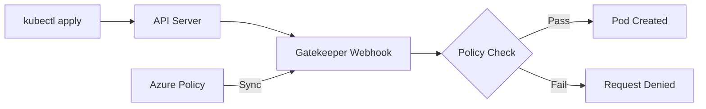

# How to Configure Azure Policy for AKS to Enforce Pod Security Standards

Author: [nawazdhandala](https://www.github.com/nawazdhandala)

Tags: AKS, Azure Policy, Pod Security, Kubernetes, Security, Compliance, Gatekeeper

Description: Learn how to use Azure Policy with AKS to enforce pod security standards and prevent privileged containers and other security risks.

---

Running containers in production without security guardrails is asking for trouble. A single misconfigured pod running as root or with host networking can become the entry point for a serious breach. Azure Policy for AKS gives you a way to enforce security standards across your entire cluster, automatically rejecting workloads that violate your policies before they ever run. In this post, I will walk through setting up Azure Policy on AKS and configuring it to enforce the Kubernetes Pod Security Standards.

## How Azure Policy Works with AKS

Under the hood, Azure Policy for AKS uses Gatekeeper, which is the Open Policy Agent (OPA) admission controller. When you enable the Azure Policy add-on for AKS, it installs Gatekeeper and syncs policy definitions from Azure into constraint templates and constraints inside your cluster. Every pod creation request goes through Gatekeeper, which evaluates it against your active policies and blocks anything that violates them.

The nice thing about using Azure Policy instead of managing Gatekeeper directly is that you get centralized policy management through the Azure portal, audit trails, compliance dashboards, and the ability to apply the same policies across multiple clusters.

## Prerequisites

You need an AKS cluster, Azure CLI installed, and the ability to assign Azure Policies at the subscription or resource group level. You also need the AKS cluster to be running Kubernetes 1.25 or later for the Pod Security Standards to apply properly.

## Step 1: Enable the Azure Policy Add-on

If you have an existing AKS cluster, enable the add-on with a single command.

```bash
# Enable Azure Policy add-on on an existing AKS cluster
az aks enable-addons \
  --addons azure-policy \
  --resource-group myResourceGroup \
  --name myAKSCluster
```

For new clusters, include it at creation time.

```bash
# Create a new AKS cluster with Azure Policy enabled
az aks create \
  --resource-group myResourceGroup \
  --name myAKSCluster \
  --enable-addons azure-policy \
  --node-count 3 \
  --generate-ssh-keys
```

After enabling, verify the add-on is running.

```bash
# Check that the Azure Policy pods are running
kubectl get pods -n gatekeeper-system

# Check that the Azure Policy pod is running in kube-system
kubectl get pods -n kube-system -l app=azure-policy
```

You should see the gatekeeper-controller and gatekeeper-audit pods in the gatekeeper-system namespace, plus the azure-policy pod in kube-system.

## Step 2: Understand Pod Security Standards

Kubernetes defines three levels of Pod Security Standards:

**Privileged** - No restrictions. This is the default behavior without any policies.

**Baseline** - Prevents known privilege escalations. Blocks things like hostNetwork, hostPID, privileged containers, and certain dangerous volume types. This is a good starting point for most workloads.

**Restricted** - The most locked-down profile. Requires non-root containers, read-only root filesystems, drops all capabilities, and enforces seccomp profiles. This is the target for security-conscious production environments.

## Step 3: Assign the Pod Security Standards Initiative

Azure provides a built-in policy initiative that maps to the Kubernetes Pod Security Standards. You can assign it at the resource group or subscription level.

```bash
# Get the resource group ID
RG_ID=$(az group show \
  --name myResourceGroup \
  --query id -o tsv)

# Assign the baseline Pod Security Standards initiative
az policy assignment create \
  --name "aks-baseline-security" \
  --display-name "AKS Baseline Pod Security Standards" \
  --policy-set-definition "a8640138-9b0a-4a28-b8cb-1666c838647d" \
  --scope $RG_ID \
  --params '{"effect": {"value": "deny"}}' \
  --mi-system-assigned \
  --location eastus
```

The policy set definition ID above is for the Kubernetes cluster pods should only use approved capabilities initiative. To find the exact IDs for the policies you want, check the Azure Policy built-in definitions for Kubernetes.

## Step 4: Apply Individual Security Policies

Beyond the initiative, you can apply individual policies for more granular control. Here are the most important ones.

This command blocks containers from running in privileged mode.

```bash
# Policy: Do not allow privileged containers in AKS
az policy assignment create \
  --name "no-privileged-containers" \
  --display-name "Do not allow privileged containers" \
  --policy "95edb821-ddaf-4404-9732-666045e056b4" \
  --scope $RG_ID \
  --params '{"effect": {"value": "deny"}, "excludedNamespaces": {"value": ["kube-system", "gatekeeper-system"]}}'
```

This one prevents containers from running as root.

```bash
# Policy: Containers must run as non-root user
az policy assignment create \
  --name "must-run-as-nonroot" \
  --display-name "Containers must run as non-root" \
  --policy "f06ddb64-5fa3-4b77-b166-acb36f7f6042" \
  --scope $RG_ID \
  --params '{"effect": {"value": "deny"}, "excludedNamespaces": {"value": ["kube-system", "gatekeeper-system"]}}'
```

And this blocks host networking.

```bash
# Policy: Do not allow host network access
az policy assignment create \
  --name "no-host-networking" \
  --display-name "Do not allow pods to use host networking" \
  --policy "82985f06-dc18-4a48-bc1c-b9f4f0098cfe" \
  --scope $RG_ID \
  --params '{"effect": {"value": "deny"}, "excludedNamespaces": {"value": ["kube-system", "gatekeeper-system"]}}'
```

Notice the `excludedNamespaces` parameter. System namespaces often need elevated privileges for legitimate reasons, so excluding them prevents breaking your cluster's control plane components.

## Step 5: Test the Policies

Give the policies about 15-20 minutes to sync to your cluster. Gatekeeper needs time to download and compile the constraint templates. Once synced, test with a privileged pod.

```yaml
# test-privileged-pod.yaml
# This pod should be rejected by the policy
apiVersion: v1
kind: Pod
metadata:
  name: test-privileged
  namespace: default
spec:
  containers:
    - name: nginx
      image: nginx
      securityContext:
        # This triggers the privileged container policy
        privileged: true
```

Apply it and observe the rejection.

```bash
# Try to create a privileged pod - should be denied
kubectl apply -f test-privileged-pod.yaml
```

You should get an error like:

```
Error from server (Forbidden): admission webhook "validation.gatekeeper.sh" denied the request:
[azurepolicy-psp-privileged-container-xxx] Privileged container is not allowed: nginx
```

Now test with a compliant pod.

```yaml
# test-compliant-pod.yaml
# This pod follows the baseline security standards
apiVersion: v1
kind: Pod
metadata:
  name: test-compliant
  namespace: default
spec:
  containers:
    - name: nginx
      image: nginx
      securityContext:
        # Run as non-root user
        runAsNonRoot: true
        runAsUser: 1000
        # Drop all capabilities
        capabilities:
          drop:
            - ALL
        # Read-only root filesystem
        readOnlyRootFilesystem: true
```

This pod should be created successfully.

## Step 6: Monitor Compliance

Azure Policy provides compliance reporting in the Azure portal. You can also check it from the CLI.

```bash
# Check policy compliance state
az policy state list \
  --resource-group myResourceGroup \
  --filter "complianceState eq 'NonCompliant'" \
  --query "[].{policy:policyDefinitionName, resource:resourceId}" \
  --output table
```

For cluster-level visibility, check the Gatekeeper audit results.

```bash
# View constraint violations found by Gatekeeper audit
kubectl get constraint -A -o json | \
  jq '.items[] | {name: .metadata.name, violations: .status.totalViolations}'
```

## The Policy Enforcement Flow

Here is how the enforcement works end-to-end.



## Step 7: Use Audit Mode First

If you are applying policies to an existing cluster with running workloads, start with audit mode instead of deny. This lets you see what would be blocked without actually breaking anything.

```bash
# Assign policy in audit mode first
az policy assignment create \
  --name "audit-privileged-containers" \
  --display-name "Audit privileged containers" \
  --policy "95edb821-ddaf-4404-9732-666045e056b4" \
  --scope $RG_ID \
  --params '{"effect": {"value": "audit"}}'
```

Run in audit mode for a week or two, review the compliance report, fix the non-compliant workloads, and then switch to deny mode.

## Common Policies Worth Enabling

Beyond the basics, consider enabling these policies:

- **Container images must be from allowed registries** - prevents pulling from untrusted sources
- **Pods must use approved volume types** - blocks hostPath mounts
- **CPU and memory resource limits must be set** - prevents resource exhaustion
- **Services must not use NodePort** - forces traffic through ingress controllers
- **Containers must not allow privilege escalation** - blocks setuid binaries

## Handling Exceptions

Sometimes a workload legitimately needs elevated privileges. Use policy exemptions rather than disabling the policy entirely.

```bash
# Create an exemption for a specific deployment
az policy exemption create \
  --name "monitoring-agent-exemption" \
  --policy-assignment "no-privileged-containers" \
  --scope "$RG_ID/providers/Microsoft.ContainerService/managedClusters/myAKSCluster" \
  --exemption-category "Waiver" \
  --description "Monitoring agent requires privileged access for host metrics"
```

Azure Policy for AKS is one of those things that feels like overhead when you are setting it up but becomes invaluable once it is running. It catches misconfigurations before they reach production, provides an audit trail for compliance, and gives you confidence that your security standards are being enforced consistently across every cluster in your organization.
