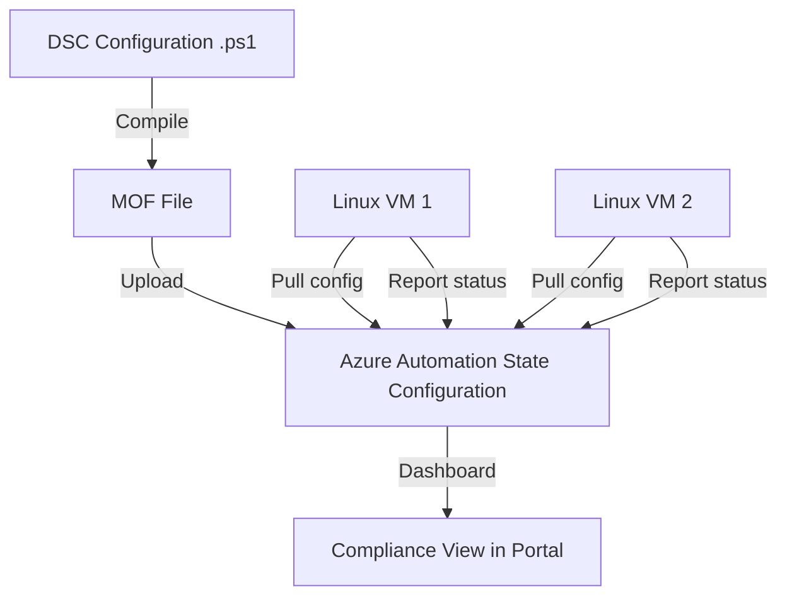

# How to Configure Azure PowerShell DSC for Linux VM Configuration Management

Author: [nawazdhandala](https://www.github.com/nawazdhandala)

Tags: Azure, PowerShell DSC, Linux, Configuration Management, Automation, Virtual Machines, DevOps

Description: A hands-on guide to using Azure Automation State Configuration with PowerShell DSC to manage and enforce configurations on Linux virtual machines.

---

PowerShell Desired State Configuration (DSC) is not just for Windows. Through the `nx` module and the Open Management Infrastructure (OMI) server, DSC can manage Linux systems too. Azure Automation State Configuration builds on this by providing a cloud-based pull server that your Linux VMs check in with to receive their configurations. When a VM drifts from its desired state, DSC detects the drift and can automatically correct it.

This post walks through setting up Azure Automation State Configuration for Linux VMs, writing DSC configurations that work on Linux, and connecting everything together.

## How DSC Works on Linux

On Windows, DSC uses the Local Configuration Manager (LCM) that is built into the OS. On Linux, it works through OMI (Open Management Infrastructure), which is the Linux equivalent of WMI. The OMI server runs a DSC agent that can operate in push or pull mode.

In pull mode with Azure Automation, the flow looks like this:

1. You write a DSC configuration and compile it into a MOF file
2. Upload the MOF to Azure Automation State Configuration
3. Register your Linux VMs with the Automation account
4. VMs periodically pull their configuration and apply it
5. VMs report compliance status back to Azure



## Setting Up Azure Automation

First, create an Azure Automation account and enable State Configuration. You can do this with Terraform, Bicep, or the Azure CLI. Here is the Terraform approach since it integrates well with VM provisioning.

```hcl
# Terraform configuration for Azure Automation State Configuration
resource "azurerm_resource_group" "dsc" {
  name     = "rg-dsc-linux"
  location = "eastus2"
}

# Azure Automation account for hosting DSC configurations
resource "azurerm_automation_account" "dsc" {
  name                = "auto-dsc-linux"
  location            = azurerm_resource_group.dsc.location
  resource_group_name = azurerm_resource_group.dsc.name
  sku_name            = "Basic"

  identity {
    type = "SystemAssigned"
  }

  tags = {
    Purpose   = "dsc-configuration"
    ManagedBy = "terraform"
  }
}
```

## Installing the nx Module

The `nx` module provides DSC resources for Linux. Import it into your Automation account.

```bash
# Import the nx module into Azure Automation
# The nx module provides Linux-specific DSC resources
az automation module create \
  --automation-account-name auto-dsc-linux \
  --resource-group rg-dsc-linux \
  --name nx \
  --content-link-uri "https://www.powershellgallery.com/api/v2/package/nx/1.0"

# Verify the module imported successfully
az automation module show \
  --automation-account-name auto-dsc-linux \
  --resource-group rg-dsc-linux \
  --name nx \
  --query "provisioningState"
```

## Writing DSC Configurations for Linux

DSC configurations for Linux use the `nx` resources instead of the standard Windows resources. Here is a configuration that manages common Linux settings: packages, files, services, and user accounts.

```powershell
# LinuxWebServer.ps1 - DSC configuration for a Linux web server
Configuration LinuxWebServer {
    # Import the nx module for Linux DSC resources
    Import-DscResource -ModuleName nx

    # This applies to all nodes assigned this configuration
    Node "localhost" {

        # Ensure nginx is installed
        nxPackage NginxPackage {
            Name = "nginx"
            Ensure = "Present"
            PackageManager = "apt"    # Use "yum" for RHEL/CentOS
        }

        # Ensure the nginx service is running and enabled
        nxService NginxService {
            Name = "nginx"
            State = "Running"
            Enabled = $true
            Controller = "systemd"
            DependsOn = "[nxPackage]NginxPackage"
        }

        # Create the web content directory
        nxFile WebContentDir {
            DestinationPath = "/var/www/html"
            Type = "Directory"
            Ensure = "Present"
            Owner = "www-data"
            Group = "www-data"
            Mode = "0755"
        }

        # Deploy a custom nginx configuration file
        nxFile NginxConfig {
            DestinationPath = "/etc/nginx/sites-available/default"
            Ensure = "Present"
            Type = "File"
            Contents = '
server {
    listen 80 default_server;
    listen [::]:80 default_server;
    root /var/www/html;
    index index.html;
    server_name _;
    location / {
        try_files $uri $uri/ =404;
    }
}
'
            Owner = "root"
            Group = "root"
            Mode = "0644"
            DependsOn = "[nxPackage]NginxPackage"
        }

        # Ensure security packages are present
        nxPackage FailToBan {
            Name = "fail2ban"
            Ensure = "Present"
            PackageManager = "apt"
        }

        # Ensure the firewall package is installed
        nxPackage UFW {
            Name = "ufw"
            Ensure = "Present"
            PackageManager = "apt"
        }

        # Create a deploy user with specific group membership
        nxUser DeployUser {
            UserName = "deploy"
            Ensure = "Present"
            HomeDirectory = "/home/deploy"
            Description = "Deployment service account"
        }

        # Set up the deploy user's SSH directory
        nxFile DeploySshDir {
            DestinationPath = "/home/deploy/.ssh"
            Type = "Directory"
            Ensure = "Present"
            Owner = "deploy"
            Group = "deploy"
            Mode = "0700"
            DependsOn = "[nxUser]DeployUser"
        }

        # Configure SSH settings for security
        nxFile SshdConfig {
            DestinationPath = "/etc/ssh/sshd_config.d/hardening.conf"
            Ensure = "Present"
            Type = "File"
            Contents = '
# DSC-managed SSH hardening
PermitRootLogin no
PasswordAuthentication no
MaxAuthTries 3
ClientAliveInterval 300
ClientAliveCountMax 2
'
            Owner = "root"
            Group = "root"
            Mode = "0644"
        }

        # Run a custom script to configure firewall rules
        nxScript ConfigureFirewall {
            GetScript = @'
#!/bin/bash
ufw status | grep -q "Status: active"
'@
            TestScript = @'
#!/bin/bash
# Check if firewall is already configured
ufw status | grep -q "Status: active" && \
ufw status | grep -q "22/tcp" && \
ufw status | grep -q "80/tcp" && \
ufw status | grep -q "443/tcp"
'@
            SetScript = @'
#!/bin/bash
# Configure firewall rules
ufw default deny incoming
ufw default allow outgoing
ufw allow 22/tcp
ufw allow 80/tcp
ufw allow 443/tcp
ufw --force enable
'@
            DependsOn = "[nxPackage]UFW"
        }
    }
}
```

## Compiling and Uploading the Configuration

Compile the DSC configuration and upload it to Azure Automation.

```powershell
# Compile the configuration locally to verify it
# Run this in PowerShell 7 with the nx module installed
LinuxWebServer

# Upload the configuration to Azure Automation
Import-AzAutomationDscConfiguration `
    -SourcePath "./LinuxWebServer.ps1" `
    -ResourceGroupName "rg-dsc-linux" `
    -AutomationAccountName "auto-dsc-linux" `
    -Published `
    -Force

# Compile the configuration in Azure Automation
# This creates the MOF files that nodes will pull
Start-AzAutomationDscCompilationJob `
    -ResourceGroupName "rg-dsc-linux" `
    -AutomationAccountName "auto-dsc-linux" `
    -ConfigurationName "LinuxWebServer"
```

Alternatively, upload and compile using the Azure CLI.

```bash
# Upload the DSC configuration
az automation configuration create \
  --automation-account-name auto-dsc-linux \
  --resource-group rg-dsc-linux \
  --name LinuxWebServer \
  --source-control-name LinuxWebServer.ps1 \
  --location eastus2

# Start compilation
az automation configuration create-or-update \
  --automation-account-name auto-dsc-linux \
  --resource-group rg-dsc-linux \
  --name LinuxWebServer
```

## Registering Linux VMs

To register a Linux VM with Azure Automation State Configuration, you install the DSC extension on the VM. This installs OMI and the DSC agent, configures the pull server, and starts the initial configuration pull.

```hcl
# Terraform - Register a Linux VM with Azure Automation DSC
resource "azurerm_virtual_machine_extension" "dsc" {
  name                 = "DSCForLinux"
  virtual_machine_id   = azurerm_linux_virtual_machine.web.id
  publisher            = "Microsoft.OSTCExtensions"
  type                 = "DSCForLinux"
  type_handler_version = "2.71"

  settings = jsonencode({
    Mode                  = "Register"
    FileUri               = ""
  })

  protected_settings = jsonencode({
    RegistrationUrl = azurerm_automation_account.dsc.dsc_server_endpoint
    RegistrationKey = azurerm_automation_account.dsc.dsc_primary_access_key
    NodeConfigurationName = "LinuxWebServer.localhost"
    ConfigurationMode     = "ApplyAndAutoCorrect"
    ConfigurationModeFrequencyMins = 15
    RefreshFrequencyMins  = 30
  })
}
```

The `ConfigurationMode` setting controls what happens when drift is detected:

- **ApplyOnly** - Apply the configuration once and do not check again
- **ApplyAndMonitor** - Apply the configuration and report drift but do not fix it
- **ApplyAndAutoCorrect** - Apply the configuration and automatically fix any drift

For production servers where you want enforcement, `ApplyAndAutoCorrect` is the right choice.

## Checking Compliance

Once VMs are registered, you can check their compliance status.

```bash
# List all registered nodes and their compliance state
az automation dsc-node list \
  --automation-account-name auto-dsc-linux \
  --resource-group rg-dsc-linux \
  --output table

# Get detailed compliance report for a specific node
az automation dsc-node-report list \
  --automation-account-name auto-dsc-linux \
  --resource-group rg-dsc-linux \
  --node-id "<NODE_ID>" \
  --output table
```

## A Configuration for Database Servers

Here is another example that shows a different workload - configuring a Linux VM as a PostgreSQL server.

```powershell
Configuration LinuxDatabaseServer {
    Import-DscResource -ModuleName nx

    Node "localhost" {
        # Install PostgreSQL
        nxPackage PostgreSQL {
            Name = "postgresql"
            Ensure = "Present"
            PackageManager = "apt"
        }

        # Ensure PostgreSQL service is running
        nxService PostgreSQLService {
            Name = "postgresql"
            State = "Running"
            Enabled = $true
            Controller = "systemd"
            DependsOn = "[nxPackage]PostgreSQL"
        }

        # Configure kernel parameters for PostgreSQL
        nxFile SysctlConfig {
            DestinationPath = "/etc/sysctl.d/99-postgresql.conf"
            Type = "File"
            Ensure = "Present"
            Contents = '
# PostgreSQL kernel tuning - managed by DSC
vm.swappiness = 1
vm.overcommit_memory = 2
kernel.shmmax = 17179869184
kernel.shmall = 4194304
'
            Owner = "root"
            Group = "root"
            Mode = "0644"
        }

        # Create backup directory
        nxFile BackupDir {
            DestinationPath = "/var/backups/postgresql"
            Type = "Directory"
            Ensure = "Present"
            Owner = "postgres"
            Group = "postgres"
            Mode = "0750"
        }
    }
}
```

## Limitations and Considerations

There are some things to keep in mind when using DSC for Linux:

1. **Module support** - The `nx` module provides basic resources (files, packages, services, users, groups, scripts). It does not have the breadth of Windows DSC resources. For more complex configurations, you will use `nxScript` with custom bash scripts.

2. **Package managers** - You need to specify the correct package manager (`apt`, `yum`, or `zypper`) for your Linux distribution. There is no auto-detection.

3. **Azure Automation State Configuration** - Microsoft has signaled that Azure Automation State Configuration will eventually be replaced by Azure Machine Configuration (formerly Azure Policy Guest Configuration). For new projects, consider whether Machine Configuration is a better fit.

4. **OMI dependencies** - The OMI server needs to be compatible with your Linux distribution and kernel version. Check the supported distributions list before committing to DSC for Linux.

## Wrapping Up

PowerShell DSC for Linux through Azure Automation gives you centralized configuration management with drift detection and automatic correction. The `nx` module provides the building blocks for managing packages, services, files, and users, while `nxScript` fills the gaps for anything custom. Combined with Azure Automation as a pull server, you get a managed solution that scales to hundreds of VMs with consistent compliance reporting across your fleet.
