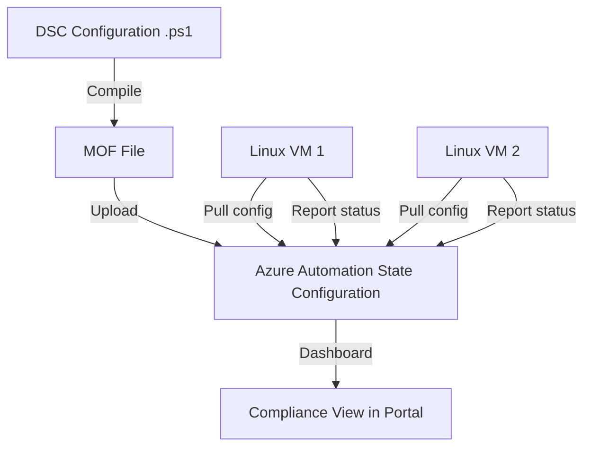

# How to Configure Azure PowerShell DSC for Linux VM Configuration Management

Author: [nawazdhandala](https://www.github.com/nawazdhandala)

Tags: Azure, PowerShell DSC, Linux, Configuration Management, Automation, Virtual Machine, DevOps

Description: A hands-on guide to using Azure Automation State Configuration with PowerShell DSC to manage and enforce configurations on Linux virtual machines.

---

PowerShell Desired State Configuration (DSC) was not just for Windows. Through the `nx` module and the Open Management Infrastructure (OMI) server, DSC could manage Linux systems too. Azure Automation State Configuration built on this by providing a cloud-based pull server that your Linux VMs checked in with to receive their configurations. When a VM drifted from its desired state, DSC detected the drift and could automatically correct it.

Important: Azure Automation DSC for Linux and the Desired State Configuration VM extension for Linux were retired on September 30, 2023. The PowerShell DSC for Linux project was archived on September 12, 2024, and OMI was deprecated on March 24, 2025. Azure Automation State Configuration itself is scheduled for retirement on September 30, 2027. Use the approach in this post only for understanding or maintaining legacy environments; for new Linux VM configuration management, use Azure Machine Configuration or another supported configuration management tool.

This post walks through the legacy setup for Azure Automation State Configuration for Linux VMs, writing DSC configurations that worked on Linux, and connecting everything together.

## How DSC Works on Linux

On Windows, DSC uses the Local Configuration Manager (LCM) that is built into the OS. On Linux, DSC for Linux worked through OMI (Open Management Infrastructure), which provided a CIM/WMI-style management layer for Linux. The OMI server ran a DSC agent that could operate in push or pull mode.

In pull mode with Azure Automation, the legacy flow looked like this:

1. You write a DSC configuration and compile it into one or more MOF node configuration files
2. Upload the configuration for Azure Automation to compile, or import externally compiled MOF files
3. Register your Linux VMs with the Automation account
4. VMs periodically pull their configuration and apply it
5. VMs report compliance status back to Azure


```mermaid
graph TD
    A[DSC Configuration .ps1] -->|Compile| B[MOF File]
    B -->|Upload| C[Azure Automation State Configuration]
    D[Linux VM 1] -->|Pull config| C
    E[Linux VM 2] -->|Pull config| C
    D -->|Report status| C
    E -->|Report status| C
    C -->|Dashboard| F[Compliance View in Portal]
```

## Setting Up Azure Automation

For legacy State Configuration environments, first create an Azure Automation account and enable State Configuration. You can do this with Terraform, Bicep, or the Azure CLI. Here is the Terraform approach since it integrates well with VM provisioning.

```hcl
# Terraform configuration for Azure Automation State Configuration

resource "azurerm_resource_group" "dsc" {
  name     = "rg-dsc-linux"
  location = "eastus2"
}

# Azure Automation account for hosting DSC configurations
resource "azurerm_automation_account" "dsc" {
  name                = "auto-dsc-linux"
  location            = azurerm_resource_group.dsc.location
  resource_group_name = azurerm_resource_group.dsc.name
  sku_name            = "Basic"

  identity {
    type = "SystemAssigned"
  }

  tags = {
    Purpose   = "dsc-configuration"
    ManagedBy = "terraform"
  }
}
```

## Installing the nx Module

The `nx` module provided DSC resources for Linux. In a legacy Automation account that still depends on these configurations, import it into your Automation account.

```powershell
# Import the nx module into Azure Automation
# The nx module provides legacy Linux-specific DSC resources
New-AzAutomationModule `
    -AutomationAccountName "auto-dsc-linux" `
    -ResourceGroupName "rg-dsc-linux" `
    -Name "nx" `
    -ContentLinkUri "https://www.powershellgallery.com/api/v2/package/nx/1.0"

# Verify the module imported successfully
Get-AzAutomationModule `
    -AutomationAccountName "auto-dsc-linux" `
    -ResourceGroupName "rg-dsc-linux" `
    -Name "nx" |
    Select-Object Name, ProvisioningState
```

## Writing DSC Configurations for Linux

DSC configurations for Linux used the `nx` resources instead of the standard Windows resources. Here is a configuration that manages common Linux settings: packages, files, services, and user accounts.

```powershell
# LinuxWebServer.ps1 - DSC configuration for a Linux web server
Configuration LinuxWebServer {
    # Import the nx module for Linux DSC resources
    Import-DscResource -ModuleName nx

    # This applies to all nodes assigned this configuration
    Node "localhost" {

        # Ensure nginx is installed
        nxPackage NginxPackage {
            Name = "nginx"
            Ensure = "Present"
            PackageManager = "Apt"    # Use "Yum" for RHEL/CentOS
        }

        # Ensure the nginx service is running and enabled
        nxService NginxService {
            Name = "nginx"
            State = "Running"
            Enabled = $true
            Controller = "systemd"
            DependsOn = "[nxPackage]NginxPackage"
        }

        # Create the web content directory
        nxFile WebContentDir {
            DestinationPath = "/var/www/html"
            Type = "Directory"
            Ensure = "Present"
            Owner = "www-data"
            Group = "www-data"
            Mode = "0755"
            DependsOn = "[nxPackage]NginxPackage"
        }

        # Deploy a custom nginx configuration file
        nxFile NginxConfig {
            DestinationPath = "/etc/nginx/sites-available/default"
            Ensure = "Present"
            Type = "File"
            Contents = '
server {
    listen 80 default_server;
    listen [::]:80 default_server;
    root /var/www/html;
    index index.html;
    server_name _;
    location / {
        try_files $uri $uri/ =404;
    }
}
'
            Owner = "root"
            Group = "root"
            Mode = "0644"
            DependsOn = "[nxPackage]NginxPackage"
        }

        # Ensure security packages are present
        nxPackage FailToBan {
            Name = "fail2ban"
            Ensure = "Present"
            PackageManager = "Apt"
        }

        # Ensure the firewall package is installed
        nxPackage UFW {
            Name = "ufw"
            Ensure = "Present"
            PackageManager = "Apt"
        }

        # Create a deploy user with specific group membership
        nxUser DeployUser {
            UserName = "deploy"
            Ensure = "Present"
            HomeDirectory = "/home/deploy"
            Description = "Deployment service account"
        }

        # Set up the deploy user's SSH directory
        nxFile DeploySshDir {
            DestinationPath = "/home/deploy/.ssh"
            Type = "Directory"
            Ensure = "Present"
            Owner = "deploy"
            Group = "deploy"
            Mode = "0700"
            DependsOn = "[nxUser]DeployUser"
        }

        # Configure SSH settings for security
        nxFile SshdConfig {
            DestinationPath = "/etc/ssh/sshd_config.d/hardening.conf"
            Ensure = "Present"
            Type = "File"
            Contents = '
# DSC-managed SSH hardening
PermitRootLogin no
PasswordAuthentication no
MaxAuthTries 3
ClientAliveInterval 300
ClientAliveCountMax 2
'
            Owner = "root"
            Group = "root"
            Mode = "0644"
        }

        # Run a custom script to configure firewall rules
        nxScript ConfigureFirewall {
            GetScript = @'
#!/bin/bash
ufw status | grep -q "Status: active"
'@
            TestScript = @'
#!/bin/bash
# Check if firewall is already configured
ufw status | grep -q "Status: active" && \
ufw status | grep -q "22/tcp" && \
ufw status | grep -q "80/tcp" && \
ufw status | grep -q "443/tcp"
'@
            SetScript = @'
#!/bin/bash
# Configure firewall rules
ufw default deny incoming
ufw default allow outgoing
ufw allow 22/tcp
ufw allow 80/tcp
ufw allow 443/tcp
ufw --force enable
'@
            DependsOn = "[nxPackage]UFW"
        }
    }
}
```

## Compiling and Uploading the Configuration

Compile the DSC configuration and upload it to Azure Automation.

```powershell
# Compile the configuration locally to verify it
# Run this in Windows PowerShell 5.1 with the nx module installed
. ./LinuxWebServer.ps1
LinuxWebServer

# Upload the configuration to Azure Automation
Import-AzAutomationDscConfiguration `
    -SourcePath "./LinuxWebServer.ps1" `
    -ResourceGroupName "rg-dsc-linux" `
    -AutomationAccountName "auto-dsc-linux" `
    -Published `
    -Force

# Compile the configuration in Azure Automation
# This creates the MOF files that nodes will pull
Start-AzAutomationDscCompilationJob `
    -ResourceGroupName "rg-dsc-linux" `
    -AutomationAccountName "auto-dsc-linux" `
    -ConfigurationName "LinuxWebServer"
```

Alternatively, use the Azure CLI to create or update the configuration source, then compile it from the Azure portal, Azure PowerShell, or the Azure Automation REST API.

```bash
# Upload the DSC configuration source from a local file
CONFIG_SOURCE="$(cat ./LinuxWebServer.ps1)"

az automation configuration create \
  --automation-account-name auto-dsc-linux \
  --resource-group rg-dsc-linux \
  --name LinuxWebServer \
  --location eastus2 \
  --source-type embeddedContent \
  --source "$CONFIG_SOURCE"
```

## Registering Linux VMs

Before retirement, you registered a Linux VM with Azure Automation State Configuration by installing the DSC extension on the VM. This installed OMI and the DSC agent, configured the pull server, and started the initial configuration pull. This extension is retired for Linux and should not be used for new deployments.

```hcl
# Terraform - legacy example for a Linux VM that used Azure Automation DSC
resource "azurerm_virtual_machine_extension" "dsc" {
  name                 = "DSCForLinux"
  virtual_machine_id   = azurerm_linux_virtual_machine.web.id
  publisher            = "Microsoft.OSTCExtensions"
  type                 = "DSCForLinux"
  type_handler_version = "2.71"

  settings = jsonencode({
    Mode                  = "Register"
    FileUri               = ""
  })

  protected_settings = jsonencode({
    RegistrationUrl = azurerm_automation_account.dsc.dsc_server_endpoint
    RegistrationKey = azurerm_automation_account.dsc.dsc_primary_access_key
    NodeConfigurationName = "LinuxWebServer.localhost"
    ConfigurationMode     = "ApplyAndAutoCorrect"
    ConfigurationModeFrequencyMins = 15
    RefreshFrequencyMins  = 30
  })
}
```

The `ConfigurationMode` setting controls what happens when drift is detected:

- **ApplyOnly** - Apply the configuration once and do not check again
- **ApplyAndMonitor** - Apply the configuration and report drift but do not fix it
- **ApplyAndAutoCorrect** - Apply the configuration and automatically fix any drift

For production servers where you want enforcement, `ApplyAndAutoCorrect` is the right choice.

## Checking Compliance

Once VMs are registered, you can check their compliance status.

```powershell
# List all registered nodes and their compliance state
Get-AzAutomationDscNode `
    -AutomationAccountName "auto-dsc-linux" `
    -ResourceGroupName "rg-dsc-linux" |
    Select-Object Name, Status, NodeConfigurationName

# Get detailed compliance report for a specific node
Get-AzAutomationDscNodeReport `
    -AutomationAccountName "auto-dsc-linux" `
    -ResourceGroupName "rg-dsc-linux" `
    -NodeId "<NODE_ID>"
```

## A Configuration for Database Servers

Here is another example that shows a different workload - configuring a Linux VM as a PostgreSQL server.

```powershell
Configuration LinuxDatabaseServer {
    Import-DscResource -ModuleName nx

    Node "localhost" {
        # Install PostgreSQL
        nxPackage PostgreSQL {
            Name = "postgresql"
            Ensure = "Present"
            PackageManager = "Apt"
        }

        # Ensure PostgreSQL service is running
        nxService PostgreSQLService {
            Name = "postgresql"
            State = "Running"
            Enabled = $true
            Controller = "systemd"
            DependsOn = "[nxPackage]PostgreSQL"
        }

        # Configure kernel parameters for PostgreSQL
        nxFile SysctlConfig {
            DestinationPath = "/etc/sysctl.d/99-postgresql.conf"
            Type = "File"
            Ensure = "Present"
            Contents = '
# PostgreSQL kernel tuning - managed by DSC
vm.swappiness = 1
vm.overcommit_memory = 2
kernel.shmmax = 17179869184
kernel.shmall = 4194304
'
            Owner = "root"
            Group = "root"
            Mode = "0644"
        }

        # Create backup directory
        nxFile BackupDir {
            DestinationPath = "/var/backups/postgresql"
            Type = "Directory"
            Ensure = "Present"
            Owner = "postgres"
            Group = "postgres"
            Mode = "0750"
            DependsOn = "[nxPackage]PostgreSQL"
        }
    }
}
```

## Limitations and Considerations

There are some things to keep in mind when using DSC for Linux:

1. **Module support** - The legacy `nx` module provides basic resources (files, packages, services, users, groups, scripts). It does not have the breadth of Windows DSC resources. For more complex configurations, you will use `nxScript` with custom bash scripts.

2. **Package managers** - You need to specify the correct package manager (`apt`, `yum`, or `zypper`) for your Linux distribution. There is no auto-detection.

3. **Azure Automation State Configuration** - Azure Automation State Configuration will be retired on September 30, 2027. Azure Automation DSC for Linux and the DSC VM extension for Linux were already retired on September 30, 2023. For new projects, use Azure Machine Configuration or another supported Linux configuration management tool.

4. **OMI dependencies** - The OMI server needed to be compatible with your Linux distribution and kernel version. OMI has been deprecated since March 24, 2025, so do not start new designs that depend on it.

## Wrapping Up

PowerShell DSC for Linux through Azure Automation gave legacy environments centralized configuration management with drift detection and automatic correction. The `nx` module provided the building blocks for managing packages, services, files, and users, while `nxScript` filled the gaps for anything custom. Combined with Azure Automation as a pull server, it provided a managed solution that scaled to hundreds of VMs with consistent compliance reporting across a fleet. For new Linux VM configuration management, use a supported replacement such as Azure Machine Configuration.
