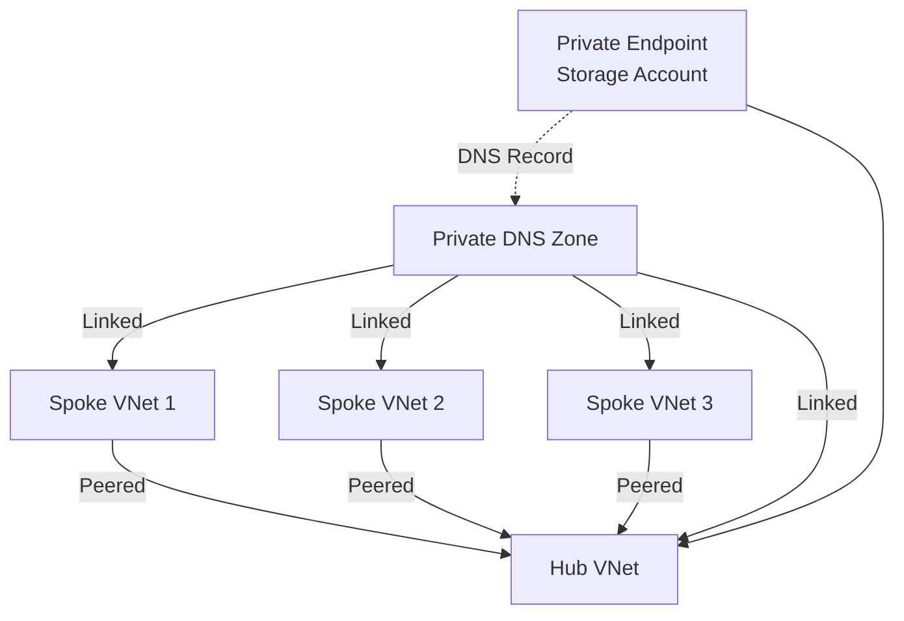

# How to Configure Azure Private DNS Zones for Name Resolution Across VNets

Author: [nawazdhandala](https://www.github.com/nawazdhandala)

Tags: Azure, Private DNS, Virtual Networks, DNS Resolution, Private Endpoints, Networking, Azure DNS

Description: Learn how to configure Azure Private DNS Zones for reliable name resolution across multiple virtual networks and with private endpoints.

---

DNS is one of those things that is invisible when it works and catastrophic when it does not. In Azure, when you start using private endpoints, hub-spoke network topologies, or multi-VNet architectures, you quickly run into DNS resolution challenges. Azure Private DNS Zones are the answer, but getting them configured correctly across multiple virtual networks requires understanding how DNS resolution flows through the Azure networking stack.

I have helped multiple organizations set up Private DNS Zones as part of their hub-spoke network architecture, and the same configuration mistakes come up repeatedly. This guide covers the correct approach and the pitfalls to avoid.

## How Azure DNS Resolution Works

Every Azure virtual network has a built-in DNS resolver at the virtual IP address 168.63.129.16. When a VM in a VNet makes a DNS query, here is what happens:

1. The query goes to the Azure DNS resolver (168.63.129.16)
2. If the VNet has a linked Private DNS Zone that matches the query, Azure resolves it from the private zone
3. If not, Azure forwards the query to the public Azure DNS service (or to a custom DNS server if configured)

This built-in resolver is what makes Private DNS Zones work without any software to install or manage. But it only resolves queries for zones that are linked to the VNet where the query originates. This is the key point that trips people up.

## Creating a Private DNS Zone

Private DNS Zones use the same format as public DNS zones. For Azure private endpoints, Microsoft publishes a specific zone name for each service. For example, Azure Storage private endpoints use `privatelink.blob.core.windows.net`.

Here is how to create a Private DNS Zone and link it to a virtual network.

```bash
# Create a Private DNS Zone for Azure Storage blob private endpoints
az network private-dns zone create \
  --resource-group rg-networking \
  --name "privatelink.blob.core.windows.net"

# Link the zone to a virtual network
# Enable auto-registration if VMs in this VNet should be registered automatically
az network private-dns link vnet create \
  --resource-group rg-networking \
  --zone-name "privatelink.blob.core.windows.net" \
  --name "link-to-hub-vnet" \
  --virtual-network "/subscriptions/{sub-id}/resourceGroups/rg-networking/providers/Microsoft.Network/virtualNetworks/vnet-hub" \
  --registration-enabled false
```

The `registration-enabled` flag controls whether VMs in the linked VNet automatically register their DNS records in the zone. For private endpoint zones, set this to false. Auto-registration is useful for custom zones where you want VM hostname resolution.

## The Multi-VNet Challenge

The real complexity begins when you have multiple virtual networks. In a hub-spoke topology, you might have:

- A hub VNet with shared services (DNS, firewalls, VPN gateways)
- Multiple spoke VNets for different workloads
- Private endpoints deployed in the hub or in specific spoke VNets

For DNS resolution to work from any spoke VNet to any private endpoint, the Private DNS Zone must be linked to every VNet that needs to resolve those records.



If you forget to link the Private DNS Zone to Spoke VNet 2, VMs in that spoke will resolve the storage account's public FQDN to its public IP instead of the private endpoint IP. Your traffic goes out to the internet and back, bypassing the private endpoint entirely, or fails if you have blocked public access on the storage account.

## Linking Zones to All VNets

For each Private DNS Zone, create a link to every VNet that needs to resolve records in that zone.

```bash
# Link the same zone to multiple spoke VNets
# Repeat for each VNet that needs private endpoint resolution
for VNET in "vnet-spoke-app" "vnet-spoke-data" "vnet-spoke-mgmt"; do
  az network private-dns link vnet create \
    --resource-group rg-networking \
    --zone-name "privatelink.blob.core.windows.net" \
    --name "link-to-${VNET}" \
    --virtual-network "/subscriptions/{sub-id}/resourceGroups/rg-networking/providers/Microsoft.Network/virtualNetworks/${VNET}" \
    --registration-enabled false
done
```

This approach works but does not scale well when you have dozens of VNets and dozens of Private DNS Zones (one per service type). The number of links grows as VNets multiplied by zones.

## Centralized DNS with Azure DNS Private Resolver

For larger environments, Azure DNS Private Resolver provides a scalable solution. Instead of linking every zone to every VNet, you link zones to the hub VNet only and configure spoke VNets to forward DNS queries to the Private Resolver in the hub.

```bash
# Create a DNS Private Resolver in the hub VNet
az dns-resolver create \
  --resource-group rg-networking \
  --name "dns-resolver-hub" \
  --location eastus2 \
  --id "/subscriptions/{sub-id}/resourceGroups/rg-networking/providers/Microsoft.Network/virtualNetworks/vnet-hub"

# Create an inbound endpoint (receives queries from spoke VNets)
az dns-resolver inbound-endpoint create \
  --resource-group rg-networking \
  --dns-resolver-name "dns-resolver-hub" \
  --name "inbound-from-spokes" \
  --location eastus2 \
  --ip-configurations "[{\"privateIpAllocationMethod\":\"Dynamic\",\"subnet\":{\"id\":\"/subscriptions/{sub-id}/resourceGroups/rg-networking/providers/Microsoft.Network/virtualNetworks/vnet-hub/subnets/snet-dns-inbound\"}}]"
```

Then configure each spoke VNet to use the Private Resolver's inbound endpoint IP as its DNS server. Queries from spoke VMs go to the resolver in the hub, which resolves them against Private DNS Zones linked to the hub VNet.

## Common Private Endpoint DNS Zones

Here are the Private DNS Zone names for the most commonly used Azure services. You need one zone for each service type you use with private endpoints.

| Service | Private DNS Zone Name |
|---------|----------------------|
| Storage Blob | privatelink.blob.core.windows.net |
| Storage File | privatelink.file.core.windows.net |
| Storage Table | privatelink.table.core.windows.net |
| Storage Queue | privatelink.queue.core.windows.net |
| SQL Database | privatelink.database.windows.net |
| Cosmos DB | privatelink.documents.azure.com |
| Key Vault | privatelink.vaultcore.azure.net |
| Event Hub | privatelink.servicebus.windows.net |
| App Service | privatelink.azurewebsites.net |
| Azure Monitor | privatelink.monitor.azure.com |

## Verifying DNS Resolution

After setting everything up, verify that DNS resolution returns the private IP.

```bash
# From a VM inside one of the linked VNets
# Should return a private IP address (10.x.x.x or 172.x.x.x)
nslookup mystorageaccount.blob.core.windows.net

# Expected output:
# Name: mystorageaccount.privatelink.blob.core.windows.net
# Address: 10.0.1.5  (private endpoint IP)

# If it returns a public IP, the Private DNS Zone is not linked to the VNet
# or the zone does not contain the record
```

You can also check the DNS records in the zone directly.

```bash
# List all records in the Private DNS Zone
az network private-dns record-set list \
  --resource-group rg-networking \
  --zone-name "privatelink.blob.core.windows.net" \
  -o table
```

## Troubleshooting Common Issues

**Resolution returns public IP instead of private IP.** The Private DNS Zone is not linked to the VNet where the query originates. Verify the link exists and is in the "Succeeded" provisioning state.

**Resolution returns NXDOMAIN.** The DNS record for the specific resource does not exist in the zone. If you created the private endpoint with automatic DNS zone integration, the record should be created automatically. If not, create it manually.

```bash
# Manually create an A record in the Private DNS Zone
az network private-dns record-set a create \
  --resource-group rg-networking \
  --zone-name "privatelink.blob.core.windows.net" \
  --name "mystorageaccount"

az network private-dns record-set a add-record \
  --resource-group rg-networking \
  --zone-name "privatelink.blob.core.windows.net" \
  --record-set-name "mystorageaccount" \
  --ipv4-address "10.0.1.5"
```

**Resolution works from some VNets but not others.** Check that the zone is linked to all required VNets. Also check that VNets using custom DNS servers (like on-premises DNS) have conditional forwarding configured for the privatelink zones.

**On-premises clients cannot resolve private endpoints.** On-premises DNS servers need conditional forwarders for the privatelink zones that point to an Azure DNS Private Resolver or a DNS forwarder VM in Azure.

Private DNS in Azure is straightforward in concept but requires careful attention to zone links, especially as your network grows. Take the time to set it up correctly and verify resolution from every VNet. The alternative is mysterious connectivity failures that are extremely difficult to diagnose at the application layer.
