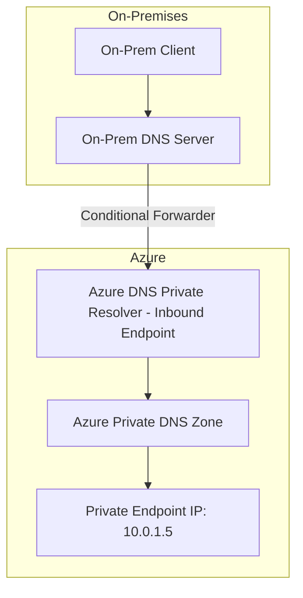

# How to Configure Azure Private Endpoint DNS Integration with On-Premises DNS

Author: [nawazdhandala](https://www.github.com/nawazdhandala)

Tags: Azure, Private Endpoint, DNS, Hybrid Networking, Private Link, On-Premises

Description: Step-by-step guide to configuring DNS resolution for Azure Private Endpoints when using on-premises DNS servers in hybrid environments.

---

Azure Private Endpoints let you access Azure PaaS services over a private IP address inside your virtual network, but they come with a DNS challenge that trips up a lot of teams. When you create a private endpoint for a service like Azure Storage or Azure SQL, the service's public FQDN needs to resolve to the private IP address instead of the public one. This is straightforward when you are entirely in Azure, but it gets more complicated when you have on-premises DNS servers in a hybrid setup.

This guide covers how to wire up DNS resolution so that both your Azure workloads and your on-premises machines resolve private endpoint FQDNs to the correct private IP addresses.

## The DNS Problem

When you create a private endpoint for, say, a storage account named `mystorageaccount`, Azure creates a network interface with a private IP in your VNet. The storage account's FQDN is `mystorageaccount.blob.core.windows.net`. For the private endpoint to work, DNS queries for that FQDN need to return the private IP (e.g., `10.0.1.5`) instead of the public IP.

Azure handles this with Private DNS Zones. When you create a private endpoint and link it to a private DNS zone like `privatelink.blob.core.windows.net`, Azure automatically creates an A record in that zone pointing to the private IP. The resolution chain works like this:


This works perfectly for VMs inside the VNet that is linked to the private DNS zone. But on-premises machines that use your corporate DNS servers have no idea about Azure Private DNS Zones. They will resolve the FQDN to the public IP, and your private endpoint becomes useless for on-premises workloads.

## Solution Architecture

The solution involves setting up DNS forwarding so that on-premises DNS servers forward queries for Azure private link zones to a DNS resolver in Azure, which can then query the Azure Private DNS Zone.



There are two main approaches:

1. **Azure DNS Private Resolver** (recommended) - A managed Azure service specifically designed for this scenario
2. **Custom DNS forwarders** - VMs running DNS server software like BIND or Windows DNS

We will focus on the Azure DNS Private Resolver since it is the managed, lower-maintenance option.

## Step 1: Create the Azure DNS Private Resolver

The DNS Private Resolver needs its own subnet in your VNet. The subnet must be delegated to the Microsoft.Network/dnsResolvers service.

```bash
# Create a dedicated subnet for the DNS Private Resolver inbound endpoint
az network vnet subnet create \
  --name dns-resolver-inbound \
  --resource-group myResourceGroup \
  --vnet-name myVNet \
  --address-prefixes "10.0.10.0/28" \
  --delegations Microsoft.Network/dnsResolvers

# Create the DNS Private Resolver
az dns-resolver create \
  --name myDnsResolver \
  --resource-group myResourceGroup \
  --location eastus \
  --id "/subscriptions/{sub-id}/resourceGroups/myResourceGroup/providers/Microsoft.Network/virtualNetworks/myVNet"
```

## Step 2: Create the Inbound Endpoint

The inbound endpoint gives you an IP address that on-premises DNS servers can forward queries to:

```bash
# Create the inbound endpoint
# This provides a private IP that on-premises DNS can forward to
az dns-resolver inbound-endpoint create \
  --name inbound-ep \
  --dns-resolver-name myDnsResolver \
  --resource-group myResourceGroup \
  --location eastus \
  --ip-configurations "[{\"private-ip-allocation-method\":\"Dynamic\",\"id\":\"/subscriptions/{sub-id}/resourceGroups/myResourceGroup/providers/Microsoft.Network/virtualNetworks/myVNet/subnets/dns-resolver-inbound\"}]"

# Get the IP address assigned to the inbound endpoint
az dns-resolver inbound-endpoint show \
  --name inbound-ep \
  --dns-resolver-name myDnsResolver \
  --resource-group myResourceGroup \
  --query "ipConfigurations[0].privateIpAddress" -o tsv
```

Note the IP address returned - you will need it when configuring the on-premises conditional forwarders.

## Step 3: Create and Link Private DNS Zones

For each Azure service you are using with private endpoints, you need a corresponding private DNS zone linked to the VNet where the DNS Private Resolver lives.

```bash
# Create private DNS zones for the services you use
# Here is an example for Storage Blob and Azure SQL
az network private-dns zone create \
  --name "privatelink.blob.core.windows.net" \
  --resource-group myResourceGroup

az network private-dns zone create \
  --name "privatelink.database.windows.net" \
  --resource-group myResourceGroup

# Link the private DNS zones to the VNet
az network private-dns link vnet create \
  --name "blob-dns-link" \
  --resource-group myResourceGroup \
  --zone-name "privatelink.blob.core.windows.net" \
  --virtual-network myVNet \
  --registration-enabled false

az network private-dns link vnet create \
  --name "sql-dns-link" \
  --resource-group myResourceGroup \
  --zone-name "privatelink.database.windows.net" \
  --virtual-network myVNet \
  --registration-enabled false
```

## Step 4: Configure On-Premises DNS Conditional Forwarders

This is where you connect the on-premises side to the Azure side. You need to create conditional forwarders on your on-premises DNS servers that forward queries for Azure private link domain zones to the DNS Private Resolver inbound endpoint IP.

For **Windows DNS Server**, open DNS Manager and create conditional forwarders for each private link zone:

```powershell
# PowerShell commands to add conditional forwarders on Windows DNS
# Replace 10.0.10.4 with the actual inbound endpoint IP

# Storage Blob
Add-DnsServerConditionalForwarderZone `
  -Name "privatelink.blob.core.windows.net" `
  -MasterServers 10.0.10.4

# Azure SQL Database
Add-DnsServerConditionalForwarderZone `
  -Name "privatelink.database.windows.net" `
  -MasterServers 10.0.10.4

# Azure Key Vault
Add-DnsServerConditionalForwarderZone `
  -Name "privatelink.vaultcore.azure.net" `
  -MasterServers 10.0.10.4
```

For **BIND on Linux**, add the following to your named.conf:

```
// Forward Azure Private Link DNS zones to the Azure DNS Private Resolver
// The IP 10.0.10.4 is the inbound endpoint of the resolver

zone "privatelink.blob.core.windows.net" {
    type forward;
    forward only;
    forwarders { 10.0.10.4; };
};

zone "privatelink.database.windows.net" {
    type forward;
    forward only;
    forwarders { 10.0.10.4; };
};

zone "privatelink.vaultcore.azure.net" {
    type forward;
    forward only;
    forwarders { 10.0.10.4; };
};
```

## Step 5: Verify DNS Resolution

After setting everything up, test from both an Azure VM and an on-premises machine.

From an Azure VM in the linked VNet:

```bash
# This should return the private IP of the storage account's private endpoint
nslookup mystorageaccount.blob.core.windows.net

# Expected output:
# Name:    mystorageaccount.privatelink.blob.core.windows.net
# Address:  10.0.1.5
```

From an on-premises machine:

```bash
# Same query from on-premises should also return the private IP
nslookup mystorageaccount.blob.core.windows.net

# If this returns the public IP instead of the private IP,
# the conditional forwarder is not configured correctly
```

## Common Private Link DNS Zones

Here is a reference list of the most commonly used private link DNS zones. You need a conditional forwarder for each service type you use with private endpoints:

| Service | Private DNS Zone |
|---------|-----------------|
| Storage Blob | privatelink.blob.core.windows.net |
| Storage File | privatelink.file.core.windows.net |
| Azure SQL | privatelink.database.windows.net |
| Azure Cosmos DB | privatelink.documents.azure.com |
| Key Vault | privatelink.vaultcore.azure.net |
| Azure Container Registry | privatelink.azurecr.io |
| Event Hubs | privatelink.servicebus.windows.net |
| Azure Monitor | privatelink.monitor.azure.com |

## Troubleshooting DNS Resolution

**Queries still returning public IPs from on-premises**: Check that the conditional forwarders are correctly pointing to the DNS Private Resolver inbound endpoint IP. Verify the ExpressRoute or VPN connection is healthy, because the DNS traffic needs to reach the resolver over the private network.

**Resolution works from Azure VMs but not from on-premises**: This usually means the private DNS zone is linked to the VNet, but the conditional forwarders on-premises are missing or misconfigured.

**Intermittent resolution failures**: Check if you have multiple DNS servers on-premises and only configured the conditional forwarder on some of them. All DNS servers that might receive queries need the forwarders.

**Resolver not reachable**: Verify that the NSG on the dns-resolver-inbound subnet allows DNS traffic (TCP/UDP port 53) from your on-premises network ranges.

## Wrapping Up

Private endpoint DNS integration in hybrid environments requires careful planning of the DNS forwarding chain. The Azure DNS Private Resolver is the cleanest solution because it is managed, highly available, and eliminates the need to maintain custom DNS forwarder VMs. The critical pieces are creating the inbound endpoint, linking private DNS zones to the resolver's VNet, and adding conditional forwarders on your on-premises DNS servers for every private link zone you use. Test resolution from both sides before declaring success, and keep a reference list of all the private link DNS zones your organization uses so you do not miss any when onboarding new services.
