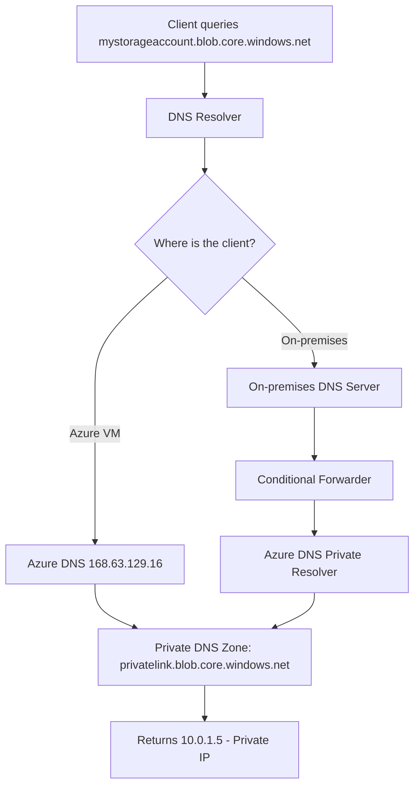

# How to Configure Azure Private Endpoint DNS Zones for Hybrid Network Name Resolution

Author: [nawazdhandala](https://www.github.com/nawazdhandala)

Tags: Azure, Private Endpoints, DNS, Hybrid Networking, Name Resolution, Private Link, Azure DNS

Description: A practical guide to configuring DNS zones for Azure Private Endpoints in hybrid environments where both Azure and on-premises workloads need to resolve private endpoint addresses.

---

Private Endpoints give your Azure services a private IP address inside your virtual network, keeping traffic off the public internet. That is the easy part. The hard part is DNS. When you create a Private Endpoint for a storage account, your applications need to resolve `mystorageaccount.blob.core.windows.net` to the private IP (like 10.0.1.5) instead of the public IP. Making this work consistently across Azure VMs, on-premises servers, and developer workstations in a hybrid environment is one of the most common pain points I see teams struggle with.

In this post, I will walk through the DNS architecture for Private Endpoints in a hybrid network, covering Azure Private DNS Zones, DNS forwarding, and the specific configurations needed to make everything resolve correctly.

## How Private Endpoint DNS Works

When you create a Private Endpoint, Azure creates a network interface with a private IP in your subnet. But the FQDN of the service (like `mystorageaccount.blob.core.windows.net`) still resolves to the public IP by default. You need to override this resolution so that clients resolve the FQDN to the private IP instead.

Azure handles this through a DNS zone hierarchy:



The key concept: Azure creates a CNAME chain. When you query `mystorageaccount.blob.core.windows.net`, it returns a CNAME to `mystorageaccount.privatelink.blob.core.windows.net`. If you have a Private DNS Zone for `privatelink.blob.core.windows.net` linked to your VNet, the Azure DNS resolver returns the private IP. If not, the CNAME resolves through public DNS to the public IP.

## Step 1: Create Private DNS Zones

Each Azure service type has its own Private DNS zone name. Here are the most common ones:

| Service | Private DNS Zone |
|---------|-----------------|
| Blob Storage | privatelink.blob.core.windows.net |
| Azure SQL | privatelink.database.windows.net |
| Key Vault | privatelink.vaultcore.azure.net |
| Azure Container Registry | privatelink.azurecr.io |
| Azure Web Apps | privatelink.azurewebsites.net |
| Cosmos DB | privatelink.documents.azure.com |
| Event Hub | privatelink.servicebus.windows.net |

Let us create the zones for the services you are using. This script creates Private DNS zones for the most common service types:

```bash
# Resource group for DNS zones (centralized management)
RG_DNS="rg-dns-zones"
az group create --name $RG_DNS --location eastus

# Create Private DNS zones for commonly used services
ZONES=(
    "privatelink.blob.core.windows.net"
    "privatelink.file.core.windows.net"
    "privatelink.queue.core.windows.net"
    "privatelink.table.core.windows.net"
    "privatelink.database.windows.net"
    "privatelink.vaultcore.azure.net"
    "privatelink.azurecr.io"
    "privatelink.azurewebsites.net"
)

for ZONE in "${ZONES[@]}"; do
    echo "Creating zone: $ZONE"
    az network private-dns zone create \
        --resource-group $RG_DNS \
        --name "$ZONE"
done
```

## Step 2: Link Private DNS Zones to Virtual Networks

Private DNS zones need to be linked to the virtual networks where your workloads run. When a VM in a linked VNet makes a DNS query, Azure DNS will consult the Private DNS zone.

This links all the zones to your hub virtual network:

```bash
# Link each zone to the hub VNet (where DNS resolution happens)
VNET_ID="/subscriptions/<sub-id>/resourceGroups/rg-networking/providers/Microsoft.Network/virtualNetworks/vnet-hub"

for ZONE in "${ZONES[@]}"; do
    # Create the VNet link with auto-registration disabled
    # Auto-registration is for VM DNS records, not needed for Private Endpoints
    az network private-dns link vnet create \
        --resource-group $RG_DNS \
        --zone-name "$ZONE" \
        --name "link-vnet-hub" \
        --virtual-network "$VNET_ID" \
        --registration-enabled false
done

# If you have spoke VNets, link those too
SPOKE_VNET_ID="/subscriptions/<sub-id>/resourceGroups/rg-networking/providers/Microsoft.Network/virtualNetworks/vnet-spoke-prod"

for ZONE in "${ZONES[@]}"; do
    az network private-dns link vnet create \
        --resource-group $RG_DNS \
        --zone-name "$ZONE" \
        --name "link-vnet-spoke-prod" \
        --virtual-network "$SPOKE_VNET_ID" \
        --registration-enabled false
done
```

## Step 3: Create Private Endpoints with DNS Zone Integration

When creating Private Endpoints, you can automatically register DNS records in the Private DNS zone. This is the recommended approach.

This creates a Private Endpoint for a storage account and registers the DNS record automatically:

```bash
# Create a Private Endpoint for a Blob Storage account
az network private-endpoint create \
    --name pe-storage-prod \
    --resource-group rg-production \
    --vnet-name vnet-hub \
    --subnet snet-private-endpoints \
    --private-connection-resource-id "/subscriptions/<sub-id>/resourceGroups/rg-production/providers/Microsoft.Storage/storageAccounts/stproddata" \
    --group-id blob \
    --connection-name storage-prod-connection

# Register the DNS record in the Private DNS zone
az network private-endpoint dns-zone-group create \
    --resource-group rg-production \
    --endpoint-name pe-storage-prod \
    --name default \
    --private-dns-zone "/subscriptions/<sub-id>/resourceGroups/rg-dns-zones/providers/Microsoft.Network/privateDnsZones/privatelink.blob.core.windows.net" \
    --zone-name blob
```

The `dns-zone-group` command is the magic piece. It creates a DNS zone group on the Private Endpoint that automatically manages the A record in the Private DNS zone. When the endpoint is created, the record is added. When it is deleted, the record is removed.

## Step 4: Set Up DNS Forwarding for On-Premises Resolution

This is where hybrid gets tricky. Your on-premises servers need to resolve `mystorageaccount.blob.core.windows.net` to the private IP too, but they do not use Azure DNS. You need to set up DNS forwarding from your on-premises DNS servers to Azure.

The recommended approach is to use Azure DNS Private Resolver, which provides inbound and outbound DNS endpoints in your VNet.

This creates a DNS Private Resolver with inbound and outbound endpoints:

```bash
# Create Azure DNS Private Resolver in the hub VNet
az dns-resolver create \
    --name dnspr-hub \
    --resource-group rg-networking \
    --location eastus \
    --id "/subscriptions/<sub-id>/resourceGroups/rg-networking/providers/Microsoft.Network/virtualNetworks/vnet-hub"

# Create an inbound endpoint (on-premises DNS forwards TO this)
az dns-resolver inbound-endpoint create \
    --name inbound-endpoint \
    --resource-group rg-networking \
    --dns-resolver-name dnspr-hub \
    --location eastus \
    --ip-configurations "[{\"privateIpAllocationMethod\":\"Dynamic\",\"subnet\":{\"id\":\"/subscriptions/<sub-id>/resourceGroups/rg-networking/providers/Microsoft.Network/virtualNetworks/vnet-hub/subnets/snet-dns-inbound\"}}]"

# Get the inbound endpoint IP address
az dns-resolver inbound-endpoint show \
    --name inbound-endpoint \
    --resource-group rg-networking \
    --dns-resolver-name dnspr-hub \
    --query "ipConfigurations[0].privateIpAddress" -o tsv
```

The inbound endpoint gets a private IP in your VNet. This is the IP address you will configure as the forwarding target on your on-premises DNS servers.

## Step 5: Configure On-Premises DNS Forwarding

On your on-premises DNS servers (Windows DNS, BIND, or whatever you use), create conditional forwarders for each `privatelink.*` zone that point to the inbound endpoint IP.

For Windows DNS Server, here is the PowerShell configuration. This creates conditional forwarders for Private Endpoint DNS zones pointing to the Azure DNS Private Resolver:

```powershell
# Azure DNS Private Resolver inbound endpoint IP
$AzureDnsResolverIP = "10.0.4.4"

# List of privatelink zones to forward
$PrivateLinkZones = @(
    "privatelink.blob.core.windows.net",
    "privatelink.file.core.windows.net",
    "privatelink.queue.core.windows.net",
    "privatelink.table.core.windows.net",
    "privatelink.database.windows.net",
    "privatelink.vaultcore.azure.net",
    "privatelink.azurecr.io",
    "privatelink.azurewebsites.net"
)

# Create conditional forwarders on the on-premises DNS server
foreach ($zone in $PrivateLinkZones) {
    Add-DnsServerConditionalForwarderZone `
        -Name $zone `
        -MasterServers $AzureDnsResolverIP `
        -ReplicationScope "Forest"

    Write-Output "Created conditional forwarder for $zone"
}
```

For BIND DNS servers, add the following to your named.conf. These forward declarations send queries for Private Link zones to the Azure DNS resolver:

```
// Forward privatelink zones to Azure DNS Private Resolver
zone "privatelink.blob.core.windows.net" {
    type forward;
    forward only;
    forwarders { 10.0.4.4; };
};

zone "privatelink.database.windows.net" {
    type forward;
    forward only;
    forwarders { 10.0.4.4; };
};

zone "privatelink.vaultcore.azure.net" {
    type forward;
    forward only;
    forwarders { 10.0.4.4; };
};
```

## Step 6: Configure Outbound DNS Forwarding (Azure to On-Premises)

If your Azure workloads need to resolve on-premises DNS names, set up outbound forwarding through the DNS Private Resolver.

This creates an outbound endpoint and forwarding rules:

```bash
# Create an outbound endpoint
az dns-resolver outbound-endpoint create \
    --name outbound-endpoint \
    --resource-group rg-networking \
    --dns-resolver-name dnspr-hub \
    --location eastus \
    --id "/subscriptions/<sub-id>/resourceGroups/rg-networking/providers/Microsoft.Network/virtualNetworks/vnet-hub/subnets/snet-dns-outbound"

# Create a forwarding ruleset
az dns-resolver forwarding-ruleset create \
    --name frs-onprem-forwarding \
    --resource-group rg-networking \
    --location eastus \
    --outbound-endpoints "[{\"id\":\"/subscriptions/<sub-id>/resourceGroups/rg-networking/providers/Microsoft.Network/dnsResolvers/dnspr-hub/outboundEndpoints/outbound-endpoint\"}]"

# Add a forwarding rule for your on-premises domain
az dns-resolver forwarding-rule create \
    --name rule-corp-domain \
    --resource-group rg-networking \
    --ruleset-name frs-onprem-forwarding \
    --domain-name "corp.yourcompany.com." \
    --forwarding-rule-state Enabled \
    --target-dns-servers "[{\"ipAddress\":\"192.168.1.10\",\"port\":53}]"
```

## Step 7: Verify DNS Resolution

Test resolution from different locations to make sure everything is working.

From an Azure VM in the linked VNet:

```bash
# This should return the private IP address
nslookup stproddata.blob.core.windows.net

# You should see a CNAME to stproddata.privatelink.blob.core.windows.net
# and an A record with the private IP (e.g., 10.0.1.5)
```

From an on-premises machine:

```bash
# This should also return the private IP address via the forwarding chain
nslookup stproddata.blob.core.windows.net

# If it returns a public IP, the conditional forwarder is not working
```

## Common Pitfalls

**Forgetting to link the DNS zone to a VNet.** The Private DNS zone must be linked to every VNet where resources need to resolve private endpoints. In a hub-and-spoke topology, link to both the hub and all spokes.

**Split-brain DNS for VPN/ExpressRoute clients.** VPN clients and ExpressRoute-connected servers may use different DNS resolvers depending on how the connection is configured. Test from each connectivity path.

**Missing zones for sub-resources.** Some services need multiple zones. For example, Storage accounts need separate zones for blob, file, queue, and table endpoints if you create private endpoints for each.

**TTL caching on on-premises DNS.** If you create a Private Endpoint and the on-premises DNS has cached the public IP, clients will continue using the public IP until the TTL expires. Plan for this during migration.

## Wrapping Up

DNS is the piece that makes or breaks a Private Endpoint deployment, especially in hybrid environments. The architecture itself is not complicated - Private DNS zones for resolution within Azure, DNS Private Resolver for the bridge between Azure and on-premises, and conditional forwarders on the on-premises side. But every piece needs to be in place and correctly configured. Take the time to plan your DNS zones, document your forwarding rules, and test from every connectivity path in your environment. Getting this right means your private endpoints work seamlessly whether the request comes from an Azure VM, an on-premises server, or a VPN-connected laptop.
