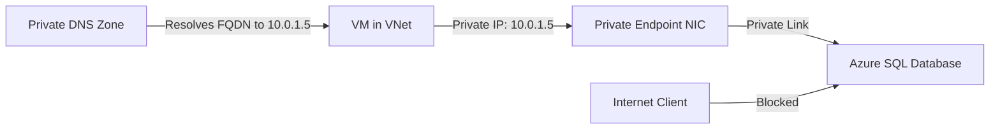

# How to Configure Azure Private Endpoint for Azure SQL Database

Author: [nawazdhandala](https://www.github.com/nawazdhandala)

Tags: Azure, Private Endpoint, Azure SQL, Networking, Security, Private Link, Database

Description: Step-by-step guide to configuring Azure Private Endpoint for Azure SQL Database to secure database access over a private network connection.

---

If you have ever dealt with securing database connections in Azure, you know that public endpoints can be a headache. Any time your Azure SQL Database is accessible over the internet, you are one misconfigured firewall rule away from a security incident. Azure Private Endpoint solves this by bringing Azure SQL Database traffic entirely onto your virtual network, removing exposure to the public internet.

In this guide, I will walk through the full process of setting up a Private Endpoint for Azure SQL Database - from prerequisites to DNS configuration to testing.

## What is Azure Private Endpoint?

Azure Private Endpoint is a network interface that connects you privately and securely to a service powered by Azure Private Link. The endpoint gets assigned a private IP address from your VNet subnet, effectively bringing the Azure service into your virtual network.

For Azure SQL Database, this means your SQL traffic never leaves the Microsoft backbone network. Instead of connecting to a public IP like `yourserver.database.windows.net` resolving to a public address, the DNS resolves to a private IP inside your VNet.

## Why Use Private Endpoints for Azure SQL?

There are several practical reasons to go this route:

- **No public internet exposure.** The SQL Database becomes accessible only from your VNet or peered networks.
- **Simplified network security.** You do not need to worry about SQL firewall rules for IP whitelisting.
- **Cross-region private access.** Private Endpoints work across regions, so a VM in West US can connect privately to a SQL Database in East US.
- **Compliance requirements.** Many regulatory frameworks require data to stay on private networks. Private Endpoint helps meet those requirements.

## Prerequisites

Before getting started, make sure you have the following:

1. An Azure subscription with permissions to create network resources
2. An existing Azure SQL Server and database
3. A Virtual Network with at least one subnet (not delegated to another service)
4. Azure CLI installed or access to the Azure Portal

## Step 1: Create the Private Endpoint

Using Azure CLI, you can create the Private Endpoint in a single command. First, let us get the resource ID of the SQL Server.

The following script retrieves the SQL Server resource ID and creates a Private Endpoint in the specified subnet:

```bash
# Get the resource ID of the Azure SQL Server
SQL_SERVER_ID=$(az sql server show \
  --resource-group myResourceGroup \
  --name mysqlserver \
  --query id \
  --output tsv)

# Create the Private Endpoint in the target subnet
az network private-endpoint create \
  --name mySQL-PE \
  --resource-group myResourceGroup \
  --vnet-name myVNet \
  --subnet mySubnet \
  --private-connection-resource-id $SQL_SERVER_ID \
  --group-id sqlServer \
  --connection-name mySQLConnection
```

The `--group-id sqlServer` parameter tells Azure which sub-resource you want to connect to. For Azure SQL Database, this is always `sqlServer`.

## Step 2: Configure Private DNS Zone

This is the part that trips up most people. After creating the Private Endpoint, you need DNS to resolve the SQL Server FQDN to the private IP address instead of the public one.

Azure provides a Private DNS Zone for this purpose. Here is how to set it up:

```bash
# Create the Private DNS Zone for Azure SQL
az network private-dns zone create \
  --resource-group myResourceGroup \
  --name privatelink.database.windows.net

# Link the DNS zone to your VNet
az network private-dns link vnet create \
  --resource-group myResourceGroup \
  --zone-name privatelink.database.windows.net \
  --name myDNSLink \
  --virtual-network myVNet \
  --registration-enabled false

# Create the DNS zone group for automatic record management
az network private-endpoint dns-zone-group create \
  --resource-group myResourceGroup \
  --endpoint-name mySQL-PE \
  --name myZoneGroup \
  --private-dns-zone privatelink.database.windows.net \
  --zone-name privatelink-database-windows-net
```

The DNS zone group is important because it automatically creates and updates the A record in the Private DNS Zone whenever the Private Endpoint IP changes. Without it, you would need to manage DNS records manually.

## Step 3: Disable Public Network Access

Once the Private Endpoint is working, you should disable public access to your SQL Server. This ensures all connections must go through the Private Endpoint.

```bash
# Disable public network access on the SQL Server
az sql server update \
  --resource-group myResourceGroup \
  --name mysqlserver \
  --public-network-access Disabled
```

After running this, any attempt to connect from outside the VNet will be rejected. This includes connections from the Azure Portal query editor, so keep that in mind.

## Step 4: Verify DNS Resolution

From a VM inside the same VNet (or a peered VNet), verify that the SQL Server FQDN resolves to the private IP:

```bash
# Check DNS resolution from within the VNet
nslookup mysqlserver.database.windows.net
```

You should see something like this:

```
Name:    mysqlserver.privatelink.database.windows.net
Address: 10.0.1.5
Aliases: mysqlserver.database.windows.net
```

The key indicator is that the address returned is a private IP from your subnet range, not a public Azure IP.

## Step 5: Test the Connection

From a VM inside your VNet, use `sqlcmd` or any SQL client to connect:

```bash
# Test SQL connectivity using sqlcmd
sqlcmd -S mysqlserver.database.windows.net -U sqladmin -P 'YourPassword' -d myDatabase -Q "SELECT 1"
```

If everything is configured correctly, the query should return successfully.

## Understanding the Network Flow

Here is a diagram showing how traffic flows when using Private Endpoint:



The VM resolves the SQL Server FQDN through the Private DNS Zone, gets the private IP, and connects directly through the Private Endpoint NIC. Internet clients are blocked entirely when public access is disabled.

## Handling Hybrid Scenarios

If you have on-premises servers connecting to Azure SQL through ExpressRoute or VPN, you need to configure DNS forwarding. Your on-premises DNS server must forward queries for `privatelink.database.windows.net` to Azure DNS (168.63.129.16) through a DNS forwarder VM or Azure DNS Private Resolver in your VNet.

The forwarding chain looks like this:

1. On-premises server queries `mysqlserver.database.windows.net`
2. On-premises DNS forwards to Azure DNS forwarder
3. Azure DNS resolves through the Private DNS Zone
4. Returns private IP to on-premises server
5. Traffic routes through ExpressRoute/VPN to the Private Endpoint

Without this DNS setup, on-premises servers will resolve the public IP and fail to connect when public access is disabled.

## Common Issues and Troubleshooting

**Connection times out from VNet VM.** Check the NSG on the subnet hosting the Private Endpoint. Make sure outbound traffic on port 1433 is allowed. Also verify that the subnet does not have a service endpoint for `Microsoft.Sql` - that can conflict with Private Endpoint.

**DNS resolves to public IP.** This usually means the Private DNS Zone is not linked to the VNet or the zone group was not created. Run `az network private-dns link vnet list` to check.

**Cannot connect from peered VNet.** The Private DNS Zone must be linked to every VNet that needs to resolve the private IP. Create additional VNet links for each peered network.

**Azure Portal query editor does not work.** This is expected when public access is disabled. Use Azure Data Studio or SSMS from a VM inside the VNet instead.

## Cost Considerations

Private Endpoints are not free. You pay for the endpoint itself (per hour) plus data processing charges for traffic flowing through the endpoint. As of early 2026, the cost is roughly $0.01 per hour for the endpoint and $0.01 per GB processed. For most workloads, this adds a modest but manageable cost compared to the security benefits.

## Wrapping Up

Setting up Azure Private Endpoint for SQL Database is straightforward once you understand the three pieces: the endpoint itself, DNS resolution, and disabling public access. The DNS piece is where most mistakes happen, so double-check your Private DNS Zone links and zone groups.

For production environments, I strongly recommend combining Private Endpoints with Azure SQL auditing and Azure Monitor alerts so you can track who is connecting and catch any issues early. The combination of Private Endpoint plus disabled public access gives you a solid security posture that satisfies most compliance requirements while keeping the operational overhead low.
