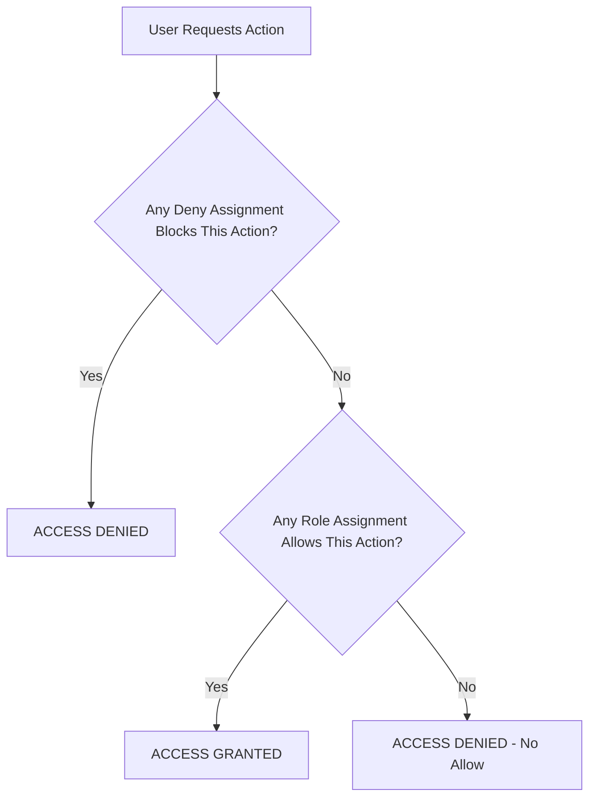

# How to Configure Azure RBAC Deny Assignments to Restrict Specific Actions on Resources

Author: [nawazdhandala](https://www.github.com/nawazdhandala)

Tags: Azure RBAC, Deny Assignments, Access Control, Security, Governance, Azure Policy, Cloud Security

Description: Understand how Azure RBAC deny assignments work and how to use them to block specific actions even for users with broad role assignments.

---

Azure RBAC (Role-Based Access Control) is an allow-based system. You grant roles that give users permission to perform actions, and anything not explicitly allowed is denied by default. But what happens when you want to grant someone broad permissions while explicitly blocking a specific action? That is where deny assignments come in.

Deny assignments are the flip side of role assignments. They block specific actions on a resource, and they take precedence over any allow role assignments. If a user has Contributor access to a resource group but a deny assignment blocks `Microsoft.Compute/virtualMachines/delete`, they can manage everything in that resource group except delete VMs.

This guide covers how deny assignments work, where they come from, and how to use them effectively in your governance strategy.

## How Deny Assignments Work

Azure evaluates access in this order:

1. Check deny assignments first
2. Then check role assignments
3. If a deny assignment blocks the action, access is denied regardless of any allow role assignments



This evaluation order means deny assignments are extremely powerful. They override everything, including Owner role assignments. The only exception is that deny assignments do not apply to actions performed by the resource provider itself (system-level operations).

## Important: How Deny Assignments Are Created

Here is something that trips up a lot of people: **you cannot create deny assignments directly through the Azure portal, CLI, or ARM templates.** Deny assignments are created by Azure itself as part of specific features:

- **Azure Blueprints**: When you mark a resource as "locked" in a Blueprint, Azure creates deny assignments to prevent modifications
- **Azure Managed Applications**: The publisher of a managed application can create deny assignments to protect the managed resources
- **Azure Lighthouse**: Cross-tenant management scenarios can include deny assignments

For custom governance scenarios, you typically use **Azure Policy** with the `deny` effect to achieve similar results, or you use Azure Blueprints to create deny assignments on specific resources.

Let me walk through both approaches.

## Approach 1: Using Azure Blueprints for Deny Assignments

Azure Blueprints can create deny assignments that lock specific resources from modification. This is useful for protecting core infrastructure that should never be changed by regular users.

### Create a Blueprint with Resource Locks

```bash
# Create a blueprint definition
az blueprint create \
  --name "CoreInfraProtection" \
  --target-scope "subscription" \
  --description "Protects core infrastructure resources from modification"

# Add a resource group artifact with lock mode
az blueprint resource-group add \
  --blueprint-name "CoreInfraProtection" \
  --artifact-name "CoreNetworkRG" \
  --display-name "Core Network Resource Group" \
  --rg-name "core-network-rg" \
  --rg-location "eastus"
```

When you publish and assign the blueprint, choose one of the lock modes:

- **Don't Lock**: No deny assignments are created
- **Do Not Delete**: Creates a deny assignment that blocks delete operations
- **Read Only**: Creates a deny assignment that blocks all write and delete operations

```bash
# Publish the blueprint
az blueprint publish \
  --blueprint-name "CoreInfraProtection" \
  --version "1.0"

# Assign the blueprint with a lock mode
az blueprint assignment create \
  --name "protect-core-infra" \
  --blueprint-version "/providers/Microsoft.Blueprint/blueprints/CoreInfraProtection/versions/1.0" \
  --location "eastus" \
  --lock-mode "DoNotDelete" \
  --identity-type SystemAssigned
```

After assignment, Azure creates deny assignments on all resources managed by the blueprint. You can view them in the portal under the resource's Access Control (IAM) > Deny assignments tab.

### View Deny Assignments

```bash
# List deny assignments at a specific scope
az rest --method GET \
  --url "https://management.azure.com/subscriptions/YOUR_SUB/resourceGroups/core-network-rg/providers/Microsoft.Authorization/denyAssignments?api-version=2022-04-01" \
  --query 'value[].{name: denyAssignmentName, scope: scope, actions: permissions[0].actions}'
```

The output shows which actions are denied and at what scope. Blueprint-created deny assignments typically block broad action categories like `*/write` and `*/delete`.

## Approach 2: Using Azure Policy for Deny Effects

While Azure Policy does not create deny assignments per se, the `deny` effect achieves the same practical result - blocking specific actions on resources that match your conditions.

### Block VM Deletion in Production

Here is a custom policy definition that prevents deletion of VMs tagged as production.

```json
{
  "mode": "All",
  "policyRule": {
    "if": {
      "allOf": [
        {
          "field": "type",
          "equals": "Microsoft.Compute/virtualMachines"
        },
        {
          "field": "tags.environment",
          "equals": "production"
        }
      ]
    },
    "then": {
      "effect": "deny"
    }
  },
  "parameters": {}
}
```

Wait - this policy denies all operations on production VMs, not just deletion. To deny only deletion, you need to use the `deny` effect with the request type condition.

Unfortunately, Azure Policy's `deny` effect does not natively distinguish between create, update, and delete operations in the same way deny assignments do. For operation-specific blocking, you need a different approach.

### Block Specific Operations with Policy

To block only delete operations, use the audit-based approach combined with resource locks, or use a more targeted policy.

```json
{
  "mode": "All",
  "policyRule": {
    "if": {
      "allOf": [
        {
          "field": "type",
          "equals": "Microsoft.Compute/virtualMachines"
        },
        {
          "field": "tags.environment",
          "equals": "production"
        }
      ]
    },
    "then": {
      "effect": "denyAction",
      "details": {
        "actionNames": [
          "delete"
        ]
      }
    }
  }
}
```

The `denyAction` effect (available in newer API versions) lets you target specific operations. This blocks deletion of production-tagged VMs while still allowing updates and other management operations.

Create and assign this policy.

```bash
# Create the custom policy definition
az policy definition create \
  --name "deny-prod-vm-deletion" \
  --display-name "Deny deletion of production VMs" \
  --description "Prevents deletion of VMs tagged with environment=production" \
  --rules @policy-rule.json \
  --mode All

# Assign the policy at the subscription level
az policy assignment create \
  --name "deny-prod-vm-deletion" \
  --policy "deny-prod-vm-deletion" \
  --scope "/subscriptions/YOUR_SUB"
```

## Viewing Deny Assignments on a Resource

To see what deny assignments affect a specific resource, use the IAM blade in the portal or the REST API.

```bash
# List deny assignments that affect a specific resource
az rest --method GET \
  --url "https://management.azure.com/subscriptions/YOUR_SUB/resourceGroups/core-network-rg/providers/Microsoft.Network/virtualNetworks/core-vnet/providers/Microsoft.Authorization/denyAssignments?api-version=2022-04-01"
```

Each deny assignment includes:
- **DenyAssignmentName**: Human-readable name
- **Permissions**: List of actions that are denied and excluded from denial
- **Principals**: Which users or groups the deny applies to
- **ExcludePrincipals**: Users or groups excluded from the deny (typically the Blueprint service principal)
- **Scope**: Where the deny applies
- **IsSystemProtected**: Whether the deny was created by Azure and cannot be modified

## Understanding Deny Assignment Exclusions

Deny assignments can exclude specific principals, which is how administrative override works. For example, a Blueprint deny assignment might exclude the Blueprint service principal and a break-glass admin group.

```json
{
  "denyAssignmentName": "Blueprint Lock - DoNotDelete",
  "permissions": [
    {
      "actions": ["*/delete"],
      "notActions": [],
      "dataActions": [],
      "notDataActions": []
    }
  ],
  "principals": [
    {
      "type": "Everyone"
    }
  ],
  "excludePrincipals": [
    {
      "objectId": "blueprint-service-principal-id",
      "type": "ServicePrincipal"
    },
    {
      "objectId": "break-glass-group-id",
      "type": "Group"
    }
  ]
}
```

This structure blocks deletion for everyone except the Blueprint service principal and the break-glass admin group.

## Practical Governance Patterns

Here are some patterns I have seen work well in production environments.

### Pattern 1: Protect Network Infrastructure

Use Blueprints with Read Only lock on your hub virtual network, VPN gateways, and ExpressRoute circuits. This prevents accidental modifications that could bring down connectivity for the entire organization.

### Pattern 2: Prevent Subscription-Level Changes

Deny modifications to subscription-level settings like diagnostic settings, activity log exports, and security center configurations. This ensures compliance infrastructure stays intact even if someone has Owner access.

### Pattern 3: Protect Audit Logging

Use deny assignments on your Log Analytics workspace and storage accounts used for audit logs. This prevents anyone from deleting audit evidence, which is a common compliance requirement.

### Pattern 4: Immutable Backups

Create deny assignments on backup vaults and recovery services vaults to prevent deletion of backup data. This protects against ransomware scenarios where attackers try to delete backups before encrypting production data.

## Limitations

- Deny assignments cannot be created directly through the API by regular users. They are system-managed features.
- You can have up to 500 deny assignments per tenant.
- Deny assignments do not appear in the standard `az role assignment list` output. You need to specifically query for deny assignments.
- Removing a Blueprint assignment removes the associated deny assignments, which could create a security gap if not handled carefully.

## Wrapping Up

Azure RBAC deny assignments are a powerful governance mechanism for protecting critical resources from modification, even by users with broad permissions. While you cannot create them directly, Azure Blueprints and Managed Applications give you the tools to deploy them where needed. For action-level blocking without deny assignments, Azure Policy with the `denyAction` effect is an increasingly capable alternative. Use these tools together to build a defense-in-depth access control strategy that protects your most important resources.
