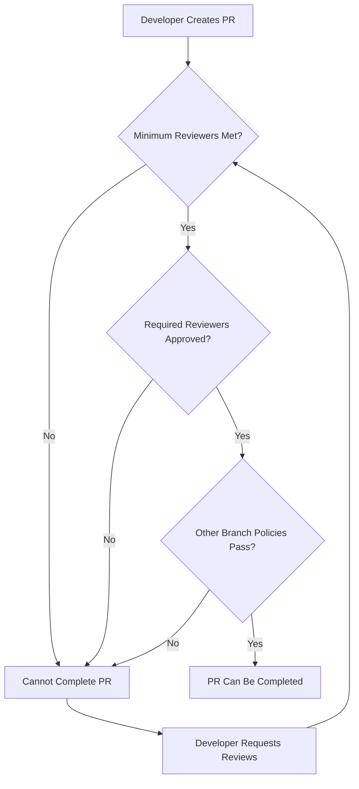

# How to Configure Azure Repos Required Reviewers and Automatic Reviewer Assignment Policies

Author: [nawazdhandala](https://www.github.com/nawazdhandala)

Tags: Azure Repos, Code Review, Branch Policies, Pull Requests, Azure DevOps, DevOps, Git

Description: Learn how to set up required reviewers and automatic reviewer assignment policies in Azure Repos to enforce code review standards on pull requests.

---

Code review is one of the most effective practices for maintaining code quality, but it only works if it actually happens. Left to convention and good intentions, reviews get skipped when deadlines are tight. Azure Repos branch policies formalize the review process by requiring specific reviewers on pull requests and automatically assigning the right people based on what files are changing.

In this post, I will cover how to configure required reviewers, set up automatic reviewer assignment based on file paths, use code owner files, and design review policies that balance thoroughness with development velocity.

## Branch Policy Basics

Branch policies in Azure Repos are rules applied to specific branches (typically `main` or `develop`) that control what conditions must be met before a pull request can be completed. Review-related policies include:

- Minimum number of reviewers
- Required specific reviewers
- Automatically included reviewers based on file paths
- Reset reviewer votes when changes are pushed
- Allow or disallow requestors to approve their own changes

All of these are configured in Project Settings under Repos, then Policies.

## Setting the Minimum Reviewer Count

The most basic review policy requires a minimum number of approvals before a PR can be merged:

1. Go to Project Settings, then Repositories
2. Select the repository
3. Click on Policies, then select the branch (e.g., `main`)
4. Under "Require a minimum number of reviewers," enable the policy
5. Set the minimum count (typically 1 or 2)

Additional options include:

- **Allow requestors to approve their own changes**: Usually disabled - self-approvals defeat the purpose of code review
- **Prohibit the most recent pusher from approving their changes**: Prevents the last person who pushed code from being one of the approvers
- **Allow completion even if some reviewers vote "Wait" or "Reject"**: Usually disabled - if someone explicitly objects, the discussion should happen before merging
- **Reset all approval votes when there are new changes**: Important for ensuring reviewers see the final version of the code, not just an earlier draft



## Configuring Required Reviewers

Sometimes you need specific people to review certain changes, regardless of the minimum reviewer count. Required reviewers must approve the PR - it cannot be merged without their sign-off.

To add required reviewers:

1. In the branch policies section, scroll to "Automatically included reviewers"
2. Click "Add" to create a new reviewer policy
3. Configure:
   - **Reviewers**: Select the user or group
   - **For pull requests affecting these folders**: Optionally restrict to specific file paths
   - **Required**: Toggle on to make the review mandatory (vs. optional)
   - **Allow requestors to approve their own changes**: Per-reviewer override

Here are some common required reviewer configurations:

### Security Team Review for Auth Changes

```
Reviewer: Security Team (group)
Path filter: /src/auth/*; /src/security/*; /config/auth*
Required: Yes
Message: "Security team must review all authentication and authorization changes"
```

### DBA Review for Database Migrations

```
Reviewer: Database Admins (group)
Path filter: /migrations/*; /src/database/schema/*; *.sql
Required: Yes
Message: "DBA team must review all database schema changes"
```

### DevOps Review for Infrastructure Changes

```
Reviewer: DevOps Team (group)
Path filter: /infrastructure/*; /terraform/*; *.bicep; azure-pipelines.yml
Required: Yes
Message: "DevOps team must review infrastructure and pipeline changes"
```

### API Review for Contract Changes

```
Reviewer: API Design Group
Path filter: /src/api/contracts/*; /openapi/*; *.swagger.json
Required: Yes
Message: "API design team must review contract changes"
```

## Path-Based Automatic Reviewer Assignment

The path filter is one of the most powerful features. It lets you assign reviewers based on which files the PR touches. This means the right experts are automatically pulled into reviews without manual effort.

Path filters support:
- Exact paths: `/src/auth/login.ts`
- Wildcards: `/src/auth/*`
- File extensions: `*.sql`
- Multiple paths separated by semicolons: `/src/api/*; /src/models/*`
- Negation with `!`: `/src/*; !/src/tests/*` (matches src but not tests)

```
# Example: Different teams review different parts of the codebase
Frontend Team    -> /src/frontend/*; /src/components/*; *.css; *.html
Backend Team     -> /src/api/*; /src/services/*; /src/models/*
Data Team        -> /src/data/*; /src/pipelines/*; *.sql
Platform Team    -> /infrastructure/*; /docker/*; Dockerfile; *.yml
```

## Using CODEOWNERS-Style Configuration

While Azure Repos does not have a native CODEOWNERS file like GitHub, you can achieve the same effect through the automatically included reviewers feature. Set up one reviewer policy per team/path combination.

For larger organizations, manage this through the REST API to keep it version-controlled:

```python
import requests

# Azure DevOps API configuration
org = "myorganization"
project = "myproject"
repo_id = "my-repo-id"
pat = "your-pat"
auth = ("", pat)

base_url = f"https://dev.azure.com/{org}/{project}/_apis"

# Define code ownership rules
ownership_rules = [
    {
        "path": "/src/frontend",
        "reviewers": ["frontend-team-id"],
        "required": True,
        "message": "Frontend team review required"
    },
    {
        "path": "/src/api",
        "reviewers": ["backend-team-id"],
        "required": True,
        "message": "Backend team review required"
    },
    {
        "path": "/infrastructure",
        "reviewers": ["devops-team-id"],
        "required": True,
        "message": "DevOps review required for infra changes"
    }
]

# Create reviewer policies via the API
for rule in ownership_rules:
    policy_config = {
        "isEnabled": True,
        "isBlocking": rule["required"],
        "type": {
            "id": "fd2167ab-b0d6-447e-a6e9-c5ab7f5f8a33"  # Required reviewer policy type ID
        },
        "settings": {
            "requiredReviewerIds": rule["reviewers"],
            "filenamePatterns": [f"{rule['path']}/*"],
            "addedFilesOnly": False,
            "message": rule["message"],
            "scope": [
                {
                    "repositoryId": repo_id,
                    "refName": "refs/heads/main",
                    "matchKind": "Exact"
                }
            ]
        }
    }

    response = requests.post(
        f"{base_url}/policy/configurations?api-version=7.1",
        auth=auth,
        json=policy_config
    )
    print(f"Created policy for {rule['path']}: {response.status_code}")
```

## Vote Reset Policies

When a reviewer approves a PR and then the author pushes new changes, should the approval still count? This is configurable:

- **Reset all votes on new pushes**: Strictest option. Any push resets all approvals, requiring re-review. Good for critical branches.
- **Reset votes of approvers who approved older iterations**: Only resets votes from reviewers who approved before the latest push. Reviewers who have not voted yet are unaffected.
- **Do not reset votes**: Most lenient. Once approved, the approval sticks regardless of subsequent changes.

For most teams, "Reset votes of approvers who approved older iterations" is the right balance. It ensures reviewers see the final version but does not force re-review when unrelated minor changes are pushed.

## Review Completion Workflow

Here is how a well-configured review workflow plays out:

1. Developer creates a PR from their feature branch to `main`
2. Azure Repos automatically assigns reviewers based on the files changed:
   - Frontend files changed? Frontend team is added
   - Database migration included? DBA team is added
   - CI/CD config modified? DevOps team is added
3. The PR shows which reviewers are required and which are optional
4. Required reviewers get email notifications
5. Reviewers provide feedback: Approve, Approve with suggestions, Wait for author, or Reject
6. If the author pushes new changes, approvals from previous iterations are reset
7. Once all required reviewers have approved and the minimum reviewer count is met, the PR can be completed

## Handling Large Teams and Review Fatigue

Required reviewers can create bottlenecks. If one person is a required reviewer for a large portion of the codebase, they become a blocker. Some strategies to manage this:

**Use groups instead of individuals.** Assign a team group as the required reviewer. Any member of the group can approve, so you are not dependent on one person's availability.

**Set up rotating reviewers.** Some teams rotate who is "on review duty" each week. The entire team is the required group, but the social contract is that the person on rotation handles incoming reviews promptly.

**Use optional reviewers for non-critical paths.** Not every directory needs a required reviewer. Make reviewers optional for stable, well-tested areas and required only for sensitive code.

**Tier your review requirements.** Critical paths (auth, payments, infrastructure) get required reviewers. Everything else gets the minimum reviewer count policy only, and the PR author chooses appropriate reviewers.

## Monitoring Review Metrics

Track review health through Azure DevOps analytics:

- **Review turnaround time**: How long from PR creation to first review?
- **Number of review iterations**: Are PRs going through many rounds of feedback?
- **Reviewer load distribution**: Is review work spread evenly across the team?

These metrics help you tune your policies. If turnaround time is too long, you might need more reviewers in the required group or should consider splitting review responsibilities more granularly.

## Wrapping Up

Azure Repos reviewer policies turn code review from a best practice into a guaranteed process. Path-based automatic assignment ensures the right experts see changes to their area of the codebase. Required reviewers enforce sign-off for critical code paths. Vote reset policies ensure approvals reflect the current state of the code. Configure these policies thoughtfully - too strict and you slow down development, too loose and you miss issues. Start with minimum reviewer counts and path-based assignments, then add required reviewers for your most sensitive code paths.
