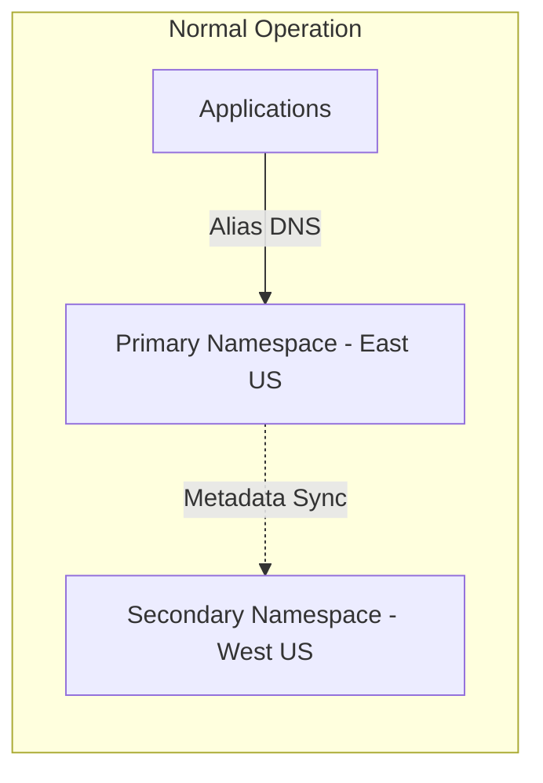
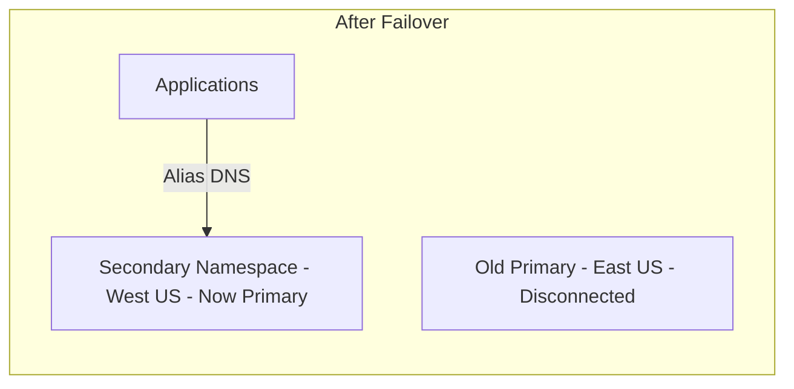

# How to Configure Azure Service Bus Geo-Disaster Recovery

Author: [nawazdhandala](https://www.github.com/nawazdhandala)

Tags: Azure, Service Bus, Disaster Recovery, Geo-Replication, High Availability, Business Continuity, Premium Tier

Description: A hands-on guide to setting up Azure Service Bus Geo-Disaster Recovery for high availability across Azure regions.

---

When your messaging infrastructure goes down, everything downstream stops. Orders stop processing, notifications stop sending, and your integrations grind to a halt. Azure Service Bus Geo-Disaster Recovery (Geo-DR) lets you fail over to a secondary region when the primary region has an outage, keeping your messaging layer available even during regional failures.

## How Geo-DR Works

Azure Service Bus Geo-DR creates a pairing between two Premium tier namespaces in different regions. The primary namespace actively handles all operations. The secondary namespace stays in standby, receiving metadata replication (queue definitions, topic definitions, subscription rules, etc.) but not message data.

When you initiate a failover, the secondary namespace becomes the new primary. The alias DNS record switches to point at the secondary, and applications using the alias automatically start connecting to the new primary. It is important to understand that messages in the old primary are not replicated - only the metadata is.





## Prerequisites

Before you start, you need:

- Two Azure Service Bus Premium tier namespaces in different regions. Geo-DR is a Premium-only feature.
- The secondary namespace must be empty - no queues, topics, or subscriptions. They will be replicated from the primary.
- Both namespaces must have the same number of messaging units.

## Setting Up the Pairing

Let's walk through the setup using the Azure CLI.

First, create both namespaces if they do not already exist.

```bash
# Create the primary namespace in East US
az servicebus namespace create \
  --name sb-myapp-primary \
  --resource-group rg-messaging \
  --location eastus \
  --sku Premium \
  --capacity 1

# Create the secondary namespace in West US (must be empty)
az servicebus namespace create \
  --name sb-myapp-secondary \
  --resource-group rg-messaging \
  --location westus \
  --sku Premium \
  --capacity 1
```

Now create the disaster recovery alias. This is the DNS name your applications will use to connect.

```bash
# Create the Geo-DR pairing with an alias
az servicebus georecovery-alias set \
  --resource-group rg-messaging \
  --namespace-name sb-myapp-primary \
  --alias sb-myapp \
  --partner-namespace "/subscriptions/{sub-id}/resourceGroups/rg-messaging/providers/Microsoft.ServiceBus/namespaces/sb-myapp-secondary"
```

After running this command, the alias `sb-myapp.servicebus.windows.net` will point to the primary namespace, and metadata replication will begin.

## Checking the Pairing Status

Monitor the pairing status to make sure replication is healthy.

```bash
# Check the Geo-DR alias status
az servicebus georecovery-alias show \
  --resource-group rg-messaging \
  --namespace-name sb-myapp-primary \
  --alias sb-myapp \
  --query "{role:role, provisioningState:provisioningState, partnerNamespace:partnerNamespace}"
```

The provisioning state should show `Succeeded` and the role should show `Primary`.

## Updating Your Application Connection Strings

Your applications should connect using the alias, not the primary namespace directly. Get the connection string for the alias.

```bash
# Get the alias connection string
az servicebus georecovery-alias authorization-rule keys list \
  --resource-group rg-messaging \
  --namespace-name sb-myapp-primary \
  --alias sb-myapp \
  --name RootManageSharedAccessKey \
  --query primaryConnectionString \
  --output tsv
```

The connection string will use `sb-myapp.servicebus.windows.net` as the endpoint. When a failover happens, this DNS entry automatically resolves to the new primary.

```csharp
// Use the alias connection string - NOT the direct namespace connection string
var connectionString = "Endpoint=sb://sb-myapp.servicebus.windows.net/;SharedAccessKeyName=RootManageSharedAccessKey;SharedAccessKey=...";

// Your application code stays the same - just use the alias endpoint
var client = new ServiceBusClient(connectionString);
var sender = client.CreateSender("orders");
await sender.SendMessageAsync(new ServiceBusMessage("test"));
```

## Initiating a Failover

When you need to fail over (either because of a real outage or for testing), run the failover command against the secondary namespace.

```bash
# Initiate failover - this promotes the secondary to primary
az servicebus georecovery-alias fail-over \
  --resource-group rg-messaging \
  --namespace-name sb-myapp-secondary \
  --alias sb-myapp
```

After the failover completes, the alias DNS now points to the secondary namespace. The old primary is disconnected from the pairing.

## Setting Up Geo-DR with Bicep

For repeatable infrastructure, here is the Bicep equivalent.

```bicep
// Bicep template for Service Bus Geo-DR setup
param primaryLocation string = 'eastus'
param secondaryLocation string = 'westus'
param aliasName string = 'sb-myapp'

// Primary namespace
resource primaryNamespace 'Microsoft.ServiceBus/namespaces@2022-10-01-preview' = {
  name: 'sb-myapp-primary'
  location: primaryLocation
  sku: {
    name: 'Premium'
    tier: 'Premium'
    capacity: 1
  }
}

// Secondary namespace
resource secondaryNamespace 'Microsoft.ServiceBus/namespaces@2022-10-01-preview' = {
  name: 'sb-myapp-secondary'
  location: secondaryLocation
  sku: {
    name: 'Premium'
    tier: 'Premium'
    capacity: 1
  }
}

// Create queues on the primary (they will replicate to secondary)
resource ordersQueue 'Microsoft.ServiceBus/namespaces/queues@2022-10-01-preview' = {
  parent: primaryNamespace
  name: 'orders'
  properties: {
    maxDeliveryCount: 10
    deadLetteringOnMessageExpiration: true
  }
}

// Geo-DR alias pairing
resource geoAlias 'Microsoft.ServiceBus/namespaces/disasterRecoveryConfigs@2022-10-01-preview' = {
  parent: primaryNamespace
  name: aliasName
  properties: {
    partnerNamespace: secondaryNamespace.id
  }
  dependsOn: [ordersQueue] // Wait for entities to be created first
}
```

## What Gets Replicated and What Does Not

This is the most important thing to understand about Service Bus Geo-DR. Metadata is replicated continuously. Messages are not.

**Replicated (metadata):**
- Queue definitions and settings
- Topic definitions and settings
- Subscription definitions and filters
- Authorization rules
- Correlation filter rules

**Not replicated:**
- Messages currently in queues
- Messages in dead-letter queues
- Scheduled messages
- Sequence numbers
- Message state

This means that during a failover, any messages in the old primary that have not been processed are stranded. If the old region comes back, you can recover them, but during the outage, they are not available.

## Dealing with Message Loss During Failover

Since messages are not replicated, you need a strategy for handling potential message loss. Here are common approaches.

**Accept the loss.** For some workloads, losing a few minutes of messages during a regional outage is acceptable. The messages can be replayed from the source system when things recover.

**Dual-write.** Producers send messages to both the primary and secondary namespaces. Consumers run on the primary only, and you switch consumers to the secondary during a failover. This requires deduplication logic.

**Active-Active with application-level routing.** Run both namespaces as active and partition your workload across them. This is the most resilient but also the most complex approach.

## After the Failover: Re-Pairing

After a failover, the pairing is broken. The old primary is no longer part of the disaster recovery configuration. To re-establish protection:

1. Break the old pairing completely if it has not been broken already.
2. Clear any entities from the old primary namespace (it needs to be empty to become a secondary).
3. Create a new Geo-DR pairing with the old primary as the new secondary.

```bash
# After failover, re-pair with the old primary as secondary
# First, delete all entities from the old primary
# Then create a new alias pairing

az servicebus georecovery-alias set \
  --resource-group rg-messaging \
  --namespace-name sb-myapp-secondary \
  --alias sb-myapp \
  --partner-namespace "/subscriptions/{sub-id}/resourceGroups/rg-messaging/providers/Microsoft.ServiceBus/namespaces/sb-myapp-primary"
```

## Testing Your Failover

You should test failover regularly - at least once a quarter. Run a planned failover during a maintenance window and verify that your applications reconnect automatically through the alias. Check that all queues, topics, and subscriptions are present in the new primary. Then re-pair and fail back.

## Summary

Azure Service Bus Geo-DR provides regional failover for your messaging infrastructure, but it is not magic. It replicates metadata, not messages. Plan for potential message loss during failovers, use the alias DNS for all application connections, and test your failover process regularly. Combined with proper monitoring and alerting, Geo-DR gives you the resilience you need for mission-critical messaging workloads.
