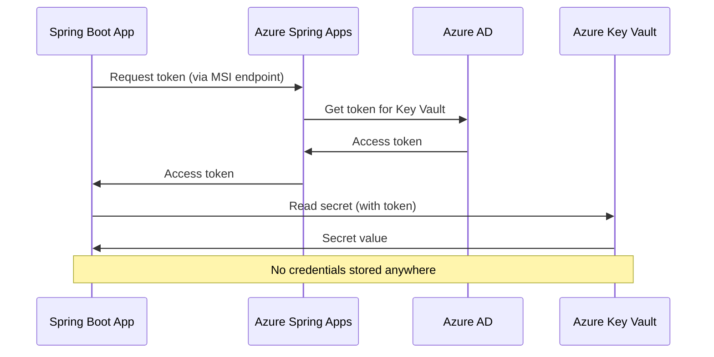

# How to Configure Azure Spring Apps with Managed Identity for Secure Access to Azure Key Vault

Author: [nawazdhandala](https://www.github.com/nawazdhandala)

Tags: Azure Spring Apps, Managed Identity, Azure Key Vault, Spring Boot, Security, Secrets Management, Java

Description: Learn how to configure managed identity in Azure Spring Apps to securely access Azure Key Vault secrets without storing credentials in your application code.

---

Every application needs secrets - database passwords, API keys, connection strings, certificates. The traditional approach of putting these in configuration files or environment variables is a security risk. Secrets in config files end up in source control, secrets in environment variables are visible to anyone who can inspect the process, and rotating secrets requires redeployment. Azure Key Vault solves the storage problem, and managed identity solves the authentication problem. With managed identity, your Spring Boot application authenticates to Key Vault without any credentials at all - no client secrets, no certificates, no passwords. This guide shows how to set this up in Azure Spring Apps.

## How Managed Identity Works

Managed identity is an Azure AD feature that gives your application an identity without you having to manage credentials. When your Spring Boot app runs in Azure Spring Apps, the platform automatically provides a token that the app can use to authenticate to Azure services like Key Vault.

There are two types:

- **System-assigned**: Tied to the specific app instance. Created when you enable it, deleted when you delete the app.
- **User-assigned**: A standalone Azure resource that you create independently and assign to one or more apps. Useful when multiple apps need the same identity.

For most scenarios, system-assigned managed identity is simpler and sufficient.



## Prerequisites

- Azure Spring Apps instance (Standard or Enterprise tier)
- Azure Key Vault
- Azure CLI with the spring extension
- A Spring Boot application
- Basic understanding of Spring Boot configuration

## Step 1: Enable Managed Identity on the Spring App

```bash
# Enable system-assigned managed identity on the app
RESOURCE_GROUP="rg-spring-production"
SPRING_SERVICE="myorg-spring-apps"
APP_NAME="order-service"

az spring app identity assign \
    --name $APP_NAME \
    --service $SPRING_SERVICE \
    --resource-group $RESOURCE_GROUP \
    --system-assigned

# Get the managed identity's principal ID
PRINCIPAL_ID=$(az spring app show \
    --name $APP_NAME \
    --service $SPRING_SERVICE \
    --resource-group $RESOURCE_GROUP \
    --query "identity.principalId" -o tsv)

echo "Principal ID: $PRINCIPAL_ID"
```

## Step 2: Create and Configure Azure Key Vault

If you do not already have a Key Vault:

```bash
# Create Azure Key Vault
KEY_VAULT="kv-spring-secrets"

az keyvault create \
    --name $KEY_VAULT \
    --resource-group $RESOURCE_GROUP \
    --location eastus \
    --enable-rbac-authorization true
```

I strongly recommend using RBAC authorization mode over the legacy access policies. RBAC integrates with Azure AD and provides more granular control.

## Step 3: Grant Key Vault Access to the Managed Identity

Assign the "Key Vault Secrets User" role to let the app read secrets:

```bash
# Get the Key Vault resource ID
KV_ID=$(az keyvault show \
    --name $KEY_VAULT \
    --resource-group $RESOURCE_GROUP \
    --query id -o tsv)

# Grant the managed identity permission to read secrets
az role assignment create \
    --role "Key Vault Secrets User" \
    --assignee-object-id $PRINCIPAL_ID \
    --assignee-principal-type ServicePrincipal \
    --scope $KV_ID
```

If your app also needs to read certificates or keys, assign additional roles:

```bash
# For reading certificates
az role assignment create \
    --role "Key Vault Certificate User" \
    --assignee-object-id $PRINCIPAL_ID \
    --assignee-principal-type ServicePrincipal \
    --scope $KV_ID

# For reading keys (encryption keys, etc.)
az role assignment create \
    --role "Key Vault Crypto User" \
    --assignee-object-id $PRINCIPAL_ID \
    --assignee-principal-type ServicePrincipal \
    --scope $KV_ID
```

## Step 4: Add Secrets to Key Vault

Store the secrets your application needs:

```bash
# Add secrets to Key Vault
az keyvault secret set \
    --vault-name $KEY_VAULT \
    --name "database-password" \
    --value "super-secret-db-password"

az keyvault secret set \
    --vault-name $KEY_VAULT \
    --name "redis-password" \
    --value "redis-secret-key"

az keyvault secret set \
    --vault-name $KEY_VAULT \
    --name "api-key-stripe" \
    --value "sk_live_abc123..."

az keyvault secret set \
    --vault-name $KEY_VAULT \
    --name "smtp-password" \
    --value "email-service-password"

# Verify the secrets were created
az keyvault secret list \
    --vault-name $KEY_VAULT \
    --query "[].name" -o tsv
```

## Step 5: Configure the Spring Boot Application

There are two approaches to integrating Key Vault with Spring Boot: the Azure Spring Cloud Key Vault starter (which maps secrets to Spring properties) and the Azure SDK for direct Key Vault access.

### Approach 1: Spring Cloud Azure Key Vault Starter (Recommended)

This approach automatically maps Key Vault secrets to Spring configuration properties. Add the dependency:

```xml
<!-- pom.xml - Key Vault integration with Spring Boot -->
<dependencies>
    <!-- Spring Cloud Azure starter for Key Vault -->
    <dependency>
        <groupId>com.azure.spring</groupId>
        <artifactId>spring-cloud-azure-starter-keyvault-secrets</artifactId>
    </dependency>
</dependencies>

<dependencyManagement>
    <dependencies>
        <dependency>
            <groupId>com.azure.spring</groupId>
            <artifactId>spring-cloud-azure-dependencies</artifactId>
            <version>5.8.0</version>
            <type>pom</type>
            <scope>import</scope>
        </dependency>
    </dependencies>
</dependencyManagement>
```

Configure the Key Vault endpoint in application.yml:

```yaml
# application.yml
# Spring Cloud Azure Key Vault configuration
spring:
  cloud:
    azure:
      keyvault:
        secret:
          endpoint: https://kv-spring-secrets.vault.azure.net/
          # No credentials needed - managed identity handles authentication
```

That is it for configuration. The starter automatically discovers all secrets in Key Vault and makes them available as Spring properties. Secret names in Key Vault are mapped to property names using a simple convention: hyphens in secret names become dots in property names.

For example:
- Key Vault secret `database-password` becomes Spring property `database.password`
- Key Vault secret `spring-datasource-password` becomes `spring.datasource.password`

This means you can store your database password as a Key Vault secret named `spring-datasource-password`, and Spring Boot's auto-configuration will pick it up automatically without any additional code:

```yaml
# These properties are loaded from Key Vault automatically
# Secret "spring-datasource-url" -> spring.datasource.url
# Secret "spring-datasource-username" -> spring.datasource.username
# Secret "spring-datasource-password" -> spring.datasource.password
```

### Approach 2: Direct Azure SDK Access

For more control over when and how secrets are accessed:

```java
// KeyVaultService.java - Direct access to Key Vault secrets
import com.azure.identity.ManagedIdentityCredentialBuilder;
import com.azure.security.keyvault.secrets.SecretClient;
import com.azure.security.keyvault.secrets.SecretClientBuilder;
import org.springframework.stereotype.Service;

@Service
public class KeyVaultService {

    private final SecretClient secretClient;

    public KeyVaultService() {
        // Build the client using managed identity
        // No credentials needed - the ManagedIdentityCredential handles it
        this.secretClient = new SecretClientBuilder()
            .vaultUrl("https://kv-spring-secrets.vault.azure.net/")
            .credential(new ManagedIdentityCredentialBuilder().build())
            .buildClient();
    }

    public String getSecret(String secretName) {
        // Retrieve a secret from Key Vault
        return secretClient.getSecret(secretName).getValue();
    }

    public void setSecret(String secretName, String value) {
        // Store a secret in Key Vault (requires write permissions)
        secretClient.setSecret(secretName, value);
    }
}
```

Use the service in your application:

```java
// PaymentService.java - Using Key Vault secrets in business logic
@Service
public class PaymentService {

    private final KeyVaultService keyVaultService;

    public PaymentService(KeyVaultService keyVaultService) {
        this.keyVaultService = keyVaultService;
    }

    public PaymentResult processPayment(PaymentRequest request) {
        // Get the payment gateway API key from Key Vault
        String apiKey = keyVaultService.getSecret("api-key-stripe");

        // Use the API key to call the payment gateway
        // The key is never stored in application config or environment variables
        StripeClient stripe = new StripeClient(apiKey);
        return stripe.charge(request.getAmount(), request.getCurrency());
    }
}
```

## Step 6: Handle Secret Rotation

One of the best features of this setup is seamless secret rotation. When you update a secret in Key Vault, your application can pick up the new value without redeployment.

With the Spring Cloud Azure starter, configure a refresh interval:

```yaml
# application.yml
spring:
  cloud:
    azure:
      keyvault:
        secret:
          endpoint: https://kv-spring-secrets.vault.azure.net/
          property-sources:
            - name: keyvault-secrets
              endpoint: https://kv-spring-secrets.vault.azure.net/
              # Refresh secrets every 30 minutes
              refresh-interval: 30m
```

Rotate a secret in Key Vault:

```bash
# Update a secret (creates a new version)
az keyvault secret set \
    --vault-name $KEY_VAULT \
    --name "database-password" \
    --value "new-super-secret-password"

# The old version is still accessible if needed
az keyvault secret list-versions \
    --vault-name $KEY_VAULT \
    --name "database-password" \
    -o table
```

Within 30 minutes (or whatever refresh interval you set), the application picks up the new secret value. No redeployment needed.

## Step 7: Testing Locally

During development, you cannot use managed identity on your local machine. The Azure SDK falls back to other credential types through the DefaultAzureCredential chain:

```yaml
# application-local.yml
# For local development, use the Azure CLI credential
# Make sure you are logged in with: az login
spring:
  cloud:
    azure:
      keyvault:
        secret:
          endpoint: https://kv-spring-secrets.vault.azure.net/
```

As long as you are logged into the Azure CLI (`az login`) and your Azure AD account has the "Key Vault Secrets User" role on the vault, the Spring Cloud Azure starter will authenticate using your CLI credentials locally and managed identity in Azure Spring Apps.

## Step 8: Monitoring and Auditing

Key Vault logs every access in its diagnostic logs. Enable them for security auditing:

```bash
# Enable diagnostic logging on Key Vault
az monitor diagnostic-settings create \
    --name kv-audit-logs \
    --resource $KV_ID \
    --workspace law-security-monitoring \
    --logs '[{"category": "AuditEvent", "enabled": true}]'
```

Query the audit logs to see which secrets are being accessed:

```kusto
// See which secrets are being accessed and by whom
AzureDiagnostics
| where ResourceType == "VAULTS"
| where OperationName == "SecretGet"
| project TimeGenerated, CallerIPAddress, identity_claim_appid_g,
    requestUri_s, resultType_s
| order by TimeGenerated desc
```

## Summary

Managed identity with Azure Key Vault eliminates the need to store any credentials in your Spring Boot application. The setup involves enabling managed identity on your Spring app, granting the identity access to Key Vault, and configuring the Spring Cloud Azure Key Vault starter. Secrets are loaded automatically as Spring properties, and secret rotation happens without redeployment. This is the most secure way to manage secrets in Azure Spring Apps because there are literally no credentials to leak - the authentication happens through Azure AD tokens that the platform manages for you.
