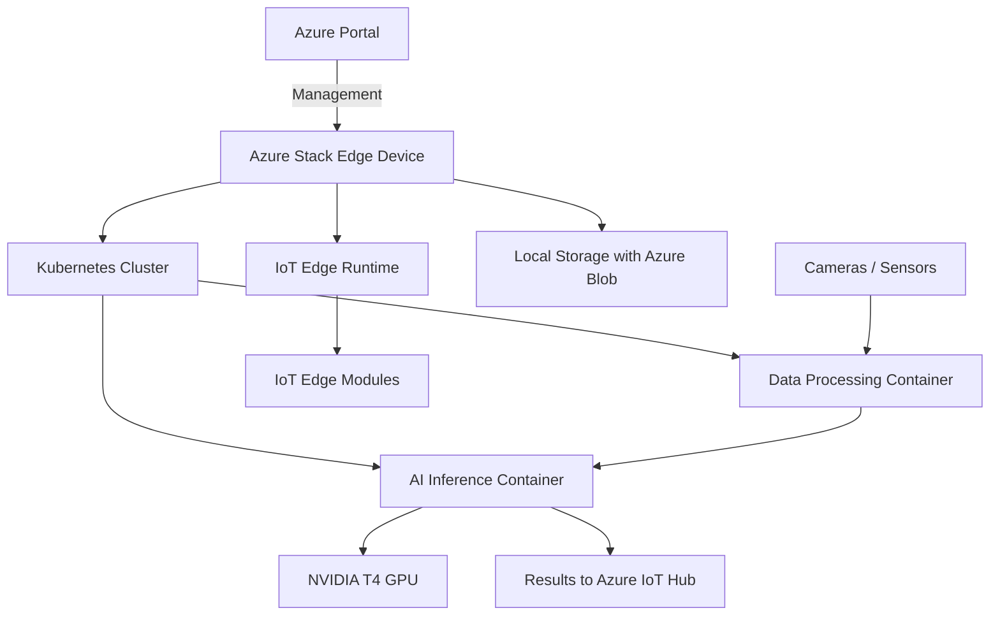

# How to Configure Azure Stack Edge for Local Compute and AI Inference at the Edge

Author: [nawazdhandala](https://www.github.com/nawazdhandala)

Tags: Azure, Azure Stack Edge, Edge Computing, AI, Machine Learning, IoT, Inference

Description: Learn how to configure Azure Stack Edge for local compute and AI inference workloads at the edge, bringing cloud intelligence to remote locations.

---

There are situations where sending data to the cloud for processing is not practical. A factory floor with millisecond latency requirements for quality inspection, a remote oil platform with limited satellite bandwidth, or a hospital running real-time patient monitoring. Azure Stack Edge puts compute, storage, and AI acceleration hardware at these locations while maintaining a management connection back to Azure.

This guide covers configuring Azure Stack Edge for local compute workloads and deploying AI inference models that run entirely on the device.

## What Azure Stack Edge Is

Azure Stack Edge is a physical appliance shipped by Microsoft that you rack in your data center or edge location. Depending on the model, it includes:

- **Azure Stack Edge Pro with GPU** - Includes 1 or 2 NVIDIA T4 GPUs for AI/ML inference.
- **Azure Stack Edge Pro with FPGA** - Includes an FPGA for specific acceleration scenarios.
- **Azure Stack Edge Mini R** - A ruggedized, portable form factor for harsh environments.

The device runs an Azure-managed operating system, supports Kubernetes and IoT Edge for containerized workloads, and provides local storage with automatic tiering to Azure Blob Storage.



## Prerequisites

- An Azure Stack Edge device ordered and delivered through the Azure portal.
- An Azure Stack Edge resource created in your Azure subscription.
- Network cables and rack space at the edge location.
- A management computer with a web browser for initial setup.
- For GPU workloads: familiarity with NVIDIA container toolkit and GPU-accelerated containers.

## Step 1: Physical Setup and Activation

After receiving the device:

1. Rack the device and connect the power cables.
2. Connect the network ports:
   - **Port 1** (1 GbE) - For initial device management.
   - **Port 3 or 5** (25 GbE) - For data traffic.
3. Power on the device and wait for the ready indicator.

Connect your management computer to Port 1. The device has a default IP of `https://192.168.100.10`. Open it in a browser to access the local web UI.

## Step 2: Configure the Device Through Local Web UI

Log in to the local web UI with the device password (found on a label attached to the device).

### Network Configuration

Configure the network interfaces for your environment.

```
Port 1 (Management):
  IP: 10.0.0.100
  Subnet: 255.255.255.0
  Gateway: 10.0.0.1

Port 3 (Compute/Data):
  IP: 10.0.1.100
  Subnet: 255.255.255.0
  Gateway: 10.0.1.1

DNS: 10.0.0.53
NTP: time.windows.com
```

### Activate the Device

1. In the Azure portal, go to your Azure Stack Edge resource.
2. Click "Get activation key."
3. Copy the activation key.
4. In the local web UI, go to "Get started" > "Activate."
5. Paste the activation key and click Activate.

Activation links the physical device to your Azure resource, enabling remote management.

## Step 3: Enable Compute

After activation, enable the compute role on a network interface. This deploys a Kubernetes cluster and IoT Edge runtime on the device.

1. In the Azure portal, navigate to your Azure Stack Edge resource.
2. Under "Edge compute," click "Configure compute."
3. Select the network interface for compute traffic (Port 3 recommended for 25 GbE throughput).
4. Assign Kubernetes service IPs:
   - **External service IP range**: 10.0.1.200 - 10.0.1.220
   - **Kubernetes node IPs**: Assigned from the interface subnet
5. Click "Apply."

The compute configuration takes 15-20 minutes. It deploys IoT Edge, creates a Kubernetes cluster, and configures the GPU passthrough if applicable.

Verify the compute setup via the local UI or CLI.

```bash
# Check the Kubernetes cluster status (run on the device or via kubectl)
kubectl get nodes -o wide
kubectl get pods -A
```

## Step 4: Deploy an AI Inference Module

For GPU-accelerated AI inference, deploy a container that uses the NVIDIA T4 GPU on the device.

### Create the IoT Edge Deployment Manifest

```json
{
  "modulesContent": {
    "$edgeAgent": {
      "properties.desired": {
        "runtime": {
          "type": "docker",
          "settings": {
            "minDockerVersion": "v1.25",
            "loggingOptions": "",
            "registryCredentials": {
              "myregistry": {
                "address": "myregistry.azurecr.io",
                "username": "myregistry",
                "password": "registry-password"
              }
            }
          }
        },
        "modules": {
          "ai-inference": {
            "type": "docker",
            "status": "running",
            "restartPolicy": "always",
            "settings": {
              "image": "myregistry.azurecr.io/defect-detection:v1.0",
              "createOptions": {
                "HostConfig": {
                  "DeviceRequests": [
                    {
                      "Count": 1,
                      "Capabilities": [["gpu"]]
                    }
                  ],
                  "Binds": [
                    "/home/input:/app/input",
                    "/home/output:/app/output"
                  ],
                  "PortBindings": {
                    "5000/tcp": [{"HostPort": "5000"}]
                  }
                }
              }
            },
            "env": {
              "MODEL_PATH": {"value": "/app/models/defect_model.onnx"},
              "CONFIDENCE_THRESHOLD": {"value": "0.85"}
            }
          }
        }
      }
    },
    "$edgeHub": {
      "properties.desired": {
        "routes": {
          "inferenceToCloud": "FROM /messages/modules/ai-inference/outputs/* INTO $upstream"
        }
      }
    }
  }
}
```

Deploy the manifest through the Azure portal.

1. Navigate to your IoT Hub (created automatically with the Azure Stack Edge compute setup).
2. Go to Devices and select your edge device.
3. Click "Set modules."
4. Add the module configuration from the manifest above.
5. Click "Review + create."

## Step 5: Deploy a Custom AI Model

Build a container that runs your trained model on the GPU. Here is an example Dockerfile for an ONNX Runtime inference container.

```dockerfile
# Use the NVIDIA CUDA base image for GPU support
FROM nvcr.io/nvidia/cuda:11.8.0-cudnn8-runtime-ubuntu22.04

# Install Python and required packages
RUN apt-get update && apt-get install -y python3 python3-pip
RUN pip3 install onnxruntime-gpu flask numpy pillow

# Copy the model and inference code
COPY model/ /app/models/
COPY inference_server.py /app/

WORKDIR /app

# Expose the inference API port
EXPOSE 5000

# Start the inference server
CMD ["python3", "inference_server.py"]
```

And the inference server code.

```python
# inference_server.py
# REST API server that runs ONNX model inference on the GPU
import onnxruntime as ort
import numpy as np
from flask import Flask, request, jsonify
from PIL import Image
import io
import os

app = Flask(__name__)

# Load the ONNX model with GPU execution provider
model_path = os.environ.get('MODEL_PATH', '/app/models/defect_model.onnx')
confidence_threshold = float(os.environ.get('CONFIDENCE_THRESHOLD', '0.85'))

# Use CUDAExecutionProvider for GPU acceleration, fall back to CPU if unavailable
providers = ['CUDAExecutionProvider', 'CPUExecutionProvider']
session = ort.InferenceSession(model_path, providers=providers)

print(f"Model loaded. Using provider: {session.get_providers()[0]}")

@app.route('/predict', methods=['POST'])
def predict():
    """Accept an image and return defect detection results."""
    if 'image' not in request.files:
        return jsonify({'error': 'No image provided'}), 400

    # Read and preprocess the image
    image_file = request.files['image']
    image = Image.open(io.BytesIO(image_file.read()))
    image = image.resize((640, 640))

    # Convert to numpy array and normalize
    input_array = np.array(image).astype(np.float32) / 255.0
    input_array = np.transpose(input_array, (2, 0, 1))  # CHW format
    input_array = np.expand_dims(input_array, axis=0)    # Add batch dimension

    # Run inference on the GPU
    input_name = session.get_inputs()[0].name
    results = session.run(None, {input_name: input_array})

    # Process results and filter by confidence threshold
    detections = []
    for detection in results[0][0]:
        confidence = float(detection[4])
        if confidence >= confidence_threshold:
            detections.append({
                'class': int(detection[5]),
                'confidence': confidence,
                'bbox': detection[:4].tolist()
            })

    return jsonify({
        'detections': detections,
        'total': len(detections)
    })

@app.route('/health', methods=['GET'])
def health():
    """Health check endpoint."""
    return jsonify({'status': 'healthy', 'gpu': session.get_providers()[0]})

if __name__ == '__main__':
    app.run(host='0.0.0.0', port=5000)
```

Build and push the container to your Azure Container Registry.

```bash
# Build the container image
docker build -t myregistry.azurecr.io/defect-detection:v1.0 .

# Push to ACR
az acr login --name myregistry
docker push myregistry.azurecr.io/defect-detection:v1.0
```

## Step 6: Configure Local Storage

Azure Stack Edge provides local storage that can tier data to Azure Blob Storage automatically.

1. In the Azure portal, go to your Azure Stack Edge resource.
2. Under "Cloud storage gateway," click "Shares."
3. Click "Add share."
4. Configure:
   - **Name**: inference-data
   - **Type**: Edge local share (data stays on device) or Block blob (tiers to cloud)
   - **Storage account**: Select or create an Azure Storage account
   - **Container**: inference-results
5. Click Create.

Edge local shares keep data entirely on the device for low-latency access. Block blob shares upload data to Azure Storage on a schedule, which is useful for sending inference results to the cloud for further analysis.

## Step 7: Monitor the Device

Monitor device health and workload performance through the Azure portal.

```bash
# Check device alerts and health
az databoxedge device show \
  --resource-group myResourceGroup \
  --name myStackEdgeDevice \
  --query "deviceProperties" \
  --output table

# Check GPU utilization (via the local web UI or SSH)
nvidia-smi
```

Set up Azure Monitor alerts for:
- GPU temperature exceeding thresholds.
- Disk space running low on local storage.
- IoT Edge modules failing to start.
- Network disconnection from Azure (the device continues to run locally but loses management connectivity).

## Summary

Azure Stack Edge is the right tool when you need cloud-grade compute with AI acceleration at locations where cloud connectivity is limited or latency requirements are strict. The configuration flow is physical setup, activation through the Azure portal, enabling the compute role, and deploying containers with GPU access. The device handles the infrastructure - Kubernetes, IoT Edge, GPU drivers, storage tiering - so you can focus on building the AI models and processing pipelines that deliver value at the edge. Once deployed, the same Azure portal you use for cloud resources manages your edge devices, keeping your operations consistent regardless of where the compute physically runs.
