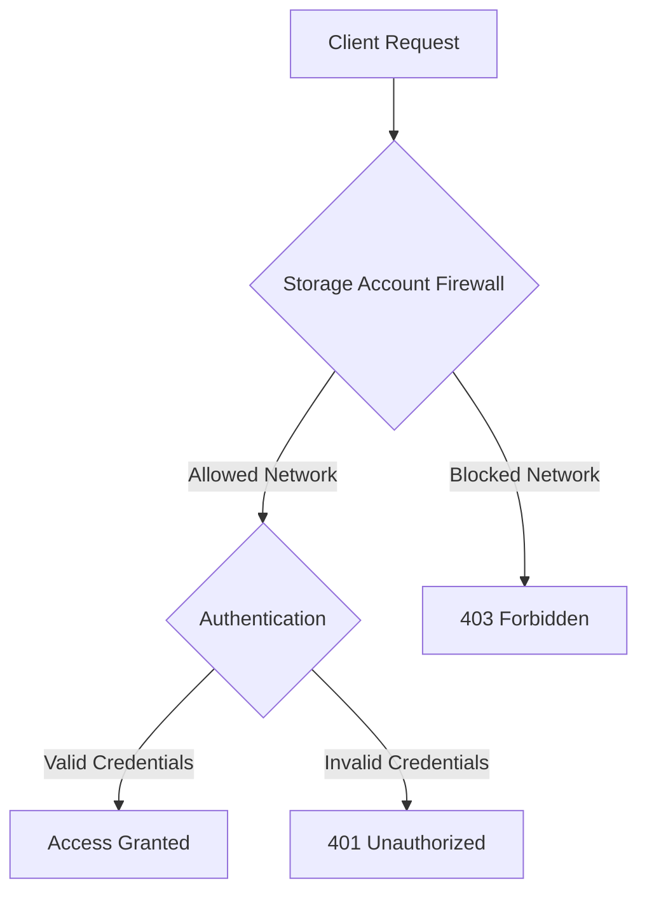

# How to Configure Azure Storage Account Network Security with Service Endpoints

Author: [nawazdhandala](https://www.github.com/nawazdhandala)

Tags: Azure, Storage Security, Service Endpoints, Virtual Network, Network Security, Firewall Rules, Access Control

Description: How to restrict Azure Storage account access to specific virtual networks and IP addresses using service endpoints and firewall rules.

---

By default, Azure Storage accounts accept connections from any network on the internet. For production workloads, this is usually too permissive. You want to restrict access so that only your applications - running in specific Azure virtual networks or from specific IP addresses - can reach the storage account. Azure provides two mechanisms for this: Virtual Network service endpoints and storage account firewall rules. This guide covers how to set them up properly.

## Understanding the Security Layers

Azure Storage network security works in layers:



The network layer (firewall) is evaluated first. Even with valid credentials, a request from a blocked network is rejected. This provides defense in depth - if a storage account key is compromised, the attacker still cannot access the data unless they are on an allowed network.

## Virtual Network Service Endpoints

A service endpoint extends your virtual network's identity to the Azure Storage service. When you enable a service endpoint for Azure Storage on a subnet, traffic from that subnet takes an optimized route directly to the storage service over the Azure backbone network. The storage account can then use the subnet identity to allow or deny access.

### Step 1: Enable the Service Endpoint on a Subnet

```bash
# Enable the Microsoft.Storage service endpoint on a subnet
# This tells Azure to route storage traffic through the backbone
az network vnet subnet update \
  --resource-group myResourceGroup \
  --vnet-name myVNet \
  --name app-subnet \
  --service-endpoints Microsoft.Storage
```

You can verify the service endpoint is enabled:

```bash
# Check the service endpoints on a subnet
az network vnet subnet show \
  --resource-group myResourceGroup \
  --vnet-name myVNet \
  --name app-subnet \
  --query "serviceEndpoints" -o json
```

### Step 2: Configure the Storage Account Firewall

Now configure the storage account to only accept traffic from the subnet with the service endpoint:

```bash
# Set the default action to Deny (block all traffic by default)
az storage account update \
  --name mystorageaccount \
  --resource-group myResourceGroup \
  --default-action Deny

# Add the subnet to the allowed list
az storage account network-rule add \
  --account-name mystorageaccount \
  --resource-group myResourceGroup \
  --vnet-name myVNet \
  --subnet app-subnet
```

After this configuration:
- Traffic from `app-subnet` is allowed
- Traffic from all other networks is denied
- Traffic from the Azure Portal is denied (unless you add an exception)

### Step 3: Add Additional Networks

You will likely need to allow access from multiple subnets and IP addresses:

```bash
# Add another subnet
az storage account network-rule add \
  --account-name mystorageaccount \
  --resource-group myResourceGroup \
  --vnet-name myVNet \
  --subnet worker-subnet

# Add a subnet from a different VNet (if peered)
az storage account network-rule add \
  --account-name mystorageaccount \
  --resource-group myResourceGroup \
  --vnet-name otherVNet \
  --subnet data-subnet

# Add a specific public IP address (for on-premises access)
az storage account network-rule add \
  --account-name mystorageaccount \
  --resource-group myResourceGroup \
  --ip-address 203.0.113.50

# Add a CIDR range
az storage account network-rule add \
  --account-name mystorageaccount \
  --resource-group myResourceGroup \
  --ip-address 203.0.113.0/24
```

## Allowing Azure Service Access

Some Azure services need to access your storage account but do not use virtual network service endpoints. For example, Azure Monitor needs to write diagnostic logs, and Azure Backup needs to read and write backup data. You can allow trusted Microsoft services to bypass the firewall:

```bash
# Allow trusted Azure services to access the storage account
az storage account update \
  --name mystorageaccount \
  --resource-group myResourceGroup \
  --bypass AzureServices
```

The trusted services include:
- Azure Backup
- Azure Site Recovery
- Azure DevTest Labs
- Azure Event Grid
- Azure Event Hubs
- Azure Networking
- Azure Monitor
- Azure SQL Data Warehouse

You can also selectively bypass for logging and metrics:

```bash
# Allow Azure services, logging, and metrics to bypass the firewall
az storage account update \
  --name mystorageaccount \
  --resource-group myResourceGroup \
  --bypass AzureServices Logging Metrics
```

## Viewing Current Network Rules

Check the current firewall configuration at any time:

```bash
# Show all network rules for a storage account
az storage account network-rule list \
  --account-name mystorageaccount \
  --resource-group myResourceGroup -o json

# Show the default action and bypass settings
az storage account show \
  --name mystorageaccount \
  --resource-group myResourceGroup \
  --query "networkRuleSet" -o json
```

The output shows:
- **defaultAction**: Allow or Deny
- **bypass**: Which services bypass the firewall
- **virtualNetworkRules**: Allowed subnets
- **ipRules**: Allowed IP addresses and ranges

## Service Endpoints vs. Private Endpoints

Service endpoints and private endpoints both restrict network access, but they work differently:

| Feature | Service Endpoints | Private Endpoints |
|---------|------------------|-------------------|
| Traffic path | Azure backbone (public IP) | Private IP in your VNet |
| DNS | Public DNS name | Private DNS zone needed |
| Cross-region | Limited | Works cross-region |
| On-premises access | Via public IP rules only | Via VPN/ExpressRoute |
| Cost | Free | Per-hour charge |
| NSG support | Yes | Yes |

Service endpoints are simpler and free, making them a good default choice. Private endpoints give you a private IP address within your VNet, which is required for certain compliance scenarios and works better with on-premises connectivity.

## Configuring with ARM Templates

For infrastructure-as-code deployments, configure network rules in your ARM template:

```json
{
  "type": "Microsoft.Storage/storageAccounts",
  "apiVersion": "2023-01-01",
  "name": "[parameters('storageAccountName')]",
  "location": "[parameters('location')]",
  "sku": {
    "name": "Standard_LRS"
  },
  "kind": "StorageV2",
  "properties": {
    "networkAcls": {
      "defaultAction": "Deny",
      "bypass": "AzureServices, Logging, Metrics",
      "virtualNetworkRules": [
        {
          "id": "[resourceId('Microsoft.Network/virtualNetworks/subnets', 'myVNet', 'app-subnet')]",
          "action": "Allow"
        }
      ],
      "ipRules": [
        {
          "value": "203.0.113.50",
          "action": "Allow"
        }
      ]
    }
  }
}
```

## Configuring with Terraform

```hcl
resource "azurerm_storage_account" "main" {
  name                     = "mystorageaccount"
  resource_group_name      = azurerm_resource_group.main.name
  location                 = azurerm_resource_group.main.location
  account_tier             = "Standard"
  account_replication_type = "LRS"

  # Configure network rules
  network_rules {
    default_action             = "Deny"
    bypass                     = ["AzureServices", "Logging", "Metrics"]
    virtual_network_subnet_ids = [azurerm_subnet.app.id]
    ip_rules                   = ["203.0.113.50"]
  }
}

# Enable service endpoint on the subnet
resource "azurerm_subnet" "app" {
  name                 = "app-subnet"
  resource_group_name  = azurerm_resource_group.main.name
  virtual_network_name = azurerm_virtual_network.main.name
  address_prefixes     = ["10.0.1.0/24"]

  service_endpoints = ["Microsoft.Storage"]
}
```

## Troubleshooting Network Rules

When you lock down a storage account, things can break. Here are common issues and their fixes.

### "This request is not authorized to perform this operation"

This usually means your client's IP or subnet is not in the allowed list. Check your outgoing IP:

```bash
# Check your public IP address
curl -s ifconfig.me

# Verify the IP is in the storage account's allowed list
az storage account network-rule list \
  --account-name mystorageaccount \
  --resource-group myResourceGroup \
  --query "ipRules[].ipAddressOrRange" -o tsv
```

### Azure Portal Cannot Access Storage

When you set the default action to Deny, the Azure Portal loses access too. Add your browser's IP to the allowed list, or check the "Allow access from Azure Portal" option when using the Portal's network configuration page.

### Azure Functions or App Service Cannot Reach Storage

If your Azure Functions or App Service runs on a shared plan, it does not have a static outbound IP. You need to either use VNet integration (to route traffic through a subnet with a service endpoint) or add all possible outbound IPs:

```bash
# Get the outbound IPs for an App Service
az webapp show \
  --name my-web-app \
  --resource-group myResourceGroup \
  --query "possibleOutboundIpAddresses" -o tsv
```

The better solution is VNet integration:

```bash
# Integrate the App Service with a VNet subnet
az webapp vnet-integration add \
  --name my-web-app \
  --resource-group myResourceGroup \
  --vnet myVNet \
  --subnet integration-subnet
```

### Removing Network Rules

If you need to temporarily open up access for debugging:

```bash
# Remove a specific subnet rule
az storage account network-rule remove \
  --account-name mystorageaccount \
  --resource-group myResourceGroup \
  --vnet-name myVNet \
  --subnet app-subnet

# Or temporarily set default action to Allow
az storage account update \
  --name mystorageaccount \
  --resource-group myResourceGroup \
  --default-action Allow
```

Remember to restore the Deny default action after troubleshooting.

Network security for Azure Storage accounts is one of those things that should be configured from day one, not bolted on later. Starting with a Deny default action and explicitly allowing only the networks that need access is the right approach. It takes a bit more work upfront to identify all the clients that need access, but it dramatically reduces your attack surface and meets the baseline expectations of any security audit.
