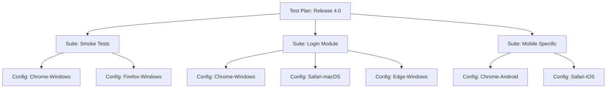

# How to Configure Azure Test Plans Test Configurations for Cross-Browser and Cross-Device Testing

Author: [nawazdhandala](https://www.github.com/nawazdhandala)

Tags: Azure Test Plans, Test Configurations, Cross-Browser Testing, QA, Testing, Azure DevOps, Test Management

Description: Learn how to set up Azure Test Plans test configurations to manage cross-browser and cross-device testing matrices without duplicating test cases.

---

When your web application needs to work on Chrome, Firefox, Safari, and Edge, and also on Windows, macOS, and mobile devices, the number of test combinations explodes. If you have 50 test cases and 8 browser/OS combinations, that is 400 test runs. Without proper tooling, teams either duplicate test cases for each configuration (creating a maintenance nightmare) or skip configurations (creating coverage gaps).

Azure Test Plans test configurations solve this by separating test case logic from execution context. You write each test case once and then assign configurations that define the environments it should be tested in. The same test case runs against multiple configurations, and results are tracked independently for each combination.

## Understanding Test Configurations

A test configuration in Azure Test Plans is a named combination of configuration variables and their values. Think of it as a label that describes a test environment.

For example:
- "Chrome on Windows 11" (Browser = Chrome, OS = Windows 11)
- "Safari on macOS" (Browser = Safari, OS = macOS)
- "Chrome on Android" (Browser = Chrome, OS = Android 14)

Configuration variables are the dimensions of your testing matrix. Common variables include:
- Browser (Chrome, Firefox, Safari, Edge)
- Operating System (Windows 11, Windows 10, macOS, Ubuntu)
- Device Type (Desktop, Tablet, Mobile)
- Screen Resolution (1920x1080, 1366x768, 375x812)

## Creating Configuration Variables

Navigate to your Azure DevOps project, go to Test Plans, then click the settings gear icon. Under "Test configurations," click "Configuration variables."

Create the variables your team needs.

```
Variable: Browser
  Values: Chrome, Firefox, Safari, Edge, Chrome Mobile, Safari Mobile

Variable: Operating System
  Values: Windows 11, Windows 10, macOS Sonoma, Ubuntu 22.04, iOS 17, Android 14

Variable: Screen Resolution
  Values: 1920x1080, 1366x768, 1024x768, 375x812, 390x844
```

You can also manage configuration variables through the REST API.

```bash
# Create a configuration variable using the REST API
ORG="your-organization"
PROJECT="your-project"
PAT="your-pat"

# Create the Browser configuration variable
curl -X POST \
  "https://dev.azure.com/${ORG}/${PROJECT}/_apis/testplan/configurations?api-version=7.1" \
  -H "Authorization: Basic $(echo -n ":${PAT}" | base64)" \
  -H "Content-Type: application/json" \
  -d '{
    "name": "Chrome on Windows 11",
    "description": "Desktop Chrome browser on Windows 11",
    "isDefault": true,
    "values": [
      { "name": "Browser", "value": "Chrome" },
      { "name": "Operating System", "value": "Windows 11" }
    ]
  }'
```

## Creating Test Configurations

With the variables defined, create configurations that combine them into meaningful test environments.

Go to Test Plans, then click the settings gear, then "Test configurations," and click "New configuration."

Here is a practical set of configurations for a web application:

```
Configuration 1: Chrome - Windows 11
  Browser: Chrome
  Operating System: Windows 11
  Default: Yes

Configuration 2: Firefox - Windows 11
  Browser: Firefox
  Operating System: Windows 11

Configuration 3: Edge - Windows 11
  Browser: Edge
  Operating System: Windows 11

Configuration 4: Safari - macOS Sonoma
  Browser: Safari
  Operating System: macOS Sonoma

Configuration 5: Chrome - Android
  Browser: Chrome Mobile
  Operating System: Android 14
  Screen Resolution: 390x844

Configuration 6: Safari - iOS
  Browser: Safari Mobile
  Operating System: iOS 17
  Screen Resolution: 375x812
```

## Assigning Configurations to Test Suites

Configurations are assigned at the test suite level. Each suite can have one or more configurations, and every test case in the suite gets a test point for each assigned configuration.

Navigate to your test plan, select a test suite, and click "Configurations" in the toolbar. Check the configurations that apply to this suite.



When you assign three configurations to a suite with 10 test cases, you get 30 test points (10 cases times 3 configurations). Each test point can be passed, failed, or blocked independently.

## Running Tests with Configurations

When a tester opens the test runner, they see test points organized by configuration. They can filter to see only the tests assigned to them for a specific configuration.

For manual testing, the workflow is:
1. Tester opens Test Plans and selects the current sprint's test plan
2. Filters by their assigned configuration (e.g., "Safari - macOS")
3. Runs each test case in that configuration
4. Marks each test point as Passed, Failed, or Blocked with configuration-specific notes

The test runner shows which configuration each test point belongs to, so the tester knows which browser and OS to use for each run.

## Tracking Results Across Configurations

The real value of configurations shows up in the test results view. You can see at a glance which configurations are passing and which have failures.

Navigate to your test plan and look at the progress charts. These charts break down results by configuration, showing you patterns like "all tests pass on Chrome but 5 fail on Safari" or "mobile configurations have a higher failure rate."

You can also use the Azure DevOps REST API to pull configuration-specific results for reporting.

```bash
# Get test results grouped by configuration
ORG="your-organization"
PROJECT="your-project"
PLAN_ID="123"
SUITE_ID="456"
PAT="your-pat"

# List test points with their configuration and outcome
curl -s \
  "https://dev.azure.com/${ORG}/${PROJECT}/_apis/testplan/Plans/${PLAN_ID}/Suites/${SUITE_ID}/TestPoint?api-version=7.1" \
  -H "Authorization: Basic $(echo -n ":${PAT}" | base64)" | \
  python3 -c "
import json, sys
data = json.load(sys.stdin)
for point in data.get('value', []):
    config = point.get('configuration', {}).get('name', 'Unknown')
    test = point.get('testCase', {}).get('name', 'Unknown')
    outcome = point.get('results', {}).get('outcome', 'Not Run')
    print(f'{config:30s} | {test:40s} | {outcome}')
"
```

## Automating Cross-Browser Tests in Pipelines

For automated test suites, you can run the same test code against multiple configurations using pipeline matrix strategies.

```yaml
# azure-pipelines.yml - Run automated tests across browser configurations

trigger:
  branches:
    include:
      - main

pool:
  vmImage: 'ubuntu-latest'

strategy:
  matrix:
    Chrome_Windows:
      browserName: 'chrome'
      osName: 'Windows 11'
      configId: '1'
    Firefox_Windows:
      browserName: 'firefox'
      osName: 'Windows 11'
      configId: '2'
    Edge_Windows:
      browserName: 'MicrosoftEdge'
      osName: 'Windows 11'
      configId: '3'

steps:
  - task: NodeTool@0
    inputs:
      versionSpec: '18.x'

  - script: |
      npm ci
      # Run Playwright tests with the specified browser
      npx playwright test --project=$(browserName)
    displayName: 'Run tests on $(browserName)'
    env:
      BROWSER: $(browserName)

  # Publish test results and associate with the configuration
  - task: PublishTestResults@2
    displayName: 'Publish test results'
    inputs:
      testResultsFormat: 'JUnit'
      testResultsFiles: '**/test-results/*.xml'
      testRunTitle: 'Automated Tests - $(browserName) on $(osName)'
      configuration: '$(configId)'
    condition: always()
```

## Managing Configuration Sprawl

As your application matures, the number of configurations can grow unwieldy. Here are strategies to keep it manageable.

Prioritize configurations based on user analytics. If 80% of your users are on Chrome, Chrome configurations should always run. If only 2% use Firefox on Linux, that configuration can run less frequently.

Create configuration tiers. Tier 1 configurations run on every build (Chrome, Safari, mobile). Tier 2 configurations run nightly (Firefox, Edge). Tier 3 configurations run weekly or before releases (less common browser/OS combinations).

Use the default configuration wisely. Set your most common user environment as the default. When testers run a quick sanity check, they automatically test the most important configuration.

Archive configurations that are no longer relevant. When you drop support for Internet Explorer or an old OS version, archive the configuration rather than deleting it (so historical results are preserved).

## Connecting Test Configurations to Requirements

Link your test suites to work items (user stories or requirements) to create a traceability matrix that includes configuration coverage.

```
Requirement: US-1234 "User can log in with SSO"
  Test Suite: Login - SSO
    Test Case: TC-101 "SSO login with valid credentials"
      Config 1: Chrome-Windows - Passed
      Config 2: Safari-macOS - Passed
      Config 3: Chrome-Android - Failed (Bug AB#5678)
      Config 4: Safari-iOS - Passed
```

This gives product owners and QA leads a clear picture of which features are verified on which platforms. When a stakeholder asks "does SSO work on mobile?", you have a definitive answer.

Test configurations bring order to the chaos of multi-platform testing. Without them, you either test everything everywhere (slow and expensive) or miss coverage on important platforms (risky). With configurations, you systematically cover the platforms that matter, track results by environment, and know exactly where your application works and where it does not.
