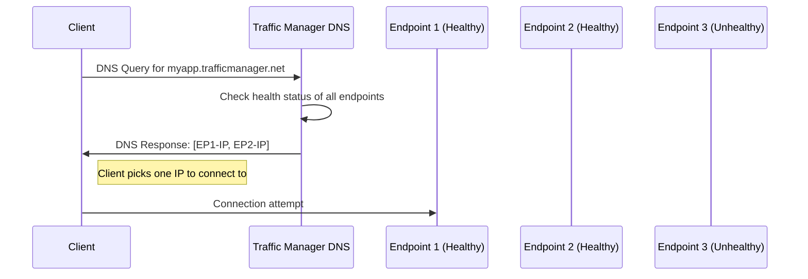

# How to Configure Azure Traffic Manager with Multivalue Routing for DNS Load Balancing

Author: [nawazdhandala](https://www.github.com/nawazdhandala)

Tags: Azure, Traffic Manager, DNS, Load Balancing, Multivalue Routing, High Availability

Description: Configure Azure Traffic Manager with multivalue routing to return multiple healthy endpoints in DNS responses for client-side load balancing.

---

Azure Traffic Manager provides DNS-based traffic routing across multiple endpoints, and the multivalue routing method is one of its lesser-known but genuinely useful features. Unlike other routing methods that return a single endpoint per DNS query, multivalue routing returns multiple healthy IP addresses in the DNS response. The client then chooses which one to connect to, effectively distributing load at the DNS level without any application-layer load balancer.

This guide covers when multivalue routing makes sense, how to configure it, and the practical considerations you need to think about.

## How Multivalue Routing Works

With most Traffic Manager routing methods (priority, weighted, performance, geographic), the DNS response contains a single endpoint. The client connects to that endpoint, and if it fails, the client must make another DNS query to get a different endpoint.

Multivalue routing works differently. When a client queries the Traffic Manager DNS name, it gets back multiple IP addresses in the response - only healthy ones, based on the health probe results. The client (or the client's DNS resolver) can use any of these addresses.



The key behavior is that unhealthy endpoints are excluded from the response. If Endpoint 3 is failing health checks, its IP address is not returned in the DNS response. This gives you automatic failover without the client needing to detect failures itself.

## When to Use Multivalue Routing

Multivalue routing is a good fit when:

- **You have multiple independent endpoints** that can each handle the full request (not sharded or partitioned)
- **You want client-side load distribution** without a centralized load balancer
- **Your clients support DNS-level failover** (most HTTP clients and browsers do)
- **You need fast failover** because the client already has alternate IPs from the DNS response and can try them without another DNS lookup
- **You are distributing across external or non-Azure endpoints** where you cannot use Azure Load Balancer

Common use cases include distributing traffic across API servers in different regions, providing resilient DNS for email servers, and load balancing across independently deployed service instances.

## Prerequisites

- An Azure subscription
- Multiple endpoints (Azure VMs, external endpoints, or other Azure services) each with their own public IP
- The endpoints must serve the same content and be independently capable of handling requests
- Azure CLI installed

## Step 1: Create the Traffic Manager Profile

Create a Traffic Manager profile with multivalue routing:

```bash
# Create the Traffic Manager profile with multivalue routing
az network traffic-manager profile create \
  --name myMultivalueProfile \
  --resource-group myResourceGroup \
  --routing-method MultiValue \
  --unique-dns-name myapp-multivalue \
  --ttl 30 \
  --protocol HTTPS \
  --port 443 \
  --path "/health" \
  --max-return 3
```

Important parameters:

- **routing-method MultiValue**: Enables the multivalue routing mode
- **max-return 3**: The maximum number of healthy endpoints to return in each DNS response. You can set this between 1 and 8.
- **ttl 30**: DNS TTL in seconds. Lower values mean faster failover but more DNS queries. 30 seconds is a good balance.
- **path "/health"**: The health probe path. Traffic Manager checks this endpoint to determine health status.

## Step 2: Add Endpoints

Add the endpoints that Traffic Manager will monitor and include in DNS responses. For multivalue routing, you must use external endpoints with IPv4 addresses:

```bash
# Add external endpoints with their IP addresses
az network traffic-manager endpoint create \
  --name endpoint-eastus \
  --profile-name myMultivalueProfile \
  --resource-group myResourceGroup \
  --type externalEndpoints \
  --target "40.71.x.x" \
  --endpoint-status Enabled

az network traffic-manager endpoint create \
  --name endpoint-westus \
  --profile-name myMultivalueProfile \
  --resource-group myResourceGroup \
  --type externalEndpoints \
  --target "40.83.x.x" \
  --endpoint-status Enabled

az network traffic-manager endpoint create \
  --name endpoint-westeurope \
  --profile-name myMultivalueProfile \
  --resource-group myResourceGroup \
  --type externalEndpoints \
  --target "52.174.x.x" \
  --endpoint-status Enabled

az network traffic-manager endpoint create \
  --name endpoint-southeastasia \
  --profile-name myMultivalueProfile \
  --resource-group myResourceGroup \
  --type externalEndpoints \
  --target "52.187.x.x" \
  --endpoint-status Enabled
```

With `max-return` set to 3 and 4 endpoints, each DNS response will return up to 3 of the 4 healthy IPs. If one endpoint goes down, all DNS responses will return the 3 remaining healthy ones.

## Step 3: Configure Health Probes

The health probe configuration determines how Traffic Manager checks endpoint health. Customize it based on your application:

```bash
# Update the profile with specific health check settings
az network traffic-manager profile update \
  --name myMultivalueProfile \
  --resource-group myResourceGroup \
  --protocol HTTPS \
  --port 443 \
  --path "/health" \
  --interval 10 \
  --timeout 5 \
  --tolerated-number-of-failures 2
```

Parameters explained:

- **interval 10**: Check every 10 seconds
- **timeout 5**: Wait up to 5 seconds for a response
- **tolerated-number-of-failures 2**: Mark as unhealthy after 2 consecutive failures (so unhealthy detection takes about 20-30 seconds)

## Step 4: Verify the DNS Response

Test the DNS resolution to see the multivalue response:

```bash
# Query the Traffic Manager DNS name
nslookup myapp-multivalue.trafficmanager.net

# You should see multiple A records in the response
# Server:  168.63.129.16
# Address:  168.63.129.16
#
# Non-authoritative answer:
# Name:    myapp-multivalue.trafficmanager.net
# Address:  40.71.x.x
# Address:  40.83.x.x
# Address:  52.174.x.x
```

You can also use `dig` for more detailed output:

```bash
# Use dig to see the full DNS response with TTL
dig myapp-multivalue.trafficmanager.net

# Look for the ANSWER SECTION with multiple A records
# ;; ANSWER SECTION:
# myapp-multivalue.trafficmanager.net. 30 IN A 40.71.x.x
# myapp-multivalue.trafficmanager.net. 30 IN A 40.83.x.x
# myapp-multivalue.trafficmanager.net. 30 IN A 52.174.x.x
```

## Step 5: Monitor Endpoint Health

Set up monitoring to track which endpoints are healthy and how traffic is distributed:

```bash
# Check current endpoint health status
az network traffic-manager endpoint list \
  --profile-name myMultivalueProfile \
  --resource-group myResourceGroup \
  --output table
```

Create an alert for when endpoints become unhealthy:

```bash
# Create an alert when the number of healthy endpoints drops
az monitor metrics alert create \
  --name "TM-Unhealthy-Endpoint" \
  --resource-group myResourceGroup \
  --scopes "/subscriptions/{sub-id}/resourceGroups/myResourceGroup/providers/Microsoft.Network/trafficManagerProfiles/myMultivalueProfile" \
  --condition "avg ProbeAgentCurrentEndpointStateByProfileResourceId < 1" \
  --window-size 5m \
  --evaluation-frequency 1m \
  --action myActionGroup \
  --severity 2 \
  --description "Traffic Manager endpoint is unhealthy"
```

## Step 6: Configure Custom Headers for Health Probes

If your endpoints require specific headers for health checks (like a Host header or custom authentication header), configure them:

```bash
# Add custom headers to health probes
az network traffic-manager profile update \
  --name myMultivalueProfile \
  --resource-group myResourceGroup \
  --custom-headers host=myapp.example.com x-health-check=true
```

This is useful when your endpoints sit behind a reverse proxy that requires a specific Host header to route the request correctly.

## How Clients Handle Multiple DNS Records

The behavior when a client receives multiple A records depends on the client implementation:

**Web browsers**: Most browsers implement Happy Eyeballs (RFC 6555) or similar algorithms. They try the first IP, and if it does not respond within a short timeout (typically 300ms), they try the next one. This gives you very fast failover at the client level.

**HTTP libraries**: Libraries like curl, requests (Python), and HttpClient (.NET) typically try IPs in order and fall back if the first one fails.

**DNS resolvers**: Some resolvers rotate the order of A records they return (round-robin), which naturally distributes connections across your endpoints.

**Custom applications**: If you are building your own client, you can implement your own selection logic - random selection, latency-based selection, or weighted selection.

## Tuning max-return

The `max-return` value affects both resilience and performance:

- **Higher values** (4-8): More IPs in each response means faster client-side failover since the client has more alternatives. But it also means more load on your health probing infrastructure.
- **Lower values** (1-2): Fewer IPs per response, which means less client-side redundancy. If the returned IPs happen to be the ones that go down, the client needs to wait for DNS TTL expiry and re-query.
- **Recommended**: Set `max-return` to at least 2 for basic redundancy, and no more than the total number of endpoints you have.

## Limitations

**External endpoints only**: Multivalue routing only works with external endpoints (IP addresses). You cannot use Azure endpoints or nested profiles.

**IPv4 only**: Endpoints must be IPv4 addresses. IPv6 is not supported for multivalue routing.

**No weighting**: Unlike weighted routing, multivalue routing does not let you assign different weights to different endpoints. All healthy endpoints are equally likely to be included in the response.

**Client behavior varies**: You cannot control how the client selects from the returned IPs. Some clients always use the first one, which can lead to uneven distribution.

## Wrapping Up

Multivalue routing in Azure Traffic Manager is a straightforward way to distribute traffic across multiple endpoints using DNS. It works well for scenarios where you want client-side redundancy without a centralized load balancer. The setup is simple - create a profile with multivalue routing, add your endpoints with their IP addresses, configure health probes, and set your `max-return` value. The combination of server-side health checking and client-side IP selection gives you a resilient distribution mechanism that handles endpoint failures gracefully.
