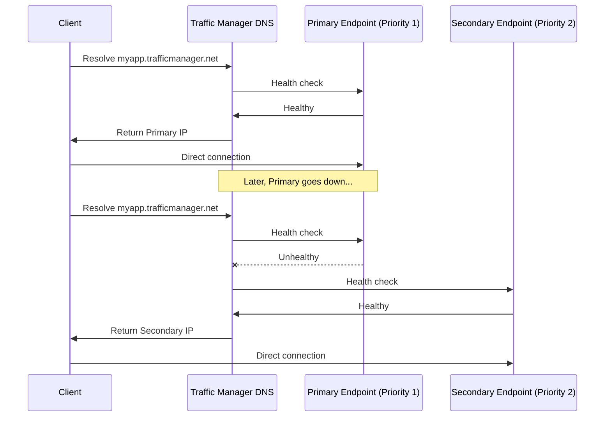

# How to Configure Azure Traffic Manager with Priority Routing Method

Author: [nawazdhandala](https://www.github.com/nawazdhandala)

Tags: Azure, Traffic Manager, DNS Routing, Priority Routing, Failover, High Availability, Azure Networking

Description: Learn how to set up Azure Traffic Manager with priority routing to implement active-passive failover for your applications across Azure regions.

---

Azure Traffic Manager is a DNS-based global traffic load balancer. It does not proxy traffic or sit in the data path. Instead, it uses DNS to direct clients to the most appropriate endpoint based on the routing method you configure. Priority routing is the simplest and most commonly used method for active-passive failover scenarios.

With priority routing, all traffic goes to your primary endpoint. If that endpoint becomes unhealthy, Traffic Manager automatically fails over to the next priority endpoint. This gives you automatic disaster recovery across regions without any client-side changes.

## How Priority Routing Works

When a client resolves your Traffic Manager domain, here is what happens:



Traffic Manager always returns the healthy endpoint with the lowest priority number (highest priority). If endpoint with priority 1 is healthy, it always gets returned. Only when it fails do lower-priority endpoints get used.

## Prerequisites

- An Azure subscription
- Two or more endpoints in different regions (App Services, VMs with public IPs, or external endpoints)
- Azure CLI installed
- A custom domain (optional but recommended)

## Step 1: Create a Traffic Manager Profile

```bash
# Create a resource group
az group create --name rg-tm-demo --location eastus

# Create a Traffic Manager profile with priority routing
az network traffic-manager profile create \
  --resource-group rg-tm-demo \
  --name tm-myapp \
  --routing-method Priority \
  --unique-dns-name myapp-tm-demo \
  --ttl 30 \
  --protocol HTTPS \
  --port 443 \
  --path /health \
  --status Enabled
```

Important parameters:

- `--routing-method Priority`: Uses priority-based routing for failover
- `--unique-dns-name`: Creates the FQDN `myapp-tm-demo.trafficmanager.net`
- `--ttl 30`: DNS time-to-live in seconds. Lower values mean faster failover but more DNS queries. 30 seconds is a good balance.
- `--protocol HTTPS`, `--port 443`, `--path /health`: The health check configuration. Traffic Manager will probe each endpoint with `GET https://<endpoint>:443/health`

## Step 2: Create the Primary Endpoint

Add your primary region endpoint with the highest priority (lowest number).

```bash
# Add the primary endpoint (East US App Service)
az network traffic-manager endpoint create \
  --resource-group rg-tm-demo \
  --profile-name tm-myapp \
  --name ep-primary-eastus \
  --type azureEndpoints \
  --target-resource-id $(az webapp show --resource-group rg-app-eastus --name myapp-eastus --query id -o tsv) \
  --priority 1 \
  --endpoint-status Enabled
```

If your endpoint is not an Azure resource (like an on-premises server or third-party service), use an external endpoint:

```bash
# Add an external endpoint
az network traffic-manager endpoint create \
  --resource-group rg-tm-demo \
  --profile-name tm-myapp \
  --name ep-primary-external \
  --type externalEndpoints \
  --target "myapp-primary.example.com" \
  --priority 1 \
  --endpoint-status Enabled
```

## Step 3: Create the Secondary Endpoint

Add the failover endpoint with a lower priority (higher number).

```bash
# Add the secondary endpoint (West Europe App Service)
az network traffic-manager endpoint create \
  --resource-group rg-tm-demo \
  --profile-name tm-myapp \
  --name ep-secondary-westeurope \
  --type azureEndpoints \
  --target-resource-id $(az webapp show --resource-group rg-app-westeurope --name myapp-westeurope --query id -o tsv) \
  --priority 2 \
  --endpoint-status Enabled
```

## Step 4: Add a Tertiary Endpoint (Optional)

For even more resilience, add a third endpoint.

```bash
# Add a tertiary endpoint (Southeast Asia App Service)
az network traffic-manager endpoint create \
  --resource-group rg-tm-demo \
  --profile-name tm-myapp \
  --name ep-tertiary-seasia \
  --type azureEndpoints \
  --target-resource-id $(az webapp show --resource-group rg-app-seasia --name myapp-seasia --query id -o tsv) \
  --priority 3 \
  --endpoint-status Enabled
```

Now Traffic Manager will try endpoints in order: Priority 1 first, then Priority 2, then Priority 3.

## Step 5: Verify the Configuration

Check the profile and endpoint health status.

```bash
# Show the Traffic Manager profile
az network traffic-manager profile show \
  --resource-group rg-tm-demo \
  --name tm-myapp \
  --output table

# List all endpoints and their status
az network traffic-manager endpoint list \
  --resource-group rg-tm-demo \
  --profile-name tm-myapp \
  --type azureEndpoints \
  --output table
```

## Step 6: Test DNS Resolution

Verify that Traffic Manager returns the primary endpoint.

```bash
# Resolve the Traffic Manager FQDN
nslookup myapp-tm-demo.trafficmanager.net

# You should see the primary endpoint's IP address
```

## Step 7: Configure a Custom Domain

Instead of having users access `myapp-tm-demo.trafficmanager.net`, point your custom domain to it with a CNAME record.

At your DNS provider, create:

- **Record type**: CNAME
- **Name**: `www` (or `app`, or whatever subdomain)
- **Value**: `myapp-tm-demo.trafficmanager.net`

```bash
# Verify with nslookup
nslookup www.myapp.com
# Should resolve to myapp-tm-demo.trafficmanager.net
# Which then resolves to the primary endpoint's IP
```

## Health Check Configuration

The health check settings on the profile determine how quickly Traffic Manager detects failures and fails over.

```bash
# Update health check settings for faster failover
az network traffic-manager profile update \
  --resource-group rg-tm-demo \
  --name tm-myapp \
  --monitor-protocol HTTPS \
  --monitor-port 443 \
  --monitor-path /health \
  --monitor-interval 10 \
  --monitor-timeout 5 \
  --monitor-failures 3
```

With these settings:

- Traffic Manager checks every 10 seconds
- Each check times out after 5 seconds
- After 3 consecutive failures (30 seconds), the endpoint is marked unhealthy
- With a DNS TTL of 30 seconds, total failover time is roughly 60 seconds

## Testing Failover

To test failover without actually breaking your primary endpoint, you can disable it.

```bash
# Disable the primary endpoint to simulate failure
az network traffic-manager endpoint update \
  --resource-group rg-tm-demo \
  --profile-name tm-myapp \
  --name ep-primary-eastus \
  --type azureEndpoints \
  --endpoint-status Disabled

# Wait for TTL to expire, then check DNS
nslookup myapp-tm-demo.trafficmanager.net
# Should now return the secondary endpoint's IP

# Re-enable the primary endpoint
az network traffic-manager endpoint update \
  --resource-group rg-tm-demo \
  --profile-name tm-myapp \
  --name ep-primary-eastus \
  --type azureEndpoints \
  --endpoint-status Enabled
```

## Failover Time Breakdown

Understanding the total failover time helps set expectations:

```mermaid
gantt
    title Failover Timeline
    dateFormat s
    axisFormat %S seconds
    section Detection
    Health check interval (10s)    :a1, 0, 10s
    Failure 1 detected             :milestone, 10, 0
    Health check interval (10s)    :a2, 10, 10s
    Failure 2 detected             :milestone, 20, 0
    Health check interval (10s)    :a3, 20, 10s
    Failure 3 detected             :milestone, 30, 0
    section DNS Update
    DNS propagation               :a4, 30, 5s
    section Client TTL
    Client DNS cache (30s TTL)    :a5, 35, 30s
```



Total worst-case failover: ~65 seconds with the settings above.

## Monitoring Traffic Manager

Set up alerts to know when failover happens.

```bash
# Create an alert for endpoint degradation
TM_ID=$(az network traffic-manager profile show --resource-group rg-tm-demo --name tm-myapp --query id -o tsv)

az monitor metrics alert create \
  --resource-group rg-tm-demo \
  --name "alert-tm-endpoint-down" \
  --scopes $TM_ID \
  --condition "avg ProbeAgentCurrentEndpointStateByProfileResourceId < 1" \
  --window-size 5m \
  --evaluation-frequency 1m \
  --severity 2 \
  --description "Traffic Manager endpoint is unhealthy"
```

## Cleanup

```bash
# Delete the resource group
az group delete --name rg-tm-demo --yes --no-wait
```

## Wrapping Up

Azure Traffic Manager with priority routing gives you DNS-based active-passive failover with minimal configuration. Set your primary endpoint to priority 1, your secondary to priority 2, configure health checks, and Traffic Manager handles the rest. Keep the DNS TTL low for faster failover, implement meaningful health check endpoints on your backends, and test failover regularly to make sure everything works when you actually need it. The DNS-based approach means it works with any endpoint type - Azure resources, on-premises servers, or third-party services - making it one of the most flexible failover solutions available.
