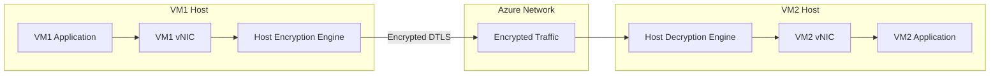

# How to Configure Azure Virtual Network Encryption for Intra-VNet Traffic Protection

Author: [nawazdhandala](https://www.github.com/nawazdhandala)

Tags: Azure, Virtual Network, Encryption, Security, Data Protection, Networking, Zero Trust

Description: Enable Azure Virtual Network encryption to protect data in transit between virtual machines within the same VNet using DTLS-based wire-level encryption.

---

Traffic between VMs in the same Azure virtual network is generally considered secure because it stays within the Azure infrastructure. But "generally secure" is not good enough for workloads handling sensitive data. Compliance frameworks like PCI DSS, HIPAA, and certain government standards require encryption of data in transit, even within a private network. Azure Virtual Network encryption addresses this by encrypting traffic between VMs at the wire level, using DTLS encryption handled entirely by the Azure infrastructure.

This guide covers how to enable VNet encryption, understand what it protects, configure it for your environment, and verify it is working.

## How VNet Encryption Works

VNet encryption operates at the network layer, below your applications. When enabled, all traffic between VMs in the VNet is encrypted using DTLS (Datagram Transport Layer Security). The encryption and decryption happen on the Azure host infrastructure, not inside the VM, which means:

- No performance impact on the VM's CPU (encryption is handled by the host)
- No configuration changes inside the VM
- No application code changes
- No certificate management in the VM



The VM sends unencrypted traffic to its virtual NIC. The host infrastructure intercepts it, encrypts it with DTLS, sends it across the Azure network, and the receiving host decrypts it before delivering to the destination VM. The VMs never see the encryption - it is completely transparent.

## Prerequisites

- An Azure subscription
- VMs that support accelerated networking (most modern VM sizes do)
- VMs using VM sizes that support VNet encryption (requires specific hardware generations)
- Azure CLI version 2.44 or later
- The VNet and VMs must be in a supported region

## Supported VM Sizes

VNet encryption requires VM sizes that run on specific hardware with encryption support. The commonly supported sizes include:

- **D-series v5 and later**: Dsv5, Ddsv5, Dasv5
- **E-series v5 and later**: Esv5, Edsv5, Easv5
- **F-series v2**: Fsv2
- **M-series**: Msv2, Mdsv2
- **L-series v3**: Lsv3

Check the Azure documentation for the complete list, as it expands regularly.

## Step 1: Enable Encryption on the Virtual Network

VNet encryption is enabled at the VNet level:

```bash
# Enable VNet encryption
az network vnet update \
  --name myVNet \
  --resource-group myResourceGroup \
  --enable-encryption true \
  --encryption-enforcement-policy AllowUnencrypted
```

The `--encryption-enforcement-policy` has two options:

- **AllowUnencrypted**: Encrypts traffic between VMs that support encryption, but allows unencrypted traffic to/from VMs that do not support it. This is the safe starting point.
- **DropUnencrypted**: Only allows encrypted traffic. VMs that do not support VNet encryption will lose connectivity to other VMs. Use this only when you are certain all VMs in the VNet support encryption.

## Step 2: Create a New VNet with Encryption

If you are starting from scratch, enable encryption during VNet creation:

```bash
# Create a new VNet with encryption enabled
az network vnet create \
  --name myEncryptedVNet \
  --resource-group myResourceGroup \
  --location eastus \
  --address-prefixes "10.0.0.0/16" \
  --subnet-name default \
  --subnet-prefixes "10.0.1.0/24" \
  --enable-encryption true \
  --encryption-enforcement-policy AllowUnencrypted
```

## Step 3: Verify VNet Encryption Is Enabled

Check the encryption status of your VNet:

```bash
# Verify VNet encryption settings
az network vnet show \
  --name myVNet \
  --resource-group myResourceGroup \
  --query "{Name:name, EncryptionEnabled:encryption.enabled, EnforcementPolicy:encryption.enforcement}" \
  --output table
```

## Step 4: Verify VM Support for Encryption

Check whether your existing VMs support VNet encryption by verifying their NIC configuration:

```bash
# Check if a VM's NIC supports encryption
# Accelerated networking must be enabled
az network nic show \
  --name myvm-nic \
  --resource-group myResourceGroup \
  --query "{Name:name, AcceleratedNetworking:enableAcceleratedNetworking, VMSize:virtualMachine}" \
  --output table
```

If accelerated networking is not enabled, enable it:

```bash
# Enable accelerated networking on the NIC
# Note: The VM must be stopped/deallocated to change this
az vm deallocate \
  --name myVM \
  --resource-group myResourceGroup

az network nic update \
  --name myvm-nic \
  --resource-group myResourceGroup \
  --accelerated-networking true

az vm start \
  --name myVM \
  --resource-group myResourceGroup
```

## Step 5: Deploy VMs with Encryption Support

When creating new VMs in the encrypted VNet, ensure you use a supported VM size with accelerated networking:

```bash
# Create a VM that supports VNet encryption
az vm create \
  --name myEncryptedVM \
  --resource-group myResourceGroup \
  --location eastus \
  --image Ubuntu2204 \
  --size Standard_D4s_v5 \
  --vnet-name myEncryptedVNet \
  --subnet default \
  --accelerated-networking true \
  --admin-username azureuser \
  --generate-ssh-keys
```

The combination of a supported VM size and accelerated networking ensures the VM participates in VNet encryption.

## Step 6: Transition to DropUnencrypted Enforcement

Once you have verified that all VMs in the VNet support encryption, you can switch to strict enforcement:

```bash
# First, list all VMs in the VNet and check their encryption support
az vm list \
  --resource-group myResourceGroup \
  --query "[].{Name:name, Size:hardwareProfile.vmSize}" \
  --output table

# If all VMs are on supported sizes, switch to strict enforcement
az network vnet update \
  --name myVNet \
  --resource-group myResourceGroup \
  --encryption-enforcement-policy DropUnencrypted
```

With DropUnencrypted, any VM that does not support encryption will lose intra-VNet connectivity. This is the most secure option but requires careful validation first.

## Step 7: Monitor Encryption Status

Azure provides metrics and diagnostics for VNet encryption. Check the encryption state of network flows:

```bash
# Enable Network Watcher flow logs with traffic analytics
az network watcher flow-log create \
  --name vnet-encryption-flow-log \
  --resource-group myResourceGroup \
  --nsg myNSG \
  --storage-account myStorageAccount \
  --enabled true \
  --format JSON \
  --log-version 2 \
  --traffic-analytics true \
  --workspace "/subscriptions/{sub-id}/resourceGroups/myResourceGroup/providers/Microsoft.OperationalInsights/workspaces/myWorkspace"
```

You can also verify encryption at the packet level using traffic analytics:

```
// KQL query to check traffic encryption status
AzureNetworkAnalytics_CL
| where FlowType_s == "IntraVNet"
| summarize FlowCount = count() by Encrypted_s, bin(TimeGenerated, 1h)
| render timechart
```

## What VNet Encryption Protects

VNet encryption protects the following traffic:

- **VM to VM**: Traffic between two VMs in the same VNet
- **VM to load balancer**: Traffic between VMs and internal load balancers
- **VM to VNet peered VM**: Traffic between VMs in peered VNets (when both VNets have encryption enabled)

## What VNet Encryption Does Not Protect

There are traffic types that VNet encryption does not cover:

- **Traffic to/from Azure PaaS services**: Use Private Endpoints with service-side encryption for PaaS
- **Traffic to/from the internet**: Use TLS at the application layer
- **Traffic through VPN or ExpressRoute**: These have their own encryption (IPsec for VPN)
- **DNS traffic to Azure DNS**: Uses a separate channel
- **Traffic to Azure management endpoints**: Metadata service, IMDS, etc.

For a complete zero-trust network posture, combine VNet encryption with application-layer TLS and Private Endpoints for PaaS services.

## Performance Considerations

Since encryption is handled by the host infrastructure (not the VM), the performance impact is minimal:

- **Latency**: Adds microseconds, not milliseconds. For most applications, this is undetectable.
- **Throughput**: No measurable throughput reduction because encryption uses dedicated hardware on the host.
- **CPU impact on VMs**: Zero. The VM does not participate in encryption.

The main constraint is VM size compatibility. If you need to use VM sizes that do not support VNet encryption, you must use the AllowUnencrypted policy and rely on application-layer encryption for those specific VMs.

## VNet Peering and Encryption

When two VNets are peered and both have encryption enabled, traffic between VMs in the peered VNets is also encrypted. Both VNets must have encryption enabled for cross-VNet traffic to be encrypted:

```bash
# Enable encryption on both VNets
az network vnet update \
  --name vnet1 \
  --resource-group myResourceGroup \
  --enable-encryption true \
  --encryption-enforcement-policy AllowUnencrypted

az network vnet update \
  --name vnet2 \
  --resource-group myResourceGroup \
  --enable-encryption true \
  --encryption-enforcement-policy AllowUnencrypted

# Create peering between the VNets
az network vnet peering create \
  --name vnet1-to-vnet2 \
  --resource-group myResourceGroup \
  --vnet-name vnet1 \
  --remote-vnet vnet2 \
  --allow-vnet-access

az network vnet peering create \
  --name vnet2-to-vnet1 \
  --resource-group myResourceGroup \
  --vnet-name vnet2 \
  --remote-vnet vnet1 \
  --allow-vnet-access
```

## Wrapping Up

Azure Virtual Network encryption provides wire-level encryption for intra-VNet traffic without any changes to your VMs or applications. The encryption happens on the host infrastructure, so there is no performance impact on your workloads. Start with the AllowUnencrypted enforcement policy to ensure compatibility with all your existing VMs, verify that all VMs support encryption, and then optionally switch to DropUnencrypted for strict enforcement. Combined with application-layer TLS and Private Endpoints, VNet encryption fills the gap for in-transit data protection within your Azure network infrastructure.
