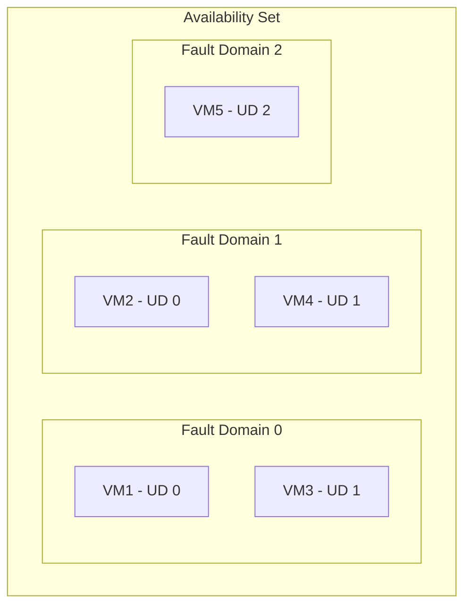

# How to Configure Azure VM Availability Sets for High Availability

Author: [nawazdhandala](https://www.github.com/nawazdhandala)

Tags: Azure, Virtual Machine, Availability Sets, High Availability, Fault Domains, Update Domains, Cloud Infrastructure

Description: Learn how to use Azure VM availability sets to protect your workloads from hardware failures and planned maintenance events.

---

When you run a single VM on Azure, you are at the mercy of hardware failures and planned maintenance events. If the physical host goes down or needs a reboot for a platform update, your VM goes with it. Availability sets solve this by distributing your VMs across multiple fault domains and update domains, ensuring that not all of your VMs are affected by the same event.

In this post, I will explain how availability sets work, how to set them up, and when you should use them versus availability zones.

## How Availability Sets Work

An availability set is a logical grouping of VMs that tells Azure to spread them across the datacenter's physical infrastructure. Two concepts drive this:

**Fault domains (FDs)**: A fault domain maps to a physical server rack in the datacenter. VMs in different fault domains are on different racks with independent power, cooling, and network switches. If a rack fails, only VMs in that fault domain are affected. An availability set can have up to 3 fault domains.

**Update domains (UDs)**: An update domain is a logical group of VMs that Azure reboots together during planned maintenance. VMs in different update domains are rebooted at different times, so your application stays available during platform updates. An availability set can have up to 20 update domains.

Here is how VMs get distributed across fault and update domains:



With this distribution, if Fault Domain 0's rack loses power, only VM1 and VM3 are affected. If Update Domain 0 is being rebooted for maintenance, only VM1 and VM2 are rebooted at the same time.

## Creating an Availability Set

Create an availability set before creating the VMs that will use it:

```bash
# Create an availability set with 3 fault domains and 5 update domains
az vm availability-set create \
  --resource-group myResourceGroup \
  --name myAvailabilitySet \
  --platform-fault-domain-count 3 \
  --platform-update-domain-count 5 \
  --location eastus
```

The maximum fault domain count depends on the region. Most regions support 3, but some smaller regions only support 2. The update domain count can be between 1 and 20.

For managed disks (which you should be using), Azure automatically aligns the disk fault domains with the VM fault domains. This means your disks are protected from rack-level failures just like the VMs themselves.

## Adding VMs to an Availability Set

VMs must be added to an availability set at creation time. You cannot move an existing VM into an availability set after the fact.

```bash
# Create the first VM in the availability set
az vm create \
  --resource-group myResourceGroup \
  --name webServer1 \
  --availability-set myAvailabilitySet \
  --image Ubuntu2204 \
  --size Standard_D2s_v5 \
  --admin-username azureuser \
  --generate-ssh-keys \
  --no-wait

# Create the second VM in the same availability set
az vm create \
  --resource-group myResourceGroup \
  --name webServer2 \
  --availability-set myAvailabilitySet \
  --image Ubuntu2204 \
  --size Standard_D2s_v5 \
  --admin-username azureuser \
  --generate-ssh-keys \
  --no-wait

# Create the third VM
az vm create \
  --resource-group myResourceGroup \
  --name webServer3 \
  --availability-set myAvailabilitySet \
  --image Ubuntu2204 \
  --size Standard_D2s_v5 \
  --admin-username azureuser \
  --generate-ssh-keys
```

The `--no-wait` flag on the first two VMs lets them be created in parallel, which saves time.

## Verifying Fault Domain and Update Domain Placement

After creating the VMs, check which fault domain and update domain each VM landed in:

```bash
# Show the fault domain and update domain for each VM in the availability set
az vm availability-set show \
  --resource-group myResourceGroup \
  --name myAvailabilitySet \
  --query virtualMachines[].id \
  --output tsv

# Check specific VM placement
az vm get-instance-view \
  --resource-group myResourceGroup \
  --name webServer1 \
  --query instanceView.platformFaultDomain \
  --output tsv
```

You can also see the full availability set status:

```bash
# View the availability set details including fault and update domain assignments
az vm availability-set show \
  --resource-group myResourceGroup \
  --name myAvailabilitySet \
  --output json
```

## Putting a Load Balancer in Front

An availability set on its own distributes VMs across fault domains, but it does not handle traffic distribution. You need a load balancer for that:

```bash
# Create a public IP for the load balancer
az network public-ip create \
  --resource-group myResourceGroup \
  --name lbPublicIP \
  --sku Standard \
  --allocation-method Static

# Create the load balancer
az network lb create \
  --resource-group myResourceGroup \
  --name myLoadBalancer \
  --sku Standard \
  --public-ip-address lbPublicIP \
  --frontend-ip-name myFrontend \
  --backend-pool-name myBackendPool

# Create a health probe
az network lb probe create \
  --resource-group myResourceGroup \
  --lb-name myLoadBalancer \
  --name healthProbe \
  --protocol Tcp \
  --port 80

# Create a load balancing rule
az network lb rule create \
  --resource-group myResourceGroup \
  --lb-name myLoadBalancer \
  --name httpRule \
  --protocol Tcp \
  --frontend-port 80 \
  --backend-port 80 \
  --frontend-ip-name myFrontend \
  --backend-pool-name myBackendPool \
  --probe-name healthProbe
```

Then add the VMs' NICs to the backend pool. The load balancer's health probes automatically detect when a VM is down and stop routing traffic to it.

## VM Size Constraints

All VMs in an availability set must be compatible with the same hardware cluster. This means you are limited to VM sizes that are available on the same physical infrastructure. In practice, this is rarely an issue, but if you try to add a VM with a size that is not available on the cluster, the creation will fail.

If you need to change the VM size of all VMs in an availability set, you may need to deallocate all of them first so Azure can move them to a cluster that supports the new size.

```bash
# Check available sizes for an existing VM in an availability set
az vm list-vm-resize-options \
  --resource-group myResourceGroup \
  --name webServer1 \
  --output table
```

## Availability Sets vs. Availability Zones

Azure also offers availability zones, which provide a higher level of protection. Here is how they compare:

| Feature | Availability Sets | Availability Zones |
|---------|------------------|-------------------|
| Protection level | Rack-level (fault domains) | Datacenter-level (separate buildings) |
| SLA | 99.95% | 99.99% |
| Fault isolation | Same datacenter, different racks | Different datacenters in same region |
| Network latency | Sub-millisecond between VMs | Low, typically 1-2ms between zones |
| Cost | No extra cost | No extra cost for VMs, but cross-zone traffic has costs |

Use availability zones when you need the highest level of protection against datacenter failures. Use availability sets when your region does not support zones or when you need the VMs to be very close together for latency-sensitive communication.

You cannot combine both - a VM is either in an availability set or in a specific availability zone, not both.

## When to Use Availability Sets

Availability sets are the right choice when:

- Your application needs multiple identical VMs for redundancy.
- You are deploying in a region that does not support availability zones.
- Network latency between your VMs must be as low as possible (same datacenter).
- You are running a legacy application that does not handle multi-zone networking well.

## Migrating Existing VMs into an Availability Set

If you have existing VMs that you want to put into an availability set, you cannot move them directly. You need to:

1. Create the availability set.
2. Delete the existing VMs (but keep the disks).
3. Recreate the VMs in the availability set, attaching the original disks.

```bash
# Step 1: Record the VM configuration
az vm show --resource-group myResourceGroup --name myVM --output json > vm-config.json

# Step 2: Delete the VM (keeps the disks)
az vm delete --resource-group myResourceGroup --name myVM --yes

# Step 3: Recreate the VM in the availability set with the original OS disk
az vm create \
  --resource-group myResourceGroup \
  --name myVM \
  --availability-set myAvailabilitySet \
  --attach-os-disk myVM_OsDisk \
  --os-type Linux \
  --size Standard_D2s_v5
```

This preserves your data but requires downtime. Plan accordingly.

## Monitoring Availability Set Health

You can monitor the health of your availability set through Azure Monitor:

```bash
# Check the status of all VMs in the availability set
az vm list \
  --resource-group myResourceGroup \
  --query "[?availabilitySet!=null].{Name:name, Status:provisioningState}" \
  --output table
```

Set up alerts to notify you when a VM in the availability set becomes unavailable. This way, you know immediately when a fault domain event impacts one of your VMs and can take corrective action.

## Wrapping Up

Availability sets are one of the simplest ways to improve the resiliency of your Azure workloads. By spreading VMs across fault domains and update domains, you protect against both hardware failures and planned maintenance events. The setup takes just a few extra commands during VM creation, and the 99.95% SLA gives you confidence that your application will stay available. Pair your availability set with a load balancer and health probes, and you have a solid foundation for highly available infrastructure.
