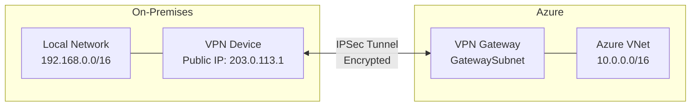

# How to Configure Azure VPN Gateway for Site-to-Site Connectivity

Author: [nawazdhandala](https://www.github.com/nawazdhandala)

Tags: Azure, VPN Gateway, Site-to-Site VPN, Hybrid Networking, Azure Networking, IPSec

Description: Learn how to set up an Azure VPN Gateway with a site-to-site IPSec connection to link your on-premises network with an Azure virtual network.

---

A site-to-site (S2S) VPN connects your on-premises network to an Azure virtual network through an encrypted IPSec/IKE tunnel over the public internet. This is one of the most common hybrid networking patterns - your office or data center gets a secure tunnel into Azure, and resources on both sides can communicate as if they are on the same network.

Setting up a site-to-site VPN in Azure involves several components: a VPN gateway on the Azure side, a local network gateway representing your on-premises network, and a connection object that ties them together. This guide walks through all of it.

## Architecture Overview



## Prerequisites

- An Azure subscription
- A VPN device on-premises with a public IP address (or a simulated environment for testing)
- The public IP address and address space of your on-premises network
- Azure CLI installed

## Step 1: Create the Virtual Network and Gateway Subnet

The VPN gateway requires a special subnet named exactly `GatewaySubnet`. Do not use any other name.

```bash
# Create a resource group
az group create --name rg-vpn-demo --location eastus

# Create a virtual network
az network vnet create \
  --resource-group rg-vpn-demo \
  --name vnet-azure \
  --location eastus \
  --address-prefixes 10.0.0.0/16 \
  --subnet-name subnet-workloads \
  --subnet-prefixes 10.0.0.0/24

# Create the GatewaySubnet (must be named exactly GatewaySubnet)
az network vnet subnet create \
  --resource-group rg-vpn-demo \
  --vnet-name vnet-azure \
  --name GatewaySubnet \
  --address-prefixes 10.0.255.0/27
```

The GatewaySubnet should be at least a /27 for production use. A /28 works but leaves no room for future expansion. Microsoft recommends /27 as the minimum.

## Step 2: Create a Public IP for the VPN Gateway

```bash
# Create a public IP address for the VPN gateway
az network public-ip create \
  --resource-group rg-vpn-demo \
  --name pip-vpn-gateway \
  --sku Standard \
  --allocation-method Static
```

## Step 3: Create the VPN Gateway

This step takes 30-45 minutes. The VPN gateway is a pair of VMs deployed into the GatewaySubnet, and Azure needs time to provision them.

```bash
# Create the VPN gateway (this takes 30-45 minutes)
az network vnet-gateway create \
  --resource-group rg-vpn-demo \
  --name vng-azure \
  --location eastus \
  --vnet vnet-azure \
  --gateway-type Vpn \
  --vpn-type RouteBased \
  --sku VpnGw2 \
  --public-ip-addresses pip-vpn-gateway \
  --no-wait
```

A few notes on the options:

- `--gateway-type Vpn`: This is a VPN gateway (as opposed to ExpressRoute).
- `--vpn-type RouteBased`: Route-based VPNs support more features than policy-based, including site-to-site and point-to-site simultaneously. Always use RouteBased unless you have a specific reason not to.
- `--sku VpnGw2`: The SKU determines throughput and features. VpnGw2 supports up to 1.25 Gbps. Choose based on your bandwidth needs.

You can check the provisioning status with:

```bash
# Check if the gateway has finished provisioning
az network vnet-gateway show \
  --resource-group rg-vpn-demo \
  --name vng-azure \
  --query "provisioningState" --output tsv
```

Wait until it shows `Succeeded` before proceeding.

## Step 4: Create the Local Network Gateway

The local network gateway represents your on-premises VPN device. You need to specify the public IP of your VPN device and the address ranges of your on-premises network.

```bash
# Create the local network gateway (represents on-premises)
az network local-gateway create \
  --resource-group rg-vpn-demo \
  --name lng-onpremises \
  --gateway-ip-address 203.0.113.1 \
  --local-address-prefixes 192.168.0.0/16
```

Replace `203.0.113.1` with your actual on-premises VPN device's public IP and `192.168.0.0/16` with your on-premises network ranges. You can specify multiple address prefixes separated by spaces.

## Step 5: Create the VPN Connection

Now create the connection between the Azure VPN gateway and the local network gateway.

```bash
# Create the site-to-site VPN connection
az network vpn-connection create \
  --resource-group rg-vpn-demo \
  --name conn-azure-to-onprem \
  --vnet-gateway1 vng-azure \
  --local-gateway2 lng-onpremises \
  --shared-key "YourSuperSecretSharedKey123!" \
  --location eastus
```

The shared key must match exactly on both sides. Use the same key when configuring your on-premises VPN device. Make it strong - at least 32 characters with a mix of letters, numbers, and symbols.

## Step 6: Configure the On-Premises VPN Device

This part depends on your hardware. Azure provides configuration scripts for many popular VPN devices. You can download a configuration script from the portal:

1. Go to the VPN connection resource in the Azure portal
2. Click "Download configuration"
3. Select your VPN device vendor, model, and firmware version
4. Download and apply the configuration

The key parameters your on-premises device needs:

| Parameter | Value |
|---|---|
| Azure VPN Gateway Public IP | (from pip-vpn-gateway) |
| Shared Key (PSK) | YourSuperSecretSharedKey123! |
| Azure VNet Address Space | 10.0.0.0/16 |
| IKE Version | IKEv2 (recommended) |
| Encryption | AES256 |
| Integrity | SHA256 |
| DH Group | DHGroup14 or higher |

## Step 7: Verify the Connection

After configuring both sides, check the connection status.

```bash
# Check connection status
az network vpn-connection show \
  --resource-group rg-vpn-demo \
  --name conn-azure-to-onprem \
  --query "connectionStatus" --output tsv
```

A healthy connection shows `Connected`. If it shows `Connecting` or `Unknown`, the tunnel has not been established yet. Common reasons include mismatched shared keys, firewall blocking UDP ports 500 and 4500, or incompatible IKE/IPSec parameters.

## Troubleshooting Connection Issues

If the connection does not come up, here are the usual suspects:

**Shared key mismatch.** Double-check that both sides use exactly the same pre-shared key. Even a trailing space can cause failure.

**Firewall blocking IPSec.** Your on-premises firewall must allow UDP ports 500 (IKE) and 4500 (NAT traversal), plus IP protocol 50 (ESP).

**IKE parameter mismatch.** The encryption algorithm, integrity algorithm, and DH group must match on both sides. Azure supports several combinations, and your device needs to match at least one.

**Address space overlap.** Your on-premises address space must not overlap with the Azure VNet address space. If both use 10.0.0.0/8, routing breaks.

Use the VPN diagnostics tool in Azure Network Watcher for detailed troubleshooting:

```bash
# Start VPN troubleshooting
az network watcher troubleshooting start \
  --resource-group rg-vpn-demo \
  --resource vng-azure \
  --resource-type vpnGateway \
  --storage-account ststoragediag \
  --storage-path "https://ststoragediag.blob.core.windows.net/vpn-diag"
```

## IPSec/IKE Policy Customization

For stricter security requirements, you can specify custom IPSec/IKE policies on the connection.

```bash
# Set a custom IPSec/IKE policy
az network vpn-connection ipsec-policy add \
  --resource-group rg-vpn-demo \
  --connection-name conn-azure-to-onprem \
  --ike-encryption AES256 \
  --ike-integrity SHA384 \
  --dh-group DHGroup14 \
  --ipsec-encryption AES256 \
  --ipsec-integrity SHA256 \
  --pfs-group PFS2048 \
  --sa-lifetime 28800 \
  --sa-max-size 1024
```

## Cleanup

```bash
# Delete all resources (gateway deletion also takes a while)
az group delete --name rg-vpn-demo --yes --no-wait
```

## Wrapping Up

Setting up a site-to-site VPN with Azure VPN Gateway gives your on-premises network a secure, encrypted tunnel into Azure. The process involves creating a VPN gateway (the longest wait), defining your on-premises network via a local network gateway, and creating a connection with a shared key. The most common issues are mismatched shared keys and firewall rules blocking IPSec traffic. Once the tunnel is up, traffic flows transparently between your networks, and you can manage it just like local network traffic with NSGs and route tables on the Azure side.
