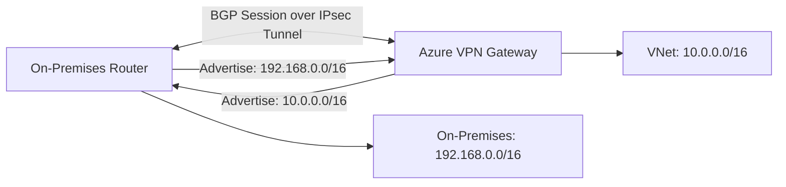

# How to Configure Azure VPN Gateway with BGP for Dynamic Routing

Author: [nawazdhandala](https://www.github.com/nawazdhandala)

Tags: Azure, VPN Gateway, BGP, Dynamic Routing, Networking, Hybrid Cloud, Site-to-Site VPN

Description: Learn how to configure Azure VPN Gateway with BGP (Border Gateway Protocol) for dynamic route exchange between your on-premises network and Azure.

---

Static routing works fine for simple site-to-site VPN connections where you have a handful of subnets on each side. But as your network grows and you add more sites, subnets, and redundant connections, managing static routes becomes unsustainable. You end up maintaining route tables by hand, and every time someone adds a new subnet on-premises, you have to remember to update Azure too.

BGP (Border Gateway Protocol) eliminates this manual work by automatically exchanging routes between your on-premises routers and Azure VPN Gateway. When a new subnet appears on-premises, your router advertises it through BGP, and Azure learns about it automatically. The same works in reverse.

## What BGP Does for VPN Connections

BGP is a dynamic routing protocol that lets routers automatically share their routing information. In the context of Azure VPN, it provides:

- **Automatic route propagation.** New subnets are learned automatically without manual route table updates.
- **Failover routing.** When you have redundant VPN tunnels, BGP detects failures and reroutes traffic to the healthy tunnel.
- **Transit routing.** Multiple sites can learn about each other's routes through the Azure VPN Gateway.
- **Route summarization.** You can advertise summarized routes instead of individual subnets.

## How BGP Works with Azure VPN Gateway



The BGP session runs over the already-established IPsec tunnel. Both sides exchange their known routes, and the routing tables update automatically.

## Prerequisites

1. Azure VPN Gateway SKU that supports BGP (VpnGw1 and above; Basic SKU does not support BGP)
2. An on-premises VPN device that supports BGP
3. ASN (Autonomous System Number) for both sides - Azure defaults to 65515
4. An established site-to-site VPN connection (or you can set up both together)

## Step 1: Create the VPN Gateway with BGP Enabled

```bash
# Create a public IP for the gateway
az network public-ip create \
  --resource-group myResourceGroup \
  --name vpnGatewayPIP \
  --sku Standard \
  --allocation-method Static

# Create the VPN Gateway with BGP enabled
az network vnet-gateway create \
  --resource-group myResourceGroup \
  --name myVPNGateway \
  --vnet myVNet \
  --public-ip-address vpnGatewayPIP \
  --gateway-type Vpn \
  --vpn-type RouteBased \
  --sku VpnGw2 \
  --asn 65515 \
  --no-wait
```

The `--asn` parameter sets the Azure-side BGP ASN. The default is 65515, which is fine for most setups. If your on-premises network already uses 65515, choose a different ASN from the private range (64512-65534).

Gateway creation takes 30-45 minutes. Check progress with:

```bash
# Check gateway provisioning state
az network vnet-gateway show \
  --resource-group myResourceGroup \
  --name myVPNGateway \
  --query "provisioningState" \
  --output tsv
```

## Step 2: Get the BGP Peer IP Address

After the gateway is created, get its BGP peer IP address. This is the IP your on-premises router needs to establish the BGP session with:

```bash
# Get the BGP settings of the VPN Gateway
az network vnet-gateway show \
  --resource-group myResourceGroup \
  --name myVPNGateway \
  --query "bgpSettings" \
  --output json
```

This returns something like:

```json
{
  "asn": 65515,
  "bgpPeeringAddress": "10.0.255.254",
  "peerWeight": 0
}
```

The `bgpPeeringAddress` is the IP address inside the GatewaySubnet that Azure uses for BGP. Your on-premises router must be able to reach this IP through the VPN tunnel.

## Step 3: Create the Local Network Gateway with BGP

The Local Network Gateway represents your on-premises VPN device. With BGP, you still create one, but you include your on-premises BGP settings:

```bash
# Create the Local Network Gateway with BGP info
az network local-gateway create \
  --resource-group myResourceGroup \
  --name onPremGateway \
  --gateway-ip-address 203.0.113.10 \
  --asn 65510 \
  --bgp-peering-address 192.168.1.1 \
  --peer-weight 0
```

Parameters:
- `--gateway-ip-address` is the public IP of your on-premises VPN device
- `--asn` is your on-premises BGP ASN
- `--bgp-peering-address` is the on-premises router's BGP peer IP (typically a loopback or tunnel interface IP)

Notice that you do not need to specify `--local-address-prefixes` when using BGP. The routes will be learned dynamically. However, you may still include them as a fallback if BGP goes down.

## Step 4: Create the VPN Connection with BGP

```bash
# Create the VPN connection with BGP enabled
az network vpn-connection create \
  --resource-group myResourceGroup \
  --name toOnPrem \
  --vnet-gateway1 myVPNGateway \
  --local-gateway2 onPremGateway \
  --shared-key "YourSharedKey123" \
  --enable-bgp true
```

The `--enable-bgp true` flag is what activates BGP on this connection.

## Step 5: Configure Your On-Premises Router

Your on-premises router needs to be configured with:

1. **IPsec tunnel** to the Azure VPN Gateway public IP
2. **BGP neighbor** pointing to Azure's BGP peer IP (e.g., 10.0.255.254) with ASN 65515
3. **Route advertisement** for your on-premises subnets

Here is an example configuration for a Cisco IOS router:

```
! Configure the BGP session with Azure
router bgp 65510
  neighbor 10.0.255.254 remote-as 65515
  neighbor 10.0.255.254 ebgp-multihop 5
  neighbor 10.0.255.254 update-source Loopback0
  !
  address-family ipv4
    ! Advertise on-premises networks to Azure
    network 192.168.1.0 mask 255.255.255.0
    network 192.168.2.0 mask 255.255.255.0
    network 172.16.0.0 mask 255.255.0.0
    neighbor 10.0.255.254 activate
  exit-address-family
```

The specific configuration depends on your router vendor. Consult your device documentation for BGP configuration syntax.

## Step 6: Verify BGP Peering

After both sides are configured, verify the BGP session:

```bash
# Check BGP peer status
az network vnet-gateway list-bgp-peer-status \
  --resource-group myResourceGroup \
  --name myVPNGateway \
  --output table
```

You should see your on-premises router with a state of `Connected`.

## Step 7: View Learned Routes

Check which routes Azure has learned from your on-premises router:

```bash
# List routes learned via BGP
az network vnet-gateway list-learned-routes \
  --resource-group myResourceGroup \
  --name myVPNGateway \
  --output table
```

You should see your on-premises subnets listed with the source as the BGP peer IP. Similarly, check which routes Azure is advertising to your on-premises router:

```bash
# List routes advertised to the peer
az network vnet-gateway list-advertised-routes \
  --resource-group myResourceGroup \
  --name myVPNGateway \
  --peer "192.168.1.1" \
  --output table
```

Azure advertises the VNet address space and any other connected VNet routes.

## Redundant VPN with BGP Failover

One of the biggest benefits of BGP is automatic failover between redundant tunnels. With active-active VPN gateways:

```bash
# Create an active-active VPN gateway with two public IPs
az network public-ip create \
  --resource-group myResourceGroup \
  --name vpnGatewayPIP2 \
  --sku Standard \
  --allocation-method Static

az network vnet-gateway create \
  --resource-group myResourceGroup \
  --name myAAVPNGateway \
  --vnet myVNet \
  --public-ip-addresses vpnGatewayPIP vpnGatewayPIP2 \
  --gateway-type Vpn \
  --vpn-type RouteBased \
  --sku VpnGw2 \
  --asn 65515 \
  --no-wait
```

Each gateway instance has its own BGP peer IP. Configure your on-premises router with two BGP neighbors. If one tunnel goes down, BGP withdraws routes through that tunnel, and traffic automatically shifts to the other.

## Troubleshooting BGP Issues

**BGP session not establishing.** Verify the IPsec tunnel is up first. BGP runs over the tunnel, so if the tunnel is down, BGP will not work. Check shared keys and IKE proposals.

**Routes not being learned.** Verify the on-premises router is actually advertising routes. Check with `show ip bgp summary` on Cisco or equivalent on your platform.

**Asymmetric routing.** If you have multiple tunnels, BGP may choose a path that does not match what you expect. Use BGP attributes like AS path prepending or local preference to influence path selection.

**ASN conflicts.** Azure and your on-premises network must use different ASNs. If both use 65515, the BGP session will not establish.

## Summary

Configuring BGP on Azure VPN Gateway replaces manual route management with automatic route exchange. Create the gateway with an ASN, set up the Local Network Gateway with your on-premises BGP details, and enable BGP on the connection. Once the BGP session establishes, routes propagate automatically in both directions. For production environments, use active-active gateways with dual BGP sessions for automatic failover. The initial setup is slightly more complex than static routing, but the long-term operational savings are significant, especially as your network grows.
