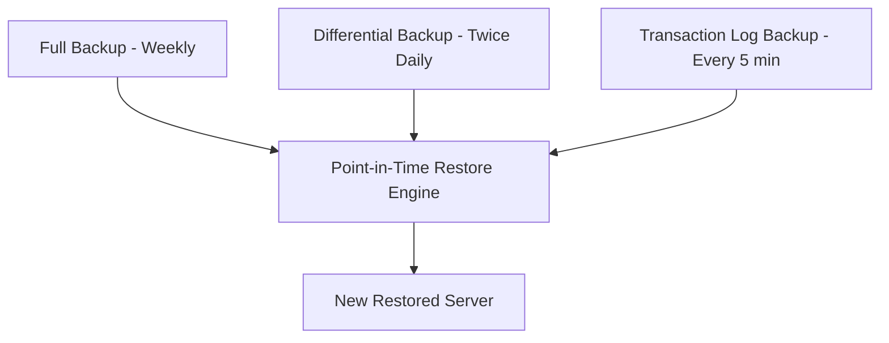

# How to Configure Backup and Restore for Azure Database for MariaDB

Author: [nawazdhandala](https://www.github.com/nawazdhandala)

Tags: Azure, MariaDB, Backup, Restore, Disaster Recovery, Data Protection, Cloud Database

Description: Learn how to configure automated backups, point-in-time restore, and geo-redundant backups for Azure Database for MariaDB to protect your data.

---

Data loss is one of those problems where prevention is infinitely cheaper than recovery. Azure Database for MariaDB handles backups automatically, but understanding how the backup system works, what it covers, and how to restore when needed is essential knowledge for anyone running production workloads. Whether it is an accidental DELETE without a WHERE clause, a bad migration script, or a regional outage, knowing how to recover quickly can save your project.

In this post, I will cover how automated backups work in Azure Database for MariaDB, how to configure them properly, and how to perform restores when you need them.

## How Automated Backups Work

Azure Database for MariaDB takes backups automatically without any manual intervention:

- **Full backups**: Taken weekly.
- **Differential backups**: Taken twice a day.
- **Transaction log backups**: Taken approximately every five minutes.

These three backup types work together to enable point-in-time restore (PITR). You can restore to any second within your retention period, not just to fixed backup points.



The backups are taken using Azure's snapshot-based approach, so they do not impact server performance or require any downtime.

## Configuring Backup Retention

The retention period determines how far back you can restore. You can set it between 7 and 35 days.

### During Server Creation

```bash
# Create a MariaDB server with 14-day backup retention
az mariadb server create \
  --resource-group myResourceGroup \
  --name my-mariadb-server \
  --location eastus \
  --admin-user myadmin \
  --admin-password 'StrongPassword123!' \
  --sku-name GP_Gen5_4 \
  --version 10.3 \
  --storage-size 128000 \
  --backup-retention 14 \
  --geo-redundant-backup Enabled
```

### Updating an Existing Server

```bash
# Change the backup retention period to 21 days
az mariadb server update \
  --resource-group myResourceGroup \
  --name my-mariadb-server \
  --backup-retention 21
```

### Choosing the Right Retention Period

The right retention depends on your use case:

| Scenario | Recommended Retention |
|----------|----------------------|
| Development/testing | 7 days |
| Standard production | 14 days |
| Regulated industries (finance, healthcare) | 35 days |
| Data that changes slowly | 14 days |
| High-frequency data changes | 21-35 days |

The reasoning: if someone runs a bad query that corrupts data and nobody notices for a week, a 7-day retention gives you almost no buffer. With 14 days, you have a full week to discover and recover.

## Backup Storage Redundancy

Azure offers two redundancy options for backup storage:

### Locally Redundant Storage (LRS)

- Three copies within the same datacenter.
- Protects against hardware failure.
- Lower cost.

### Geo-Redundant Storage (GRS)

- Copies in both the primary and paired region.
- Protects against regional disasters.
- Required for geo-restore capability.

```bash
# Check current backup configuration
az mariadb server show \
  --resource-group myResourceGroup \
  --name my-mariadb-server \
  --query "{geoRedundantBackup:storageProfile.geoRedundantBackup, backupRetention:storageProfile.backupRetentionDays}"
```

Important: Backup storage redundancy can only be configured during server creation. You cannot change it afterward. If you need geo-redundant backup and do not currently have it, you will need to create a new server and migrate.

## Point-in-Time Restore (PITR)

PITR is your primary recovery tool. It creates a new server with your data restored to a specific point in time.

### Restore via Azure CLI

```bash
# Restore to a specific point in time
# This creates a completely new server
az mariadb server restore \
  --resource-group myResourceGroup \
  --name my-mariadb-restored \
  --source-server my-mariadb-server \
  --restore-point-in-time "2026-02-15T10:30:00Z"
```

The restored server is a new, independent server. It does not replace the original. This is actually beneficial because you can:

- Compare data between the original and restored servers.
- Selectively export and import specific tables.
- Test the restored data before making changes to production.

### Restore via Azure Portal

1. Navigate to your MariaDB server.
2. Click "Overview."
3. Click "Restore" in the toolbar.
4. Select the restore point using the date/time picker.
5. Enter a name for the new server.
6. Click "OK."

### Finding the Earliest Restore Point

```bash
# Check the earliest available restore point
az mariadb server show \
  --resource-group myResourceGroup \
  --name my-mariadb-server \
  --query "earliestRestoreDate"
```

You cannot restore to a time before this date.

## Geo-Restore

If your primary region is completely unavailable, geo-restore creates a server in the paired region from your geo-redundant backups:

```bash
# Geo-restore to the paired region
az mariadb server georestore \
  --resource-group myDRResourceGroup \
  --name my-mariadb-geo-restored \
  --source-server my-mariadb-server \
  --location westus2
```

Geo-restore characteristics:

- **RPO (Recovery Point Objective)**: Up to 1 hour. Geo-replication of backup data has latency.
- **RTO (Recovery Time Objective)**: Varies by database size, but typically under a few hours.
- The restored server will have the same configuration as the original (SKU, storage, etc.).

## Restoring Specific Tables

Sometimes you only need to recover specific tables or rows, not the entire database. Here is the workflow:

```bash
# Step 1: Restore the full server to a temporary instance
az mariadb server restore \
  --resource-group myResourceGroup \
  --name my-mariadb-temp \
  --source-server my-mariadb-server \
  --restore-point-in-time "2026-02-15T14:00:00Z"

# Step 2: Export the specific tables you need
mysqldump \
  --host=my-mariadb-temp.mariadb.database.azure.com \
  --user=myadmin@my-mariadb-temp \
  --password='StrongPassword123!' \
  --ssl \
  --single-transaction \
  myapp users orders > recovered_data.sql

# Step 3: Import into the production server
mysql \
  --host=my-mariadb-server.mariadb.database.azure.com \
  --user=myadmin@my-mariadb-server \
  --password='StrongPassword123!' \
  --ssl \
  myapp < recovered_data.sql

# Step 4: Clean up the temporary server
az mariadb server delete \
  --resource-group myResourceGroup \
  --name my-mariadb-temp \
  --yes
```

## Long-Term Backup Retention

Azure Database for MariaDB's built-in backup retention maxes out at 35 days. If you need longer retention for compliance or archival purposes, you need to implement your own solution:

### Option 1: Scheduled mysqldump to Azure Blob Storage

Create a script that runs a mysqldump and uploads it to Azure Blob Storage:

```bash
#!/bin/bash
# Script to create a manual backup and upload to Azure Blob Storage
# Run this on a schedule (e.g., weekly via Azure Automation or cron)

DATE=$(date +%Y-%m-%d)
DUMP_FILE="myapp_backup_${DATE}.sql.gz"

# Create the dump and compress it
mysqldump \
  --host=my-mariadb-server.mariadb.database.azure.com \
  --user=myadmin@my-mariadb-server \
  --password='StrongPassword123!' \
  --ssl \
  --single-transaction \
  --routines \
  --triggers \
  myapp | gzip > "/tmp/${DUMP_FILE}"

# Upload to Azure Blob Storage
az storage blob upload \
  --account-name mybackupstorage \
  --container-name mariadb-backups \
  --name "${DUMP_FILE}" \
  --file "/tmp/${DUMP_FILE}"

# Clean up local file
rm "/tmp/${DUMP_FILE}"

echo "Backup ${DUMP_FILE} uploaded successfully"
```

### Option 2: Azure Automation with Runbooks

Create an Azure Automation runbook that runs the backup script on a schedule. This is fully managed and does not require a dedicated VM.

## Monitoring Backup Health

Set up monitoring to ensure backups are working:

```bash
# Check server health and backup status
az mariadb server show \
  --resource-group myResourceGroup \
  --name my-mariadb-server \
  --query "{state:userVisibleState, backupRetention:storageProfile.backupRetentionDays, geoRedundant:storageProfile.geoRedundantBackup, earliestRestore:earliestRestoreDate}"
```

Set up Azure Monitor alerts for server health:

```bash
# Alert on server availability
az monitor metrics alert create \
  --name mariadb-health-alert \
  --resource-group myResourceGroup \
  --scopes "/subscriptions/{sub-id}/resourceGroups/myResourceGroup/providers/Microsoft.DBforMariaDB/servers/my-mariadb-server" \
  --condition "avg active_connections < 1" \
  --description "MariaDB server may be unavailable" \
  --action-group myActionGroup
```

## Testing Your Backups

A backup that has never been tested is not reliable. Schedule regular restore tests:

1. Pick a random restore point within your retention period.
2. Create a temporary server from that restore point.
3. Connect and verify data integrity.
4. Run application queries against the restored data.
5. Delete the temporary server.

```bash
# Monthly restore test script
RESTORE_TIME=$(date -u -d "3 days ago" +"%Y-%m-%dT%H:%M:%SZ")

az mariadb server restore \
  --resource-group myResourceGroup \
  --name my-mariadb-test-restore \
  --source-server my-mariadb-server \
  --restore-point-in-time "$RESTORE_TIME"

# Verify data (connect and run checks)
mysql -h my-mariadb-test-restore.mariadb.database.azure.com \
  -u myadmin@my-mariadb-test-restore -p \
  --ssl \
  -e "SELECT COUNT(*) FROM myapp.users; SELECT COUNT(*) FROM myapp.orders;"

# Clean up
az mariadb server delete \
  --resource-group myResourceGroup \
  --name my-mariadb-test-restore \
  --yes
```

## Cost Considerations

- Backup storage up to 100% of your provisioned server storage is included free.
- Storage beyond that is billed at the backup storage rate.
- Geo-redundant backup storage costs more than locally redundant.
- Restored servers are billed as new servers from the moment they are created.
- Delete temporary restored servers promptly to avoid unnecessary charges.

## Planning for MariaDB Retirement

Since Azure Database for MariaDB is being retired, your backup strategy should also include migration planning:

1. Continue maintaining proper backup configuration on MariaDB.
2. Plan your migration to Azure Database for MySQL Flexible Server.
3. After migration, set up equivalent backup configuration on the new MySQL server.
4. Keep the MariaDB server (and its backups) running until you are confident in the MySQL deployment.

## Summary

Automated backups in Azure Database for MariaDB provide solid protection with minimal configuration. Set an appropriate retention period based on your compliance needs and risk tolerance, enable geo-redundant backup for critical workloads, and test your restores regularly. Point-in-time restore gives you second-level precision for recovery, and geo-restore protects against regional disasters. As you plan your migration to MySQL Flexible Server, ensure your backup strategy transfers smoothly to the new platform.
