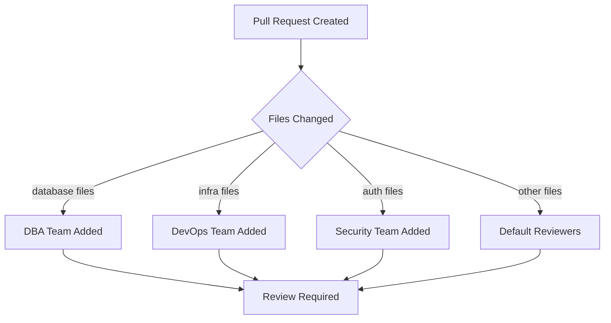

# How to Configure Branch Policies in Azure Repos to Enforce Code Review Requirements

Author: [nawazdhandala](https://www.github.com/nawazdhandala)

Tags: Azure Repos, Branch Policies, Code Review, Azure DevOps, Git, Pull Requests, DevOps

Description: A step-by-step guide to configuring branch policies in Azure Repos that enforce code reviews and protect your main branch.

---

Branch policies in Azure Repos are one of those features that every team should configure but many overlook until something goes wrong. They protect your important branches by requiring specific conditions to be met before code can be merged. The most common use case is enforcing code reviews, but branch policies go much further than that.

In this post, I will cover how to set up branch policies from scratch, configure reviewer requirements, and share some patterns that work well for teams of different sizes.

## Why Branch Policies Matter

Without branch policies, anyone with push access can commit directly to your main branch. That means:

- Untested code can land in production
- Code reviews become optional (and therefore get skipped under pressure)
- There is no audit trail of who approved what
- Build breaks can go unnoticed until someone pulls the latest changes

Branch policies turn these from "best practices that people sometimes follow" into "enforced rules that cannot be bypassed."

## Setting Up Your First Branch Policy

Navigate to your Azure DevOps project, go to **Repos > Branches**, find the branch you want to protect (usually `main` or `master`), click the three dots menu, and select **Branch policies**.

You will see several policy options. Let me walk through the most important ones.

## Requiring a Minimum Number of Reviewers

This is the core policy that enforces code reviews. When you enable it, pull requests cannot be completed unless the specified number of people have approved.

Here is what I recommend for different team sizes:

- **Small teams (2-4 people)**: Require 1 reviewer. You do not have enough people to require more, and getting blocked on reviews kills velocity.
- **Medium teams (5-10 people)**: Require 2 reviewers. This ensures at least two sets of eyes on every change.
- **Large teams (10+ people)**: Require 2 reviewers, but also consider adding specific required reviewers for critical paths.

Within this policy, you have additional options:

- **Allow requestors to approve their own changes**: I always turn this off. Self-approval defeats the purpose of code review.
- **Prohibit the most recent pusher from approving**: Turn this on. If someone pushes a fix to address review comments, they should not be able to approve their own fix.
- **Reset code reviewer votes when there are new changes**: I leave this on for critical branches. When someone pushes new commits, previous approvals are reset, forcing reviewers to look at the updated code.

## Linking Build Validation

Code review alone does not catch everything. You also want automated builds running against every pull request. Under the **Build validation** section, click **Add build policy**.

The following configuration runs your CI pipeline against every PR targeting the main branch.

```yaml
# This YAML is your CI pipeline that runs on PR validation
trigger: none  # Do not trigger on push; only on PR validation

pr:
  branches:
    include:
      - main

pool:
  vmImage: 'ubuntu-latest'

steps:
  # Restore project dependencies
  - task: DotNetCoreCLI@2
    displayName: 'Restore'
    inputs:
      command: 'restore'

  # Build the project
  - task: DotNetCoreCLI@2
    displayName: 'Build'
    inputs:
      command: 'build'
      arguments: '--no-restore'

  # Run tests to validate the PR
  - task: DotNetCoreCLI@2
    displayName: 'Test'
    inputs:
      command: 'test'
      arguments: '--no-build'
```

When configuring the build policy, you can set:

- **Trigger**: Automatic (runs on every update) or Manual (someone has to queue it)
- **Policy requirement**: Required (must pass) or Optional (informational)
- **Build expiration**: How long a passing build is valid. I set this to "Immediately when the source branch is updated" for important branches.
- **Display name**: A friendly name that shows up in the PR status checks

## Requiring Linked Work Items

If your team uses Azure Boards for tracking work, you can require that every PR has at least one linked work item. This creates traceability between code changes and the business requirements that drove them.

Enable this under **Check for linked work items** in the branch policies. Set it to "Required" for main branches and "Optional" for development branches.

## Enforcing Comment Resolution

This is a small but powerful policy. When enabled, all comments on a pull request must be resolved before the PR can be completed. This prevents the common scenario where a reviewer leaves feedback, the author ignores it, and the code gets merged anyway.

I recommend setting this to "Required" on all branches that have branch policies.

## Configuring Automatic Reviewers

Automatic reviewers are assigned based on file path patterns. This is incredibly useful for ensuring domain experts review changes to their areas of the codebase.

For example, you might configure:

- Changes to `/src/database/**` automatically add the DBA team as reviewers
- Changes to `/infrastructure/**` automatically add the DevOps team
- Changes to `/src/api/auth/**` automatically add the security team

Here is how the path-based reviewer assignment works conceptually.



To set this up, go to **Automatically included reviewers**, click **Add**, then specify:

- The reviewer (user or group)
- The path filter (e.g., `/src/database/*`)
- Whether this reviewer is required or optional
- A minimum number of approvals from this group

## Branch-Specific Policies with Wildcards

You can apply policies to multiple branches using wildcards. For example, setting policies on `release/*` applies them to all release branches. This is useful when your branching strategy includes:

- `release/*` branches that need the same protection as main
- `hotfix/*` branches that need build validation but maybe fewer reviewers
- `feature/*` branches where you want minimal policies

## Using the Azure CLI to Manage Policies

If you manage multiple repositories, configuring policies through the UI becomes tedious. The Azure CLI can automate this.

The following script creates a minimum reviewer policy on the main branch.

```bash
# Create a minimum reviewer policy requiring 2 approvals on the main branch
az repos policy approver-count create \
  --project "MyProject" \
  --repository-id "$(az repos show --repository MyRepo --query id -o tsv)" \
  --branch main \
  --minimum-approver-count 2 \
  --creator-vote-counts false \
  --allow-downvotes false \
  --reset-on-source-push true \
  --blocking true \
  --enabled true
```

You can also export existing policies and apply them to other repositories.

```bash
# List all policies for a repository
az repos policy list \
  --project "MyProject" \
  --repository-id "$(az repos show --repository MyRepo --query id -o tsv)" \
  --output table
```

## Handling Policy Overrides

Sometimes you need to bypass policies - maybe there is a critical hotfix that cannot wait for a full review cycle. Azure DevOps allows certain users to override branch policies when completing a pull request. The option shows up as "Override branch policies" in the complete dialog.

This ability is controlled by the "Bypass policies when completing pull requests" permission. Grant it sparingly - typically only to team leads or a designated on-call rotation.

Every policy override is logged, so you can audit who bypassed policies and when. I recommend running a periodic review of overrides to make sure they are not being abused.

## Common Mistakes to Avoid

**Setting policies too strict initially.** If you go from zero policies to requiring 3 reviewers, linked work items, resolved comments, and a passing build all at once, your team will revolt. Start with build validation and one required reviewer, then add more policies as the team adjusts.

**Not excluding service accounts.** If you have automation that pushes to protected branches (like a version bump bot), make sure those service accounts have the appropriate permissions. Otherwise your automation will break.

**Forgetting about merge strategies.** Branch policies let you control which merge strategies are allowed (merge commit, squash, rebase, semi-linear). Pick one and be consistent. I prefer squash merges for feature branches going into main - it keeps the history clean.

**Ignoring stale reviews.** If you do not enable "Reset votes on new pushes," a reviewer might approve a PR, then the author could push completely different code and merge it with the stale approval. Always reset votes for important branches.

## Wrapping Up

Branch policies are one of the highest-leverage configurations you can make in Azure DevOps. They take minutes to set up but save hours of debugging, prevent security incidents, and create a culture where code review is the norm rather than the exception.

Start with the basics - one required reviewer and build validation on your main branch. Then layer on additional policies as your team grows and your deployment requirements become more sophisticated. The goal is not to create bureaucracy but to create guardrails that let your team move fast with confidence.
