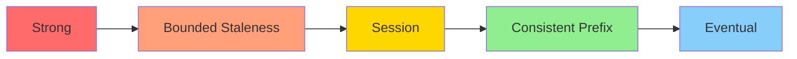

# How to Configure Consistency Levels in Azure Cosmos DB

Author: [nawazdhandala](https://www.github.com/nawazdhandala)

Tags: Azure, Cosmos DB, Consistency Levels, Distributed Databases, NoSQL, Data Consistency

Description: Understand and configure the five consistency levels in Azure Cosmos DB to balance between data consistency, availability, and latency for your workload.

---

One of the most powerful features of Azure Cosmos DB is that it gives you five distinct consistency levels to choose from. Most databases force you into either strong consistency (slower, always correct) or eventual consistency (fast, sometimes stale). Cosmos DB offers three additional levels in between, letting you make precise tradeoffs between consistency, availability, latency, and throughput.

## The Five Consistency Levels

Cosmos DB provides these consistency levels, ordered from strongest to weakest:



### Strong Consistency

Reads are guaranteed to return the most recent committed write. This is the same guarantee you get with traditional relational databases. In a globally distributed setup, a write must be replicated to a majority of replicas across all regions before it is acknowledged.

Tradeoffs: Highest latency, highest RU cost, only available in single-region or with single-region writes.

Best for: Financial transactions, inventory management, anything where stale reads are unacceptable.

### Bounded Staleness

Reads may lag behind writes by at most K versions (updates) or T time interval, whichever is reached first. Outside of the staleness window, reads are fully consistent. Within the window, reads are guaranteed to be in order.

Tradeoffs: Higher latency than session consistency, but provides a quantifiable staleness guarantee.

Best for: Applications that can tolerate slight delays but need a guarantee on how stale data can be. Score tracking, stock tickers.

### Session Consistency (Default)

Within a single client session, reads are guaranteed to see writes made by that same session. Other sessions may see eventual consistency. This is the default and most popular level because it matches how most applications work - a user writes data and expects to immediately see their own writes.

Tradeoffs: Good balance of performance and consistency for most workloads.

Best for: User-facing applications, shopping carts, user profiles, social media feeds.

### Consistent Prefix

Reads never see out-of-order writes. If writes happen in order A, B, C, you will never see A, C without B. However, you might not see the latest writes immediately.

Tradeoffs: Lower latency than session, but no guarantee you will see your own writes.

Best for: Applications where order matters but freshness does not. Activity feeds, timeline events.

### Eventual Consistency

No ordering guarantee. Reads will eventually return the latest write, but there is no bound on how long "eventually" takes. In practice, convergence usually happens within seconds.

Tradeoffs: Lowest latency, lowest RU cost, but no ordering or freshness guarantees.

Best for: Non-critical reads, analytics, counters, likes, view counts.

## Setting the Default Consistency Level

The default consistency level applies to all requests that do not explicitly specify a level. Set it in the Azure Portal, CLI, or SDK.

### Azure Portal

1. Navigate to your Cosmos DB account
2. Under Settings, click Default consistency
3. Select the desired level
4. Click Save

### Azure CLI

```bash
# Set the default consistency level to Session
az cosmosdb update \
    --name myCosmosAccount \
    --resource-group myResourceGroup \
    --default-consistency-level Session
```

For Bounded Staleness, you also need to specify the staleness parameters:

```bash
# Set Bounded Staleness with a max of 100 versions or 5 seconds lag
az cosmosdb update \
    --name myCosmosAccount \
    --resource-group myResourceGroup \
    --default-consistency-level BoundedStaleness \
    --max-staleness-prefix 100 \
    --max-interval 5
```

## Overriding Consistency Per Request

You can override the default consistency level on individual requests, but only to a weaker level. For example, if your default is Session, you can override to Consistent Prefix or Eventual for specific queries, but not to Strong or Bounded Staleness.

### .NET SDK

```csharp
// Override consistency level for a specific read operation
// This reads with Eventual consistency regardless of the account default
using Microsoft.Azure.Cosmos;

CosmosClient client = new CosmosClient(endpoint, key);
Container container = client.GetContainer("mydb", "mycontainer");

// Create request options with a specific consistency level
ItemRequestOptions options = new ItemRequestOptions
{
    ConsistencyLevel = ConsistencyLevel.Eventual
};

// Read with the overridden consistency level
ItemResponse<MyDocument> response = await container.ReadItemAsync<MyDocument>(
    id: "doc1",
    partitionKey: new PartitionKey("pk1"),
    requestOptions: options
);
```

### Python SDK

```python
# Override consistency for a specific query in Python
from azure.cosmos import CosmosClient, ConsistencyLevel

client = CosmosClient(url, credential)
database = client.get_database_client("mydb")
container = database.get_container_client("mycontainer")

# Query with Eventual consistency for better performance on non-critical reads
items = container.query_items(
    query="SELECT * FROM c WHERE c.category = @category",
    parameters=[{"name": "@category", "value": "electronics"}],
    # Override to Eventual for this specific query
    session_token=None,
    initial_headers={"x-ms-consistency-level": "Eventual"}
)

for item in items:
    print(item)
```

### Java SDK

```java
// Override consistency in Java SDK
// Use CosmosItemRequestOptions to set the level per request
CosmosItemRequestOptions options = new CosmosItemRequestOptions();
options.setConsistencyLevel(ConsistencyLevel.EVENTUAL);

CosmosItemResponse<MyDocument> response = container.readItem(
    "doc1",
    new PartitionKey("pk1"),
    options,
    MyDocument.class
);
```

## Session Tokens

When using Session consistency, the session token is critical. It is what tells Cosmos DB which write your session has seen, so it can guarantee reads after writes within that session.

```csharp
// Capture and reuse session tokens for session consistency
// This is important when your application has multiple instances
// behind a load balancer

// After a write, capture the session token from the response
ItemResponse<MyDocument> writeResponse = await container.CreateItemAsync(
    item: newDoc,
    partitionKey: new PartitionKey("pk1")
);
string sessionToken = writeResponse.Headers.Session;

// Pass the session token to subsequent reads to guarantee
// they see the write you just made
ItemRequestOptions readOptions = new ItemRequestOptions
{
    SessionToken = sessionToken
};

ItemResponse<MyDocument> readResponse = await container.ReadItemAsync<MyDocument>(
    id: newDoc.Id,
    partitionKey: new PartitionKey("pk1"),
    requestOptions: readOptions
);
```

This is especially important in web applications where a user might write data on one server instance and read it back on another. Without passing the session token, the second server might return stale data.

## RU Cost by Consistency Level

Consistency level affects your Request Unit consumption. Here is the approximate multiplier:

| Consistency Level | Read Cost (relative) | Write Cost |
|-------------------|---------------------|------------|
| Strong | 2x | Normal |
| Bounded Staleness | 2x | Normal |
| Session | 1x | Normal |
| Consistent Prefix | 1x | Normal |
| Eventual | 1x | Normal |

Strong and Bounded Staleness reads cost twice as much because the read must contact a quorum of replicas. Session, Consistent Prefix, and Eventual reads only contact a single replica.

Write costs are the same across all consistency levels because writes always go through the same replication process.

## Choosing the Right Level

Here is a decision framework:

1. Start with Session consistency. It is the default for a reason - it provides intuitive behavior for most applications.

2. If you need absolute correctness across all readers (not just within a session), move to Strong. Accept the latency and cost increase.

3. If you need to quantify maximum staleness for compliance or SLA reasons, use Bounded Staleness.

4. If you are doing analytics or background reads where freshness does not matter, drop to Eventual and save on RU costs.

5. If you care about ordering but not freshness, Consistent Prefix gives you the best of both worlds.

## Multi-Region Considerations

Consistency levels interact with multi-region replication:

- Strong consistency is not available with multi-region writes. You can use it with a single write region and multiple read regions.
- Bounded Staleness in a multi-region setup behaves like Strong within the write region and Bounded Staleness in read regions.
- Session consistency works across regions as long as you pass the session token.

## Monitoring Consistency

You can monitor consistency-related metrics in Azure Monitor:

```bash
# Check the replication lag between regions
az monitor metrics list \
    --resource "/subscriptions/{sub}/resourceGroups/{rg}/providers/Microsoft.DocumentDB/databaseAccounts/{account}" \
    --metric "ReplicationLatency" \
    --interval PT5M
```

Understanding and configuring consistency levels properly can significantly improve your application's performance while maintaining the data guarantees your users expect. Do not just stick with the default - evaluate what each part of your application actually needs and configure accordingly.
