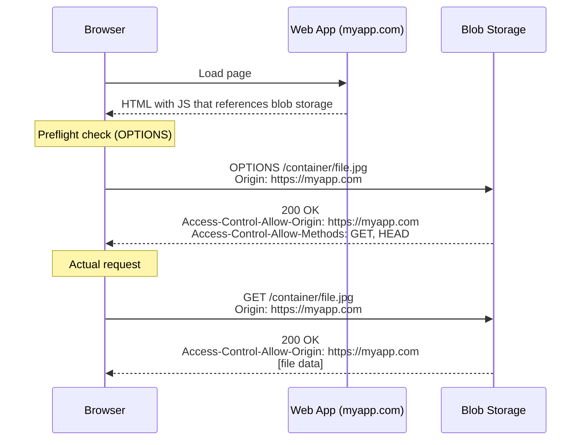

# How to Configure CORS Rules for Azure Blob Storage

Author: [nawazdhandala](https://www.github.com/nawazdhandala)

Tags: Azure, Blob Storage, CORS, Web Development, Cross-Origin, API Security, Frontend

Description: Learn how to configure Cross-Origin Resource Sharing (CORS) rules for Azure Blob Storage to enable browser-based access from web applications.

---

When your web application needs to access Azure Blob Storage directly from the browser - loading images, downloading files, or uploading user content - you will run into CORS (Cross-Origin Resource Sharing) restrictions. Browsers block requests to a different origin than the one serving the page, and your storage account URL is a different origin than your application URL. Configuring CORS rules on your storage account tells Azure to include the right headers so browsers allow these cross-origin requests. In this post, I will cover how to set up CORS properly for common web application scenarios.

## What CORS Does

CORS is a browser security mechanism. When JavaScript running on `https://myapp.com` tries to fetch a blob from `https://mystorageaccount.blob.core.windows.net`, the browser sends a preflight OPTIONS request to the storage account. If the storage account responds with headers that permit the origin, the browser allows the actual request.

Without CORS rules configured on the storage account, the browser blocks the request and your users see errors in the console like "Access to XMLHttpRequest has been blocked by CORS policy."

CORS only affects browser-based requests. Server-side code, CLI tools, and SDKs are not subject to CORS restrictions.

## Configuring CORS with Azure CLI

```bash
# Add a CORS rule to the blob service
# This rule allows GET and PUT requests from a specific origin
az storage cors add \
  --account-name mystorageaccount \
  --services b \
  --methods GET PUT OPTIONS HEAD \
  --origins "https://myapp.com" \
  --allowed-headers "Content-Type,x-ms-blob-type,x-ms-blob-content-type" \
  --exposed-headers "x-ms-request-id,x-ms-version" \
  --max-age 3600

# The --services flag specifies which storage service:
# b = blob, f = file, q = queue, t = table

# List current CORS rules
az storage cors list \
  --account-name mystorageaccount \
  --services b \
  --output table
```

## Configuring CORS for Multiple Origins

You can add multiple CORS rules, one for each origin pattern.

```bash
# Allow access from your production domain
az storage cors add \
  --account-name mystorageaccount \
  --services b \
  --methods GET HEAD OPTIONS \
  --origins "https://myapp.com" \
  --allowed-headers "*" \
  --exposed-headers "*" \
  --max-age 3600

# Allow access from your staging domain
az storage cors add \
  --account-name mystorageaccount \
  --services b \
  --methods GET HEAD OPTIONS \
  --origins "https://staging.myapp.com" \
  --allowed-headers "*" \
  --exposed-headers "*" \
  --max-age 3600

# Allow access from localhost during development
az storage cors add \
  --account-name mystorageaccount \
  --services b \
  --methods GET PUT POST DELETE HEAD OPTIONS \
  --origins "http://localhost:3000" \
  --allowed-headers "*" \
  --exposed-headers "*" \
  --max-age 86400
```

## Wildcard Origins (Use with Caution)

You can use `*` as the origin to allow any website to access your storage. This is appropriate for public assets like images on a CDN but should never be used for storage containing sensitive data.

```bash
# Allow any origin (only for truly public content)
az storage cors add \
  --account-name mystorageaccount \
  --services b \
  --methods GET HEAD OPTIONS \
  --origins "*" \
  --allowed-headers "*" \
  --exposed-headers "*" \
  --max-age 3600
```

## Configuring CORS with Python SDK

```python
from azure.storage.blob import BlobServiceClient, CorsRule
import os

connection_string = os.environ["AZURE_STORAGE_CONNECTION_STRING"]
blob_service = BlobServiceClient.from_connection_string(connection_string)

# Define CORS rules
cors_rules = [
    CorsRule(
        allowed_origins=["https://myapp.com", "https://staging.myapp.com"],
        allowed_methods=["GET", "PUT", "HEAD", "OPTIONS"],
        allowed_headers=["Content-Type", "x-ms-blob-type", "x-ms-blob-content-type", "Authorization"],
        exposed_headers=["x-ms-request-id", "x-ms-version", "Content-Length", "Content-Type"],
        max_age_in_seconds=3600
    ),
    CorsRule(
        allowed_origins=["http://localhost:3000"],
        allowed_methods=["GET", "PUT", "POST", "DELETE", "HEAD", "OPTIONS"],
        allowed_headers=["*"],
        exposed_headers=["*"],
        max_age_in_seconds=86400
    )
]

# Set the CORS rules on the blob service
# This replaces all existing CORS rules
blob_service.set_service_properties(cors=cors_rules)
print("CORS rules configured successfully")

# Verify the rules
properties = blob_service.get_service_properties()
for rule in properties["cors"]:
    print(f"Origins: {rule.allowed_origins}")
    print(f"Methods: {rule.allowed_methods}")
    print(f"Headers: {rule.allowed_headers}")
    print("---")
```

## Configuring CORS with .NET SDK

```csharp
using Azure.Storage.Blobs;
using Azure.Storage.Blobs.Models;
using System.Collections.Generic;

var blobService = new BlobServiceClient(connectionString);

// Get current properties
var properties = await blobService.GetPropertiesAsync();

// Define CORS rules
var corsRules = new List<BlobCorsRule>
{
    new BlobCorsRule
    {
        AllowedOrigins = "https://myapp.com,https://staging.myapp.com",
        AllowedMethods = "GET,PUT,HEAD,OPTIONS",
        AllowedHeaders = "Content-Type,x-ms-blob-type,Authorization",
        ExposedHeaders = "x-ms-request-id,Content-Length",
        MaxAgeInSeconds = 3600
    }
};

// Update the service properties with the new CORS rules
properties.Value.Cors.Clear();
foreach (var rule in corsRules)
{
    properties.Value.Cors.Add(rule);
}

await blobService.SetPropertiesAsync(properties);
Console.WriteLine("CORS rules set successfully");
```

## Configuring CORS via ARM Template

```json
{
    "type": "Microsoft.Storage/storageAccounts/blobServices",
    "apiVersion": "2023-01-01",
    "name": "mystorageaccount/default",
    "properties": {
        "cors": {
            "corsRules": [
                {
                    "allowedOrigins": ["https://myapp.com"],
                    "allowedMethods": ["GET", "PUT", "HEAD", "OPTIONS"],
                    "allowedHeaders": ["Content-Type", "x-ms-blob-type"],
                    "exposedHeaders": ["x-ms-request-id"],
                    "maxAgeInSeconds": 3600
                }
            ]
        }
    }
}
```

## Configuring CORS with Terraform

```hcl
resource "azurerm_storage_account" "main" {
  name                     = "mystorageaccount"
  resource_group_name      = azurerm_resource_group.main.name
  location                 = azurerm_resource_group.main.location
  account_tier             = "Standard"
  account_replication_type = "LRS"

  blob_properties {
    cors_rule {
      allowed_origins    = ["https://myapp.com"]
      allowed_methods    = ["GET", "PUT", "HEAD", "OPTIONS"]
      allowed_headers    = ["Content-Type", "x-ms-blob-type"]
      exposed_headers    = ["x-ms-request-id"]
      max_age_in_seconds = 3600
    }

    cors_rule {
      allowed_origins    = ["http://localhost:3000"]
      allowed_methods    = ["GET", "PUT", "POST", "DELETE", "HEAD", "OPTIONS"]
      allowed_headers    = ["*"]
      exposed_headers    = ["*"]
      max_age_in_seconds = 86400
    }
  }
}
```

## Understanding the CORS Request Flow



## Common CORS Rule Configurations

### Public Image CDN

For a storage account serving public images to any website.

```bash
az storage cors add \
  --account-name mystorageaccount \
  --services b \
  --methods GET HEAD OPTIONS \
  --origins "*" \
  --allowed-headers "Accept,Accept-Language,Content-Language" \
  --exposed-headers "Content-Length,Content-Type" \
  --max-age 86400
```

### SPA File Upload

For a single-page application that uploads files directly to blob storage using SAS tokens.

```bash
az storage cors add \
  --account-name mystorageaccount \
  --services b \
  --methods GET PUT HEAD OPTIONS \
  --origins "https://myapp.com" \
  --allowed-headers "Content-Type,x-ms-blob-type,x-ms-blob-content-type,x-ms-blob-content-disposition,Authorization" \
  --exposed-headers "x-ms-request-id,x-ms-version,Content-Length,ETag" \
  --max-age 3600
```

### Video Streaming

For a storage account serving video content with range requests.

```bash
az storage cors add \
  --account-name mystorageaccount \
  --services b \
  --methods GET HEAD OPTIONS \
  --origins "https://myapp.com" \
  --allowed-headers "Range,Accept-Ranges,Content-Range" \
  --exposed-headers "Accept-Ranges,Content-Range,Content-Length,Content-Type" \
  --max-age 3600
```

## Clearing CORS Rules

```bash
# Remove all CORS rules from blob service
az storage cors clear \
  --account-name mystorageaccount \
  --services b
```

## Troubleshooting CORS Issues

If CORS is not working, check these common problems.

The origin in your request must exactly match the allowed origin in the rule. `https://myapp.com` does not match `https://www.myapp.com` or `http://myapp.com`.

The HTTP method must be in the allowed methods list. If your rule allows GET but your application sends PUT, it will be blocked.

Custom request headers must be listed in allowed-headers. If your JavaScript sets a custom header that is not in the rule, the preflight will fail.

Caching can hide changes. Browsers cache preflight responses for up to max-age seconds. If you change a CORS rule and it does not take effect, try clearing your browser cache or using a private window.

```bash
# Quick test: send a preflight request manually with curl
curl -I -X OPTIONS \
  "https://mystorageaccount.blob.core.windows.net/mycontainer/test.jpg" \
  -H "Origin: https://myapp.com" \
  -H "Access-Control-Request-Method: GET" \
  -H "Access-Control-Request-Headers: Content-Type"

# Check the response headers for:
# Access-Control-Allow-Origin: https://myapp.com
# Access-Control-Allow-Methods: GET
```

## Limits

Azure Storage supports up to 5 CORS rules per storage service (blob, file, queue, table). If you need more origins, consider using a wildcard or consolidating origins into fewer rules with comma-separated values.

CORS rules apply at the storage service level, not per container or blob. If you need different CORS policies for different sets of blobs, you will need separate storage accounts.

CORS configuration is straightforward once you understand the browser security model. Configure the minimum required origins and methods, avoid wildcard origins for anything beyond public content, and test your preflight requests to verify the rules are working correctly.
