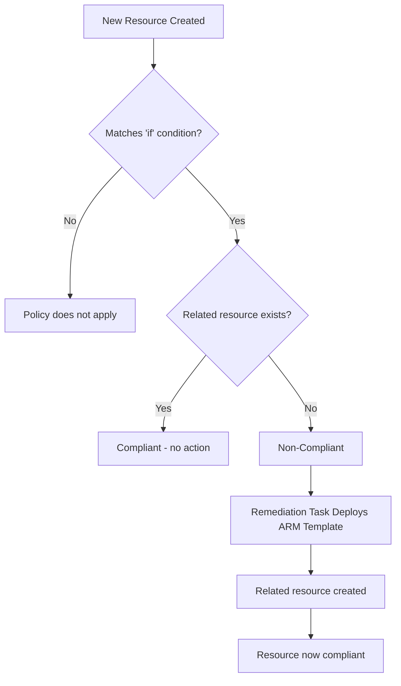

# How to Configure Custom Azure Policy Definitions Using the DeployIfNotExists Effect

Author: [nawazdhandala](https://www.github.com/nawazdhandala)

Tags: Azure Policy, DeployIfNotExists, Governance, Compliance, ARM Templates, Infrastructure as Code, Azure

Description: A detailed guide to writing custom Azure Policy definitions with the DeployIfNotExists effect to automatically deploy configurations on non-compliant resources.

---

Azure Policy's `audit` and `deny` effects are useful, but they only tell you about problems or prevent new ones. The `DeployIfNotExists` effect goes further - it automatically deploys a configuration on a resource if that configuration is missing. When a VM gets created without diagnostic settings, the policy deploys them. When a storage account is created without encryption at rest, the policy configures it. This turns your policies from passive monitors into active enforcers.

Writing a `DeployIfNotExists` policy is more involved than writing an `audit` policy because you need to embed an ARM template that performs the remediation. This guide walks through the full process with real examples.

## How DeployIfNotExists Works

The `DeployIfNotExists` (DINE) effect evaluates a condition and, if the required related resource does not exist, triggers an ARM template deployment to create it.

The evaluation has two parts:

1. **If condition**: Determines which resources the policy applies to (e.g., all virtual machines)
2. **Existence condition**: Checks whether a related resource exists (e.g., whether diagnostic settings are configured)

If the target resource matches the `if` condition and the related resource does not satisfy the existence condition, the resource is marked as non-compliant. A remediation task can then deploy the ARM template to fix it.



For newly created resources, the DINE evaluation triggers automatically within about 15 minutes. For existing resources, you need to create a remediation task.

## Policy Definition Structure

A DINE policy definition has this structure:

```json
{
  "mode": "All",
  "policyRule": {
    "if": {
      "field": "type",
      "equals": "Microsoft.SomeProvider/resourceType"
    },
    "then": {
      "effect": "DeployIfNotExists",
      "details": {
        "type": "Microsoft.SomeProvider/relatedResourceType",
        "name": "expectedResourceName",
        "existenceCondition": {
          "field": "someField",
          "equals": "expectedValue"
        },
        "roleDefinitionIds": [
          "/providers/Microsoft.Authorization/roleDefinitions/ROLE_GUID"
        ],
        "deployment": {
          "properties": {
            "mode": "incremental",
            "template": {
              "$schema": "https://schema.management.azure.com/schemas/2019-04-01/deploymentTemplate.json#",
              "contentVersion": "1.0.0.0",
              "resources": []
            }
          }
        }
      }
    }
  }
}
```

Let me break down the key fields:

- **type**: The resource type to check for existence
- **existenceCondition**: What constitutes a compliant related resource
- **roleDefinitionIds**: Roles that the remediation managed identity needs
- **deployment**: The ARM template that creates the missing resource

## Example 1: Deploy Diagnostic Settings on VMs

This is one of the most common DINE policies. It ensures every VM has diagnostic settings configured to send logs to a Log Analytics workspace.

```json
{
  "mode": "All",
  "parameters": {
    "logAnalyticsWorkspaceId": {
      "type": "String",
      "metadata": {
        "displayName": "Log Analytics Workspace ID",
        "description": "The resource ID of the Log Analytics workspace to send diagnostics to"
      }
    }
  },
  "policyRule": {
    "if": {
      "field": "type",
      "equals": "Microsoft.Compute/virtualMachines"
    },
    "then": {
      "effect": "DeployIfNotExists",
      "details": {
        "type": "Microsoft.Insights/diagnosticSettings",
        "name": "vm-diagnostics",
        "existenceCondition": {
          "allOf": [
            {
              "field": "Microsoft.Insights/diagnosticSettings/workspaceId",
              "equals": "[parameters('logAnalyticsWorkspaceId')]"
            }
          ]
        },
        "roleDefinitionIds": [
          "/providers/Microsoft.Authorization/roleDefinitions/749f88d5-cbae-40b8-bcfc-e573ddc772fa",
          "/providers/Microsoft.Authorization/roleDefinitions/92aaf0da-9dab-42b6-94a3-d43ce8d16293"
        ],
        "deployment": {
          "properties": {
            "mode": "incremental",
            "template": {
              "$schema": "https://schema.management.azure.com/schemas/2019-04-01/deploymentTemplate.json#",
              "contentVersion": "1.0.0.0",
              "parameters": {
                "vmName": {
                  "type": "string"
                },
                "workspaceId": {
                  "type": "string"
                },
                "location": {
                  "type": "string"
                }
              },
              "resources": [
                {
                  "type": "Microsoft.Compute/virtualMachines/providers/diagnosticSettings",
                  "apiVersion": "2021-05-01-preview",
                  "name": "[concat(parameters('vmName'), '/Microsoft.Insights/vm-diagnostics')]",
                  "location": "[parameters('location')]",
                  "properties": {
                    "workspaceId": "[parameters('workspaceId')]",
                    "metrics": [
                      {
                        "category": "AllMetrics",
                        "enabled": true
                      }
                    ]
                  }
                }
              ]
            },
            "parameters": {
              "vmName": {
                "value": "[field('name')]"
              },
              "workspaceId": {
                "value": "[parameters('logAnalyticsWorkspaceId')]"
              },
              "location": {
                "value": "[field('location')]"
              }
            }
          }
        }
      }
    }
  }
}
```

Note the `roleDefinitionIds` - these are the GUIDs for "Monitoring Contributor" and "Log Analytics Contributor" roles. The remediation managed identity needs these roles to create diagnostic settings.

## Example 2: Deploy Network Security Group on Subnets

This policy ensures every subnet in a VNet has an NSG attached.

```json
{
  "mode": "All",
  "parameters": {
    "nsgId": {
      "type": "String",
      "metadata": {
        "displayName": "Default NSG Resource ID",
        "description": "Resource ID of the NSG to attach to subnets without one"
      }
    }
  },
  "policyRule": {
    "if": {
      "allOf": [
        {
          "field": "type",
          "equals": "Microsoft.Network/virtualNetworks/subnets"
        },
        {
          "field": "Microsoft.Network/virtualNetworks/subnets/networkSecurityGroup.id",
          "exists": "false"
        }
      ]
    },
    "then": {
      "effect": "DeployIfNotExists",
      "details": {
        "type": "Microsoft.Network/virtualNetworks/subnets",
        "existenceCondition": {
          "field": "Microsoft.Network/virtualNetworks/subnets/networkSecurityGroup.id",
          "exists": "true"
        },
        "roleDefinitionIds": [
          "/providers/Microsoft.Authorization/roleDefinitions/4d97b98b-1d4f-4787-a291-c67834d212e7"
        ],
        "deployment": {
          "properties": {
            "mode": "incremental",
            "template": {
              "$schema": "https://schema.management.azure.com/schemas/2019-04-01/deploymentTemplate.json#",
              "contentVersion": "1.0.0.0",
              "parameters": {
                "subnetName": { "type": "string" },
                "vnetName": { "type": "string" },
                "nsgId": { "type": "string" },
                "subnetAddressPrefix": { "type": "string" }
              },
              "resources": [
                {
                  "type": "Microsoft.Network/virtualNetworks/subnets",
                  "apiVersion": "2023-05-01",
                  "name": "[concat(parameters('vnetName'), '/', parameters('subnetName'))]",
                  "properties": {
                    "addressPrefix": "[parameters('subnetAddressPrefix')]",
                    "networkSecurityGroup": {
                      "id": "[parameters('nsgId')]"
                    }
                  }
                }
              ]
            },
            "parameters": {
              "subnetName": { "value": "[field('name')]" },
              "vnetName": { "value": "[first(split(field('id'), '/subnets/'))]" },
              "nsgId": { "value": "[parameters('nsgId')]" },
              "subnetAddressPrefix": { "value": "[field('Microsoft.Network/virtualNetworks/subnets/addressPrefix')]" }
            }
          }
        }
      }
    }
  }
}
```

## Creating and Assigning the Policy

Save your policy definition as a JSON file and create it using the CLI.

```bash
# Create the custom policy definition
az policy definition create \
  --name "deploy-vm-diagnostics" \
  --display-name "Deploy diagnostic settings on VMs" \
  --description "Automatically deploys diagnostic settings to Log Analytics for virtual machines" \
  --rules @policy-rule.json \
  --params @policy-params.json \
  --mode All

# Assign the policy at the subscription level
az policy assignment create \
  --name "deploy-vm-diagnostics-assignment" \
  --policy "deploy-vm-diagnostics" \
  --scope "/subscriptions/YOUR_SUB" \
  --mi-system-assigned \
  --location eastus \
  --params '{"logAnalyticsWorkspaceId": {"value": "/subscriptions/YOUR_SUB/resourceGroups/monitoring-rg/providers/Microsoft.OperationalInsights/workspaces/central-workspace"}}'
```

After creating the assignment, grant the managed identity the required roles.

```bash
# Get the managed identity principal ID
PRINCIPAL_ID=$(az policy assignment show \
  --name "deploy-vm-diagnostics-assignment" \
  --query 'identity.principalId' -o tsv)

# Assign the required roles
az role assignment create \
  --assignee-object-id $PRINCIPAL_ID \
  --assignee-principal-type ServicePrincipal \
  --role "Monitoring Contributor" \
  --scope "/subscriptions/YOUR_SUB"

az role assignment create \
  --assignee-object-id $PRINCIPAL_ID \
  --assignee-principal-type ServicePrincipal \
  --role "Log Analytics Contributor" \
  --scope "/subscriptions/YOUR_SUB"
```

## Testing Your Policy

Create a test VM without diagnostic settings and verify the policy catches it.

```bash
# Wait about 15 minutes for the policy to evaluate the new resource
# Then check the compliance state
az policy state list \
  --filter "policyAssignmentName eq 'deploy-vm-diagnostics-assignment' and complianceState eq 'NonCompliant'" \
  --query '[].{resource: resourceId}' \
  --output table

# Create a remediation task to fix non-compliant resources
az policy remediation create \
  --name "fix-vm-diagnostics" \
  --policy-assignment "deploy-vm-diagnostics-assignment" \
  --resource-discovery-mode ReEvaluateCompliance
```

## Debugging DINE Policies

When a DINE policy fails to remediate, the ARM template deployment provides error details.

```bash
# Check remediation task deployments for errors
az policy remediation deployment list \
  --name "fix-vm-diagnostics" \
  --query '[?status==`Failed`].{resource: remediatedResourceId, error: error.code, message: error.message}' \
  --output table
```

Common issues include:
- Missing role assignments on the managed identity
- ARM template syntax errors
- Incorrect parameter references (using `field()` functions that reference wrong properties)
- API version mismatches in the template

## Best Practices

1. **Test the ARM template independently first.** Before embedding it in a policy, deploy the template manually against a test resource to verify it works.

2. **Use the minimum required roles.** Do not give the managed identity Contributor if it only needs Monitoring Contributor.

3. **Use parameters for flexibility.** Hardcoding values in the ARM template makes the policy rigid. Use policy parameters so the same definition can be reused across different environments.

4. **Set the evaluationDelay.** Some resources take time to fully provision. Use the `evaluationDelay` property to wait before evaluating the existence condition.

5. **Document the roleDefinitionIds.** Anyone maintaining the policy needs to understand which roles are required and why.

## Wrapping Up

The `DeployIfNotExists` effect transforms Azure Policy from a reporting tool into an active remediation engine. By embedding ARM templates in your policy definitions, you can automatically deploy diagnostic settings, security configurations, monitoring agents, and any other resource configuration that should always be present. The setup requires careful attention to ARM template syntax, managed identity permissions, and existence conditions, but the result is a self-healing environment where compliance is enforced automatically rather than manually.
