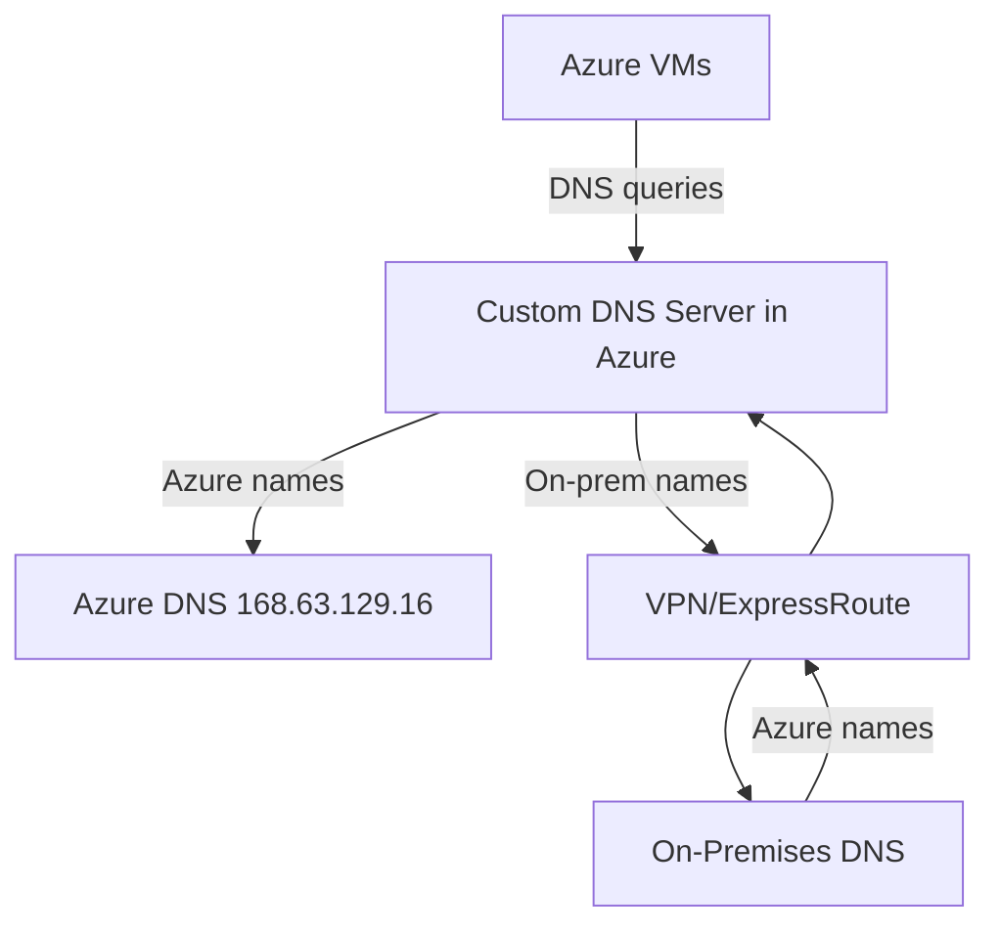

# How to Configure Custom DNS Servers on an Azure Virtual Machine

Author: [nawazdhandala](https://www.github.com/nawazdhandala)

Tags: Azure, Virtual Machines, DNS, Networking, Custom DNS, Cloud Configuration

Description: Step-by-step guide to configuring custom DNS servers on Azure VMs at the VNet, NIC, and OS level with troubleshooting tips.

---

Azure provides a default DNS service (168.63.129.16) that works well for basic name resolution within a VNet and for resolving public DNS names. But many production environments need custom DNS servers - to resolve internal corporate domains, integrate with Active Directory, use conditional forwarding, or enforce DNS-based security policies.

Setting up custom DNS on Azure VMs involves decisions at multiple levels: the VNet, the NIC, and the guest OS. Getting the layering right matters because misconfigured DNS can silently break things like domain joins, internal service discovery, and package repository access.

## DNS Resolution Order in Azure

Before changing anything, it helps to understand how DNS resolution works in Azure:

1. Azure checks the NIC-level DNS setting first. If custom DNS servers are configured on the NIC, those are used.
2. If the NIC is set to "Inherit from virtual network" (the default), Azure checks the VNet-level DNS setting.
3. If the VNet uses Azure-provided DNS, the VM uses Azure's internal DNS (168.63.129.16).
4. Guest OS DNS settings can also be configured, but Azure's DHCP will override them on lease renewal unless you take specific steps.

This hierarchy is important. NIC-level settings override VNet-level settings, and VNet-level settings override the Azure default.

## Configuring DNS at the VNet Level

This is the most common approach and affects all VMs in the VNet:

```bash
# Set custom DNS servers on the VNet
az network vnet update \
  --resource-group myResourceGroup \
  --name myVNet \
  --dns-servers 10.0.1.4 10.0.1.5

# Verify the DNS settings
az network vnet show \
  --resource-group myResourceGroup \
  --name myVNet \
  --query "dhcpOptions.dnsServers" -o tsv
```

After updating the VNet DNS settings, the change does not take effect on running VMs immediately. You need to either restart the VMs or renew the DHCP lease inside each VM.

```bash
# Restart a VM to pick up the new DNS settings
az vm restart --resource-group myResourceGroup --name myVM

# Or from inside the VM, renew the DHCP lease (Linux)
sudo dhclient -r eth0 && sudo dhclient eth0
```

## Configuring DNS at the NIC Level

If you need a specific VM to use different DNS servers than the rest of the VNet, configure DNS at the NIC level:

```bash
# Set custom DNS on a specific NIC
az network nic update \
  --resource-group myResourceGroup \
  --name myVM-nic \
  --dns-servers 10.0.1.10 10.0.1.11

# To revert to VNet-inherited DNS
az network nic update \
  --resource-group myResourceGroup \
  --name myVM-nic \
  --dns-servers ""
```

This is useful when you have a VM that needs to resolve a different set of internal domains or when testing DNS configuration changes on a single machine before rolling them out to the entire VNet.

## Setting Up a Custom DNS Server on Azure

If you are running your own DNS server in Azure (common for Active Directory environments), here is how to set one up using BIND on Linux:

```bash
# Install BIND DNS server
sudo apt update
sudo apt install -y bind9 bind9utils

# Configure the main BIND configuration
sudo tee /etc/bind/named.conf.options > /dev/null << 'DNSEOF'
options {
    directory "/var/cache/bind";

    // Allow queries from the VNet address space
    allow-query { 10.0.0.0/16; localhost; };

    // Forward queries we cannot resolve to Azure DNS
    forwarders {
        168.63.129.16;
    };

    // Use forwarders first, then try recursion
    forward first;

    dnssec-validation auto;
    listen-on { any; };
    listen-on-v6 { any; };
};
DNSEOF

# Create a zone file for your internal domain
sudo tee /etc/bind/named.conf.local > /dev/null << 'ZONEEOF'
zone "internal.mycompany.com" {
    type master;
    file "/etc/bind/zones/db.internal.mycompany.com";
};

zone "0.10.in-addr.arpa" {
    type master;
    file "/etc/bind/zones/db.10.0";
};
ZONEEOF

# Create the zone directory and zone file
sudo mkdir -p /etc/bind/zones

sudo tee /etc/bind/zones/db.internal.mycompany.com > /dev/null << 'DBEOF'
$TTL    604800
@       IN      SOA     ns1.internal.mycompany.com. admin.internal.mycompany.com. (
                     2026021601         ; Serial
                         604800         ; Refresh
                          86400         ; Retry
                        2419200         ; Expire
                         604800 )       ; Negative Cache TTL

@       IN      NS      ns1.internal.mycompany.com.
ns1     IN      A       10.0.1.4
app1    IN      A       10.0.2.10
app2    IN      A       10.0.2.11
db1     IN      A       10.0.3.10
DBEOF

# Verify the configuration
sudo named-checkconf
sudo named-checkzone internal.mycompany.com /etc/bind/zones/db.internal.mycompany.com

# Restart BIND
sudo systemctl restart bind9
sudo systemctl enable bind9
```

After setting up the DNS server, point your VNet to it:

```bash
# Point VNet DNS to your custom server
az network vnet update \
  --resource-group myResourceGroup \
  --name myVNet \
  --dns-servers 10.0.1.4
```

## DNS with Active Directory

For Windows environments with Active Directory, your domain controllers are typically your DNS servers. The setup on the Azure side is the same - point the VNet DNS to the domain controller IPs.

```powershell
# On the domain controller, verify DNS is running
Get-Service DNS

# Check DNS zones
Get-DnsServerZone

# Add a conditional forwarder for Azure-specific DNS
Add-DnsServerConditionalForwarderZone `
  -Name "internal.cloudapp.net" `
  -MasterServers 168.63.129.16
```

The conditional forwarder is important. It tells your DNS server to forward queries for Azure internal DNS names (like VM names within the VNet) to Azure's DNS. Without this, VMs using your custom DNS will lose the ability to resolve other VMs by name within the VNet.

## Hybrid DNS with On-Premises Integration

When you have VMs that need to resolve both Azure-hosted names and on-premises names, you need a DNS architecture that bridges both worlds.

The typical pattern uses Azure DNS Private Resolver or a pair of DNS forwarder VMs:



```bash
# Create an Azure DNS Private Resolver (newer approach)
az dns-resolver create \
  --resource-group myResourceGroup \
  --name myDnsResolver \
  --location eastus \
  --id "/subscriptions/<sub-id>/resourceGroups/myResourceGroup/providers/Microsoft.Network/virtualNetworks/myVNet"

# Create an inbound endpoint (for on-prem to resolve Azure names)
az dns-resolver inbound-endpoint create \
  --resource-group myResourceGroup \
  --dns-resolver-name myDnsResolver \
  --name inbound-ep \
  --location eastus \
  --ip-configurations "[{\"privateIpAllocationMethod\":\"Dynamic\",\"subnet\":{\"id\":\"/subscriptions/<sub-id>/resourceGroups/myResourceGroup/providers/Microsoft.Network/virtualNetworks/myVNet/subnets/dns-inbound-subnet\"}}]"

# Create an outbound endpoint (for Azure VMs to resolve on-prem names)
az dns-resolver outbound-endpoint create \
  --resource-group myResourceGroup \
  --dns-resolver-name myDnsResolver \
  --name outbound-ep \
  --location eastus \
  --subnet-id "/subscriptions/<sub-id>/resourceGroups/myResourceGroup/providers/Microsoft.Network/virtualNetworks/myVNet/subnets/dns-outbound-subnet"
```

## Troubleshooting DNS Issues

DNS problems are notoriously annoying to debug because the symptoms are vague - "the app cannot connect to the database" could easily be a DNS issue. Here are the tools and techniques I use:

### From Inside the VM (Linux)

```bash
# Check which DNS server the VM is using
cat /etc/resolv.conf

# Test resolution against a specific server
nslookup app1.internal.mycompany.com 10.0.1.4
dig @10.0.1.4 app1.internal.mycompany.com

# Test resolution using the system resolver
host app1.internal.mycompany.com

# Check if DNS port is reachable
nc -zv 10.0.1.4 53

# Trace the resolution path
dig +trace app1.internal.mycompany.com
```

### From Inside the VM (Windows)

```powershell
# Check DNS server configuration
Get-DnsClientServerAddress

# Test resolution
Resolve-DnsName app1.internal.mycompany.com

# Clear DNS cache and retry
Clear-DnsClientCache
Resolve-DnsName app1.internal.mycompany.com -DnsOnly

# Test against a specific server
Resolve-DnsName app1.internal.mycompany.com -Server 10.0.1.4
```

### Common DNS Issues

**DHCP overriding custom settings**: Azure DHCP refreshes periodically and can overwrite /etc/resolv.conf. If you need OS-level DNS configuration to stick, use systemd-resolved or configure it through Netplan.

**NSG blocking DNS traffic**: Make sure your NSG allows UDP and TCP port 53 between VMs and DNS servers. This is easy to miss if you have restrictive outbound NSG rules.

**DNS server not forwarding to Azure DNS**: If your custom DNS server does not forward to 168.63.129.16, VMs will lose the ability to resolve Azure internal names, Azure service endpoints, and Azure Private Link DNS names.

**Stale DNS cache**: After changing DNS settings, VMs might cache old results. Clear the cache in the guest OS and restart the DNS client service.

## Monitoring DNS Health

DNS failures can cause cascading application issues. Monitor your custom DNS servers for availability and query latency. Check that resolution time stays under acceptable thresholds and that the server can handle the query volume from your VMs.

Set up health checks in OneUptime that perform DNS lookups against your custom servers. If resolution fails or takes too long, you want to know before your applications start throwing connection errors.

## Wrapping Up

Custom DNS on Azure VMs is a three-layer configuration: VNet level for broad settings, NIC level for per-VM overrides, and guest OS level for fine-tuning. The most common architecture uses custom DNS servers in Azure that forward to both Azure DNS (for cloud names) and on-premises DNS (for corporate names). Get the forwarding rules right, make sure NSGs allow DNS traffic, and monitor your DNS servers actively. A DNS outage is an everything outage, so treat your DNS infrastructure with the same care as any other critical service.
