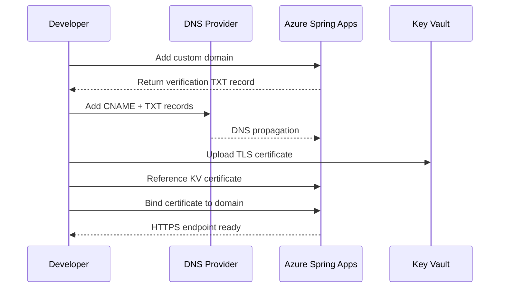

# How to Configure Custom Domains and TLS Certificates on Azure Spring Apps

Author: [nawazdhandala](https://www.github.com/nawazdhandala)

Tags: Azure, Spring Apps, Custom Domains, TLS, SSL, Certificates, DNS

Description: Step-by-step instructions for mapping custom domains and configuring TLS certificates on Azure Spring Apps for production-ready HTTPS endpoints.

---

When you deploy an application on Azure Spring Apps, it gets a default URL like `order-service-my-spring-service.azuremicroservices.io`. That is fine for development, but for production you need your own domain with a proper TLS certificate. Azure Spring Apps supports both custom domain mapping and managed or self-provided TLS certificates. This guide covers the complete setup process.

## Prerequisites

Before you start, you need:

- An Azure Spring Apps instance with the Standard or Enterprise SKU (custom domains are not available on the Basic SKU)
- A domain name that you control
- Access to your DNS provider's management panel
- Optionally, a TLS certificate in PFX format if you are not using a managed certificate

## Step 1: Verify Domain Ownership

Azure requires you to prove that you own the domain before you can map it. This is done through a CNAME or TXT record.

First, assign the custom domain to the application.

```bash
# Add a custom domain to the application
az spring app custom-domain bind \
  --app order-service \
  --service my-spring-service \
  --resource-group spring-rg \
  --domain-name api.example.com
```

Azure will tell you to add a CNAME record to verify ownership.

## Step 2: Configure DNS Records

Go to your DNS provider and add the following records.

For a subdomain like `api.example.com`, create a CNAME record.

```
Type:  CNAME
Name:  api
Value: my-spring-service.azuremicroservices.io
TTL:   3600
```

For domain verification, you may also need a TXT record.

```
Type:  TXT
Name:  asuid.api
Value: <verification-id-provided-by-azure>
TTL:   3600
```

For an apex domain (like `example.com` without a subdomain), you cannot use a CNAME. Instead, use an A record pointing to the Spring Apps instance's IP address, plus a TXT record for verification.

```bash
# Get the IP address of the Spring Apps instance
az spring show \
  --name my-spring-service \
  --resource-group spring-rg \
  --query "properties.networkProfile.outboundIPs"
```

```
Type:  A
Name:  @
Value: <spring-apps-ip-address>
TTL:   3600
```

Wait for DNS propagation. This can take anywhere from a few minutes to 48 hours, though most providers propagate within 15-30 minutes.

## Step 3: Upload a TLS Certificate

If you have your own TLS certificate, upload it to the Spring Apps instance.

```bash
# Upload a PFX certificate
az spring certificate add \
  --name my-tls-cert \
  --service my-spring-service \
  --resource-group spring-rg \
  --type KeyVaultCertificate \
  --vault-name my-keyvault \
  --vault-certificate-name my-cert
```

Alternatively, upload directly from a PFX file.

```bash
# Upload a PFX file directly
az spring certificate add \
  --name my-tls-cert \
  --service my-spring-service \
  --resource-group spring-rg \
  --type ContentCertificate \
  --certificate-file ./my-cert.pfx \
  --password "cert-password"
```

## Step 4: Bind the Certificate to the Custom Domain

After uploading the certificate, bind it to the custom domain.

```bash
# Bind the TLS certificate to the custom domain
az spring app custom-domain update \
  --app order-service \
  --service my-spring-service \
  --resource-group spring-rg \
  --domain-name api.example.com \
  --certificate my-tls-cert
```

After binding, HTTPS requests to `https://api.example.com` will be served with your TLS certificate.

## Step 5: Use Azure Key Vault for Certificate Management

Storing certificates in Azure Key Vault is the recommended approach for production. It provides centralized management, automatic renewal alerts, and integration with certificate authorities.

First, import or create a certificate in Key Vault.

```bash
# Import a PFX certificate into Key Vault
az keyvault certificate import \
  --vault-name my-keyvault \
  --name api-example-cert \
  --file ./api-example-com.pfx \
  --password "pfx-password"
```

Then reference it from Azure Spring Apps.

```bash
# Add the certificate from Key Vault
az spring certificate add \
  --name api-cert \
  --service my-spring-service \
  --resource-group spring-rg \
  --type KeyVaultCertificate \
  --vault-name my-keyvault \
  --vault-certificate-name api-example-cert

# Bind it to the custom domain
az spring app custom-domain update \
  --app order-service \
  --service my-spring-service \
  --resource-group spring-rg \
  --domain-name api.example.com \
  --certificate api-cert
```

For this to work, the Azure Spring Apps instance needs access to the Key Vault. Grant access using a managed identity.

```bash
# Get the Spring Apps instance's managed identity
SPRING_IDENTITY=$(az spring show \
  --name my-spring-service \
  --resource-group spring-rg \
  --query "identity.principalId" -o tsv)

# Grant the identity access to Key Vault certificates
az keyvault set-policy \
  --name my-keyvault \
  --object-id $SPRING_IDENTITY \
  --certificate-permissions get list
```

## Step 6: Configure Multiple Custom Domains

A single application can have multiple custom domains. This is useful for supporting both `api.example.com` and `www.example.com`.

```bash
# Add a second custom domain
az spring app custom-domain bind \
  --app web-frontend \
  --service my-spring-service \
  --resource-group spring-rg \
  --domain-name www.example.com

# Bind the same or different certificate
az spring app custom-domain update \
  --app web-frontend \
  --service my-spring-service \
  --resource-group spring-rg \
  --domain-name www.example.com \
  --certificate wildcard-cert
```

If you have a wildcard certificate for `*.example.com`, you can reuse it across multiple subdomains.

## Step 7: Force HTTPS Redirect

After setting up TLS, you likely want to redirect HTTP requests to HTTPS. This is done at the application level in Spring Boot.

Add the following to your `application.yml`.

```yaml
# Force HTTPS in Spring Boot
server:
  port: 8080
  # Trust the proxy headers from Azure Spring Apps
  forward-headers-strategy: framework

spring:
  # Redirect HTTP to HTTPS when behind a proxy
  security:
    require-ssl: true
```

Or configure it in a Spring Security configuration class.

```java
// SecurityConfig.java - Redirect HTTP to HTTPS
@Configuration
@EnableWebSecurity
public class SecurityConfig {

    @Bean
    public SecurityFilterChain filterChain(HttpSecurity http) throws Exception {
        http
            // Redirect all HTTP requests to HTTPS
            .requiresChannel(channel -> channel
                .anyRequest().requiresSecure()
            )
            // Configure other security settings
            .authorizeHttpRequests(auth -> auth
                .requestMatchers("/actuator/health").permitAll()
                .anyRequest().authenticated()
            );
        return http.build();
    }
}
```

## Custom Domain Setup Flow



## Step 8: Verify the Setup

Test that everything is working correctly.

```bash
# Check the custom domain status
az spring app custom-domain show \
  --app order-service \
  --service my-spring-service \
  --resource-group spring-rg \
  --domain-name api.example.com

# List all certificates
az spring certificate list \
  --service my-spring-service \
  --resource-group spring-rg \
  --output table
```

Also test with curl.

```bash
# Test the HTTPS endpoint
curl -I https://api.example.com

# Check the certificate details
openssl s_client -connect api.example.com:443 -servername api.example.com < /dev/null 2>/dev/null | openssl x509 -text -noout | head -20
```

## Certificate Renewal

TLS certificates expire and need renewal. Your renewal strategy depends on how you manage certificates.

**Key Vault with auto-renewal:** If you use a certificate authority that integrates with Key Vault (like DigiCert or GlobalSign), certificates can be renewed automatically. Azure Spring Apps picks up the new certificate from Key Vault.

**Manual renewal:** When you manually upload a new certificate, update the binding to use the new certificate.

```bash
# Upload the renewed certificate
az spring certificate add \
  --name api-cert-renewed \
  --service my-spring-service \
  --resource-group spring-rg \
  --type ContentCertificate \
  --certificate-file ./renewed-cert.pfx \
  --password "new-password"

# Update the domain binding
az spring app custom-domain update \
  --app order-service \
  --service my-spring-service \
  --resource-group spring-rg \
  --domain-name api.example.com \
  --certificate api-cert-renewed
```

## Troubleshooting

**Domain verification fails:** Check DNS records with `nslookup api.example.com` or `dig api.example.com`. Ensure the CNAME and TXT records are correctly set.

**Certificate binding fails:** Verify the certificate matches the domain. A certificate for `example.com` will not work for `api.example.com` unless it is a wildcard or includes `api.example.com` as a Subject Alternative Name.

**Mixed content warnings:** If your app serves HTTP content over an HTTPS page, browsers will block it. Ensure all internal URLs use HTTPS.

**Certificate expiry warnings:** Set up Azure Monitor alerts for certificate expiry. Check expiry dates regularly.

## Summary

Configuring custom domains and TLS certificates on Azure Spring Apps involves adding DNS records for domain verification, uploading certificates (preferably through Key Vault), and binding them to your applications. For production deployments, use Key Vault for centralized certificate management and plan for automatic or scheduled certificate renewal. The process is straightforward, and once set up, your Spring Boot applications are accessible on your own domain with proper HTTPS encryption.
