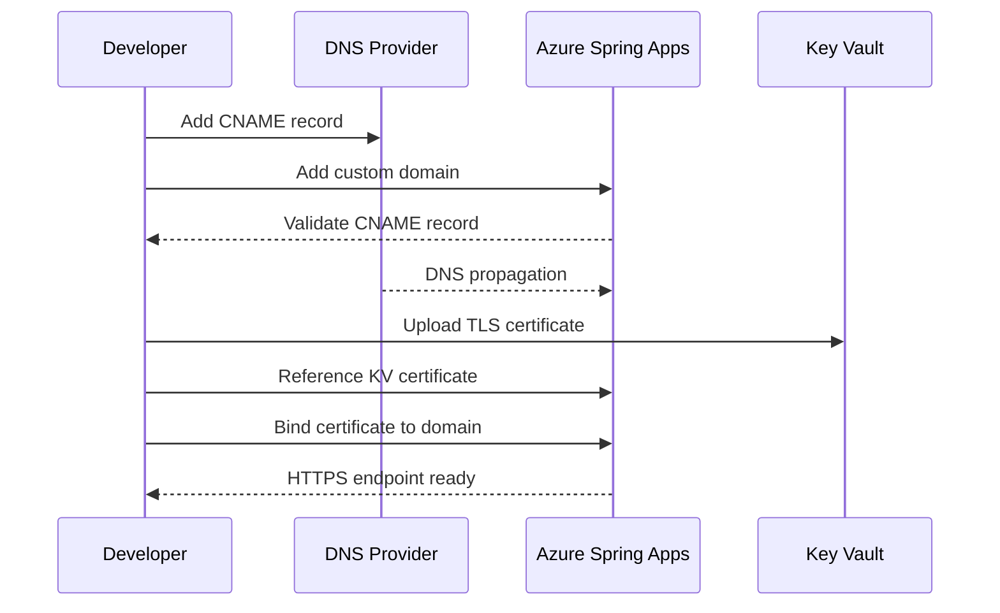

# How to Configure Custom Domains and TLS Certificates on Azure Spring Apps

Author: [nawazdhandala](https://www.github.com/nawazdhandala)

Tags: Azure, Spring Apps, Custom Domain, TLS, SSL, Certificate, DNS

Description: Step-by-step instructions for mapping custom domains and configuring TLS certificates on Azure Spring Apps for production-ready HTTPS endpoints.

---

When you deploy an application on Azure Spring Apps, it gets a default URL like `order-service-my-spring-service.azuremicroservices.io`. That is fine for development, but for production you need your own domain with a proper TLS certificate. Azure Spring Apps supports both custom domain mapping and Key Vault-backed TLS certificates. This guide covers the complete setup process.

Note that the Azure Spring Apps Basic, Standard, and Enterprise plans are in a retirement period, so use this guidance for existing services and plan migrations according to Microsoft's retirement guidance.

## Prerequisites

Before you start, you need:

- An Azure Spring Apps instance with the Standard or Enterprise SKU (custom domains are not available on the Basic SKU)
- A domain name that you control
- Access to your DNS provider's management panel
- Optionally, a TLS certificate in PFX or PEM format with its private key if you are bringing your own certificate

## Step 1: Verify Domain Ownership

Azure requires you to prove that you own the domain before you can map it. For Azure Spring Apps, this is done through a CNAME record.

First, create the CNAME record for the domain you want to map.

```text
Type:  CNAME
Name:  api
Value: my-spring-service.azuremicroservices.io
TTL:   3600
```

Then assign the custom domain to the application.

```bash
# Add a custom domain to the application

az spring app custom-domain bind \
  --app order-service \
  --service my-spring-service \
  --resource-group spring-rg \
  --domain-name api.example.com
```

Azure validates the CNAME record before it adds the custom domain.

## Step 2: Configure DNS Records

Go to your DNS provider and make sure the following record exists.

For a subdomain like `api.example.com`, create a CNAME record.

```text
Type:  CNAME
Name:  api
Value: my-spring-service.azuremicroservices.io
TTL:   3600
```

Azure Spring Apps custom domains require a CNAME record. An A record is not supported for this mapping, so use a subdomain such as `api.example.com` or `www.example.com`.

Wait for DNS propagation. This can take anywhere from a few minutes to 48 hours, though most providers propagate within 15-30 minutes.

## Step 3: Upload a TLS Certificate

If you have your own TLS certificate, import it into Azure Key Vault, grant Azure Spring Apps access, and then add it to the Spring Apps instance.

```bash
# Import a PFX certificate into Key Vault
az keyvault certificate import \
  --vault-name my-keyvault \
  --name my-cert \
  --file ./my-cert.pfx \
  --password "cert-password"

# Grant Azure Spring Apps Domain-Management access to Key Vault
az keyvault set-policy \
  --resource-group spring-rg \
  --name my-keyvault \
  --object-id 938df8e2-2b9d-40b1-940c-c75c33494239 \
  --certificate-permissions get list \
  --secret-permissions get list

# Add the Key Vault certificate to Azure Spring Apps
az spring certificate add \
  --name my-tls-cert \
  --service my-spring-service \
  --resource-group spring-rg \
  --vault-uri https://my-keyvault.vault.azure.net/ \
  --vault-certificate-name my-cert
```

## Step 4: Bind the Certificate to the Custom Domain

After uploading the certificate, bind it to the custom domain.

```bash
# Bind the TLS certificate to the custom domain
az spring app custom-domain update \
  --app order-service \
  --service my-spring-service \
  --resource-group spring-rg \
  --domain-name api.example.com \
  --certificate my-tls-cert
```

After binding, HTTPS requests to `https://api.example.com` will be served with your TLS certificate.

## Step 5: Use Azure Key Vault for Certificate Management

Storing certificates in Azure Key Vault is the recommended approach for production. It provides centralized management, automatic renewal alerts, and integration with certificate authorities.

First, import or create a certificate in Key Vault.

```bash
# Import a PFX certificate into Key Vault
az keyvault certificate import \
  --vault-name my-keyvault \
  --name api-example-cert \
  --file ./api-example-com.pfx \
  --password "pfx-password"
```

Then reference it from Azure Spring Apps.

```bash
# Add the certificate from Key Vault
az spring certificate add \
  --name api-cert \
  --service my-spring-service \
  --resource-group spring-rg \
  --vault-uri https://my-keyvault.vault.azure.net/ \
  --vault-certificate-name api-example-cert \
  --enable-auto-sync true

# Bind it to the custom domain
az spring app custom-domain update \
  --app order-service \
  --service my-spring-service \
  --resource-group spring-rg \
  --domain-name api.example.com \
  --certificate api-cert
```

For this to work, Azure Spring Apps Domain-Management needs access to the Key Vault.

```bash
# Grant Azure Spring Apps read access to Key Vault certificates and secrets
az keyvault set-policy \
  --resource-group spring-rg \
  --name my-keyvault \
  --object-id 938df8e2-2b9d-40b1-940c-c75c33494239 \
  --certificate-permissions get list \
  --secret-permissions get list
```

## Step 6: Configure Multiple Custom Domains

A single application can have multiple custom domains. This is useful for supporting both `api.example.com` and `www.example.com`.

```bash
# Add a second custom domain
az spring app custom-domain bind \
  --app web-frontend \
  --service my-spring-service \
  --resource-group spring-rg \
  --domain-name www.example.com

# Bind the same or different certificate
az spring app custom-domain update \
  --app web-frontend \
  --service my-spring-service \
  --resource-group spring-rg \
  --domain-name www.example.com \
  --certificate wildcard-cert
```

If you have a wildcard certificate for `*.example.com`, you can reuse it across multiple subdomains.

## Step 7: Force HTTPS Redirect

After setting up TLS, you likely want to redirect HTTP requests to HTTPS. Azure Spring Apps supports this with the HTTPS Only setting.

```bash
# Enforce HTTPS for the app
az spring app update \
  --resource-group spring-rg \
  --service my-spring-service \
  --name order-service \
  --https-only
```

If your Spring Boot app also needs to generate redirects or absolute links correctly behind the Azure Spring Apps proxy, add the following to your `application.yml`.

```yaml
# Trust the proxy headers from Azure Spring Apps
server:
  port: 8080
  forward-headers-strategy: framework
```

Or configure application-level HTTPS redirects in a Spring Security configuration class.

```java
// SecurityConfig.java - Redirect HTTP to HTTPS
@Configuration
@EnableWebSecurity
public class SecurityConfig {

    @Bean
    public SecurityFilterChain filterChain(HttpSecurity http) throws Exception {
        http
            // Redirect all HTTP requests to HTTPS
            .requiresChannel(channel -> channel
                .anyRequest().requiresSecure()
            )
            // Configure other security settings
            .authorizeHttpRequests(auth -> auth
                .requestMatchers("/actuator/health").permitAll()
                .anyRequest().authenticated()
            );
        return http.build();
    }
}
```

## Custom Domain Setup Flow


```mermaid
sequenceDiagram
    participant Dev as Developer
    participant DNS as DNS Provider
    participant ASA as Azure Spring Apps
    participant KV as Key Vault

    Dev->>DNS: Add CNAME record
    Dev->>ASA: Add custom domain
    ASA-->>Dev: Validate CNAME record
    DNS-->>ASA: DNS propagation
    Dev->>KV: Upload TLS certificate
    Dev->>ASA: Reference KV certificate
    Dev->>ASA: Bind certificate to domain
    ASA-->>Dev: HTTPS endpoint ready
```

## Step 8: Verify the Setup

Test that everything is working correctly.

```bash
# Check the custom domain status
az spring app custom-domain show \
  --app order-service \
  --service my-spring-service \
  --resource-group spring-rg \
  --domain-name api.example.com

# List all certificates
az spring certificate list \
  --service my-spring-service \
  --resource-group spring-rg \
  --output table
```

Also test with curl.

```bash
# Test the HTTPS endpoint
curl -I https://api.example.com

# Check the certificate details
openssl s_client -connect api.example.com:443 -servername api.example.com < /dev/null 2>/dev/null | openssl x509 -text -noout | head -20
```

## Certificate Renewal

TLS certificates expire and need renewal. Your renewal strategy depends on how you manage certificates.

**Key Vault with auto-renewal:** If you use a certificate authority that integrates with Key Vault (like DigiCert or GlobalSign), certificates can be renewed automatically. When auto sync is enabled for the imported certificate, Azure Spring Apps checks Key Vault for new versions regularly and imports them.

**Manual renewal:** When you manually import a new certificate version into Key Vault, add or update the certificate in Azure Spring Apps and update the binding if you use a new Azure Spring Apps certificate name.

```bash
# Add the renewed certificate from Key Vault
az spring certificate add \
  --name api-cert-renewed \
  --service my-spring-service \
  --resource-group spring-rg \
  --vault-uri https://my-keyvault.vault.azure.net/ \
  --vault-certificate-name api-example-cert-renewed

# Update the domain binding
az spring app custom-domain update \
  --app order-service \
  --service my-spring-service \
  --resource-group spring-rg \
  --domain-name api.example.com \
  --certificate api-cert-renewed
```

## Troubleshooting

**Domain verification fails:** Check DNS records with `nslookup api.example.com` or `dig api.example.com`. Ensure the CNAME record is correctly set.

**Certificate binding fails:** Verify the certificate matches the domain. A certificate for `example.com` will not work for `api.example.com` unless it is a wildcard or includes `api.example.com` as a Subject Alternative Name.

**Mixed content warnings:** If your app serves HTTP content over an HTTPS page, browsers will block it. Ensure all internal URLs use HTTPS.

**Certificate expiry warnings:** Set up Azure Monitor alerts for certificate expiry. Check expiry dates regularly.

## Summary

Configuring custom domains and TLS certificates on Azure Spring Apps involves adding DNS records for domain verification, uploading certificates (preferably through Key Vault), and binding them to your applications. For production deployments, use Key Vault for centralized certificate management and plan for automatic or scheduled certificate renewal. The process is straightforward, and once set up, your Spring Boot applications are accessible on your own domain with proper HTTPS encryption.
