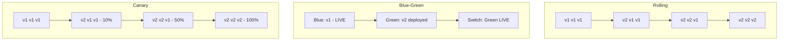

# How to Configure Deployment Strategies Like Canary and Blue-Green in Azure Pipelines Environments

Author: [nawazdhandala](https://www.github.com/nawazdhandala)

Tags: Azure Pipelines, Deployment Strategies, Canary, Blue-Green, CI/CD, Kubernetes, Azure DevOps

Description: Implement canary and blue-green deployment strategies in Azure Pipelines to reduce deployment risk and achieve zero-downtime releases.

---

Deploying new code to production is the riskiest moment in any release cycle. A bad deployment can take down your entire application. Deployment strategies like canary and blue-green exist to reduce this risk by limiting the blast radius of a failed deployment and giving you a fast rollback path.

Azure Pipelines supports these strategies natively through its deployment jobs and environments. In this post, I will walk through implementing both canary and blue-green deployments, explain when to use each one, and cover the practical details that documentation often skips.

## Understanding the Strategies

Before diving into implementation, let us clarify what each strategy actually does.

**Rolling deployment** (the default): New pods gradually replace old pods. Simple, but during the rollout, users might hit either the old or new version.

**Blue-green deployment**: You maintain two identical environments (blue and green). At any time, one is live and the other is idle. You deploy to the idle one, test it, then switch traffic. If something goes wrong, switch back.

**Canary deployment**: You deploy the new version to a small percentage of your infrastructure first. If metrics look good, gradually increase the percentage until the new version handles all traffic. If something goes wrong, you only affected a small slice of users.



## Canary Deployment in Azure Pipelines

Azure Pipelines supports canary deployments through the `canary` strategy in deployment jobs. The pipeline deploys to a subset first, then after validation (manual or automated), promotes to the full fleet.

Here is a canary deployment pipeline for a Kubernetes application.

```yaml
# azure-pipelines.yml - Canary deployment strategy
trigger:
  branches:
    include:
      - main

variables:
  registryUrl: 'myregistry.azurecr.io'
  imageName: 'myapp'
  imageTag: '$(Build.BuildId)'

stages:
  - stage: Build
    jobs:
      - job: BuildImage
        pool:
          vmImage: 'ubuntu-latest'
        steps:
          - task: Docker@2
            displayName: 'Build and push image'
            inputs:
              containerRegistry: 'myregistry'
              repository: '$(imageName)'
              command: 'buildAndPush'
              Dockerfile: 'Dockerfile'
              tags: '$(imageTag)'

  - stage: DeployCanary
    displayName: 'Canary Deployment'
    dependsOn: Build
    jobs:
      - deployment: DeployCanary
        pool:
          vmImage: 'ubuntu-latest'
        environment: 'production.myapp-canary'
        strategy:
          canary:
            increments: [10, 50]  # Deploy to 10%, then 50%, then 100%
            deploy:
              steps:
                # Deploy the canary version
                - task: KubernetesManifest@1
                  displayName: 'Deploy canary'
                  inputs:
                    action: 'deploy'
                    strategy: 'canary'
                    percentage: $(strategy.increment)
                    connectionType: 'azureResourceManager'
                    azureSubscriptionConnection: 'my-connection'
                    azureResourceGroup: 'my-rg'
                    kubernetesCluster: 'my-aks'
                    namespace: 'default'
                    manifests: 'k8s/deployment.yaml'
                    containers: '$(registryUrl)/$(imageName):$(imageTag)'

            postRouteTraffic:
              steps:
                # Validate the canary deployment
                - task: Bash@3
                  displayName: 'Validate canary health'
                  inputs:
                    targetType: 'inline'
                    script: |
                      # Check canary pod health
                      echo "Validating canary deployment at $(strategy.increment)%"
                      # Run smoke tests against the canary endpoint
                      sleep 60  # Wait for traffic to flow
                      RESPONSE=$(curl -s -o /dev/null -w "%{http_code}" http://myapp-canary.default.svc.cluster.local/health)
                      if [ "$RESPONSE" != "200" ]; then
                        echo "Canary health check failed with status $RESPONSE"
                        exit 1
                      fi
                      echo "Canary is healthy"

            on:
              failure:
                steps:
                  # Rollback if canary fails
                  - task: KubernetesManifest@1
                    displayName: 'Rollback canary'
                    inputs:
                      action: 'reject'
                      strategy: 'canary'
                      connectionType: 'azureResourceManager'
                      azureSubscriptionConnection: 'my-connection'
                      azureResourceGroup: 'my-rg'
                      kubernetesCluster: 'my-aks'
                      namespace: 'default'
                      manifests: 'k8s/deployment.yaml'

              success:
                steps:
                  # Promote canary to full deployment
                  - task: KubernetesManifest@1
                    displayName: 'Promote canary to stable'
                    inputs:
                      action: 'promote'
                      strategy: 'canary'
                      connectionType: 'azureResourceManager'
                      azureSubscriptionConnection: 'my-connection'
                      azureResourceGroup: 'my-rg'
                      kubernetesCluster: 'my-aks'
                      namespace: 'default'
                      manifests: 'k8s/deployment.yaml'
                      containers: '$(registryUrl)/$(imageName):$(imageTag)'
```

The `increments: [10, 50]` means the pipeline will:
1. Deploy to 10% of pods
2. Run the `postRouteTraffic` validation
3. If it passes, deploy to 50%
4. Run validation again
5. If it passes, promote to 100%

At any step, if validation fails, the `on.failure` block rolls back the canary.

## Blue-Green Deployment with Azure Web Apps

For Azure Web Apps, blue-green deployment is elegantly implemented using deployment slots. One slot (production) serves live traffic, and you deploy to a staging slot, then swap them.

```yaml
# azure-pipelines.yml - Blue-green deployment with slots
trigger:
  branches:
    include:
      - main

stages:
  - stage: Build
    jobs:
      - job: BuildJob
        pool:
          vmImage: 'ubuntu-latest'
        steps:
          - task: DotNetCoreCLI@2
            displayName: 'Publish'
            inputs:
              command: 'publish'
              projects: '**/MyApp.csproj'
              arguments: '--configuration Release --output $(Build.ArtifactStagingDirectory)'

          - task: PublishBuildArtifacts@1
            inputs:
              pathToPublish: '$(Build.ArtifactStagingDirectory)'
              artifactName: 'drop'

  - stage: DeployGreen
    displayName: 'Deploy to Green Slot'
    dependsOn: Build
    jobs:
      - deployment: DeployGreen
        pool:
          vmImage: 'ubuntu-latest'
        environment: 'production-green'
        strategy:
          runOnce:
            deploy:
              steps:
                # Deploy to the staging (green) slot
                - task: AzureWebApp@1
                  displayName: 'Deploy to staging slot'
                  inputs:
                    azureSubscription: 'my-connection'
                    appName: 'myapp-production'
                    deployToSlotOrASE: true
                    slotName: 'staging'
                    package: '$(Pipeline.Workspace)/drop/**/*.zip'

                # Run smoke tests against the staging slot
                - task: Bash@3
                  displayName: 'Smoke test green slot'
                  inputs:
                    targetType: 'inline'
                    script: |
                      # Test the staging slot directly
                      STATUS=$(curl -s -o /dev/null -w "%{http_code}" \
                        https://myapp-production-staging.azurewebsites.net/health)
                      if [ "$STATUS" != "200" ]; then
                        echo "Green slot health check failed"
                        exit 1
                      fi
                      echo "Green slot is healthy"

  - stage: SwapSlots
    displayName: 'Swap Green to Production'
    dependsOn: DeployGreen
    jobs:
      - deployment: SwapToProduction
        pool:
          vmImage: 'ubuntu-latest'
        environment: 'production'  # Approval gate on this environment
        strategy:
          runOnce:
            deploy:
              steps:
                # Swap the staging and production slots
                - task: AzureAppServiceManage@0
                  displayName: 'Swap slots'
                  inputs:
                    azureSubscription: 'my-connection'
                    action: 'Swap Slots'
                    webAppName: 'myapp-production'
                    sourceSlot: 'staging'
                    targetSlot: 'production'
                    preserveVnet: true
```

The beauty of slot swaps is that they are nearly instantaneous and easy to reverse. If production breaks after the swap, just swap the slots back.

## Blue-Green with Kubernetes

For Kubernetes, blue-green requires more setup since there are no built-in "slots." The approach is to maintain two deployments and switch the service selector between them.

```yaml
# k8s/deployment-blue.yaml
apiVersion: apps/v1
kind: Deployment
metadata:
  name: myapp-blue
  labels:
    app: myapp
    version: blue
spec:
  replicas: 3
  selector:
    matchLabels:
      app: myapp
      version: blue
  template:
    metadata:
      labels:
        app: myapp
        version: blue
    spec:
      containers:
        - name: myapp
          image: myregistry.azurecr.io/myapp:v1
          ports:
            - containerPort: 8080
```

```yaml
# k8s/service.yaml - Routes to whichever version is active
apiVersion: v1
kind: Service
metadata:
  name: myapp-service
spec:
  selector:
    app: myapp
    version: blue  # Change this to 'green' to switch traffic
  ports:
    - port: 80
      targetPort: 8080
```

The pipeline deploys to the inactive version, validates it, then patches the service selector.

```yaml
# Pipeline step to switch traffic from blue to green
- task: Kubernetes@1
  displayName: 'Switch traffic to green'
  inputs:
    connectionType: 'azureResourceManager'
    azureSubscriptionEndpoint: 'my-connection'
    azureResourceGroup: 'my-rg'
    kubernetesCluster: 'my-aks'
    command: 'patch'
    arguments: 'service myapp-service -p "{\"spec\":{\"selector\":{\"version\":\"green\"}}}"'
    namespace: 'default'
```

## Choosing Between Strategies

The right strategy depends on your situation:

**Use rolling deployments when:**
- Your application handles mixed versions gracefully
- You want simplicity
- Quick rollback is less critical

**Use blue-green when:**
- You need instant rollback capability
- Your application cannot run mixed versions
- You have the infrastructure budget for double capacity during deployment

**Use canary when:**
- You want to validate changes with real traffic before full rollout
- You have good monitoring and can detect issues in a subset of traffic
- Your user base is large enough that affecting 10% is still meaningful for validation

## Monitoring During Deployments

No deployment strategy works well without monitoring. You need to know quickly if the new version is causing problems.

Key metrics to watch during deployment:

- **Error rate**: Compare the error rate of the new version against the baseline
- **Latency**: Are response times increasing?
- **Resource usage**: Is the new version consuming more CPU or memory?
- **Business metrics**: Are key business events (signups, purchases) still occurring at expected rates?

Integrate your monitoring tool (Application Insights, Datadog, etc.) with your pipeline to automate these checks.

## Wrapping Up

Canary and blue-green deployment strategies trade infrastructure cost for deployment safety. Blue-green gives you instant rollback with slot swaps. Canary gives you graduated exposure to detect issues early. Both are better than deploying to 100% of your infrastructure at once and hoping nothing breaks. Start with whichever strategy matches your application architecture and monitoring capabilities, and iterate from there.
