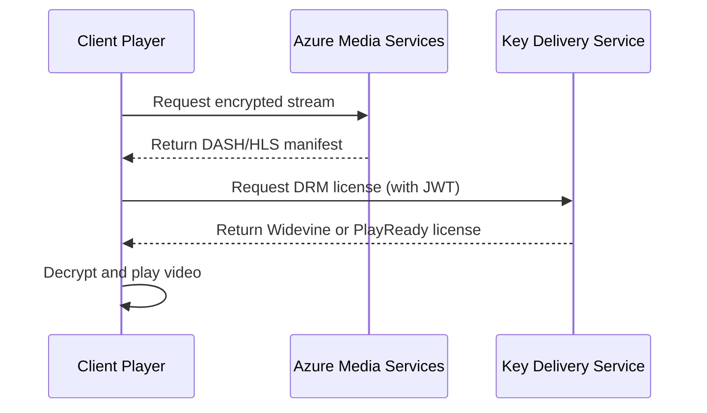

# How to Configure DRM Content Protection with Widevine and PlayReady in Azure Media Services

Author: [nawazdhandala](https://www.github.com/nawazdhandala)

Tags: Azure, Media Services, DRM, Widevine, PlayReady, Content Protection, Video Streaming

Description: Learn how to configure DRM content protection using Widevine and PlayReady in Azure Media Services to secure your video content from unauthorized access.

---

If you are streaming premium video content, protecting it from piracy and unauthorized redistribution is not optional. Digital Rights Management (DRM) is the industry standard approach for securing video streams, and Azure Media Services supports the two most widely adopted DRM technologies: Google Widevine and Microsoft PlayReady. Together, these cover virtually every major browser and device platform.

In this guide, we will walk through configuring both Widevine and PlayReady content protection in Azure Media Services, from setting up content key policies to delivering encrypted streams to your users.

## Understanding DRM in Azure Media Services

Before jumping into configuration, it helps to understand how the pieces fit together. When a user requests a video, the following happens:

1. The client player requests a license from Azure Media Services.
2. Azure Media Services validates the request (usually via a JWT token).
3. If valid, Azure issues a DRM license containing a content key.
4. The player uses the license to decrypt and play the video.

PlayReady covers Microsoft Edge, Internet Explorer, and many smart TVs. Widevine covers Chrome, Firefox, Android, and most other platforms. By enabling both, you get near-universal coverage without needing to worry about which browser your audience prefers.



## Prerequisites

Before starting, make sure you have:

- An Azure subscription with a Media Services account created.
- An Azure AD application registered for token signing.
- The Azure CLI installed, or access to the Azure portal.
- A video asset already uploaded and encoded in your Media Services account.

## Step 1: Create a Content Key Policy

Content key policies define how content keys are delivered to end clients. You need to configure separate options for each DRM system within a single policy.

The following Azure CLI command creates a content key policy with both PlayReady and Widevine options. The policy uses JWT token restriction so that only authenticated users receive licenses.

```bash
# Create a content key policy with PlayReady and Widevine license templates
az ams content-key-policy create \
  --resource-group myResourceGroup \
  --account-name myMediaServicesAccount \
  --name MultiDrmPolicy \
  --policy-option-name PlayReadyOption \
  --open-restriction false \
  --play-ready-template "@playready-template.json" \
  --widevine-template "@widevine-template.json"
```

However, in most production scenarios, you will configure this through the Azure portal or using the .NET SDK for finer control.

## Step 2: Define the PlayReady License Template

The PlayReady license template specifies what the client is allowed to do with the content. Here is a basic template that grants a non-persistent license valid for 24 hours.

```json
{
  "Licenses": [
    {
      "ContentType": "Unspecified",
      "PlayRight": {
        "AllowPassingVideoContentToUnknownOutput": "Allowed",
        "ImageConstraintForAnalogComponentVideoRestriction": false,
        "ImageConstraintForAnalogComputerMonitorRestriction": false
      },
      "LicenseType": "NonPersistent",
      "ExpirationDate": null,
      "BeginDate": null,
      "RelativeExpirationDate": "PT24H"
    }
  ]
}
```

The key fields here are `LicenseType` set to `NonPersistent` (the license lives only in memory and is not stored on disk) and `RelativeExpirationDate` set to 24 hours. You can adjust these based on your business requirements. For example, rental content might have a 48-hour window while subscription content could be refreshed every session.

## Step 3: Define the Widevine License Template

Widevine templates follow Google's license specification format. Here is a template that mirrors the PlayReady configuration above.

```json
{
  "payload": "base64-encoded-payload",
  "content_id": "content-unique-id",
  "provider": "your-provider-name",
  "allowed_track_types": "SD_HD",
  "content_key_specs": [
    {
      "track_type": "SD",
      "security_level": 1,
      "required_output_protection": {
        "hdcp": "HDCP_NONE"
      }
    }
  ],
  "policy_overrides": {
    "can_play": true,
    "can_persist": false,
    "can_renew": true,
    "rental_duration_seconds": 86400,
    "playback_duration_seconds": 86400,
    "license_duration_seconds": 86400
  }
}
```

The `policy_overrides` section is where you control playback duration and whether the license can be persisted offline. Setting `can_persist` to false keeps licenses ephemeral, which is appropriate for most streaming use cases.

## Step 4: Configure JWT Token Restriction

To prevent unauthorized license acquisition, you should use JWT token restriction. This means the player must present a valid JWT token to get a DRM license.

The following C# code sets up the token restriction on a content key policy using the Azure Media Services .NET SDK.

```csharp
// Configure the JWT token restriction for the content key policy
var tokenRestriction = new ContentKeyPolicyTokenRestriction
{
    // Set the token issuer - must match the issuer in your JWT tokens
    Issuer = "https://your-sts.example.com",

    // Set the audience - typically your application identifier
    Audience = "urn:your-application",

    // Use symmetric key for signing verification
    PrimaryVerificationKey = new ContentKeyPolicySymmetricTokenKey(
        Convert.FromBase64String("your-base64-encoded-symmetric-key")
    ),

    // Require the content key identifier claim in the token
    RequiredClaims = new List<ContentKeyPolicyTokenClaim>
    {
        ContentKeyPolicyTokenClaim.ContentKeyIdentifierClaim
    },

    // Use JWT (not SWT)
    RestrictionTokenType = ContentKeyPolicyRestrictionTokenType.Jwt
};
```

The symmetric key must match the key used by your Security Token Service (STS) when signing JWT tokens. In production, you will likely use RSA keys or X.509 certificates instead, but symmetric keys work well for getting started.

## Step 5: Create the Streaming Locator with Content Protection

With the content key policy in place, you need to create a streaming locator that references it. The streaming locator is what gives you the URL to deliver content.

```bash
# Create a streaming locator with the multi-DRM content key policy
az ams streaming-locator create \
  --resource-group myResourceGroup \
  --account-name myMediaServicesAccount \
  --name myDrmLocator \
  --asset-name myEncodedAsset \
  --streaming-policy-name Predefined_MultiDrmCencStreaming \
  --default-content-key-policy-name MultiDrmPolicy
```

The `Predefined_MultiDrmCencStreaming` streaming policy is a built-in policy that configures Common Encryption (CENC) for both PlayReady and Widevine. Azure provides this out of the box, so you do not need to create a custom streaming policy for most scenarios.

## Step 6: Configure the Client Player

On the client side, you need a player that supports DRM. Azure Media Player handles this natively. Here is an example HTML setup.

```html
<link href="//amp.azure.net/libs/amp/latest/skins/amp-default/azuremediaplayer.min.css" rel="stylesheet">
<script src="//amp.azure.net/libs/amp/latest/azuremediaplayer.min.js"></script>

<video id="azuremediaplayer" class="azuremediaplayer amp-default-skin">
</video>

<script>
  // Initialize Azure Media Player with DRM protection settings
  var myPlayer = amp('azuremediaplayer', {
    nativeControlsForTouch: false,
    autoplay: false,
    controls: true,
    width: "640",
    height: "400",
    poster: "",
    // Configure the protection info for both DRM systems
    protectionInfo: [
      {
        type: "PlayReady",
        authenticationToken: "Bearer=your-jwt-token-here"
      },
      {
        type: "Widevine",
        authenticationToken: "Bearer=your-jwt-token-here"
      }
    ]
  });

  // Set the source with the streaming URL
  myPlayer.src([{
    src: "https://your-account.streaming.media.azure.net/locator-guid/manifest(format=mpd-time-cmaf)",
    type: "application/dash+xml"
  }]);
</script>
```

The player automatically selects the appropriate DRM system based on the browser. Chrome and Firefox will use Widevine, while Edge uses PlayReady.

## Step 7: Test and Validate

After configuring everything, test the setup by:

1. Generating a valid JWT token using your STS or a test tool.
2. Opening the player in different browsers to confirm both PlayReady and Widevine work.
3. Trying to play without a token to verify that unauthorized access is blocked.
4. Checking the Azure Media Services logs for any license delivery failures.

You can also use the Azure portal's streaming endpoint test player, which has built-in support for DRM testing.

## Common Troubleshooting

A few issues come up regularly when configuring multi-DRM:

- **License delivery errors**: Usually caused by a mismatch between the token signing key in your content key policy and the key used by your STS. Double-check that the keys are identical.
- **Playback fails on specific browsers**: Verify that your streaming policy includes the correct DRM for that browser. PlayReady for Edge, Widevine for Chrome and Firefox.
- **Token expiration errors**: JWT tokens have an expiration claim. Make sure the token is fresh when the player requests a license.
- **CORS issues**: If the player is hosted on a different domain than the streaming endpoint, configure CORS on the streaming endpoint.

## Wrapping Up

Configuring DRM with both Widevine and PlayReady in Azure Media Services gives you broad device and browser coverage for content protection. The key steps are creating a content key policy with templates for both DRM systems, applying JWT token restriction, and using the built-in multi-DRM streaming policy. Once set up, the system handles license delivery automatically, letting you focus on building the rest of your video platform rather than worrying about content security plumbing.
