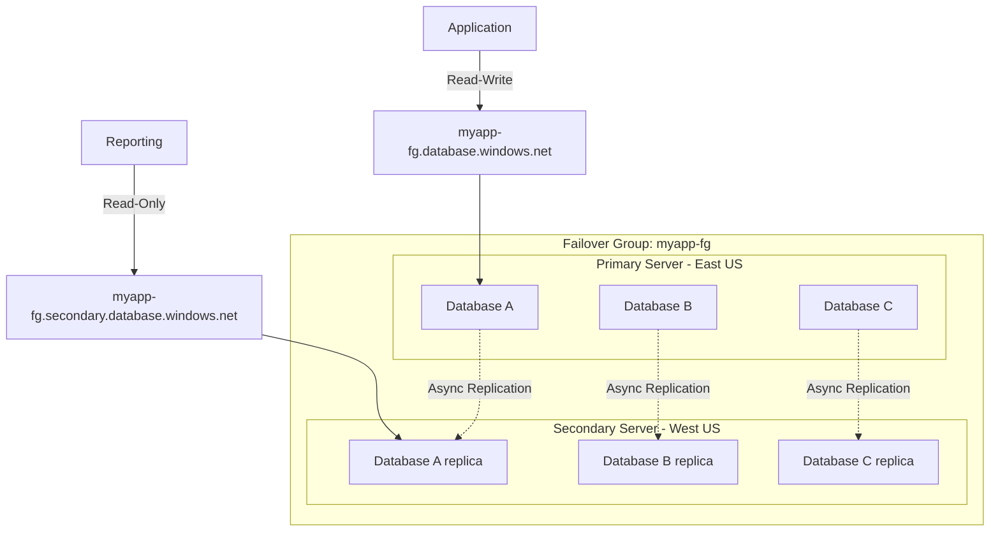

# How to Configure Failover Groups in Azure SQL Database for High Availability

Author: [nawazdhandala](https://www.github.com/nawazdhandala)

Tags: Azure SQL, Failover Groups, High Availability, Disaster Recovery, Azure, Database, Replication

Description: Learn how to configure failover groups in Azure SQL Database to achieve automatic failover and seamless high availability across Azure regions.

---

If you need your Azure SQL Database to survive a regional outage without manual intervention, failover groups are the way to go. They build on top of geo-replication but add automatic failover, listener endpoints that redirect traffic seamlessly, and the ability to group multiple databases together under a single failover policy.

In this post, I will walk through how failover groups work, how to set them up, and how to test them so you know they will work when you actually need them.

## How Failover Groups Work

A failover group is a named group of databases on a primary SQL server that can fail over as a unit to a secondary SQL server in a different region. Here is what makes failover groups special compared to plain geo-replication:

**Listener endpoints**: A failover group creates two DNS endpoints:
- Read-write: `<failover-group-name>.database.windows.net`
- Read-only: `<failover-group-name>.secondary.database.windows.net`

These endpoints automatically point to whichever server is currently primary. When a failover happens, the DNS entries update, and your application reconnects without changing connection strings.

**Automatic failover**: You can configure a grace period. If the primary is unreachable for longer than this period, Azure automatically promotes the secondary. No human intervention required.

**Group failover**: All databases in the group fail over together. This is critical for applications that depend on multiple databases being consistent with each other.



## Prerequisites

Before setting up a failover group, you need:

- A primary SQL server with one or more databases
- A secondary SQL server in a different Azure region (it must be empty - the databases will be created automatically by the failover group)
- Both servers must have the same admin login credentials
- Databases must be at Standard S3 tier or above, or General Purpose tier or above

## Creating a Failover Group via Azure Portal

### Step 1: Navigate to Your Primary SQL Server

Go to the Azure Portal and open your primary SQL server resource (the server, not an individual database).

### Step 2: Open Failover Groups

In the left menu, under "Data management", click "Failover groups". Click "+ Add group" to create a new failover group.

### Step 3: Configure the Failover Group

**Failover group name**: Choose a globally unique name. This becomes part of your connection endpoint, so keep it meaningful. For example, "myapp-fg" or "production-sql-fg".

**Server**: Select or create the secondary server. If you need to create one:
- Pick a region different from the primary (geo-redundancy requires different regions)
- The server name must be globally unique
- The admin login and password must match the primary server

**Read/Write failover policy**: Choose between:
- **Automatic**: Azure will trigger failover if the primary is unreachable for the grace period
- **Manual**: You must trigger failover yourself

I recommend Automatic for production workloads.

**Grace period (minutes)**: When set to automatic, this is how long Azure waits before triggering failover. The minimum is 1 hour. This prevents unnecessary failovers during brief transient issues.

**Databases within the group**: Select which databases to include in the failover group. All selected databases will be replicated to the secondary server.

### Step 4: Create the Group

Click "Create". Azure will begin replicating all selected databases to the secondary server. The initial seeding can take some time depending on database sizes.

### Step 5: Verify the Setup

Once the deployment completes, go back to the Failover groups page. You should see:
- The failover group name
- The primary and secondary servers
- The read-write and read-only listener endpoints
- The replication status of each database

## Creating a Failover Group via Azure CLI

For automation, here is how to do it with the CLI.

First, ensure you have a secondary server:

```bash
# Create a secondary SQL server in a different region
az sql server create \
    --resource-group myResourceGroup \
    --name myserver-secondary \
    --location westus \
    --admin-user sqladmin \
    --admin-password 'YourStrongPassword123!'
```

Create the failover group:

```bash
# Create a failover group with automatic failover
az sql failover-group create \
    --resource-group myResourceGroup \
    --server myserver-primary \
    --partner-server myserver-secondary \
    --name myapp-fg \
    --failover-policy Automatic \
    --grace-period 1
```

Add databases to the group:

```bash
# Add a database to the failover group
az sql failover-group update \
    --resource-group myResourceGroup \
    --server myserver-primary \
    --name myapp-fg \
    --add-db mydb1 mydb2 mydb3
```

## Updating Your Application Connection Strings

This is one of the best parts of failover groups. Instead of connecting to a specific server, you connect to the failover group listener.

Before failover groups:
```
Server=myserver-primary.database.windows.net;Database=mydb;...
```

With failover groups:
```
Server=myapp-fg.database.windows.net;Database=mydb;...
```

For read-only workloads:
```
Server=myapp-fg.secondary.database.windows.net;Database=mydb;...
```

When a failover happens, the DNS entries automatically update. Your application reconnects to the new primary without any code changes. There will be a brief interruption while the DNS propagates and the application reconnects, but no manual steps are needed.

## Testing Failover

You should test failover before you actually need it. There are two ways to test.

### Planned Failover (No Data Loss)

A planned failover fully synchronizes the primary and secondary before switching roles. There is no data loss, but it takes a bit longer.

Via Portal:
1. Go to your failover group.
2. Click "Failover".
3. Confirm the action.

Via CLI:

```bash
# Planned failover (no data loss, run against secondary server)
az sql failover-group set-primary \
    --resource-group myResourceGroup \
    --server myserver-secondary \
    --name myapp-fg
```

After the failover:
- The secondary becomes the new primary
- The old primary becomes the new secondary
- The listener endpoints update automatically
- Replication reverses direction

### Forced Failover (Potential Data Loss)

This simulates a disaster scenario. The secondary is promoted immediately without waiting for full synchronization.

```bash
# Forced failover (may lose data, use for disaster simulation)
az sql failover-group set-primary \
    --resource-group myResourceGroup \
    --server myserver-secondary \
    --name myapp-fg \
    --allow-data-loss
```

Only use this in actual emergencies or during controlled disaster recovery drills.

## Monitoring Failover Group Health

Regular monitoring ensures you will be ready when a real failover is needed.

In the Azure Portal, the failover group page shows:
- Current primary and secondary roles
- Replication status for each database
- The failover policy settings

Set up alerts for:
- Replication lag exceeding acceptable thresholds
- Failover events (both automatic and manual)
- Database health state changes

You can also query the replication status using T-SQL from the primary:

```sql
-- Check replication status for all databases in the failover group
SELECT
    d.name AS database_name,
    rs.replication_state_desc,
    rs.last_replication,
    rs.replication_lag_sec
FROM sys.dm_geo_replication_link_status rs
JOIN sys.databases d ON rs.resource_id = d.resource_id;
```

## Failover Group Best Practices

**Match secondary performance to primary.** The secondary needs to handle the full write workload during failover. If it is underpowered, performance will degrade when you need it most.

**Keep firewall rules in sync.** Both servers need the same firewall configuration so that applications can connect after failover. Consider using a script or Azure Policy to enforce this.

**Test failover regularly.** I recommend a planned failover test at least quarterly. This validates your runbooks, verifies DNS propagation works, and builds team confidence.

**Use the listener endpoint everywhere.** Never hardcode a specific server name in your application. Always use the failover group listener so failover is transparent.

**Mind the grace period.** The minimum 1-hour grace period means Azure waits at least an hour before triggering automatic failover. For shorter recovery time objectives, you may need to implement application-level health checks and trigger manual failover sooner.

**Plan for failback.** After a failover, you might want to fail back to the original region once it recovers. This is simply another planned failover. Test this as part of your DR drills.

## Limitations

- A failover group can contain databases from only one server.
- Both servers must be in different regions.
- The secondary server must be empty before creating the failover group (existing databases will conflict).
- The maximum number of databases per failover group varies but can support hundreds of databases.
- Databases added to the group after creation will take time to seed.

## Summary

Failover groups provide the most robust high availability option for Azure SQL Database. They combine geo-replication with automatic failover and DNS-based listener endpoints to create a solution that requires minimal application changes. Set up is straightforward through the Portal or CLI, and regular testing ensures you are prepared for actual outages. Update your connection strings to use the failover group listener, monitor replication health, and test failover at least quarterly.
