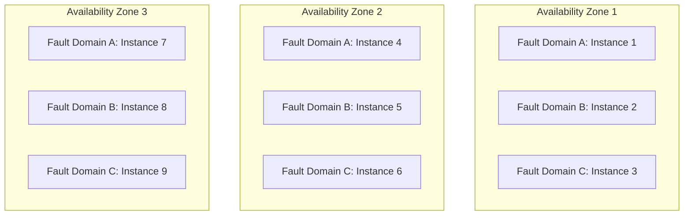

# How to Configure Fault Domain Spreading for Azure VM Scale Sets

Author: [nawazdhandala](https://www.github.com/nawazdhandala)

Tags: Azure, VM Scale Sets, Fault Domains, High Availability, Resilience, Infrastructure

Description: Learn how to configure fault domain spreading in Azure VM Scale Sets to maximize availability and protect against hardware failures.

---

When Azure provisions virtual machines, each VM is placed on a physical host within a rack in a datacenter. A fault domain represents a group of VMs that share a common power source and network switch - essentially, a rack. If that rack loses power or a top-of-rack switch fails, all VMs in that fault domain go down simultaneously. Fault domain spreading ensures your scale set instances are distributed across multiple fault domains so a single hardware failure does not take out your entire application.

Getting fault domain spreading right is one of those foundational decisions that you make when creating a scale set and rarely think about again - until a hardware failure proves it was either the right or wrong choice.

## Understanding Fault Domains

Azure datacenters organize physical hardware into fault domains and update domains:

- **Fault domains**: Groups of hardware that share a single point of failure (power, networking). Azure regions typically have 2-3 fault domains per availability zone or datacenter.
- **Update domains**: Groups of hardware that Azure updates together during planned maintenance. Up to 20 update domains are available.

For VM Scale Sets, fault domain spreading controls how instances are distributed across available fault domains.

## Spreading Modes

VM Scale Sets support two fault domain spreading modes:

### Max Spreading (platformFaultDomainCount = 1)

With max spreading, Azure distributes instances across as many fault domains as possible. The actual number depends on the region and whether you are using availability zones. This gives you the best possible fault tolerance.

Max spreading is the default for scale sets that use Flexible orchestration mode and is the recommended setting for most workloads.

### Static Spreading (platformFaultDomainCount = 2, 3, or 5)

With static spreading, you specify the exact number of fault domains to use. Instances are distributed evenly across that number of fault domains. This is useful when you need a predictable distribution (for example, database replicas that need exactly 3 fault domains).

## Configuring Fault Domain Spreading

### Using Azure CLI

```bash
# Create a scale set with max spreading (recommended)
az vmss create \
  --resource-group myResourceGroup \
  --name myScaleSet \
  --image Ubuntu2204 \
  --vm-sku Standard_D2s_v5 \
  --instance-count 6 \
  --platform-fault-domain-count 1 \
  --admin-username azureuser \
  --generate-ssh-keys

# Create a scale set with static spreading (3 fault domains)
az vmss create \
  --resource-group myResourceGroup \
  --name myStaticScaleSet \
  --image Ubuntu2204 \
  --vm-sku Standard_D2s_v5 \
  --instance-count 6 \
  --platform-fault-domain-count 3 \
  --admin-username azureuser \
  --generate-ssh-keys
```

### Using ARM Templates

```json
{
  "type": "Microsoft.Compute/virtualMachineScaleSets",
  "apiVersion": "2023-07-01",
  "name": "myScaleSet",
  "location": "eastus",
  "properties": {
    "platformFaultDomainCount": 1,
    "orchestrationMode": "Flexible",
    "virtualMachineProfile": {
      "storageProfile": {
        "imageReference": {
          "publisher": "Canonical",
          "offer": "0001-com-ubuntu-server-jammy",
          "sku": "22_04-lts-gen2",
          "version": "latest"
        }
      }
    }
  },
  "sku": {
    "name": "Standard_D2s_v5",
    "tier": "Standard",
    "capacity": 6
  }
}
```

## Fault Domain Spreading with Availability Zones

When you deploy a scale set across availability zones, fault domain spreading works within and across zones:

```bash
# Create a zone-redundant scale set with max spreading
az vmss create \
  --resource-group myResourceGroup \
  --name myZonalScaleSet \
  --image Ubuntu2204 \
  --vm-sku Standard_D2s_v5 \
  --instance-count 9 \
  --zones 1 2 3 \
  --platform-fault-domain-count 1 \
  --admin-username azureuser \
  --generate-ssh-keys
```

With 9 instances across 3 zones and max spreading, Azure distributes 3 instances per zone and then spreads within each zone across fault domains. The result is maximum protection against both zone-level and fault-domain-level failures.



## Checking Instance Fault Domain Placement

After deployment, verify how instances are distributed:

```bash
# Check fault domain placement for each instance
az vmss get-instance-view \
  --resource-group myResourceGroup \
  --name myScaleSet \
  --instance-id "*" \
  --query "[].{InstanceId:instanceId, FaultDomain:platformFaultDomain, Zone:zones[0]}" \
  -o table
```

The output shows which fault domain (and zone, if applicable) each instance is placed in. For a well-spread scale set, you should see instances evenly distributed.

## Choosing the Right Spreading Mode

### Use Max Spreading When:

- You want the highest possible availability.
- You do not care about the exact fault domain count.
- You are running stateless workloads where any instance can handle any request.
- You are using the Flexible orchestration mode.

### Use Static Spreading When:

- You need exactly N fault domains for compliance or architecture reasons.
- You are running a distributed system that requires specific replica placement (like a 3-node database cluster where each node must be in a separate fault domain).
- You need predictable placement for capacity planning.

## Impact on Scaling Operations

Fault domain spreading affects how new instances are placed during scale-out:

When the scale set adds new instances, Azure tries to maintain even distribution across fault domains. If fault domain A has 3 instances and fault domain B has 2, the next instance goes to fault domain B.

However, this is a best-effort distribution. Under certain circumstances (capacity constraints in a fault domain, specific VM size availability), Azure might not achieve perfect distribution. The instances will still be spread as well as possible given the constraints.

```bash
# After a scale-out event, verify the distribution is still balanced
az vmss scale --resource-group myResourceGroup --name myScaleSet --new-capacity 12

# Check the distribution
az vmss get-instance-view \
  --resource-group myResourceGroup \
  --name myScaleSet \
  --instance-id "*" \
  --query "[].platformFaultDomain" -o tsv | sort | uniq -c
```

This command counts instances per fault domain. Ideally, the numbers should be equal or differ by at most 1.

## Fault Domain Spreading and Availability Sets

It is worth clarifying the relationship between scale set fault domains and traditional availability sets:

- **Availability Sets**: A separate Azure resource that provides fault domain and update domain distribution for individual VMs (not scale sets). Limited to 3 fault domains and 20 update domains.
- **Scale Set Fault Domains**: Built into the scale set itself. No separate availability set resource is needed.

You do not need an availability set when using a VM Scale Set. The scale set's fault domain spreading provides equivalent or better protection.

## Regional vs. Zonal Deployments

The number of available fault domains depends on your deployment type:

**Regional deployment** (no availability zones specified): Typically 2-5 fault domains available, depending on the region.

**Zonal deployment** (availability zones specified): Each zone has its own set of fault domains. The exact count varies by region but is usually 2-3 per zone.

```bash
# Check available fault domain count in a region
az vm list-skus --location eastus \
  --query "[?resourceType=='virtualMachines' && name=='Standard_D2s_v5'].{Name:name, FaultDomains:capabilities[?name=='MaximumPlatformFaultDomainCount'].value | [0]}" \
  -o table
```

## Failure Scenarios and Fault Domain Protection

Let me walk through how fault domain spreading protects you in different failure scenarios:

### Scenario: Power supply failure in one rack

With instances spread across 3 fault domains and 6 total instances:
- 2 instances go down (those in the affected fault domain)
- 4 instances continue serving traffic
- The load balancer detects the failed instances and routes traffic to the healthy ones
- If autoscale is configured, replacement instances are created in healthy fault domains

### Scenario: Network switch failure

Similar to a power failure but affecting network connectivity. Instances in the affected fault domain become unreachable while others continue normally.

### Scenario: Entire zone failure

With zone-redundant deployment across 3 zones:
- All instances in the failed zone are lost
- Instances in the other 2 zones continue
- 66% of capacity remains (assuming even distribution)
- Autoscale can add instances in the surviving zones

## Monitoring Fault Domain Health

While Azure does not provide per-fault-domain health metrics directly, you can infer fault domain health from instance health data:

```bash
# Correlate instance health with fault domain placement
az vmss get-instance-view \
  --resource-group myResourceGroup \
  --name myScaleSet \
  --instance-id "*" \
  --query "[].{InstanceId:instanceId, FaultDomain:platformFaultDomain, Health:vmHealth.status.code, PowerState:statuses[1].displayStatus}" \
  -o table
```

If all unhealthy instances share the same fault domain, that points to a hardware issue in that fault domain.

Use OneUptime to track per-instance health and correlate failures with fault domain placement. When multiple instances fail simultaneously and they all share a fault domain, you know the cause is infrastructure rather than application.

## Best Practices

1. **Always use max spreading** unless you have a specific reason for static spreading.
2. **Deploy across availability zones** in addition to fault domains for maximum resilience.
3. **Run at least 2 instances** in production so a single fault domain failure does not cause a complete outage.
4. **Monitor fault domain distribution** after scale operations to verify instances are evenly spread.
5. **Design for N-1 fault domains**: If you have instances across 3 fault domains, your application should handle losing one-third of its instances.
6. **Combine with autoscale**: Automatic replacement of failed instances in healthy fault domains is the fastest recovery path.

## Wrapping Up

Fault domain spreading is a fundamental high-availability feature that distributes your scale set instances across different physical hardware groups. Use max spreading for the best protection, deploy across availability zones for zone-level resilience, and design your application to tolerate the loss of one fault domain. This is the kind of configuration that you set up once, verify it works, and then benefit from every time there is a hardware failure in the datacenter - which happens more often than most people realize.
