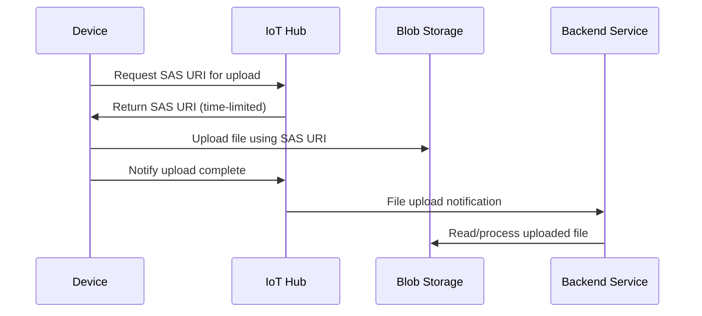

# How to Configure File Upload from IoT Devices to Azure Blob Storage via IoT Hub

Author: [nawazdhandala](https://www.github.com/nawazdhandala)

Tags: Azure IoT Hub, File Upload, Blob Storage, IoT Devices, Azure Cloud, Device Communication, IoT Architecture

Description: Learn how to configure file upload from IoT devices to Azure Blob Storage through Azure IoT Hub with step-by-step instructions and code examples.

---

IoT devices frequently need to send more than just small telemetry messages. Firmware logs, diagnostic images, sensor data batches, and configuration snapshots can all be several megabytes in size. Pushing that kind of payload through the standard device-to-cloud messaging channel in Azure IoT Hub is impractical because messages are capped at 256 KB. The file upload feature in IoT Hub solves this by brokering a secure handshake between the device and an Azure Blob Storage container, letting the device upload files of any reasonable size directly to blob storage without routing everything through the hub itself.

In this post we will walk through the complete process: provisioning the storage account, linking it to IoT Hub, writing device-side code that performs the upload, and handling the upload notification on the back end.

## Why File Upload Instead of Regular Messages

Regular device-to-cloud messages are ideal for high-frequency, low-payload telemetry - temperature readings, heartbeat pings, GPS coordinates. But when a device needs to ship a multi-megabyte firmware dump or a batch CSV of the last 24 hours of sensor readings, you hit the message size limit fast. Even if you chunk the data, you introduce ordering concerns, retry complexity, and additional cost from the sheer number of messages.

File upload sidesteps all of that. The device asks IoT Hub for a shared access signature (SAS) URI, uploads the file directly to Blob Storage over HTTPS, and then notifies IoT Hub that the upload is complete. The hub never touches the file payload itself, which keeps throughput high and costs low.

## Prerequisites

Before you start, make sure you have these resources ready:

- An Azure subscription with permissions to create resources
- An Azure IoT Hub instance (S1 tier or above - the free tier supports file upload but with limited throughput)
- The Azure CLI installed or access to the Azure Portal
- Node.js 18 or later (we will use the Node.js device SDK for the example)
- A registered device identity in your IoT Hub

## Step 1: Create an Azure Storage Account

If you do not already have a storage account, create one in the same region as your IoT Hub to avoid cross-region data transfer charges.

The following CLI command creates a general-purpose v2 storage account with locally redundant storage.

```bash
# Create a resource group if you don't have one
az group create --name iot-file-upload-rg --location eastus

# Create the storage account
az storage account create \
  --name iotfileuploadsa \
  --resource-group iot-file-upload-rg \
  --location eastus \
  --sku Standard_LRS \
  --kind StorageV2
```

Next, create a blob container inside the storage account where uploaded files will land.

```bash
# Create a container named 'device-uploads'
az storage container create \
  --name device-uploads \
  --account-name iotfileuploadsa \
  --auth-mode login
```

## Step 2: Link the Storage Account to IoT Hub

Now tell IoT Hub where to send file uploads. You can do this in the portal under IoT Hub > Messaging > File upload, or use the CLI.

```bash
# Get the storage account connection string
STORAGE_CS=$(az storage account show-connection-string \
  --name iotfileuploadsa \
  --resource-group iot-file-upload-rg \
  --query connectionString -o tsv)

# Link the storage account to IoT Hub
az iot hub update \
  --name my-iot-hub \
  --set properties.storageEndpoints.'$default'.connectionString="$STORAGE_CS" \
  properties.storageEndpoints.'$default'.containerName="device-uploads" \
  properties.storageEndpoints.'$default'.sasTtlAsIso8601="PT1H"
```

The `sasTtlAsIso8601` parameter controls how long the SAS token remains valid. One hour is a reasonable default for most file sizes, but you can shorten it for security or extend it for very large uploads over slow connections.

## Step 3: Enable File Upload Notifications

File upload notifications let your back-end services know when a device has finished uploading a file. Enable them with the following settings.

```bash
az iot hub update \
  --name my-iot-hub \
  --set properties.enableFileUploadNotifications=true \
  properties.messagingEndpoints.fileNotifications.ttlAsIso8601="PT1H" \
  properties.messagingEndpoints.fileNotifications.maxDeliveryCount=10
```

These notifications arrive on a built-in endpoint that you can consume with Event Hubs-compatible readers or route to a custom endpoint.

## Step 4: Upload a File from the Device

Install the Azure IoT device SDK for Node.js.

```bash
npm install azure-iot-device azure-iot-device-mqtt
```

Here is a complete device-side script that uploads a local file to blob storage through IoT Hub.

```javascript
// upload-file.js - Device-side file upload through IoT Hub
const { Client } = require('azure-iot-device');
const { Mqtt } = require('azure-iot-device-mqtt');
const fs = require('fs');
const path = require('path');

// Replace with your device connection string from IoT Hub
const connectionString = 'HostName=my-iot-hub.azure-devices.net;DeviceId=sensor-01;SharedAccessKey=...';

// The local file to upload
const filePath = path.join(__dirname, 'sensor-data-batch.csv');
const blobName = `sensor-01/${Date.now()}-sensor-data-batch.csv`;

async function main() {
  // Create the device client using MQTT protocol
  const client = Client.fromConnectionString(connectionString, Mqtt);
  await client.open();

  console.log('Connected to IoT Hub');

  // Create a read stream for the file
  const fileStream = fs.createReadStream(filePath);
  const fileStats = fs.statSync(filePath);

  console.log(`Uploading ${filePath} (${fileStats.size} bytes) as ${blobName}`);

  // Upload the file - IoT Hub handles the SAS token exchange behind the scenes
  await client.uploadToBlob(blobName, fileStream, fileStats.size);

  console.log('File uploaded successfully');

  // Clean up
  await client.close();
}

main().catch((err) => {
  console.error('Upload failed:', err.message);
  process.exit(1);
});
```

The `uploadToBlob` method handles three things automatically: requesting a SAS URI from IoT Hub, uploading the file to Blob Storage using that URI, and notifying IoT Hub that the upload is complete.

## Step 5: Receive File Upload Notifications on the Back End

On the service side, you can listen for file upload completion notifications. This is useful for triggering downstream processing like parsing uploaded CSV data or archiving logs.

```javascript
// notification-receiver.js - Service-side notification listener
const { Client } = require('azure-iothub');

// Use the IoT Hub service connection string (not the device connection string)
const serviceConnectionString = 'HostName=my-iot-hub.azure-devices.net;SharedAccessKeyName=service;SharedAccessKey=...';

async function main() {
  const serviceClient = Client.fromConnectionString(serviceConnectionString);
  await serviceClient.open();

  // Get the file notification receiver
  const receiver = await serviceClient.getFileNotificationReceiver();

  console.log('Listening for file upload notifications...');

  // Handle incoming notifications
  receiver.on('message', (notification) => {
    console.log('File upload notification received:');
    console.log(`  Device ID: ${notification.deviceId}`);
    console.log(`  Blob URI: ${notification.blobUri}`);
    console.log(`  Blob Name: ${notification.blobName}`);
    console.log(`  Enqueued: ${notification.enqueuedTimeUtc}`);

    // Complete the notification so it is removed from the queue
    receiver.complete(notification, (err) => {
      if (err) {
        console.error('Failed to complete notification:', err.message);
      }
    });
  });
}

main().catch(console.error);
```

## Architecture Overview

Here is a visual overview of how the file upload flow works between the device, IoT Hub, and Blob Storage.



## Handling Upload Failures and Retries

Network connections on IoT devices are often unreliable. Here are a few practical tips for making file uploads robust:

- Set the SAS TTL long enough to accommodate retries. If your device might lose connectivity for 30 minutes, a one-hour TTL gives breathing room.
- Implement exponential backoff on the device side. The SDK does not retry blob uploads automatically, so wrap the upload call in your own retry logic.
- Use unique blob names that include timestamps or UUIDs. This prevents accidental overwrites if a device retries and the original upload actually succeeded.
- Monitor the `d2c.telemetry.ingress.allProtocol` and file upload-specific metrics in Azure Monitor to track success rates.

## Security Considerations

The SAS tokens generated by IoT Hub are scoped to a specific blob name and have a limited lifetime. The device never sees the storage account key. This is a significant security advantage over giving devices direct storage credentials, because a compromised device token only grants access to upload a single blob for a limited time.

For additional security, consider enabling managed identity on your IoT Hub and using role-based access control (RBAC) instead of connection strings to link the storage account. This eliminates the need to store any storage connection string in IoT Hub configuration.

## Cost Implications

File uploads do not count against your IoT Hub message quota. The device-to-hub messages for the SAS request and upload notification are small and count as two messages. The actual data transfer cost is on the Blob Storage side. If your IoT Hub and storage account are in the same region, there are no data transfer charges, only the standard blob storage and transaction costs.

## Wrapping Up

File upload through Azure IoT Hub is one of those features that seems simple on the surface but saves a tremendous amount of engineering effort. Without it, you would need to manage storage credentials on devices, handle SAS token generation yourself, and build your own notification pipeline. The built-in integration handles all of that with a few configuration steps and a single SDK method call. If your devices produce any data that exceeds the 256 KB message limit, this is the approach to use.
