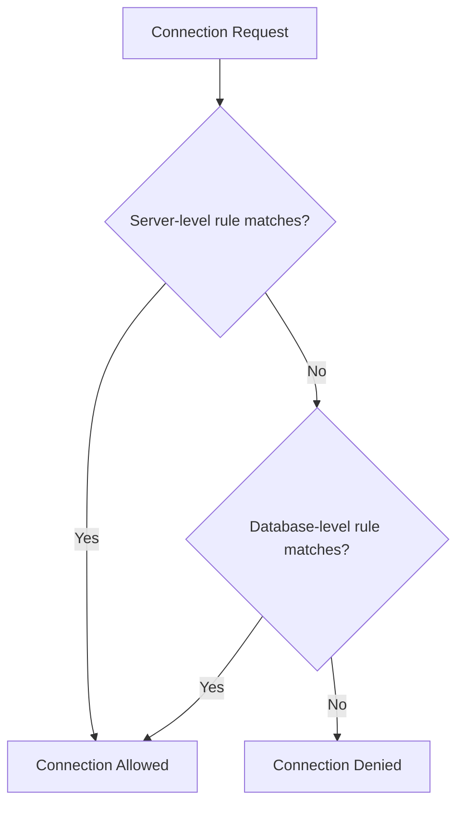

# How to Configure Firewall Rules for Azure SQL Database

Author: [nawazdhandala](https://www.github.com/nawazdhandala)

Tags: Azure SQL, Firewall, Security, Networking, Azure, Database, Cloud Security

Description: Learn how to configure server-level and database-level firewall rules for Azure SQL Database to control access and secure your data.

---

When you create an Azure SQL Database, it is protected by a firewall that blocks all external connections by default. Before any client can connect, you need to explicitly allow access by configuring firewall rules. This is one of the first things you should set up after provisioning a new database, and getting it right is critical for both security and usability.

In this guide, I will cover how Azure SQL Database firewall rules work, how to configure them through the Azure Portal, T-SQL, Azure CLI, and PowerShell, and some best practices to keep your database secure.

## How Azure SQL Database Firewall Rules Work

Azure SQL Database uses a two-level firewall system:

1. **Server-level firewall rules** apply to all databases on the logical SQL server. They control which IP addresses can reach the server at all.
2. **Database-level firewall rules** apply to individual databases. They provide finer-grained control when you need different access policies for different databases on the same server.

When a connection request arrives, Azure checks the server-level rules first. If the IP is allowed at the server level, the connection proceeds. If not, Azure checks the database-level rules for the specific database being accessed. If neither set of rules allows the IP, the connection is refused.

There is also a special toggle called "Allow Azure services and resources to access this server" which, when enabled, permits traffic from any Azure service, including services in other subscriptions. Use this with caution.



## Configuring Server-Level Firewall Rules via Azure Portal

This is the most common approach and works well for most scenarios.

1. Go to the Azure Portal and navigate to your SQL server (not the database, but the server resource).
2. In the left menu, under Security, click "Networking".
3. Under "Public network access", make sure it is set to "Selected networks" or "Enabled".
4. Under "Firewall rules", you will see a section where you can add IP address ranges.
5. Click "Add a firewall rule" or "Add your client IPv4 address" to quickly add your current IP.
6. Enter a rule name, the start IP address, and the end IP address. For a single IP, set both to the same value.
7. Click "Save".

For example, to allow a single developer machine with IP 203.0.113.45:

- Rule name: dev-machine-john
- Start IP: 203.0.113.45
- End IP: 203.0.113.45

To allow an entire office subnet from 203.0.113.0 to 203.0.113.255:

- Rule name: office-network
- Start IP: 203.0.113.0
- End IP: 203.0.113.255

## Configuring Server-Level Firewall Rules via T-SQL

You can also manage server-level firewall rules using T-SQL from within the master database. This is handy when you are already connected via SSMS or Azure Data Studio.

```sql
-- Connect to the master database first
-- Add a server-level firewall rule allowing a specific IP range
EXECUTE sp_set_firewall_rule
    @name = N'office-network',
    @start_ip_address = '203.0.113.0',
    @end_ip_address = '203.0.113.255';
```

To view existing server-level rules:

```sql
-- List all server-level firewall rules
SELECT name, start_ip_address, end_ip_address
FROM sys.firewall_rules
ORDER BY name;
```

To delete a rule:

```sql
-- Remove a server-level firewall rule by name
EXECUTE sp_delete_firewall_rule @name = N'office-network';
```

## Configuring Database-Level Firewall Rules via T-SQL

Database-level rules are managed from within the specific database you want to protect.

```sql
-- Connect to the specific database (not master)
-- Add a database-level firewall rule
EXECUTE sp_set_database_firewall_rule
    @name = N'app-server',
    @start_ip_address = '10.0.1.50',
    @end_ip_address = '10.0.1.50';
```

To view database-level rules:

```sql
-- List all database-level firewall rules for the current database
SELECT name, start_ip_address, end_ip_address
FROM sys.database_firewall_rules
ORDER BY name;
```

To delete a database-level rule:

```sql
-- Remove a database-level firewall rule
EXECUTE sp_delete_database_firewall_rule @name = N'app-server';
```

## Configuring Firewall Rules via Azure CLI

The Azure CLI is great for scripting and automation. Here are the key commands.

```bash
# Add a server-level firewall rule using Azure CLI
az sql server firewall-rule create \
    --resource-group myResourceGroup \
    --server myserver \
    --name office-network \
    --start-ip-address 203.0.113.0 \
    --end-ip-address 203.0.113.255
```

To list all rules:

```bash
# List all firewall rules for a SQL server
az sql server firewall-rule list \
    --resource-group myResourceGroup \
    --server myserver \
    --output table
```

To delete a rule:

```bash
# Delete a specific firewall rule
az sql server firewall-rule delete \
    --resource-group myResourceGroup \
    --server myserver \
    --name office-network
```

## Configuring Firewall Rules via PowerShell

If you prefer PowerShell, the Az module provides similar functionality.

```powershell
# Add a server-level firewall rule using PowerShell
New-AzSqlServerFirewallRule `
    -ResourceGroupName "myResourceGroup" `
    -ServerName "myserver" `
    -FirewallRuleName "office-network" `
    -StartIpAddress "203.0.113.0" `
    -EndIpAddress "203.0.113.255"
```

To list rules:

```powershell
# List all firewall rules on the server
Get-AzSqlServerFirewallRule `
    -ResourceGroupName "myResourceGroup" `
    -ServerName "myserver"
```

## The Allow Azure Services Toggle

In the Azure Portal networking settings, there is an option labeled "Allow Azure services and resources to access this server." When enabled, this creates a special firewall rule with start and end IP both set to 0.0.0.0.

This setting allows any Azure service from any subscription to connect to your server. While convenient for development, it is a broad permission. In production, I recommend disabling this and instead using:

- Private endpoints to keep traffic within your virtual network
- Specific firewall rules for known Azure service IPs
- Virtual network rules to allow traffic from specific subnets

## Virtual Network Rules

Beyond IP-based firewall rules, Azure SQL Database supports virtual network service endpoints. These allow you to restrict access to traffic coming from specific subnets within your Azure Virtual Network.

To set this up in the Portal:

1. Navigate to your SQL server's Networking page.
2. Under "Virtual networks", click "Add a virtual network rule".
3. Select the subscription, virtual network, and subnet.
4. If the subnet does not have a service endpoint for Microsoft.Sql enabled, the portal will prompt you to enable it.
5. Click OK and then Save.

This is more secure than IP-based rules because the traffic stays within the Azure backbone and you do not need to expose a public IP.

## Private Endpoints

For the highest level of network security, use private endpoints. A private endpoint assigns a private IP address from your virtual network to the SQL server, effectively bringing the server into your VNet.

When you use a private endpoint, you can disable public access entirely, meaning no IP-based firewall rules are needed at all. This is the recommended approach for production workloads.

## Best Practices

**Use the narrowest possible IP ranges.** Avoid wide ranges like 0.0.0.0 to 255.255.255.255. Each rule should cover only the specific IPs that need access.

**Name your rules descriptively.** Instead of "rule1", use names like "jenkins-build-server" or "vpn-office-seattle". This makes it easy to audit and clean up rules later.

**Audit regularly.** IP addresses change, developers leave, and infrastructure evolves. Review your firewall rules periodically and remove any that are no longer needed.

**Prefer private endpoints for production.** IP-based firewall rules are fine for development and testing, but production databases should use private endpoints within a virtual network.

**Do not rely solely on the firewall.** Firewall rules are one layer of defense. Also use strong authentication, encrypted connections, and the principle of least privilege for database users.

**Document your rules.** Keep a record of why each firewall rule exists and who requested it. This is invaluable during security reviews.

## Troubleshooting Connection Issues

If you cannot connect to your Azure SQL Database, check these things in order:

1. Verify your client IP address. Your public IP may differ from what you expect, especially behind NAT or VPN. Check a site like whatismyip.com.
2. Confirm that the firewall rule is on the correct server. If you have multiple logical servers, make sure you added the rule to the right one.
3. Check if public network access is disabled. If it is, only private endpoints will work.
4. Look at the error message. Error 40615 means the firewall is blocking you. The message usually includes the client IP that was rejected.
5. Wait a moment after adding a rule. Changes typically take effect within a few seconds, but occasionally there is a short delay.

## Summary

Azure SQL Database firewall rules are your first line of network defense. Server-level rules apply broadly across all databases on a server, while database-level rules offer granular control. You can manage these through the Portal, T-SQL, Azure CLI, or PowerShell. For production systems, move beyond IP-based rules to virtual network rules and private endpoints. Always follow the principle of least privilege and audit your rules regularly.
