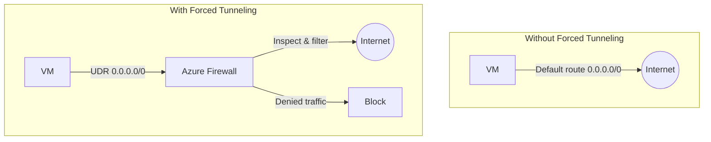
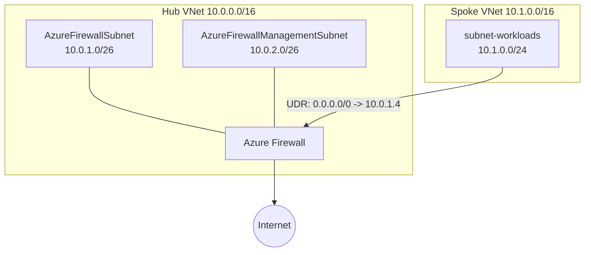

# How to Configure Forced Tunneling with Azure Firewall for Outbound Traffic Inspection

Author: [nawazdhandala](https://www.github.com/nawazdhandala)

Tags: Azure, Forced Tunneling, Azure Firewall, Traffic Inspection, Network Security, Azure Networking

Description: A detailed guide to setting up forced tunneling with Azure Firewall to inspect and control all outbound internet traffic from your Azure workloads.

---

In many enterprise environments, security teams require that all outbound internet traffic passes through a central inspection point before leaving the network. This pattern is called forced tunneling. Instead of allowing VMs to reach the internet directly through Azure's default route, you redirect all internet-bound traffic through Azure Firewall (or another network virtual appliance) where it can be logged, filtered, and controlled.

This is not just a nice-to-have for compliance-driven organizations. If your workloads handle sensitive data, you need to know what is leaving your network. Azure Firewall in a forced tunneling configuration gives you exactly that - full visibility and control over outbound traffic.

## What Forced Tunneling Means

Normally, Azure VMs have a default route (`0.0.0.0/0`) that sends internet traffic directly out through Azure's internet gateway. Forced tunneling overrides this default route with a user-defined route (UDR) that sends the traffic to your firewall instead.



## Prerequisites

- An Azure subscription
- Azure CLI installed
- Understanding of Azure networking fundamentals (VNets, subnets, route tables)

## Step 1: Design the Network Topology

For forced tunneling with Azure Firewall, you need a hub-spoke topology. The hub VNet contains the firewall, and spoke VNets route their traffic through it.



When forced tunneling is enabled, Azure Firewall needs a separate management subnet (`AzureFirewallManagementSubnet`) with its own public IP for management traffic. This is because the firewall's data path uses the forced tunnel, and it still needs a direct internet path for its own management operations.

## Step 2: Create the Hub VNet

```bash
# Create a resource group
az group create --name rg-forced-tunnel-demo --location eastus

# Create the hub VNet with AzureFirewallSubnet
az network vnet create \
  --resource-group rg-forced-tunnel-demo \
  --name vnet-hub \
  --location eastus \
  --address-prefixes 10.0.0.0/16 \
  --subnet-name AzureFirewallSubnet \
  --subnet-prefixes 10.0.1.0/26

# Create the management subnet (required for forced tunneling)
az network vnet subnet create \
  --resource-group rg-forced-tunnel-demo \
  --vnet-name vnet-hub \
  --name AzureFirewallManagementSubnet \
  --address-prefixes 10.0.2.0/26
```

## Step 3: Create Public IPs

Two public IPs are needed: one for the firewall's data traffic and one for management.

```bash
# Public IP for firewall data traffic
az network public-ip create \
  --resource-group rg-forced-tunnel-demo \
  --name pip-fw-data \
  --sku Standard \
  --allocation-method Static

# Public IP for firewall management traffic
az network public-ip create \
  --resource-group rg-forced-tunnel-demo \
  --name pip-fw-mgmt \
  --sku Standard \
  --allocation-method Static
```

## Step 4: Deploy Azure Firewall with Forced Tunneling

When creating the firewall with forced tunneling enabled, you must specify the management IP configuration.

```bash
# Create a firewall policy
az network firewall policy create \
  --resource-group rg-forced-tunnel-demo \
  --name policy-fw \
  --location eastus \
  --sku Standard

# Create the firewall with forced tunneling
az network firewall create \
  --resource-group rg-forced-tunnel-demo \
  --name fw-hub \
  --location eastus \
  --sku AZFW_VNet \
  --tier Standard \
  --vnet-name vnet-hub \
  --firewall-policy policy-fw

# Configure the data IP configuration
az network firewall ip-config create \
  --resource-group rg-forced-tunnel-demo \
  --firewall-name fw-hub \
  --name fw-ipconfig-data \
  --public-ip-address pip-fw-data \
  --vnet-name vnet-hub

# Configure the management IP configuration
az network firewall management-ip-config update \
  --resource-group rg-forced-tunnel-demo \
  --firewall-name fw-hub \
  --public-ip-address pip-fw-mgmt \
  --vnet-name vnet-hub

# Get the firewall's private IP
FW_PRIVATE_IP=$(az network firewall show \
  --resource-group rg-forced-tunnel-demo \
  --name fw-hub \
  --query "ipConfigurations[0].privateIPAddress" -o tsv)

echo "Firewall private IP: $FW_PRIVATE_IP"
```

## Step 5: Create the Spoke VNet

```bash
# Create the spoke VNet
az network vnet create \
  --resource-group rg-forced-tunnel-demo \
  --name vnet-spoke \
  --location eastus \
  --address-prefixes 10.1.0.0/16 \
  --subnet-name subnet-workloads \
  --subnet-prefixes 10.1.0.0/24
```

## Step 6: Peer the VNets

```bash
# Peer hub to spoke
az network vnet peering create \
  --resource-group rg-forced-tunnel-demo \
  --name peer-hub-to-spoke \
  --vnet-name vnet-hub \
  --remote-vnet vnet-spoke \
  --allow-vnet-access \
  --allow-forwarded-traffic

# Peer spoke to hub
az network vnet peering create \
  --resource-group rg-forced-tunnel-demo \
  --name peer-spoke-to-hub \
  --vnet-name vnet-spoke \
  --remote-vnet vnet-hub \
  --allow-vnet-access \
  --allow-forwarded-traffic
```

## Step 7: Create the Route Table for Forced Tunneling

This is the critical step. Create a route table that overrides the default route and points all internet traffic to the firewall.

```bash
# Create a route table
az network route-table create \
  --resource-group rg-forced-tunnel-demo \
  --name rt-forced-tunnel \
  --location eastus \
  --disable-bgp-route-propagation true

# Add the default route pointing to the firewall
az network route-table route create \
  --resource-group rg-forced-tunnel-demo \
  --route-table-name rt-forced-tunnel \
  --name route-all-to-firewall \
  --address-prefix 0.0.0.0/0 \
  --next-hop-type VirtualAppliance \
  --next-hop-ip-address $FW_PRIVATE_IP

# Associate the route table with the spoke subnet
az network vnet subnet update \
  --resource-group rg-forced-tunnel-demo \
  --vnet-name vnet-spoke \
  --name subnet-workloads \
  --route-table rt-forced-tunnel
```

Now all traffic from `subnet-workloads` destined for the internet is forced through the firewall.

## Step 8: Configure Firewall Rules

Without firewall rules, all traffic is denied by default. Add application rules for the traffic you want to allow.

```bash
# Create a rule collection group
az network firewall policy rule-collection-group create \
  --resource-group rg-forced-tunnel-demo \
  --policy-name policy-fw \
  --name rcg-outbound \
  --priority 200

# Allow DNS resolution
az network firewall policy rule-collection-group collection add-filter-collection \
  --resource-group rg-forced-tunnel-demo \
  --policy-name policy-fw \
  --rule-collection-group-name rcg-outbound \
  --name rc-infra \
  --collection-priority 100 \
  --action Allow \
  --rule-type NetworkRule \
  --rule-name allow-dns \
  --source-addresses "10.1.0.0/24" \
  --destination-addresses "*" \
  --destination-ports 53 \
  --ip-protocols UDP TCP

# Allow HTTPS to specific domains
az network firewall policy rule-collection-group collection add-filter-collection \
  --resource-group rg-forced-tunnel-demo \
  --policy-name policy-fw \
  --rule-collection-group-name rcg-outbound \
  --name rc-web \
  --collection-priority 200 \
  --action Allow \
  --rule-type ApplicationRule \
  --rule-name allow-updates \
  --source-addresses "10.1.0.0/24" \
  --protocols Https=443 Http=80 \
  --target-fqdns "*.ubuntu.com" "packages.microsoft.com" "aka.ms"
```

## Step 9: Verify the Setup

Deploy a VM in the spoke subnet and test outbound connectivity.

```bash
# Create a test VM in the spoke
az vm create \
  --resource-group rg-forced-tunnel-demo \
  --name vm-test \
  --image Ubuntu2204 \
  --vnet-name vnet-spoke \
  --subnet subnet-workloads \
  --admin-username azureuser \
  --generate-ssh-keys \
  --public-ip-address "" \
  --size Standard_B1s
```

From inside the VM, test that traffic is going through the firewall:

```bash
# This should work (allowed by application rule)
curl -s https://packages.microsoft.com

# This should fail (not in the allowed FQDN list)
curl -s https://www.google.com

# Check the outbound IP (should be the firewall's public IP)
curl -s ifconfig.me
```

## Step 10: Enable Firewall Logging

Logging is essential to see what traffic is being allowed and denied.

```bash
# Create a Log Analytics workspace
az monitor log-analytics workspace create \
  --resource-group rg-forced-tunnel-demo \
  --workspace-name law-fw \
  --location eastus

# Enable diagnostic settings
FW_ID=$(az network firewall show --resource-group rg-forced-tunnel-demo --name fw-hub --query id -o tsv)
LAW_ID=$(az monitor log-analytics workspace show --resource-group rg-forced-tunnel-demo --workspace-name law-fw --query id -o tsv)

az monitor diagnostic-settings create \
  --resource $FW_ID \
  --name diag-fw \
  --workspace $LAW_ID \
  --logs '[{"category":"AzureFirewallApplicationRule","enabled":true},{"category":"AzureFirewallNetworkRule","enabled":true}]'
```

## Common Issues

**VMs lose all internet access after applying the route table.** This is expected behavior. You need to add firewall rules to allow the traffic you want. Start with DNS (port 53) since nothing works without name resolution.

**The firewall itself cannot reach the internet.** Make sure the management IP configuration is set up correctly with its own public IP. The management subnet should not have a UDR applied.

**Asymmetric routing.** If the response path differs from the request path, packets get dropped. Make sure the route table is consistent across all subnets involved in the traffic flow.

## Cleanup

```bash
# Delete the resource group
az group delete --name rg-forced-tunnel-demo --yes --no-wait
```

## Wrapping Up

Forced tunneling with Azure Firewall gives you complete control over outbound internet traffic from your Azure workloads. Every connection to the internet passes through the firewall, where it can be logged, inspected, and filtered based on application rules and network rules. The setup requires a hub-spoke topology with UDRs pointing the default route to the firewall. Remember to use the management IP configuration when forced tunneling is enabled, and always start by allowing DNS traffic before anything else. This pattern is essential for organizations that need visibility and control over what data leaves their cloud environment.
