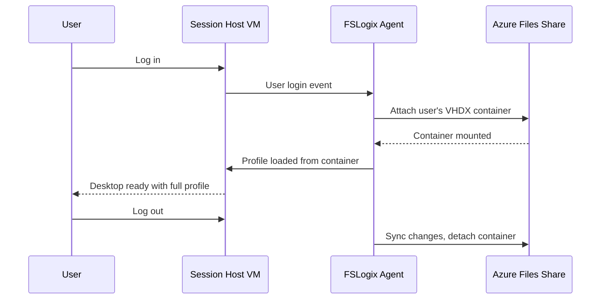

# How to Configure FSLogix Profile Containers with Azure Files for Azure Virtual Desktop

Author: [nawazdhandala](https://www.github.com/nawazdhandala)

Tags: Azure, Virtual Desktop, FSLogix, Azure Files, Profile Management, VDI, User Profiles

Description: Learn how to configure FSLogix profile containers with Azure Files for Azure Virtual Desktop to provide fast and persistent user profiles across sessions.

---

In a pooled Azure Virtual Desktop environment, users get assigned to different session hosts each time they connect. Without profile management, they lose their desktop settings, application preferences, browser bookmarks, and cached data between sessions. FSLogix solves this by storing each user's profile in a VHD(X) container on a network share. When a user logs in, FSLogix mounts their container as if it were a local profile. It is fast, transparent, and the user experience feels like using a persistent desktop.

This guide covers setting up FSLogix profile containers backed by Azure Files, which is the most common storage option for AVD deployments.

## How FSLogix Profile Containers Work

When a user logs in to a session host:

1. FSLogix checks the configured storage location for the user's profile container (a VHD or VHDX file).
2. If the container exists, it is attached to the session host VM.
3. The container is mounted as a local disk, and the user's profile is loaded from it.
4. When the user logs out, changes are written back to the container and it is detached.



This approach is significantly faster than folder-based profile solutions because the entire profile is a single file that gets mounted as a local disk. No file-by-file copying at login.

## Prerequisites

- An Azure Virtual Desktop deployment with a host pool and session hosts.
- An Azure Storage account.
- Azure AD DS or on-premises AD DS for identity (FSLogix needs Kerberos authentication for SMB shares).
- Session hosts joined to the domain.
- FSLogix installed on session hosts (included with Windows 11 Enterprise multi-session images).

## Step 1: Create an Azure Files Share

Create a storage account and file share dedicated to FSLogix profiles.

```bash
# Create a storage account with premium file shares for better performance
az storage account create \
  --resource-group myResourceGroup \
  --name avdprofilestorage \
  --location eastus \
  --sku Premium_LRS \
  --kind FileStorage \
  --enable-large-file-share

# Create the file share for FSLogix profiles
az storage share-rm create \
  --resource-group myResourceGroup \
  --storage-account avdprofilestorage \
  --name fslogix-profiles \
  --quota 1024
```

Use Premium storage (SSD-backed) for FSLogix shares. Standard storage can introduce noticeable latency during login, especially when many users log in simultaneously. The performance difference at login time is substantial.

## Step 2: Configure Azure AD Authentication for the Share

Azure Files needs to authenticate users via Kerberos. If you are using Azure AD DS, enable identity-based authentication on the storage account.

```bash
# Enable Azure AD DS authentication for the storage account
az storage account update \
  --resource-group myResourceGroup \
  --name avdprofilestorage \
  --enable-files-adds false \
  --enable-files-aadds true
```

If you are using on-premises Active Directory, the setup is different - you need to register the storage account with your AD domain.

```powershell
# For on-premises AD: Download and run the AD module for Azure Files
# This script joins the storage account to your AD domain
Import-Module AzFilesHybrid

Join-AzStorageAccountForAuth `
  -ResourceGroupName "myResourceGroup" `
  -StorageAccountName "avdprofilestorage" `
  -DomainAccountType "ComputerAccount" `
  -OrganizationalUnitDistinguishedName "OU=StorageAccounts,DC=corp,DC=example,DC=com"
```

## Step 3: Set Share-Level Permissions

Assign RBAC roles to control who can access the file share.

```bash
# Get the storage account resource ID
STORAGE_ID=$(az storage account show \
  --resource-group myResourceGroup \
  --name avdprofilestorage \
  --query "id" \
  --output tsv)

# Assign the "Storage File Data SMB Share Contributor" role to AVD users
# This allows them to read, write, and delete their own profile files
az role assignment create \
  --assignee-object-id "avd-users-group-object-id" \
  --assignee-principal-type Group \
  --role "Storage File Data SMB Share Contributor" \
  --scope "$STORAGE_ID/fileServices/default/fileshares/fslogix-profiles"

# Assign "Storage File Data SMB Share Elevated Contributor" to admins
# This allows full control for troubleshooting and management
az role assignment create \
  --assignee "admin@company.com" \
  --role "Storage File Data SMB Share Elevated Contributor" \
  --scope "$STORAGE_ID/fileServices/default/fileshares/fslogix-profiles"
```

## Step 4: Set NTFS Permissions

Share-level RBAC permissions control who can connect to the share. NTFS permissions control what they can do with individual files and folders. You need both.

Mount the share from a domain-joined machine and set NTFS permissions.

```powershell
# Mount the Azure Files share using the storage account key (for initial setup only)
$storageKey = (az storage account keys list --resource-group myResourceGroup --account-name avdprofilestorage --query "[0].value" --output tsv)
net use Z: \\avdprofilestorage.file.core.windows.net\fslogix-profiles /user:Azure\avdprofilestorage $storageKey

# Set NTFS permissions on the share root
# Users need modify permission to create and manage their profile containers
$acl = Get-Acl Z:\

# Remove inherited permissions and set explicit ones
$acl.SetAccessRuleProtection($true, $false)

# Creator/Owner gets full control of their own folder
$creatorOwnerRule = New-Object System.Security.AccessControl.FileSystemAccessRule(
    "CREATOR OWNER", "FullControl", "SubContainers,ObjectInherit", "InheritOnly", "Allow"
)
$acl.AddAccessRule($creatorOwnerRule)

# Authenticated users can create folders but not see other users' profiles
$usersRule = New-Object System.Security.AccessControl.FileSystemAccessRule(
    "Authenticated Users", "Modify", "None", "None", "Allow"
)
$acl.AddAccessRule($usersRule)

# Administrators get full control
$adminRule = New-Object System.Security.AccessControl.FileSystemAccessRule(
    "BUILTIN\Administrators", "FullControl", "ContainerInherit,ObjectInherit", "None", "Allow"
)
$acl.AddAccessRule($adminRule)

Set-Acl Z:\ $acl

# Disconnect the drive (cleanup)
net use Z: /delete
```

## Step 5: Configure FSLogix on Session Hosts

FSLogix is pre-installed on Windows 11 Enterprise multi-session images, but you need to configure it via registry settings or Group Policy.

### Using Registry Settings

Apply these on each session host (or use Group Policy for central management).

```powershell
# Configure FSLogix Profile Container settings via registry
# Run this on each session host or deploy via GPO

# Enable Profile Container
New-ItemProperty -Path "HKLM:\SOFTWARE\FSLogix\Profiles" `
  -Name "Enabled" -Value 1 -PropertyType DWORD -Force

# Set the VHD location to the Azure Files share
New-ItemProperty -Path "HKLM:\SOFTWARE\FSLogix\Profiles" `
  -Name "VHDLocations" -Value "\\avdprofilestorage.file.core.windows.net\fslogix-profiles" `
  -PropertyType MultiString -Force

# Use VHDX format (more resilient than VHD)
New-ItemProperty -Path "HKLM:\SOFTWARE\FSLogix\Profiles" `
  -Name "VolumeType" -Value "VHDX" -PropertyType String -Force

# Set the default size for profile containers (30 GB)
New-ItemProperty -Path "HKLM:\SOFTWARE\FSLogix\Profiles" `
  -Name "SizeInMBs" -Value 30720 -PropertyType DWORD -Force

# Enable dynamic VHDX (starts small, grows as needed)
New-ItemProperty -Path "HKLM:\SOFTWARE\FSLogix\Profiles" `
  -Name "IsDynamic" -Value 1 -PropertyType DWORD -Force

# Delete local profile when FSLogix profile is disconnected (saves disk space)
New-ItemProperty -Path "HKLM:\SOFTWARE\FSLogix\Profiles" `
  -Name "DeleteLocalProfileWhenVHDShouldApply" -Value 1 -PropertyType DWORD -Force

# Prevent login with a temporary profile if the container is not available
New-ItemProperty -Path "HKLM:\SOFTWARE\FSLogix\Profiles" `
  -Name "PreventLoginWithTempProfile" -Value 1 -PropertyType DWORD -Force
```

### Using Group Policy

If you prefer Group Policy (which scales better for large deployments):

1. Download the FSLogix Group Policy templates from Microsoft.
2. Copy the ADMX and ADML files to your Group Policy Central Store.
3. Create a GPO targeted at your session host OUs.
4. Navigate to Computer Configuration > Administrative Templates > FSLogix > Profile Containers.
5. Enable the settings equivalent to the registry values above.

## Step 6: Test the Configuration

Log in to a session host as a test user and verify FSLogix is working.

```powershell
# On the session host, check if the FSLogix profile container is mounted
# Run this as the logged-in user
Get-Volume | Where-Object { $_.FileSystemLabel -like "*Profile*" }

# Check FSLogix logs for any errors
Get-Content "C:\ProgramData\FSLogix\Logs\Profile*.log" -Tail 50

# Verify the profile container was created on Azure Files
# Look for a folder named after the user's SID containing a Profile_*.VHDX file
```

On the Azure Files share, you should see a folder structure like:

```
\\avdprofilestorage.file.core.windows.net\fslogix-profiles\
  S-1-5-21-xxxx-user1\
    Profile_user1.VHDX
  S-1-5-21-xxxx-user2\
    Profile_user2.VHDX
```

## Step 7: Configure Office Container (Optional)

For Microsoft 365 applications, you can use a separate Office Container that stores Outlook cache, Teams cache, and OneDrive data. This prevents the profile container from growing too large.

```powershell
# Enable Office Container (separate from Profile Container)
New-Item -Path "HKLM:\SOFTWARE\Policies\FSLogix\ODFC" -Force

New-ItemProperty -Path "HKLM:\SOFTWARE\Policies\FSLogix\ODFC" `
  -Name "Enabled" -Value 1 -PropertyType DWORD -Force

New-ItemProperty -Path "HKLM:\SOFTWARE\Policies\FSLogix\ODFC" `
  -Name "VHDLocations" -Value "\\avdprofilestorage.file.core.windows.net\fslogix-profiles" `
  -PropertyType MultiString -Force

# Include Teams cache in the Office Container
New-ItemProperty -Path "HKLM:\SOFTWARE\Policies\FSLogix\ODFC" `
  -Name "IncludeTeams" -Value 1 -PropertyType DWORD -Force
```

## Monitoring and Troubleshooting

**Common issues and solutions:**

- **Slow login times**: Check the Azure Files share performance. Upgrade to a larger share size (which increases IOPS) or enable private endpoints to reduce network latency.
- **Profile container locked**: This happens when a user's session was not properly closed. Use the FSLogix tool `frx.exe` to release the lock, or wait for the lock to expire.
- **Container growing too large**: Use FSLogix's redirect settings to exclude folders like browser caches and temp files from the profile container.

```powershell
# Create a redirections.xml file to exclude large cache folders
# Save this file to the Azure Files share root
$xml = @"
<?xml version="1.0" encoding="UTF-8"?>
<FrxProfileFolderRedirection ExcludeCommonFolders="0">
  <Excludes>
    <Exclude Copy="0">AppData\Local\Packages</Exclude>
    <Exclude Copy="0">AppData\Local\Microsoft\Windows\INetCache</Exclude>
    <Exclude Copy="0">AppData\Local\Temp</Exclude>
  </Excludes>
</FrxProfileFolderRedirection>
"@
$xml | Out-File "\\avdprofilestorage.file.core.windows.net\fslogix-profiles\redirections.xml"
```

Point FSLogix to the redirections file.

```powershell
# Configure FSLogix to use the redirections file
New-ItemProperty -Path "HKLM:\SOFTWARE\FSLogix\Profiles" `
  -Name "RedirXMLSourceFolder" -Value "\\avdprofilestorage.file.core.windows.net\fslogix-profiles" `
  -PropertyType String -Force
```

## Summary

FSLogix profile containers with Azure Files give AVD users a consistent desktop experience across pooled session hosts. The setup involves creating a premium Azure Files share, configuring identity-based authentication, setting the right NTFS permissions, and configuring FSLogix on the session hosts via registry or Group Policy. The key to a good experience is using Premium storage for low login latency, sizing containers appropriately, and excluding unnecessary cache folders to keep container sizes manageable. Once configured, users get their full profile - settings, bookmarks, application data - regardless of which session host they land on.
