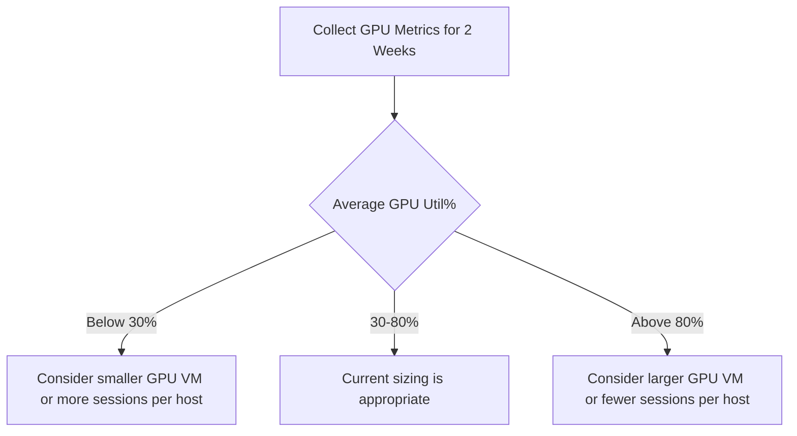

# How to Configure GPU-Enabled Session Hosts for Azure Virtual Desktop Graphics Workloads

Author: [nawazdhandala](https://www.github.com/nawazdhandala)

Tags: Azure Virtual Desktop, GPU, Graphics Workloads, NV Series, AVD, Remote Graphics, CAD

Description: Learn how to configure GPU-enabled session hosts in Azure Virtual Desktop for graphics-intensive workloads like CAD, 3D modeling, video editing, and data visualization.

---

Not all virtual desktop workloads are about email and spreadsheets. Engineers running CAD software, architects using 3D modeling tools, video editors working with high-resolution footage, and data scientists building visualizations all need GPU acceleration in their remote sessions. Azure Virtual Desktop supports GPU-enabled session hosts through the NV, NVv3, NVv4, NCasT4, and NVadsA10 VM series. This guide covers how to select the right GPU VM, configure the drivers and display settings, and optimize the remote display protocol for graphics-heavy workloads.

## Understanding GPU VM Options

Azure offers several GPU-enabled VM families, each suited for different workloads:

| VM Series | GPU | VRAM | Best For |
|-----------|-----|------|----------|
| NVv3 | NVIDIA Tesla M60 | 8-16 GB | General GPU visualization |
| NVadsA10 v5 | NVIDIA A10 | 6-24 GB | Professional visualization, AI |
| NCasT4 v3 | NVIDIA Tesla T4 | 16 GB | Mixed visualization and compute |
| NVv4 | AMD Radeon MI25 | 4-16 GB | Cost-effective visualization |

For most AVD graphics workloads, I recommend the NVadsA10 v5 series. It provides the best balance of performance, features, and cost. The NVIDIA A10 GPU supports hardware-accelerated encoding (NVENC), which offloads the remote display encoding from the CPU to the GPU, significantly improving the remote experience.

## Prerequisites

- Azure subscription with GPU VM quota (you may need to request a quota increase)
- Azure Virtual Desktop host pool
- Familiarity with basic AVD setup
- GPU-compatible applications (CAD, 3D, video editing, etc.)

## Step 1: Request GPU VM Quota

GPU VMs often have zero default quota. Check and request an increase:

```bash
# Check current quota for NV series VMs in your subscription
az vm list-usage \
    --location eastus \
    --query "[?contains(name.localizedValue, 'NV')]" \
    -o table

# If the quota is 0, request an increase through the portal:
# 1. Go to Subscriptions > Your subscription > Usage + quotas
# 2. Search for the NVadsA10 v5 family
# 3. Request the number of vCPUs you need
# Quota increases for GPU VMs can take 1-3 business days
```

## Step 2: Create the GPU Session Host

```bash
# Set variables
RESOURCE_GROUP="rg-avd-gpu"
VM_NAME="sh-gpu-01"
LOCATION="eastus"
VNET_NAME="vnet-avd"
SUBNET_NAME="subnet-gpu-hosts"

# Create a subnet for GPU session hosts (if not already created)
az network vnet subnet create \
    --name $SUBNET_NAME \
    --vnet-name $VNET_NAME \
    --resource-group $RESOURCE_GROUP \
    --address-prefix 10.1.2.0/24

# Create the GPU VM
# Using NVadsA10 v5 with Windows 11 Enterprise multi-session
az vm create \
    --name $VM_NAME \
    --resource-group $RESOURCE_GROUP \
    --location $LOCATION \
    --image "MicrosoftWindowsDesktop:windows-11:win11-23h2-avd:latest" \
    --size Standard_NV36ads_A10_v5 \
    --vnet-name $VNET_NAME \
    --subnet $SUBNET_NAME \
    --admin-username localadmin \
    --admin-password "$(openssl rand -base64 24)" \
    --public-ip-address "" \
    --license-type Windows_Client \
    --os-disk-size-gb 256 \
    --storage-sku Premium_LRS
```

## Step 3: Install GPU Drivers

GPU VMs need the appropriate drivers installed. Azure provides an extension that handles this:

```bash
# Install the NVIDIA GPU driver extension
# This downloads and installs the correct driver version automatically
az vm extension set \
    --vm-name $VM_NAME \
    --resource-group $RESOURCE_GROUP \
    --name NvidiaGpuDriverWindows \
    --publisher Microsoft.HpcCompute \
    --version 1.9 \
    --settings '{}'

# Wait for the extension to complete (this can take 10-15 minutes)
az vm extension wait \
    --vm-name $VM_NAME \
    --resource-group $RESOURCE_GROUP \
    --name NvidiaGpuDriverWindows \
    --created
```

After the driver installation, the VM needs a reboot:

```bash
# Restart the VM to complete driver installation
az vm restart \
    --name $VM_NAME \
    --resource-group $RESOURCE_GROUP

# Verify the GPU driver is installed and working
az vm run-command invoke \
    --name $VM_NAME \
    --resource-group $RESOURCE_GROUP \
    --command-id RunPowerShellScript \
    --scripts "nvidia-smi"
```

The `nvidia-smi` output should show the GPU model, driver version, and memory usage. If this command fails, the driver installation did not complete successfully.

## Step 4: Configure GPU for RemoteFX/Remote Display

By default, the Remote Desktop Protocol (RDP) may not use the GPU for encoding. You need to configure the session host to leverage GPU acceleration for the remote display:

```powershell
# Configure GPU settings via PowerShell on the session host
# Run these commands on the session host VM

# Enable hardware-accelerated GPU scheduling
Set-ItemProperty -Path "HKLM:\SYSTEM\CurrentControlSet\Control\GraphicsDrivers" `
    -Name "HwSchMode" -Value 2 -Type DWord

# Configure RemoteFX vGPU (for server OS)
# Enable GPU-accelerated frame encoding
$regPath = "HKLM:\SOFTWARE\Policies\Microsoft\Windows NT\Terminal Services"

# Use hardware graphics adapter for all Remote Desktop Services sessions
Set-ItemProperty -Path $regPath `
    -Name "bEnumerateHWBeforeSW" -Value 1 -Type DWord

# Configure H.264/AVC hardware encoding for Remote Desktop connections
Set-ItemProperty -Path $regPath `
    -Name "AVC444ModePreferred" -Value 1 -Type DWord

# Enable GPU-accelerated frame encoding
Set-ItemProperty -Path $regPath `
    -Name "AVCHardwareEncodePreferred" -Value 1 -Type DWord

# Enable full-screen video playback optimization
Set-ItemProperty -Path $regPath `
    -Name "fEnableWddmDriver" -Value 1 -Type DWord

Write-Host "GPU remote display settings configured. Restart required."
```

For a more automated approach, use this as a Custom Script Extension:

```bash
# Apply GPU display settings via Custom Script Extension
az vm run-command invoke \
    --name $VM_NAME \
    --resource-group $RESOURCE_GROUP \
    --command-id RunPowerShellScript \
    --scripts '
        $regPath = "HKLM:\SOFTWARE\Policies\Microsoft\Windows NT\Terminal Services"
        if (-not (Test-Path $regPath)) { New-Item -Path $regPath -Force }
        Set-ItemProperty -Path $regPath -Name "bEnumerateHWBeforeSW" -Value 1 -Type DWord
        Set-ItemProperty -Path $regPath -Name "AVC444ModePreferred" -Value 1 -Type DWord
        Set-ItemProperty -Path $regPath -Name "AVCHardwareEncodePreferred" -Value 1 -Type DWord
        Set-ItemProperty -Path $regPath -Name "fEnableWddmDriver" -Value 1 -Type DWord
        Restart-Service -Name "TermService" -Force
    '
```

## Step 5: Optimize RDP Settings for Graphics

The RDP connection itself needs to be configured for high-quality graphics. Create an RDP properties file or configure the host pool:

```bash
# Configure host pool RDP properties for graphics workloads
az desktopvirtualization hostpool update \
    --name hp-gpu-desktop \
    --resource-group $RESOURCE_GROUP \
    --custom-rdp-property "use multimon:i:1;videoplaybackmode:i:1;audiocapturemode:i:1;encode redirected video capture:i:1;redirected video capture encoding quality:i:2;camerastoredirect:s:*;devicestoredirect:s:*;drivestoredirect:s:*;gfxrenderingmode:i:0"
```

Key RDP properties for graphics workloads:

- `use multimon:i:1` - Enable multiple monitor support
- `videoplaybackmode:i:1` - Optimize video playback
- `gfxrenderingmode:i:0` - Use the default graphics rendering (which will use GPU when available)

## Step 6: Install Graphics Applications

With the GPU configured, install your graphics applications. Here are common examples:

```powershell
# Install common GPU-dependent applications via Chocolatey
# First install Chocolatey package manager
Set-ExecutionPolicy Bypass -Scope Process -Force
[System.Net.ServicePointManager]::SecurityProtocol = [System.Net.ServicePointManager]::SecurityProtocol -bor 3072
Invoke-Expression ((New-Object System.Net.WebClient).DownloadString('https://community.chocolatey.org/install.ps1'))

# Install applications that benefit from GPU acceleration
choco install blender -y           # 3D modeling and rendering
choco install gimp -y              # Image editing
choco install obs-studio -y        # Video recording/streaming
choco install vlc -y               # Media playback

# For CAD software like AutoCAD or SolidWorks,
# use their enterprise installers through your existing deployment tools
```

## Step 7: Monitor GPU Performance

Track GPU utilization to ensure you are getting value from the GPU VMs:

```bash
# Install the Azure Monitor agent for GPU metrics
az vm extension set \
    --vm-name $VM_NAME \
    --resource-group $RESOURCE_GROUP \
    --name AzureMonitorWindowsAgent \
    --publisher Microsoft.Azure.Monitor \
    --version 1.0

# Query GPU metrics via nvidia-smi on the session host
az vm run-command invoke \
    --name $VM_NAME \
    --resource-group $RESOURCE_GROUP \
    --command-id RunPowerShellScript \
    --scripts '
        # Get GPU utilization, memory usage, and encoder stats
        $gpuInfo = nvidia-smi --query-gpu=utilization.gpu,utilization.memory,memory.used,memory.total,encoder.stats.sessionCount,encoder.stats.averageFps --format=csv,noheader,nounits
        Write-Host "GPU Util%, Mem Util%, Mem Used MB, Mem Total MB, Encoder Sessions, Encoder FPS"
        Write-Host $gpuInfo
    '
```

For ongoing monitoring, set up a scheduled task that logs GPU metrics to a file and ingest them into Log Analytics:

```powershell
# gpu-metrics-collector.ps1
# Runs on the session host and logs GPU metrics for monitoring
$logPath = "C:\Logs\gpu-metrics.csv"

# Collect GPU metrics using nvidia-smi
$metrics = nvidia-smi --query-gpu=timestamp,utilization.gpu,utilization.memory,memory.used,memory.total,temperature.gpu,power.draw --format=csv,noheader

# Append to log file
Add-Content -Path $logPath -Value $metrics
```

## Step 8: Right-Size Your GPU VMs

After running the GPU session hosts for a week or two, analyze the utilization data to ensure you have the right VM size:

- **GPU utilization consistently below 30%**: You might be able to use a smaller GPU VM or share a single GPU across more sessions
- **GPU utilization consistently above 80%**: Consider a larger GPU VM or reducing the number of concurrent sessions
- **GPU memory near capacity**: Users may experience application crashes or degraded performance; upgrade to a VM with more VRAM



## Cost Optimization Tips

GPU VMs are expensive - a Standard_NV36ads_A10_v5 costs significantly more per hour than a standard desktop VM. Here are ways to manage costs:

- **Auto-shutdown**: Configure session hosts to shut down when no sessions are active. GPU VMs should not sit idle.
- **Scaling plans**: Use AVD scaling plans to start GPU session hosts only during business hours when users need them.
- **Reserved instances**: If you have consistent GPU usage, reserve GPU VMs for 1 or 3 years for up to 60% discount.
- **Separate host pools**: Put GPU session hosts in a separate host pool from standard session hosts. Only assign users who actually need GPU acceleration to the GPU pool.

## Summary

Configuring GPU-enabled session hosts for Azure Virtual Desktop involves selecting the right GPU VM series, installing drivers through the Azure extension, configuring the GPU for remote display encoding, and optimizing RDP settings for graphics quality. The NVadsA10 v5 series with NVIDIA A10 GPUs provides the best all-around experience for professional visualization workloads. Monitor GPU utilization to right-size your VMs and use scaling plans to control costs. With proper configuration, users running CAD, 3D modeling, video editing, and data visualization get a responsive remote experience that rivals a local workstation.
